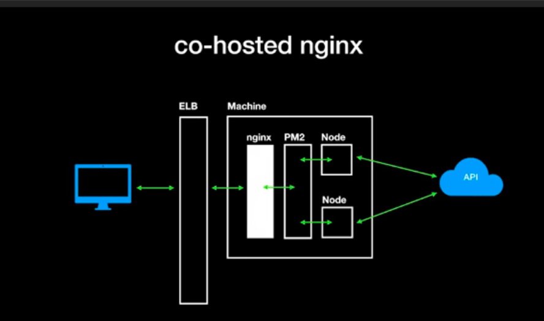

## JSConf Iceland 2018：Scaling NodeJS beyond the ordinary
## 講者 Abhinav Rastogi
## 來源 https://www.youtube.com/watch?v=K8spO4hHMhg

Abhinav Rastogi 處理的電商有這樣的規模：
 - 1億5000萬的註冊會員
 - 每15秒賣出50萬支手機
 - 年度特賣活動時，超過5天有2億的瀏覽次數。

這邊要講的是，除了`水平擴容`、`垂直擴容`之外，Application layer 可以做些什麼？

能下手分析的基本上就這4個
 - network
 - cpu
 - memory
 - disk

## network bandwidth
現在用 nodejs 來當 server時，
1000kb per page、100 rps per machine、100 machines (cluster) = 10gbps  
用 compression 來 reduce data 輕鬆解決此問題。
```javascript
const app = express()
app.use(compression)
```
但這不是好方法，因為 compression 是 high cpu cost 的操作、NodeJS 是 single thread。  
NodeJS 在執行 compression 時無法處理其他 request。

解法是 `co-hosted nginx`，也就是做，另外架一層（通常是順便用來反向代理）來幫忙 compression。
epxressjs 官網也有提到，用 nginx 來做處理效能會更好。(static file 也是讓反向代理處理會更好)

> [expressjs best-practice-performance](https://expressjs.com/zh-tw/advanced/best-practice-performance.html)：
在正式作業中，如果網站的資料流量極高，落實執行壓縮最好的作法是在反向 Proxy 層次實作它（請參閱使用反向 Proxy）。在該情況下，就不需使用壓縮中介軟體。如需在 Nginx 中啟用 gzip 壓縮的詳細資料，請參閱 Nginx 說明文件中的 ngx_http_gzip_module 模組。

另外還有一招，是打包檔案時，直接打包成 gzip file，而 expressjs 加入個 route 就行了。
```javascript
// use the gzipped bundle
app.get('*.js', (req, res, next) => {
  req.url = req.url + '.gz'; // eslint-disable-line
  res.set('Content-Encoding', 'gzip');
  next();
});
```

另外這些 js file 也要做 cache。（甚至用server worker）



重點還是要做 `network profiling` 來看數據、效能。
```
netstat / ss
lsof
watch
```
原來有一個 `Socket Statistics（簡稱 ss）` 的強大工具的樣子。大家都說，比起 `netstat` 更強大，尤其當 socket 連線數上萬時。
如果沒辦法用 `ss` 指令，可能要裝一下 `iproute`。
```
ss -atr
```
另外有一套 `iproute2` 看來也不錯。  
結果 mac 好像沒有 ss  
總之 上面的結論是，你需要有做 `network profiling`