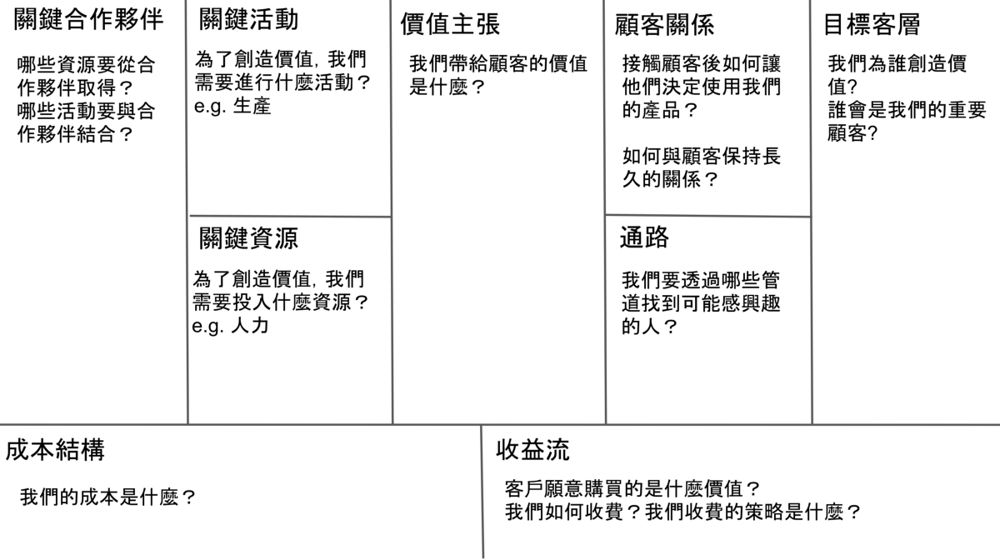

## title：我曾經以為自己懂，卻只做了半套：實作 Lean Startup 的三個關鍵
### subtitle：那些我從來自矽谷的連續創業家 X 先生口中學到的事
## source：https://medium.com/yiyi-network/lean-startup-31ac0a4cc09e

### 懵懂的時代
我們意識到這個想法可能對藝術推廣很有幫助，是一個值得去試試的創業題目，老師也鼓勵我們勇於嘗試，為產品尋找一條可行之路。。就這樣我們一夥人坐在實驗室，討論心目中理想產品的各種功能組合，我們聽過 Lean Startup (精實創業)，知道要做 MVP (最小可行性產品)，於是就把不必要的功能刪去幾個，確定產品在比賽前可以開發完成，就分工下去做了。由於 Lean Startup 提到 MVP 要盡快到市場驗證，獲取客戶回饋，我們帶著已經有些樣子的產品給人試用，依照回饋做了幾次功能修改，更把這次訪談過程寫進商業企劃書裡，當成重要的資料佐證。半年後，我們在創業比賽奪得佳績，獲得評審的肯定與知名創投的關注，團隊士氣高昂。

### 不過最後，很可惜的沒有最後。
 - 後來才知道，MVP 不是功能少幾個就叫 MVP，獲取市場回饋也不是訪談幾個目標客戶就算數的事情。
 - 訪談是連續每週談 10 個人以上，而且是不認識的人，直到發現目標客戶的回饋有共同的模式 (pattern)才算數。

總之，那段期間的我們經常是憑著自己的想像，連夜趕工開發我們認為可以為客戶創造價值的功能，我們告訴自己只要 MVP 過關了，就可以根據創業計畫書去行銷與調整，最終可以找到方法讓用戶成長(Growth)、保留(Retention)、付費。當然這樣的美夢沒有成真，最終這個題目就被擱置了。心頭時常一酸。因為當時我描繪的願景可能沒有機會被實現了；大家費盡心力設計、開發的產品，在我們把伺服器關閉後，就變成了回憶；用戶、合作夥伴的回饋，我至今再也不敢打開來看。

### 矽谷的連續創業家/天使投資人 X 先生。
X 先生：
 - 其實 Lean Startup 算是科普性的推廣，如果你要更系統性地瞭解矽谷創業的方法論，就要去看 Steve Blank 的 Customer Development！」
 - 在創業前的點子階段時，就可以用科學方法將點子拆成不同的元素，分別去實驗，從客戶與市場的反應中，找出這些元素分別是什麼。

這個方法很簡單，很像我們在實驗室中做實驗的過程，但卻可以幫助我們在創業前把點子有系統的確認得很清楚，避免掉許多可能會犯的錯誤與資源的浪費，更重要的是這個過程你不斷的在建立價值。

### Lean Startup 的三個關鍵
Lean Startup 是集合了以下三大步驟的科學方法，這三大步驟做得好不好與成功的機會息息相關：

> "Business Model Canvas" + "Customer Development" + "Agile Development"

#### 1. 畫出商業模式圖 (Business Model Canvas)：把創意點子拆解成重要元素
  創意點子要變為成功產品前，我們要先思考底下幾個問題：

   - 這個產品會讓誰感到有價值？
   - 這個價值是什麼？
   - 要透過哪些管道找到可能感興趣的人？
   - 找到後如何讓他們決定使用我們的產品、如何與他們保持長久的關係、增加他們願意付出的現金？
   - 而我們又要如何收費？
   - 為了創造價值，我們需要投資哪些資源？
   - 為了創造價值，我們要做哪些事？
   - 我們該找哪些人合作才能將我們的產品或服務提供給客戶？
   - 而這樣做的成本又是如何？

上面所列出來的九個問號，**每一個問題的解答都是新創團隊必須找到的**。如果你現在有個想做的題目，你一定會對每個問號有些想法，但是這些全部都是假設，你要透過訪談、實驗數據或觀察使用者行為，來驗證這些假設，調整你的想法，直到確認想法是對的為止，甚至找到最佳的解答(例如怎麼樣的定價方式能帶來最多的現金)。

這樣做最終會找到這個產品與生產細節的最佳搭配組合，而且是市場會買單的產品，你真的解決了別人的問題，或滿足別人的需求。這是有再多資源的競爭對手都不容易抄走的，這會為你的產品建立進入障礙。

所以成立新創公司前的第一步，應該是與你的夥伴們好好的集思廣益，寫下你們對上面九個問題的想法，畫出下面這張商業模式圖，為你的下一步：出去尋找對的答案做準備。

#### 2. 客戶開發 (Customer Development)：從使用者的回饋中驗證你的商業模式圖
有了假設的商業模式圖後，下一步去尋找那些列的假設是否是對的。提出這套方法的現代創業之父 Steve Blank 常說，窩在你的創業基地中，是無法找到這些答案的。你該做的就是去接觸潛在客戶、合作夥伴，和他們談談，確認你的每個假設。而這個談的數量可不是，找幾隻小貓為自己的商業企劃書壯膽，是你要連續數個月，每週談 10 ~ 15 人，直到你找到那九個問題的最佳答案為止。

至於談分為兩個階段：
 1. 第一個階段是測試你的想法是否被別人認為值得解決
 2. 第二個階段是測試你提出來的解決方法，也就是你的最小可行性產品，是否能解決別人的問題。

當你經過 Customer Development，確認了商業模式圖上的每一個資訊 (上面的那九個問題)，這時你就可以進入下一個階段，透過銷售與行銷的投入，去測試成長的動能。

#### 3. 敏捷開發 (Agile Development)：透過漸進式地循環開發，回應市場的需求
在尋找商業模式圖中九個問題的答案時，我們會需要做一些最小可行性產品，拿著這個產品去了解顧客的需求。產品開發的方式建議用敏捷開發來進行，敏捷開發的精神是在短時間內就推出一個產品，功能、設計會隨著每一次產品的推出而逐漸完整。

對於在尋找商業模式圖九個問題的我們來說，我們的產品功能經常會隨著每一個假設的調整而變更，因此敏捷開發可以迅速調整產品的方向，往市場真正的需求邁進，減少資源的浪費，是這個階段很好的搭配工具。

### others
其他人的回應特別指出 Lean Startup 最大的優點是降低客戶取得的風險，讓新創團隊先確定產品有人需要，再將資源投入開發。不過有些新創成功的關鍵是在產品研發的風險，例如新藥，Lean Startup 這個方法就不一定適用了。

#### 跟 VC 打交道
說 VC 只投年輕人其實說真的不了解創投的思維。走進創投的辦公室，對方一定會問你：
- 有多少流量？（traffic）
- 有多少用戶、使用量？（traction）
- 有多少相關產業經驗？
- 你的董事會（board of directors）和顧問群（advisory board）上有那些產業資深人士？
- 你的訂價策略是甚麼？
- 你的損益平衡點、回收時點、成長曲線？
- 你要我們投資多少錢？要用這些錢來做甚麼？為什麼要做這些事？
- （如果有實體商品）你的倉儲物流情況如何？
- 你以前有沒有創過業？你的團隊以前有沒有創過業？

這些問題跟年紀沒甚麼關係，倒是跟資歷和成熟度很有關係。有成功創過業的朋友都知道：
- 沒成功創過業、沒成功出場經驗，知名創投懶得理你
- 若你有成功創業一次，知名創投至少願意聽你簡報
- 若有漂亮的成功創業經歷，創投出資幫你開公司都是很正常