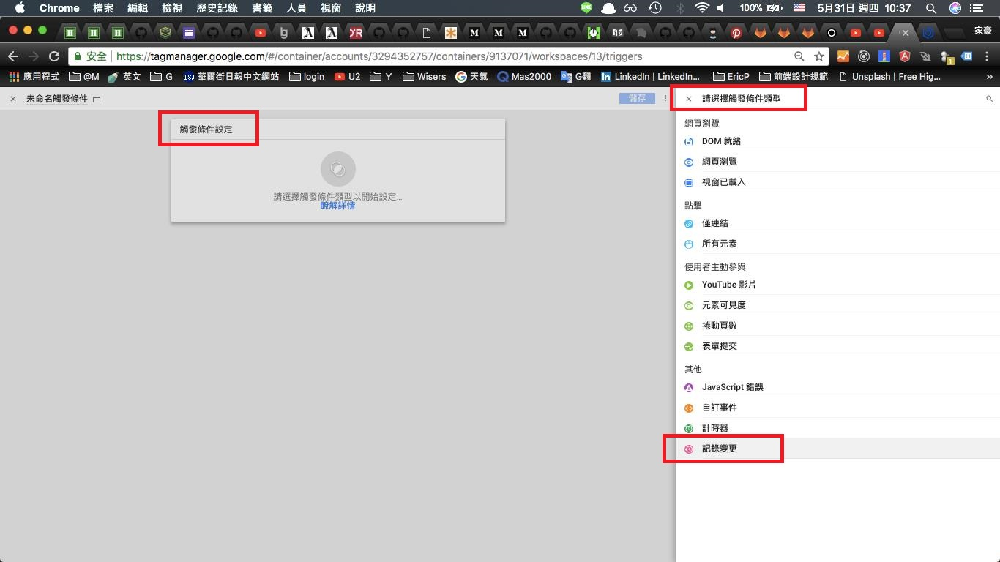
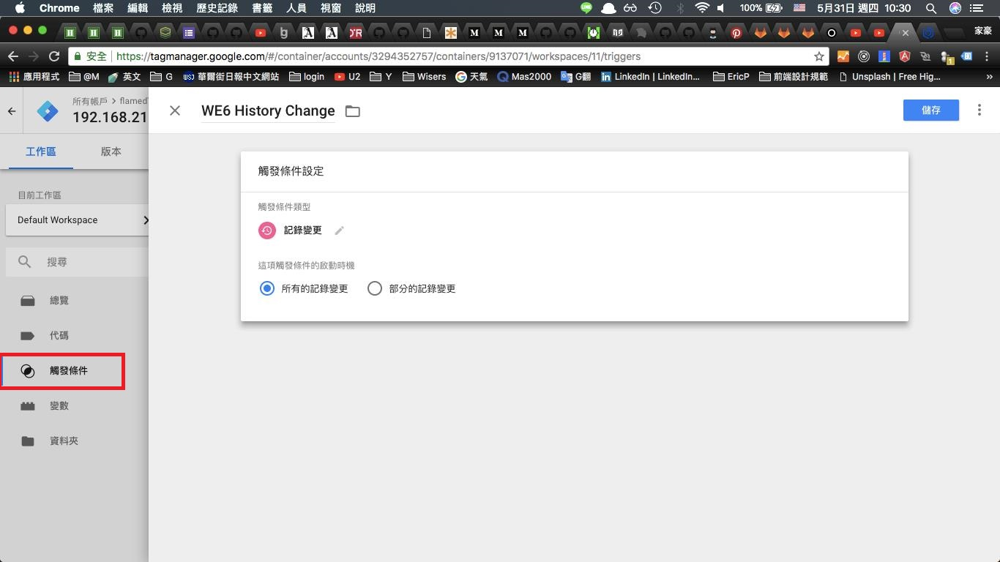
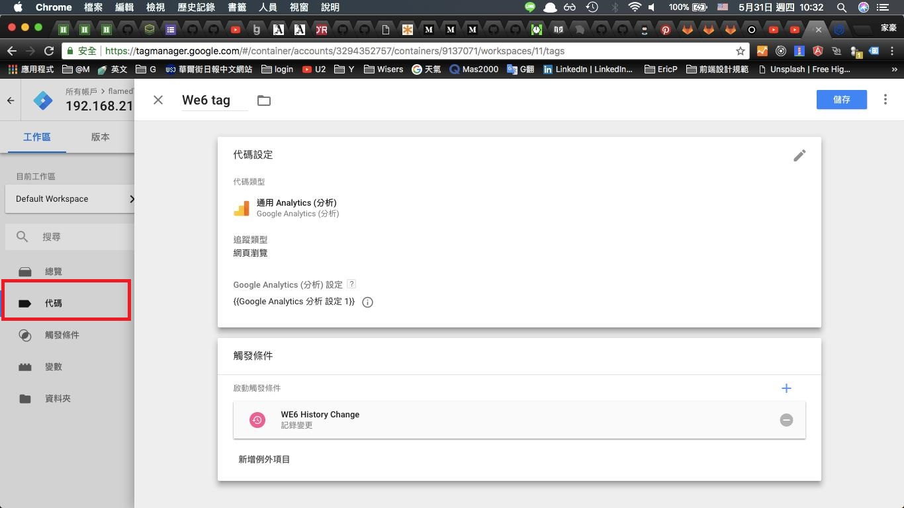

## react GA 要特別設定
## keyword: reactjs google tag manager react-google-tag-manager

### code
改成 PureComponent 應該可也可以。  
保險一點測試過後ＯＫ的話，建議改成 PureCompoent。
```js
// 程式上這樣使用就行了
// <GoogleTagManager gtmId="GTM-XXXXX" />


import React from 'react';
import PropTypes from 'prop-types';
import gtmParts from 'react-google-tag-manager';

class GoogleTagManager extends React.Component {
  componentDidMount() {
    const dataLayerName = this.props.dataLayerName || 'dataLayer';
    const scriptId = this.props.scriptId || 'react-google-tag-manager-gtm';

    if (!window[dataLayerName]) {
      const gtmScriptNode = document.getElementById(scriptId);

      eval(gtmScriptNode.textContent); // eslint-disable-line no-eval
    }
  }

  render() {
    const gtm = gtmParts({
      id: this.props.gtmId,
      dataLayerName: this.props.dataLayerName || 'dataLayer',
      additionalEvents: this.props.additionalEvents || {},
      previewVariables: this.props.previewVariables || false,
    });

    return (
      <div>
        <div>{gtm.noScriptAsReact()}</div>
        <div id={this.props.scriptId || 'react-google-tag-manager-gtm'}>
          {gtm.scriptAsReact()}
        </div>
      </div>
    );
  }
}

GoogleTagManager.propTypes = {
  gtmId: PropTypes.string.isRequired,
  dataLayerName: PropTypes.string,
  additionalEvents: PropTypes.object,
  previewVariables: PropTypes.string,
  scriptId: PropTypes.string,
};

export default GoogleTagManager;

```

### Google Tag Manger 
這邊要新增規則 "history change" 為觸發條件
#### ０１－GTM有不同的觸發條件可以設定.jpg

#### ０２－新設定一個「紀錄變更」的觸發條件.jpg

#### ０３－新增 tag，觸發條件用剛剛新增的.jpg
