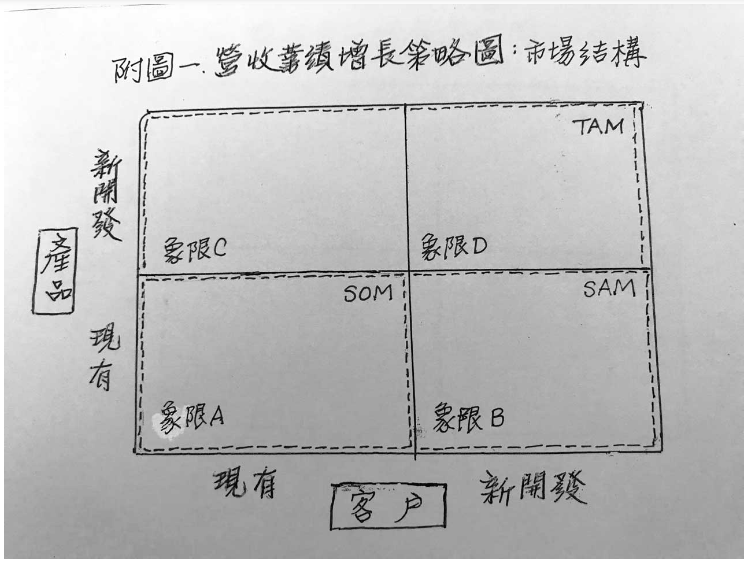
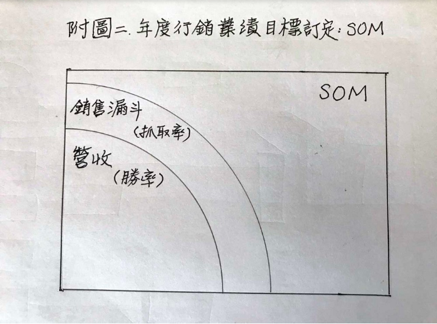

## 怎麼訂定有效的年度業績目標？：績效管理誤區系列#4／程天縱

###宏觀與微觀
用「市場佔有率」來評估市場行銷部門的績效，或許對規模較大的企業有用，但對於小公司或新創企業則不是那麼重要。因為，景氣再怎麼好，都有企業會倒閉；景氣再怎麼壞，都有企業會賺錢。

> 對於小型或微型企業來說，宏觀經濟就如同長江浩浩蕩蕩。
 作為小公司，其實可以不必太在意宏觀經濟形勢分析，像是中美貿易大戰、或是全球保護主義興起之類的議題。

即使是塊硬骨頭，**小微企業的目標就是「求生存、爭發展」；專心啃好自己的一塊硬骨頭，這才是硬道理**。
 
- 明確的數字目標
  對於大型企業，縱使採用「市場佔有率」來衡量績效比較客觀，但仍然需要訂定一個明確的業務數字目標，小微企業亦然。

不管企業規模大小，**都需要有個「年度預算」做為費用的依據**；經營者也都必須懂得「量入為出」的道理。而這個「入」，就源自於「營收」。
在財務三表的「損益表」中，最重要的就是「營收」又叫做「Top Line」；沒有營收就不會有獲利，獲利又叫做「Bottom Line」。
因此，**每年年度計劃中最重要的事，就是決定「營收目標數字」**；以這個數字為基礎，才能展開各種成本、費用的預算編列。

### 市場結構
首先請參考我於11月16日在本站發表〈年度業績目標數字是怎麼來的？：績效管理誤區系列#3〉一文中的附圖一「市場有多大？」；文章中介紹了目標市場的結構，從最大的 PAM，依次縮小為 TAM、SAM、SOM。
為了方便接下來的「營收業績增長策略」介紹，我們把市場結構「洋蔥圈」模型，轉換成「2×2」的四個象限模型圖。請參閱附圖營收業績增長策略圖：市場結構：

- 縱軸是「產品」，分成「現有」產品、和即將「新開發」的產品；
- 橫軸則是「客戶」，也分為「現有」目標客戶、和等待「新開發」的客戶。

如此一來，在「2×2」模型下就出現了四個象限，分別以A、B、C、D代表之。
1. SOM（Serviceable and Obtainable Market）就是**以現有產品「可取得的市場」**，只佔有象限A。
2. SAM（Sales Addressable Market）就是**以現有產品「可發售市場」**，由象限A、B構成。

SAM和SOM的區別，在於SAM中有部分市場受到了
 - 證照
 - 關稅
 - 專利
 - 法律
 - 環保
 
 等等非技術和產品因素的壁壘，成為暫時無法取得的市場或客戶。

3. TAM（Total Available Market）就是由企業定義的產品品類「總市場容量」，包含了可銷售出貨的「現有產品」和尚待開發的「新開發產品」。由A、B、C、D四個象限所構成。
在上一篇文章中提到，「年度行銷計劃」是針對現有產品、現有目標市場客戶所做的行銷計劃，主要就是針對 SOM。
#### 步驟一：訂目標抓取率與勝率
企業可以選擇以TAM、SAM或SOM之一作為分母，來計算市場佔有率。一般來說，企業都會以較容易從產業市場分析報告中取得的TAM或SAM做為依據。
至於SOM，因為其變異性大、競爭對手之間也難以一致，所以很少人會用SOM做為衡量市佔率的依據；但是，因為SOM已經排除了短期內業務無法施力的客戶，所以用它來作為年度行銷業務計劃的基礎，還是比較實際的。
接下來我們就要談談，具體「年度業績目標」要如何訂定。首先請參考我於本站在11月12日發表的〈管理是數字、藝術或是邏輯？：績效管理誤區系列#2〉中所介紹的「市場部和業務部分工合作」概念。

> 市場佔有率 = 市場抓取率 x 業務勝率

該文中提供了三個不同的案例，讓事業群主管以預算投入的回報程度，來決定要提高市場部的「抓取率」、或是提高業務部的「勝率」。請參考附圖2年度行銷業績目標訂定：SOM：

我建議科學方法，分別和市場部門、業務部門討論，找出要達成提高之後的「抓取率」與「勝率」目標，所應該採取的行動計劃與預算投入。
當三方達成共識之後，就可以很容易的計算出「年度業績目標數字」：

> 年度業績目標 = SOM x 抓取率 x 勝率

#### 步驟二：年度產業增長加權
到這一步為止，我們都使用本年度的SOM；還沒有考慮到產業大環境變化對明年度市場規模的影響。
因此，我們可以參考許多「產業分析報告」對明年產業規模的預測；通常可以從中得到TAM或SAM的增長率（或衰退率）。
如果得不到這些資訊、或是對產業分析報告中所提的預測不是很同意，那麼也可以在自己現有的客戶當中，找尋規模比較大的幾家去做意見調查；對於明年的景氣或市場預測，他們肯定有自己的想法。依照80/20定律，這種推測方法的準確性也蠻高的。
因此，將由**步驟一**所得到的**年度業績目標數字**，乘上「1 + 預測明年產業成長比率」或「1 — 預測明年產業衰退比率」，所得到的就是明年最終的「年度業績目標數字」。

總結
本篇文章介紹的訂定明年「年度業績目標數字」兩步驟方式，舉的例子
 - 對於2B（企業對企業）類的經營者來說，應該是比較容易理解的。
 - 對於2C（企業對消費者）類型的公司，則請參閱〈管理是數字、藝術或是邏輯？：績效管理誤區系列#2〉一文中提到的方法，以「知名度」（Awareness）和「優選度」（Preference）來取代「抓取率」和「勝率」，結果是一樣的。

在訂定「年度業務績效目標數字」時最重要的事情，**是「產品事業群主管」必須要很深入的與市場部、業務部討論**，瞭解需要什麼樣的策略與行動計劃，才能達到預期的目標「抓取率」和「勝率」。
這些策略和行動計劃，不僅會影響到市場部和業務部，也非常可能會牽涉到研發、工程、生產製造、文武周邊等部門的協同與合作。
在有限的資源下，產品事業群主管必須做最好的選擇與判斷，才能夠共同訂出一個具有最大「共識」、而又實際可行的年度業務績效目標數字。