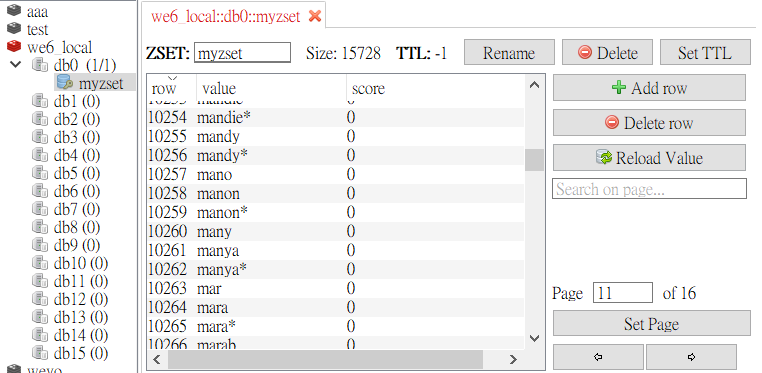
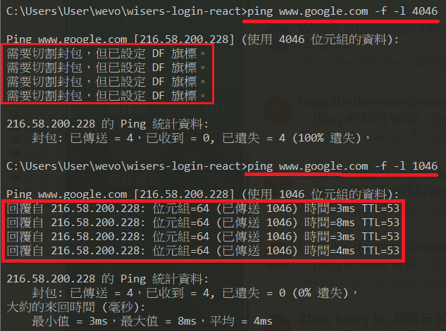

## Auto Complete with Redis
## author: Salvatore Sanfilippo aka antirez (人在 Redis Labs 工作!)
## source: http://oldblog.antirez.com/post/autocomplete-with-redis.html

作者在 **Redis Labs** 工作，這篇相信很有料。  
(為方便寫作，下面一率用 AC 來代表 auto complete)  

## 閱讀目標：
 1. 知道如何用 redis 實現 auto complete 的細節

> Auto complete is a cool and useful feature for users, but it can be non trivial to implement it with good performances when the set of completions is big.

任何功能，只要 data set 一大，就困難。

## Simple auto complete
最簡單的 AC 架構大概有
- 一組特定的 keywords (品牌名稱、熱門推薦.. etc) 範例用英文名`female-names.txt`.
- A prefix string (也就是 User 在 input 輸入的東西)

```
// female-names.txt
# Names of women from lots of languages
#
# From Bob Baldwin's collection from MIT
# Augmented by Matt Bishop and Daniel Klein
#
aaren
aarika
abagael
abagail
abbe
abbey
abbi
abbie
...
```

給定的 perfix，然後我們 extract 某些特定的字有特定的 prefix  
**(這裡不是用 match！有可能特定的 prefix 我們也能提供同義的特定關鍵字)**

問題來了！ ＝＞ **用什麼順序來呈現？**
 - 有些功能是城市為關鍵字，這時候可能就是 lexicographic 排序(**this is more simple and memory efficient to model in Redis**)

舉例，當 prefix 為 `mar` 時，我想要看到 list 為 `mara`, `marabel`, `marcela` 等等  
當我們想要一個 `scalable schema` 時，我們也希望 BigO 為` O(log(N))`。`O(N)` 是不能接受的。  

`space complexity` (另一個超重要的議題)的部分下面會談。  

### log(n)
隨著資料量增加，執行時間雖然會增加，但**增加率會趨緩**。下面的程式碼類似 findIndex 的函式，當輸入的資料有 5 個元素時，它會先切對半後，再尋找，再切半再尋找，因此雖然隨著資料量增加，執行的時間會增加，但是**當資料量越大時，執行速度增加的情況越不明顯**。

### 很少人知道的 feature -> `sorted sets`
element 根據特定的 score 到 `sorted set` 裡面。當 score 相同時，element 依 lexicographic 排序。

這是非常重要的 feature，它保證即在 large clusters of elements have the same score 時，也能保持在 `O(log(N))`！

### ZRANK command
另一 cool feature of sorted sets -> `ZRANK` 指令。回傳特定 element 在 sorted sets 的 position(index)。如果我要知道 sorted sets 中 "bar" 字接續下面是什麼字的話。
- Time complexity: O(log(N))

```
//example
redis> zrank zset bar
(integer) 1
redis> zrange zset 2 -1
1. "foo"
2. "x"
3. "z"
```

另外還需要點 final trick。  

### Completion in lexicographical ordering
上面兩點，我們能夠(在 sorted set中)查詢特定的字，並且知道接續有哪些字(lexicographically list)。但這跟實際需求有點不一樣，我們要的是「字(或句子中的字)含有特定 prefix」  

要達到這些，需要多付點～ space  

在 sorted set 中，除了 `full words` 之外，也**盡可能加入更多特定的 `prefiexs`**。  
也需要一個方法能區別出 `prefixes` 跟 `actual words`，所以我們需要這樣做

 - 每個字，像是 `bar` we add all the `prefixes`: "b", "ba", "bar".
 - 每個字，我們最後都加入 "*" 當作結尾。

這樣就能分辨 `prefixes` 跟 `actual word` （當然可以依情況用不同的字或 binary code 避免重複）  
最後像這樣：
```
redis> zrange zset 0 -1
1. "b"
2. "ba"
3. "bar"
4. "bar*"
5. "f"
6. "fo"
7. "foo"
8. "foo*"
9. "foob"
10. "fooba"
11. "foobar"
12. "foobar*"
```

當 User 輸入 `fo` 時，我們就這樣做
```
redis> zrank zset fo
(integer) 5
redis> zrange zset 6 -1
1. "foo"
2. "foo*"
3. "foob"
4. "fooba"
5. "foobar"
6. "foobar*"
```
最後 filter 出帶有 `*` 的字就好了

### Let's try it with a bigger dictionary
試試看 a list of 4960 [female names](./assets/files/female-names.txt)。  


原文用 `ruby` 給範例。
```ruby
# compl1.rb - Redis autocomplete example
# download female-names.txt from http://antirez.com/misc/female-names.txt

require 'rubygems'
require 'redis'

r = Redis.new

# Create the completion sorted set
if !r.exists(:compl)
    puts "Loading entries in the Redis DB\n"
    File.new('female-names.txt').each_line{|n|
        n.strip!
        (1..(n.length)).each{|l|
            prefix = n[0...l]
            r.zadd(:compl,0,prefix)
        }
        r.zadd(:compl,0,n+"*")
    }
else
    puts "NOT loading entries, there is already a 'compl' key\n"
end

# Complete the string "mar"

def complete(r,prefix,count)
    results = []
    rangelen = 50 # This is not random, try to get replies < MTU size
    start = r.zrank(:compl,prefix)
    return [] if !start
    while results.length != count # 還沒抓到 count 足夠的數量
        range = r.zrange(:compl,start,start+rangelen-1) # zrange 
        start += rangelen # 重新設定 startindex
        break if !range or range.length == 0
        range.each {|entry|
            minlen = [entry.length,prefix.length].min
            if entry[0...minlen] != prefix[0...minlen]
                count = results.count
                break
            end
            if entry[-1..-1] == "*" and results.length != count
                results << entry[0...-1]
            end
        }
    end
    return results
end

complete(r,"marcell",50).each{|res|
    puts res
}
```

嘗試改用 javascript 實作此功能  
完整程式碼 ＝＞ [https://github.com/flameddd/nodejs-redis-auto-complete](https://github.com/flameddd/nodejs-redis-auto-complete)

1. 存入 data set
2. 找到 keyword(prefix) 的 index
3. zrange 讀出資料
4. 接續往下找，直到 result 達到我設定的目標 or 沒有更後面的資料了

```javascript
const zaddAsync = promisify(client.zadd).bind(client);
const insertedData = await zaddAsync(keyword_list)
async function getKeyword({ prefixKeyword, count }) {
  try {
    let startIndex = await zrankAsync([DEFAULT_REDIS_SET_NAME, prefixKeyword])
    
    while (typeof startIndex === "number" && results.length < count) {
      const res = await zrangeAsync([
        DEFAULT_REDIS_SET_NAME,
        startIndex,
        startIndex + rangelen
      ])
      if (!res.length) {
        break;
      }
      const formattedRes = res
        .filter(value => value.match(isKeywork))
        .map(value => value.replace(/\*$/, ''))
      results = results.concat(formattedRes)

      startIndex = startIndex + rangelen;
    }
    console.log('結果為：')
    console.log(results)
  } catch (error) {
    console.error(error)
  }
}
```

上面有基本的功能了，但這招的**時間、空間複雜度**呢？  

### The big O
ZRANK and ZRANGE (with a fixed range of 50 elements) 都是 O(log(N))。  
memory requirements 方面，最糟的情況是，每一個字我們都需拆分來存：  
ex: agent
 - a
 - ag
 - age
 - agen
 - agent
 - agent*

所以一個單字，我需要 5 + 1 的儲存空間（假設 M 為 letter，那就是 `N個字*(M+1)` 的需求）  
Ma 為所有字平均有多少 letter，實務上的樣拆分後，其實有很多相同的字(collisions)。故最後結果會 `比 N*(Ma +1) 更好一些`。  
範例中 4960 筆資料，我們需要 14798 個 element，是可以接受的。  
(我實作的 demo 好像多一點點...，可能邏輯哪邊有點差異)

### Query prediciton
上面的範例是用 lexicographically order，實務上還有很多設計需求。例如希望前面幾個先出現的是高頻率的字，舉例：  
輸入 `ne` 時，想要先出現
 - "netflix"
 - "news"
 - "new york times"

這些 User 常輸入的字。這就沒辦法單用 `range query` 來實現。一個特定的 prefix 可以有 sub prefixes with different "top strings" 並且我們要能夠在 runtime 時不 blocking 的情況下 update data。要這樣做，要為**每一個prefix**用一個不同的 sorted set。  
這樣做：  
- 每次 User 輸入個 query，如 `news` ，我們計算`所有 prefixes: "n", "ne", "new", "news"`。然後用所有 prefixes 當作一個 sorted set 的 key name，為每一個 key 執行 `ZINCRBY <prefix> 1 news`。 
- 為了完成 prefix，需要執行 `ZRANGE <prefix> 0 4` 來顯示前 5 個 item。

> 也就是說，情境為，某位 User（透過 auto complete）輸入完一個字，然後做查詢了 "news" 給系統。我們就拿 "news" 這單字的所有 prefixes 設一個 sorted set ，並且每一個 sorted set 裡面對 "news" 的 score + 1。這樣 User 輸入 "n" 時，我們就去 "n" 的 sorted set 去撈出 top 5，這 top 5 就是最高出現頻率的 5 個單字了。

這方法的問題是，大部分的 auto complete 功能只會顯時 top 5 個item左右。但為了計算這少少的幾格，**需要加長 list**。理論上，我們需要對每一個 prefix 都這樣做。  

好在 stream algorithms 可以幫助我們。統計上來說，取 300 items pre prefix 就幾乎能做取得 top 5 items 了，只要 query 頻繁，那麼越熱門的字會一直維持在前面。所以只要每次 receive a search for a string，`string 的 every prefix`:  

- 如果 這個 prefix 的 sorted set 還不是最大數量(這文章範例是 300)，就執行 `ZINCRBY`增加 prefix 的 score 1
- 如果 the max number of items 達到了，就 remove lower score 的 element，然後新增這個新的並且把 score 設為 `lower score item` 的 score + 1
 
如果覺得上面這樣太複雜，可以這樣做（will have more or less the same performances）  
- 對 current element `ZINCRBY`，然後隨機 sample 3個 elements，並移除 lower score。

我向你保證這方法很ＯＫ，但實際上這演算法(stream algorithms)的成效還是根據 the distribution of the input。舉例，如果所有的 strings 出現頻率非常非常相近，那還是會有一起出來，但不是相關聯的字。

這 serch 研究有興趣深入再去看吧。
> But if you are curious, make sure to take at look at this [google search](https://www.google.com/search?sclient=psy&hl=en&q=stream+algorithm+frequent+items&aq=f&aqi=&aql=&oq=&gs_rfai=&pbx=1&cad=h).

### Clean up stage
Clearly because of the long tail nature of searches, we'll end with a lot of sorted sets related to prefix of words very rarely used. 

This sorted sets will have maybe just a few items, all with score 1. 
There is no interest for us in this data... and it's a good idea to clean up this keys, otherwise our approach will use too much (wasted) memory. 

There are two ways to do this. If you are using Redis 2.0 the simplest thing to do is to use an associated key for every sorted set with the time of last update. Then using RANDOMKEY you can get a random element from time to time with a background worker, and check if it's better to delete it since it was updated a few days ago the last time. 
 


 Each prefix becomes a key pointing to a zset; 
 each zset contains the fully query (and the score reflects how common that query is). 
 To see the top 'k' items for a prefix 'p', just look up the 'k' highest ranked elements of the zset at the key 'p'.


#### MTU 最大傳輸單元
最大傳輸單元（英語：Maximum Transmission Unit，縮寫MTU）是指一種通信協議的某一層上面所能通過的最大數據包大小（以字節為單位）。最大傳輸單元這個參數通常與通信接口有關（網絡接口卡、串口等）。

#### 如何為網路找到適合的 MTU 大小
測試最佳 MTU 最簡單且最精確的方法之一是做一個簡單的 `DOS Ping` 測試。
1. 只要傳送 Ping 要求
2. 並慢慢降低封包大小
3. 直到封包不需要被分散為止。

雖然這個簡單的測試對測試端點來說很精確，使用者可能會發現較低的 MTU 可能對他們的環境來說會更好。重要通知：使用 PPPoE 連線時， MTU 必須為 1492 ( 或更低 ) 。您可以在 這裡 找到更多影響 MTU 的詳細資訊。

- Ping 測試的指令是 ping www.google.com -f -l xxxx 
- 您可以使用任何有名稱可以偵測的網域，
- 每一個指令之間有一個空格。 
- 最後四位數字是測試的封包大小。 

> ping www.google.com -f -l 1046

在 Ping 測試中得到最大的封包大小，然後加上 28 。加上 28 byte 是因為 20 byte 是保留給 IP 標頭， 8 byte 是給 ICMP 回應要求標頭。記住！**您必須為 Ping 測試結果加上 28 ！** 

例如： 
Ping 測試的最大封包大小是 1440  
1440 + 28 IP 和 ICMP 標頭  
> 1468 就是您的最佳 MTU 設定

  
