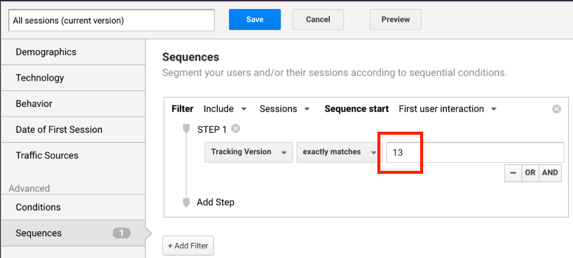
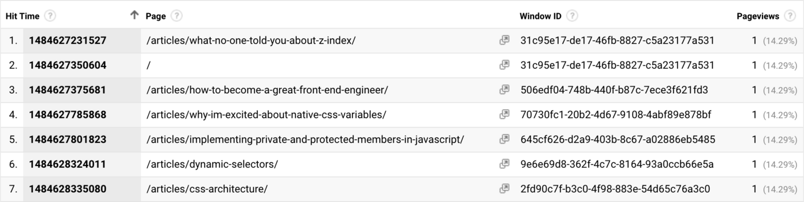
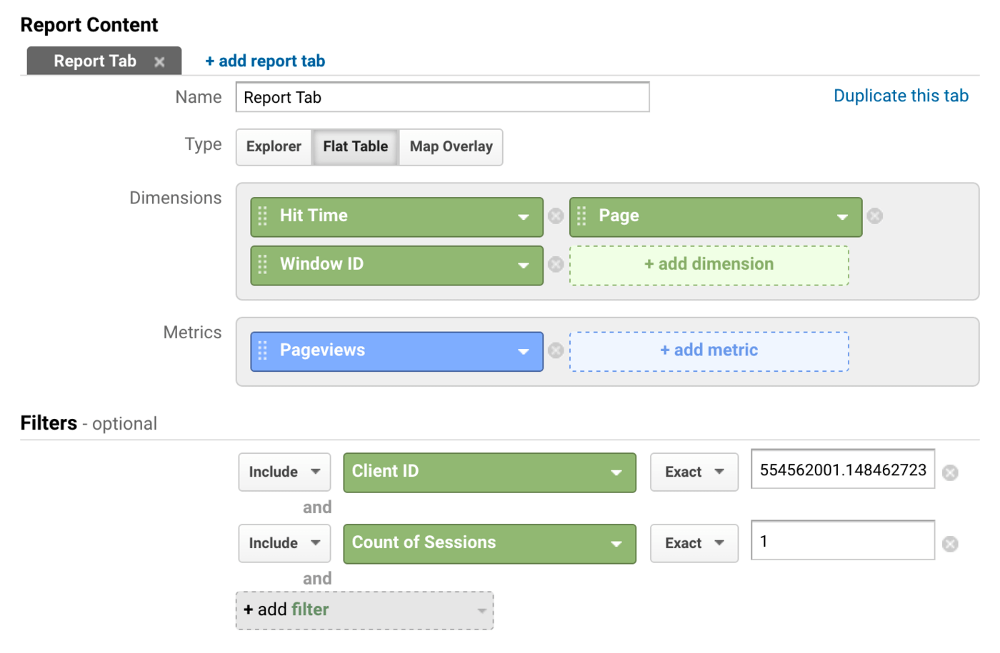
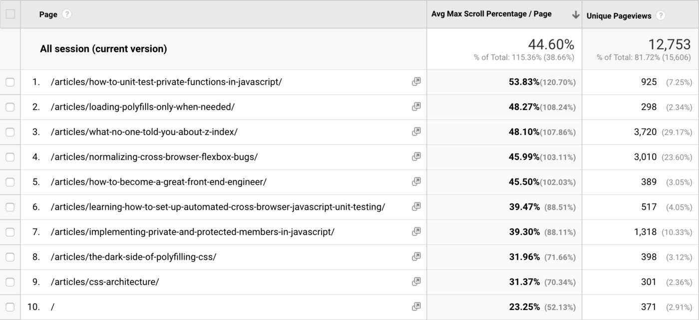
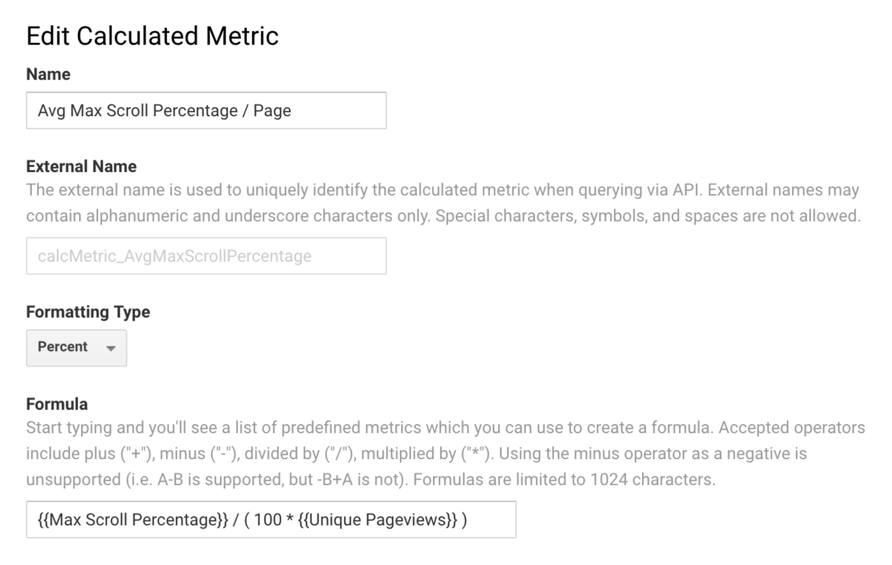
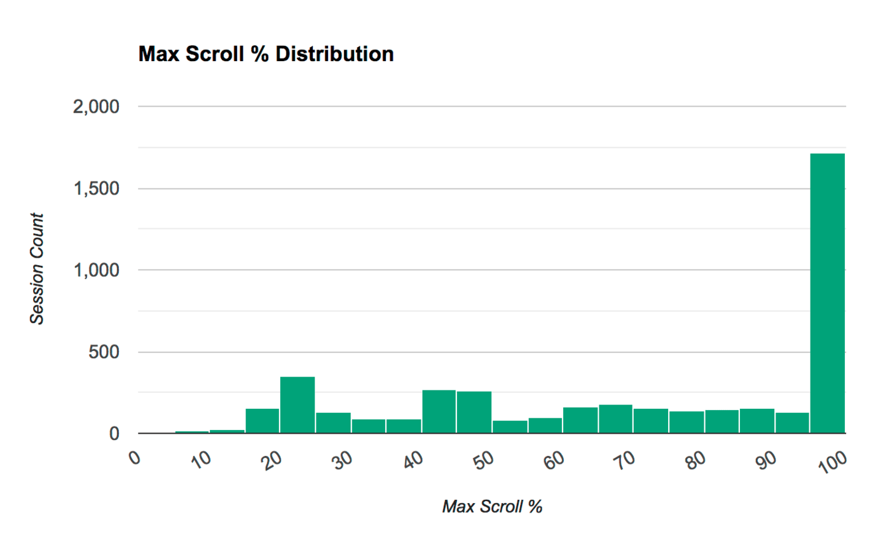

## The Google Analytics Setup I Use on Every Site I Build
## Philip Walton (philipwalton)
## https://philipwalton.com/articles/the-google-analytics-setup-i-use-on-every-site-i-build/
## date: February 8, 2017
### [analyticsjs-boilerplate](https://github.com/philipwalton/analyticsjs-boilerplate)

> Philip 過去三年都在 google 開發 GA，這篇就算是基本教學，也一定很有水準。
> Philip 還是 [autotrack](https://github.com/googleanalytics/autotrack) 開發者。

很多精彩而且免費的教學 GA，但大多都在講 marketers and advertisers 應用。但非常少是 for `web developers` 的，給那些只是想更清楚了解 User 怎使用這個網站的人。

Philip 這篇文章列出很多過去三他學到的，這篇主要是給 web developers。  
這篇文章講到的所有東西，Philip 有建了一個 repo [analyticsjs-boilerplate](https://github.com/philipwalton/analyticsjs-boilerplate)作為參考使用。  
這篇（這些資源）尤其推薦給那些直接去 copy/past [default tracking snippet](https://developers.google.com/analytics/devguides/collection/analyticsjs/#the_javascript_tracking_snippet)的 RD

## Loading analytics.js
我的看法是，**絕不接受 analytics 去降低網站的 user experience**。換句話說 **tracking scripts 應該永遠是 asynchronously 載入**(在 analytics.js 已包含了)。你 send data 到 analytics services 也不應該拖累到網站自身所需的 requests。  

現在官方推薦的 async tracking snippet 運作得很好，它
 - 保證 analytics.js 盡快的載入
 - asynchronously 載入，這樣才不會 block the loading of other critical resources.
 
但，還可以更好，現在的 async tracking snippet 有個問題在。它會產生2個 http requests
 - one for the analytics.js script
 - to send the initial pageview

這會 push back the load event，會影響其他 load-based metrics、潛在的 delay 那些 window loads 完之後要跑的 code 的 scheduled。  

有 2 招可以解這問題  
1. 等 load event fires 後，才 run the tracking code。但這招不太好，因為可能會 result in missed pageviews from users who bounce early.
2. 用 [beacon transport mechanism](https://developers.google.com/analytics/devguides/collection/analyticsjs/sending-hits#specifying_different_transport_mechanisms) (底層就是靠[navigator.sendBeacon()](https://developer.mozilla.org/en-US/docs/Web/API/Navigator/sendBeacon))to send all hits。這就不會 affect loading (or unloading) of the current page。

```javascript
ga('create', 'UA-XXXXX-Y', 'auto');

// Updates the tracker to use `navigator.sendBeacon` if available.
ga('set', 'transport', 'beacon');
```

（但，google tag manager需要做處理嗎？）

### Navigator.sendBeacon()
The navigator.sendBeacon() method can be used to `asynchronously transfer a small amount of data over HTTP` to a web server.

程式碼這樣調整就好
```javascript
// 現在 google 的 snippet
<!-- Google Analytics -->
<script>
window.ga=window.ga||function(){(ga.q=ga.q||[]).push(arguments)};ga.l=+new Date;
ga('create', 'UA-XXXXX-Y', 'auto');
ga('send', 'pageview');
</script>
<script async src='https://www.google-analytics.com/analytics.js'></script>
<!-- End Google Analytics -->
```

```javascript
// 調整過後
<script>
window.ga=window.ga||function(){(ga.q=ga.q||[]).push(arguments)};
ga('create', 'UA-XXXXX-Y', 'auto');
ga('set', 'transport', 'beacon');
ga('send', 'pageview');
</script>
<script async src="https://www.google-analytics.com/analytics.js"></script>
```

（文章提供的 code，跟官方的有點點差別 => ga.l=+new Date;）  
ga('set', 'transport', 'beacon'); => tells the tracker to use navigator.sendBeacon() for all subsequent hits:

## Putting your tracking code in a separate file
官方文件推薦把 snippet code 放到所有網站頁面的 <head> 中。如果你只有用 snippet 的話，這還好。但如果有做其他的 code to track additional user interactions 的話，這就不是個好方法。  

我偏好把所有 analytics-related code 獨立拆出一隻檔案，然後當網站 code finished loading 後，asynchronously load 這程式。  

有用工具來 supports code splitting，可以 lazily initialize your tracking code。
```javascript
// index.js

const main = () => {
  // Load custom tracking code lazily, so it's non-blocking.
  import('./analytics/base.js').then((analytics) => analytics.init());

  // Initiate all other code paths here...
};

// Start the app through its main entry point.
main();
```

Your custom tracking code will then live in its own module and can be initialized via its exported init() function:
```javascript
// analytics/base.js

export const init = () => {
  // Initialize the command queue in case analytics.js hasn't loaded yet.
  window.ga = window.ga || ((...args) => (ga.q = ga.q || []).push(args));

  ga('create', 'UA-XXXXX-Y', 'auto');
  ga('set', 'transport', 'beacon');
  ga('send', 'pageview');
};
```

Now your template files only includes the `<script async>` tag to load analytics.js as well as your site’s regular JavaScript code:

```html
<!-- Loads the site's main script -->
<script src="path/to/index.js"></script>

<!-- Loads analytics.js asynchronously -->
<script async src="https://www.google-analytics.com/analytics.js"></script>
```

如果沒有用打包工具做 code split，也能夠過 `<script async>` 達到同樣效果。而且不需要擔心 `load order`，`analytics.js` 有特別針對此情況做處理。
```html
<!-- Loads the site's main script -->
<script src="path/to/index.js"></script>

<!-- Loads analytics.js and custom tracking code asynchronously -->
<script async src="https://www.google-analytics.com/analytics.js"></script>
<script async src="/path/to/tracking-code-bundle.js"></script>
```

## Tracking custom data
dimension 是 GA 可以讓你去 subdivide usage data into categories。舉例內建的 dimensions 可以抓到 `Browser`, `Device Category`, `Language`, `Page` 等等。  

內建的 dimensions 很讚，但還有很多很好用的 dimensions 沒被 tracked by analytics.js。要靠 GA 的 `custom dimensions` 功能。文章下面會寫到我用哪些 `custom dimensions` 跟為什麼要用這些 `custom dimensions`。

## Tracking Version
如果你改了 analytics 開始新 tracking a bunch of new dimensions，或者改變了 format of the data you’re collecting 後  
你大概只想要 report (latest changes) on data from the subset of users。最簡單的方法就是[建立一個叫做 `Tracking Version` 的 custom dimension](https://support.google.com/analytics/answer/2709829)，然後設定它的 [scope](https://support.google.com/analytics/answer/2709828#processing) 為 "Hit(GA中文文件似乎翻作匹配)"(since it will apply to all hits)。

### 設定方式
導入自訂維度的第一個步驟，就是在 Analytics (分析)「管理員」區段的資源設定中定義自訂維度。本例中的自訂維度定義看起來會像這樣：

| 指數 | 1 |
| :------| :------ |
| 名稱 | 難度 |
| 範圍 | 匹配 |
| 有效 | 是 |


當你建了幾個 `custom dimension` 之後，index 可能會亂掉。Philip 會用 object 來管理 custom dimension names to their index.
```javascript
const dimensions = {
  TRACKING_VERSION: 'dimension1',
};
```

假設這是你第一個版本
```javascript
const TRACKING_VERSION = '1';

ga('create', 'UA-XXXXX-Y', 'auto');
ga('set', 'transport', 'beacon');
ga('set', dimensions.TRACKING_VERSION, TRACKING_VERSION);
ga('send', 'pageview');
```
只要你改變了 tracking，就增加 version 版本號，這樣你就能 segments 你的 report 來缺別改動前後的 report 了。  
- [About segments](https://support.google.com/analytics/answer/3123951?hl=en)
- [關於區隔](https://support.google.com/analytics/answer/3123951?hl=zh-Hant)

  

## Client ID
GA 用 [client ID](https://developers.google.com/analytics/devguides/collection/analyticsjs/cookies-user-id) 來關聯特定 user 的每次點擊，除非你自定義自己的設定，不然 `analytics.js` 會自動產生這個值給你並存到 `browser's cookies`，每次點擊時一起送出。  

GA 內部在使用這個 `client ID`，但這沒辦法讓你在 reports 中使用。  
可以設一個叫做 `Client ID` 的 `custom dimension`，設定 `scope` 為 `User`，然後把 `analytics.js` 產生的值給它。  
舉例來說說為什麼這個東西有用，假設情境是這樣：
1. 你注意到 reports 中有一些 click events 是某個 button 已經被點擊過，應該要被隱藏起來了才對。  

這時候就會疑問，到底網站怎麼回事？哪邊 broken state 了？有了 `client ID` 就能夠鎖定特定的 user，查看他的互動行為來研究到底怎麼變成 bad state 了（過濾出特定的 user’s client ID report 來研究）。  

用 get 跟 set
```js
const dimensions = {
  TRACKING_VERSION: 'dimension1',
  CLIENT_ID: 'dimension2',
};

// ...

ga((tracker) => {
  var clientId = tracker.get('clientId');
  tracker.set(dimensions.CLIENT_ID, clientId);
});
```
這段程式碼，會傳到 `The ga command queue` 裡面，預設是當 analytics.js is loaded 後，會盡快去執行。  
[The ga command queue](https://developers.google.com/analytics/devguides/collection/analyticsjs/how-analyticsjs-works#the_ga_command_queue)

## Window ID
有時候 **User 用多個視窗 or tab** 來用你的網站，GA 目前沒有收集 window/tab-specific data。  

要的話，你可以設 `Window ID` 的 `custom dimension` 來達成（**scope to “Hit”**）。page load 的時候，給它一個 random value。這就有辦法區別出 current window context 了。

> 在 SAP 中，Uesr 可以不用做 full page reload 也可以有多個 pageviews 時，這招很有用  

用 `uuid` 來產生這個 random value。
```js
const uuid = function b(a) {
  return a ? (a ^ Math.random() * 16 >> a / 4).toString(16) :
      ([1e7] + -1e3 + -4e3 + -8e3 + -1e11).replace(/[018]/g, b);
};
// ....
const dimensions = {
  TRACKING_VERSION: 'dimension1',
  CLIENT_ID: 'dimension2',
  WINDOW_ID: 'dimension3',
};

export const init = () => {
  // ...
  ga('set', dimensions.WINDOW_ID, uuid());
  // ...
};
```

## Hit ID, time, and type
GA 的 interface 可以輕鬆 report on aggregate data，但想要進一步**針對 individual user, session, or hit-level data**，就困難了。  

有一個功能叫 [BigQuery Export](https://support.google.com/analytics/answer/3437618) 能 report 所有細分資料，但這要 premium customers。  

靠 `custom dimensions` 大致上都能做到。新增一個 `唯一的` `hit-specific` 的 metadata 給`every hit` 來送給 google。report 時，就能找出來。  

- 前面的 custom dimension `Client ID` 用來 debug user-interaction 的資料超級好用。  
- 這邊這些 custom dimension `hit-level` 可以更進一步研究每個 user 的行為。  

要追蹤 `Hit ID`, `Hit Time`, and `Hit Type` custom dimensions，首先在 Google Analytics 建立然後設 `scope to “Hit”`。然後 code 方面，override buildHitTask，並且設定這些值在 model 中，確保每次點擊都有套用到。

- [override](https://developers.google.com/analytics/devguides/collection/analyticsjs/tasks#adding_to_a_task)
- [buildHitTask](https://developers.google.com/analytics/devguides/collection/analyticsjs/tasks)
- [model](https://developers.google.com/analytics/devguides/collection/analyticsjs/model-object-reference)

- [向任务添加功能](https://developers.google.com/analytics/devguides/collection/analyticsjs/tasks?hl=zh-cn)

```js
const dimensions = {
  // ...
  HIT_ID: 'dimension4',
  HIT_TIME: 'dimension5',
  HIT_TYPE: 'dimension6',
};

export const init = () => {
  // ...
  ga((tracker) => {
    const originalBuildHitTask = tracker.get('buildHitTask');
    tracker.set('buildHitTask', (model) => {
      model.set(dimensions.HIT_ID, uuid(), true);
      model.set(dimensions.HIT_TIME, String(+new Date), true);
      model.set(dimensions.HIT_TYPE, model.get('hitType'), true);

      originalBuildHitTask(model);
    });
  });
  // ...
};
```

- `Hit ID` dimension 設 uuid()
- `Hit Time` dimension 設 current timestamp
- `Hit Type` dimension 設 tracker 裡面存的（像 clientID 一樣，GA有 track 但 report 裡面沒法用）。

## Error tracking
有些付費的服務，能提供此功能（Track:js, Rollbar），但可以靠 GA 來實現。  
新增一個 `global error event listener`，在 <head> 中，讓它來 catches all errors
```js
<script>addEventListener('error', window.__e=function f(e){f.q=f.q||[];f.q.push(e)});</script>
```

這會把所有 unhandled errors 存在 array 中，等 analytics loaded 後，你可以這樣送出這些 error。
```js
export const init = () => {
  // ...
  trackErrors();
  // ...
};

export const trackError = (error, fieldsObj = {}) => {
  ga('send', 'event', Object.assign({
    eventCategory: 'Script',
    eventAction: 'error',
    eventLabel: (error && error.stack) || '(not set)',
    nonInteraction: true,
  }, fieldsObj));
};

const trackErrors = () => {
  const loadErrorEvents = window.__e && window.__e.q || [];
  const fieldsObj = {eventAction: 'uncaught error'};

  // Replay any stored load error events.
  for (let event of loadErrorEvents) {
    trackError(event.error, fieldsObj);
  }

  // Add a new listener to track event immediately.
  window.addEventListener('error', (event) => {
    trackError(event.error, fieldsObj);
  });
};
```

> Note: the `nonInteraction` field is set to true to prevent this event from influencing bounce rate calculations. If you’re curious as to why this is important you should read more about [non-interaction events](https://support.google.com/analytics/answer/1033068#NonInteractionEvents).

The above logic loops through each stored error on the error event listener and reports it. It then adds a new listener to immediately send uncaught errors to Google Analytics as they occur.  

(track unhandled Promise rejections 更複雜一些，要研究unhandledrejection event)

## Exception hits vs events
有經驗的 GA users 會疑惑為什麼我將這些 error 當作 `event hits` 而不是 `exception hits`？
- exception hits 是 GA 新增出來的特別為此目的的。

理由是，`exceptions hits` 不會顯示在 `Real Time report` 中，而 `event hits` 會。

-  [即時報表](https://support.google.com/analytics/answer/1638637?ref_topic=1638563

## Performance Tracking
GA 有 `Site Speed` 功能可以（用 Navigation Timing API）report 很多指標。但這有很多限制，所以當你真的很重視這些 these metrics 時，你大概會自己來處理。

- [關於網站速度(Site Speed)](https://support.google.com/analytics/answer/1205784)
- [Navigation Timing API](https://developers.google.com/web/fundamentals/performance/critical-rendering-path/measure-crp?hl=zh-tw)


`Site Speed`  feature works because `analytics.js` 自動將 1% 的 user，在 page load 的時候送出 `timing hit` 

- [timing hit](https://developers.google.com/analytics/devguides/collection/analyticsjs/user-timings)

但 1% 不夠具有代表性，而且沒有辦法調整這個設定。另個問題是 `segments` 中沒法取到 `timing hits`，所以你沒辦法跑 report。  
例如，只有特定的少數 uesr 的 pageload 超過 10s，你就沒辦法找到並研究這些人...  

`Custom metrics` (類似 custom dimensions)就沒有這些限制。

- [自訂維度和指標](https://support.google.com/analytics/answer/2709828)

## Custom performance metrics
Navigation Timing API 有三個指標可以幫助來測量 [critical rendering path](https://developers.google.com/web/fundamentals/performance/critical-rendering-path/measure-crp)  

- **responseEnd**: the point when the server finishes delivering the response to the browser.
- **domContentLoadedEventStart**: when all the page’s content is processed and loaded in the DOM, and the browser can start rendering the page.
- **loadEventStart**: when all the page’s initial resources are loaded.

一樣，在 GA 新增這三個 `custom metrics`（設定 scope 為 "Hit"、formatting type 設為 "Integer"[格式設定類型] 下拉式選單中，選取 [整數]）

```js
const metrics = {
  RESPONSE_END_TIME: 'metric1',
  DOM_LOAD_TIME: 'metric2',
  WINDOW_LOAD_TIME: 'metric3',
};

export const init = () => {
  // …
  sendNavigationTimingMetrics();
}

const sendNavigationTimingMetrics = () => {
  // Only track performance in supporting browsers.
  if (!(window.performance && window.performance.timing)) return;

  // If the window hasn't loaded, run this function after the `load` event.
  if (document.readyState != 'complete') {
    window.addEventListener('load', sendNavigationTimingMetrics);
    return;
  }

  const nt = performance.timing;
  const navStart = nt.navigationStart;

  const responseEnd = Math.round(nt.responseEnd - navStart);
  const domLoaded = Math.round(nt.domContentLoadedEventStart - navStart);
  const windowLoaded = Math.round(nt.loadEventStart - navStart);

  // In some edge cases browsers return very obviously incorrect NT values,
  // e.g. 0, negative, or future times. This validates values before sending.
  const allValuesAreValid = (...values) => {
    return values.every((value) => value > 0 && value < 1e6);
  };

  if (allValuesAreValid(responseEnd, domLoaded, windowLoaded)) {
    ga('send', 'event', {
      eventCategory: 'Navigation Timing',
      eventAction: 'track',
      nonInteraction: true,
      [metrics.RESPONSE_END_TIME]: responseEnd,
      [metrics.DOM_LOAD_TIME]: domLoaded,
      [metrics.WINDOW_LOAD_TIME]: windowLoaded,
    });
  }
};
```
接著就能用 [Total Events](https://developers.google.com/analytics/devguides/reporting/core/dimsmets#view=detail&group=event_tracking&jump=ga_totalevents)指標來
看全部的
- Response End Time
- DOM Load Time
- Window Load Time

可以再從這些數字分出 average。

## Median vs. average
GA 經常被批評沒有 median。如果你已經有用上面建議的 hit-level custom dimensions，你是能夠算出 median 的，這點後面再補充一些。

## Using autotrack plugins
我開發 [autotrack](https://github.com/googleanalytics/autotrack)，是因為我一直重複造輪子。這邊列出幾乎我每個網站都會用的設定並且說明。


| | |
| :------| :------ |
| outboundLinkTracker | 必要，因為 GA 不會 track 導向到外部 domains (行為？) |
| cleanUrlTracker | 痛恨看到 URL 上有一堆  marketing params，就用這個。用 developer-friendly way 來處理此問題。 |
| maxScrollTracker| Tracking how far down the page a user scrolls |
| pageVisibilityTracker | 比 GA 更好、更正確的 track User 在網站的活動時間 |
| urlChangeTracker | for 網站是 SPA |

## Testing your implementation
為了要測試，我一定至少用兩個 trackers 在網站上。分別設定為 `production property` 跟 `test property`。  
test tracker 就用來測試改動結果。

- [test property example](https://github.com/philipwalton/analyticsjs-boilerplate/blob/master/src/analytics/multiple-trackers.js)
- [Working with multiple trackers](https://developers.google.com/analytics/devguides/collection/analyticsjs/creating-trackers#working_with_multiple_trackers)

```js
ga('create', 'UA-XXXXX-Y', 'auto', 'prod');
ga('create', 'UA-XXXXX-Z', 'auto', 'test');

ga('prod.send', 'pageview');
ga('test.send', 'pageview');
```

## Filtering out local/spam data
有時候會有假帳號送假資料到你的 GA （廣告他們的 shady businesses）。你的真正 User 就會不爽了。

- [google analytics spam](https://www.google.com/search?q=google%20analytics%20spam)
- [[Google Analytics] 如何正確地將 Referrer Spam 移除](https://carlos-studio.com/2017/02/01/google-analytics-%E5%A6%82%E4%BD%95%E6%AD%A3%E7%A2%BA%E5%9C%B0%E5%B0%87-referrer-spam-%E7%A7%BB%E9%99%A4/)
- [用篩選器去除惱人的GA垃圾流量(Referral Spam)](https://www.analyticsdavis.com/2015/08/stop-referrer-spam.html)

另外的情況是，自己犯的錯。例如跑 CI 時，沒有關掉 `analytics.js`。這些資訊都是干擾。  

用 [View Filters](https://support.google.com/analytics/answer/1033162) 可以解這兩個問題。

- hostname filter (e.g. only URL hostnames matching **philipwalton.com**)
- RegExp match filter for a custom dimension value specific to my site (e.g. Tracking Version or Hit ID)

## Reporting and visualizing your data
如果上面的方法都有用的話！，這邊最重要的一個建議就是這幾招：
- [custom reports](https://support.google.com/analytics/answer/1033013)
- [calculated metrics](https://support.google.com/analytics/answer/6121409)
- [Analytics Reporting API](https://developers.google.com/analytics/devguides/reporting/core/v4/)

### Custom reports
如果你有用到 custom dimensions or custom metrics，那就需要 custom reports 來 access and visualize that data.  

這章節，我提到的（用 Client ID dimension 來）區隔 User 和（Window ID dimension）區隔 page loads。下面圖就是範例（用 Hit Time 排序）特定 User 的第一個 session，顯示 Page ID 跟 Window ID。  
 
  

圖中可以看到，這位 Uesr
1. 從讀一篇文章開始（started their session）
2. 接著倒回到首頁（in same window）
3. 接著開啟4篇文章＝＞用不同的 windows

這樣就能從 GA 看出更多的 User 行為了。上面這 report 是我隨便選一個 client ID，然後這樣設定出來的。(a `custom report` that **filtered** only `hits matching` that `Client ID` and `Session Count` dimension）  
  
### Calculated metrics
這個可以讓你從現有的指摽來定義新的指標。舉例 autotrack 的 `maxScrollTracker` 紀錄一個 seesion 的每一頁 maximum scroll percentage。  

但 GA 在 report（date range） 只顯示所有 sessions 的指標總數（這數據沒什麼用）。  

所以用 `calculated metric` 來計算**一個 session 在每一頁**的 `average Max Scroll Depth`。這資訊很有用處。  
下圖為**某一位客戶**的 report，揭露出過去 7 天，不同頁面的 the highest average max scroll percentage。  
  

設定方法  
  

## Medians, histograms, and distributions
用 `hit-level custom dimensions` 計算中位數跟資料分佈  

舉例為什麼 distribution data 很有用？從經驗看來，單單向上面的平均數 (averages max scroll) 是沒辦法告訴你全貌的。  
下圖顯示過去幾天 all users 的 max scroll percentage 分佈資料（中位數是 80%）。  

  

（提示：要取到中位數，你需要新增`Hit ID dimension` ，然後排序(ascending order)指標，然後自己去看、去找出）  
上圖就能看出差別，從再上面的資料看到，所有人平均 scoll 到 44% 而已。但其實最多人的一群是 scoll 到底的。  

要畫出上面的圖，需要靠
- [Google Charts](https://developers.google.com/chart/interactive/docs/gallery/histogram)
- [Analytics Reporting API](https://developers.google.com/analytics/devguides/reporting/core/v4/)  

## Conclusions
如果你想持續 follow best practice 的話，follow github ` analyticsjs-boilerplate`。