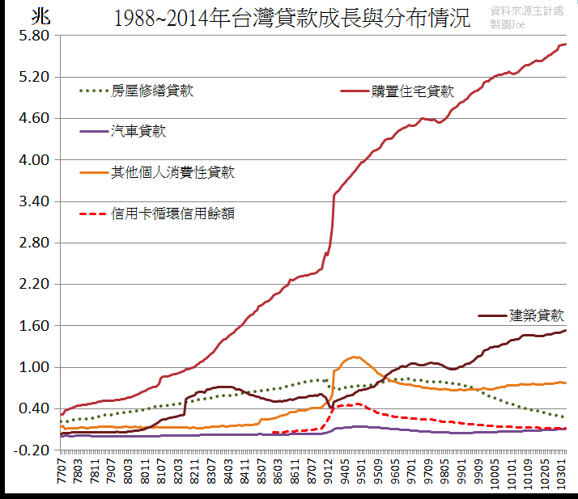

## 2019/03/11目前台灣房價根本不合理，而且很可能是歷史高點，隨時會塌
## 2019/03/11
## [Re: [新聞] 年輕人不買房  過來人：20年內就後悔](https://disp.cc/b/163-bdXm)

一般看**當地都市房價**是`自住居多`還是`投資需求`  
最簡單就兩數據 : `房價租金比` 跟 `空屋率`  

- 房價租金比過高： 表示當地炒房嚴重 因為人民可以借錢買房 但不會借錢租房
- 房價租金差異過高：表示當地資金炒房嚴重 而自住水位根本跟不上

這比房價所得比準太多了 因為所得會被所得不均稀釋 但是租金沒人會借錢租

### 房價租金比
（2018/11/27）台北市是世界第3... (49x)  
其實這算有進步了 因為2012年時  台北市是世界第一...  
從這成長就知道台灣房價水位變化是如何...只漲不停????  

### 空屋率
（2017年度）營建署統計 10.12%  
看起來還好嘛? 基本持平 但是合理空屋率 **國際上一般是6%以下**....  
而且最重要的是 這份統計資料  
用的是 低使用度用電戶(11、12月平均用電度數低於60度的住宅)  
而不是浮動用電來看 在新宅公設及用電早已成長情況下 搞不好單公設跟冰箱就超過了  
也就是說  **新建住宅空屋很多根本不會算在內**...  
這也是為何台灣這十年新建住宅雨後春筍 但空屋率統計卻沒大幅增加的原因...  

### 資金面
那奇怪了 若台灣所得跟需求沒有大幅成長  房價怎會一路飆高?  
簡單啊 就資金面啊 **看看銀行界放了多少錢在房屋貸款上**?  
  

這猛烈的資金 配合國際QE以來的低利率 房地薪火怎會少??  
現在房價不過就只是  
- 內在因素(台灣低稅放任炒房 政府佯作不知 人民不懂)
- 外在因素(國際美國QE低利後 全球低利 熱錢氾濫)
暫時撐著而已，別忘了

> 台灣建商們  單從公司資訊來看 普遍資產負債比都非常高 (>50%)

而資產最大宗來自存貨(待售屋) 如果房價不升反跌 他們存貨資不抵債  
你覺得銀行們不會有所動作??  
其實他們也知道自己已在斷頭邊緣 唯一的救命繩是  

> 台灣銀行營建融資已經高到可以綁架銀行跟台灣金融了...

但這其實也怪不了人  政府民代都民選的  
> 長期選民只顧發大財 統獨  忽視居住正義跟金融穩定的結果  

最後就是全部一起爆炸而已...  
政治歸政治 經濟歸經濟?? 別鬧了好嗎  忽視政治而只管經濟的下場  
很多時候就只是政治顧不好 經濟也顧不好而已  台灣人有時真的很天真天才..  
