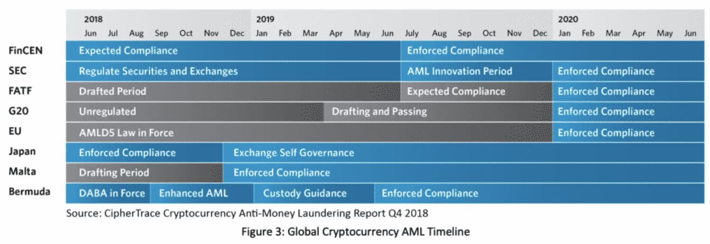
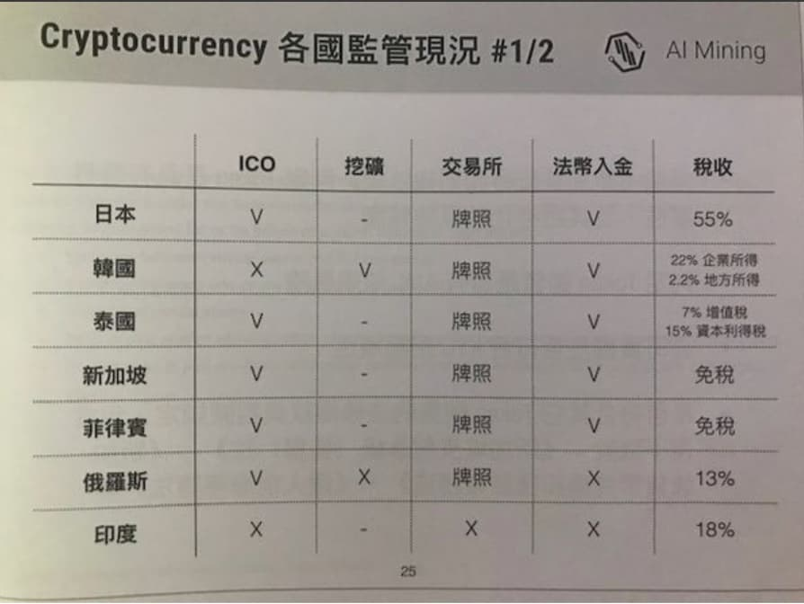

## Jollen: 證劵型通證和erc1400及合規探討 (Crypto Night 小聚 #8)
### 黃增勳 2019 Apr 25
#### https://medium.com/@tshuang0611/%E5%8D%80%E5%A1%8A%E9%8F%88-%E8%AD%89%E5%8A%B5%E5%9E%8B%E9%80%9A%E8%AD%89%E5%92%8Cerc1400%E5%8F%8A%E5%90%88%E8%A6%8F%E6%8E%A2%E8%A8%8E-crypto-night-%E5%B0%8F%E8%81%9A-8-5de71cf78b84

小聚Jollen花了不少時間說明了
1. 效用型通證(Utility Token)和證劵型通證(Secruity Token)的差異
2. 目前各國對於Token的法規監管態度和相關判例
3. 何謂erc1400智能合約
4. STO面臨的挑戰

### 數位資產(Digitals Assets)
在了解「效用型」和「證劵型通證」前先要了解甚麼是「數位資產(Digitals Assets)」  
舉例來說
- 你有一張數位相片，透過區塊鏈(密瑪學)加密變成一串數字字串
- 而這串數字字串就是「加密後的相片」這就是Token(通證)
  - 同時也代表了一個數字資產
- 假設有人出了100元買了這組數字字串後回家解密後就可以讀取
  - 他就取得了access rights的存取權限

### 加密貨幣Cryptocurrency
說明完數字資產後，解下來說明，何謂加密貨幣Cryptocurrency  
Cryptocurrency 分為 
- Coin (貨幣)
- 和通證

基本上
- 比特幣
- 比特現金

現在是被世界認可為貨幣的
- 可以用來刷機票
- 信用卡支付和繳稅(在美國)

目前有
- ETH
- 以太經典
- 瑞波等六種及各國的法幣(如:美金，台幣)

是被認可用來買STO的，但其他非Coin的就只能稱為 Token 了  
(Token 代表的就是一種數位資產，虛擬資產或虛擬產品)  

### 通證 Token
通證Token又分為兩種
- Utility(效用型以下簡稱UT)
- Secruity(證劵型以下簡稱ST)

UT和ST的差異吧  
我把Jollen的簡報資料整理成一個表，來判斷證劵型和非證劵型的通證條件  
  

#### Non-secruity Blockchain token(Utility)
- Rights to develop or create features for the system
- Rights to access the system
- Rights to contribute to the system
- Rights to use the system
- Rights to sell the products of the system
- Rights to vote on additional features of the system

#### Secruity Blockchain token
- Ownership interest in a legal entity
- Equity interest
- Share of Profits
- Status as a creditor 
- Claim in bankruptcy as equity interest holder
- Legal entity issure 
- Option to purchase more investment interests

目前的
- 交易所都是屬於商品(數位資產)交易所
- 如果要交易 Secruity 的數字資產就要受到各國證劵單位的監管
- 美國要合規營運 STO 的交易所至少要拿到3張牌照，其中一張是美國的MSB執照(金融服務商)

### 接下來由開發過程來分辨何謂UT和ST

由宏觀角度來看 Token 通證 分為
- ICO 時是 Utility token
- 但如果發行條件不足就會變成STO secruity token

### 下列過程條件充足下是屬於 UT

正向流程「先開發後上市」  
因此白皮書是  
- 成果報告/事實 — — — -> Howey Test

1. 公鏈技術研究與開發
2. 開放源碼計畫
3. 實際產品與服務
4. 通證化服務 
5. 上市交流與流通

- Utility token 是使用後才上交易所 Production Launch
- ICO(首次代幣公開發行)或 STO屬於募資行為受各國證劵單位監管 (反向流程先募資) 
- 提出的白皮書比較像 Operations 營運計劃書或Plan
  - (預計要做的事，還沒做到，可能是真的，也可能做不到)

所以是「先募資再實現」  
1. 上市交流與流通
2. 通證化服務
3. 實際產品與服務
4. 開放源碼計畫
5. 公鏈技術研究與開發

#### Howey Test
是美國聯邦最高法院於1946年在SEC v. W. J. Howey Co.案中用來確定爭端交易是否符合「投資契約」是否應該納入相關法規管制所進行的測試  
如果該交易被認定為是投資契約，則依據
- 1933年的證券法(Securities Act)
- 以及1934年的證券交易法(Securities Exchange Act)

這些交易被視為證券，而需要遵守資訊公開與登記要件  
其中判斷的標準簡要分為四個要件：
- 投資是以金錢(money)為標的
- 是針對共同事業的金錢投資
- 對於該投資具有獲利的期望
- 任何的獲利來源為投資發起人或第三方。

台灣的金管會的草案文件指出，也是採用Howey test的四要件
- 只要符合其中的要點將納入證券規範中
  - 簡單的說就是一方出資於一定的事業
  - 而由他方負責經營
  - 同時出資人的權益在相當程度下，取決於經營者的努力

因此如果Token具有上述特點，就屬於證劵性質的代幣(ST)

### 所以可以說ST和UT的差異判斷是
- 是否能通過 Howey Test？
- 是否有投資契約？
- 是否有期望獲利？

#### Howey Test
研討會Jollen的簡報也提出他們整理的數位資產的 Howey Test 的要點如下:  
- Principle1: Publish a detailed white paper
- Principle2: For a pre-sale, commit to a development roadmap
- Principle3: Use an open,public blockchain and publich all code
- Principle4: Use clear,logical and fair pricing in the token sale
- Principle5: Determine the percentage of tokens set aside for the development team
- Principle6: Avoid marketing the token as an investment

Howey Test 投資案是否通過測試，決定是否是證劵型通證
- 是的話就不可以上一般交易所，因為是證劵股票
- 但交易所正確來說是屬於數字資產交易所 digital assets 商品交易
  - 只能是 Utility 通證交易，因此ST在現行的交易所就不合規了

### 美國的SEC判決案例
美國的證劵交易委員會(US SEC.gov)有幾個著名的判例:

1. DAO 去中心化自治組織 (Decentralized Autonomous Organization， DAO)，所發行的Coin被認定為是證劵
- 詳細的案例連結: 美國法下ICO數位代幣可能受聯邦證券法規監管之情形 — DAO 案例 (上）
- 美國法下ICO數位代幣可能受聯邦證券法規監管之情形 — DAO 案例 (下）

2. EtherDelta的創辦人被SEC起訴罰款的案例
- EtherDelta是一個去中化交易所，被控違法提供erc20和證劵型的token交易
- 即使這位創辦人把公司賣給別人，一樣被追朔起訴和被追捕，最後認罪協商繳了罰金…..
- 判例新聞連結: EtherDelta 創辦人遭美國 SEC 起訴 去中心化非未註冊證券避風港

SEC在2016年開始監管，直到2017 因詐騙案太多，所以ICO被認為大部分都是募資的行為(割韭菜)，因此SEC才開始嚴格管理，詳細界定現行美國的交易所都是數字資產不行買賣ST，同時對於UT和ST的分辨條件做出了解釋，因此才有STO的出現，開始對ST做監管

上述是由法律觀點來分辨何謂UT和ST，但還有一個美國的法院的判例也有引用的是TCF(Token Classify Framework)的標準

### TCF(Token Classify Framework)的標準
TCF1.0是用工程師角度教你檢測分辨是否是ST  

其實圖片是看不懂的，都是專業名詞。要弄懂看只能去網站好好看解釋
- http://www.untitled-inc.com/the-token-classification-framework-a-multi-dimensional-tool-for-understanding-and-classifying-crypto-tokens/  

判例: 
- 美國 2019/1 KIN Token Sale 時用了很多 投資investment 的字眼
- 而被法院引用 TCF+Howey test 判定是證劵，下架罰錢
- Kin 的辯護律師則解釋
  - 宣稱 Kin 採用的是 erc2 0標準用在自己的 app 所以是 utility token
  - 但這剛好一槍斃命，因為法官認為既用 erc20 為何不用以太幣而是發行自己的 token
  - 因此目的就是募資行為

US SEC認定
- 只有用自己的公鏈才有發幣的必要!!
- 否則就用別人發的幣，因此就算是用Utility專用的erc20智能合約標準
- 如果發自己的Token來募資都屬於Secruity Token

### 智能合約的標準
- 通常 Utility token => 使用erc20的智能合約標準
- Secruity token => 使用erc1400的智能合約標準

因此想要開發ST就需要了解erc1400  
接下來 erc 1400 還要符合
- 美國SEC審核的規章條件 Regulation A+
- 和 Regulation D(A，B，C)

​
File coin
- 是一個合規的ICO
- 收200 M USD
- 採用的是 Regulation D(C)有條件豁免的通證法規

比較、特徵與未來
- 目前這些特例以後會逐漸由 Reg D506(C) 轉換到 Reg A+
- D 和 A+ 的主要差異在投資額的限制
- Reg A/B 就是證劵
- 而 Reg D 506(C) 則是有條件豁免，以後會消失
- 初期是 ST 但後來轉 UT
- 可是日後的通證發行一開始就要宣告是ST或UT，ST就是ST，UT就是UT，基本上不可以轉換

還有對於 erc1400 的探討
- 需要有很專業的律師和會計師
- 因為須了解全球監管體系
- 還有對公司的營運方向的思考，最後才是考慮到Token的Sales

### 發STO必須先考量下列三點
因此如果你要發STO必須先考量下列三點:

#### 1.Regulatory Framework (選擇框架)
- Reg D 和 Reg A+ 的差別在投資額度的限制
- D
  - 有投資人限制
  - 和鎖倉條件 (3個月/半年/1年)
  - 但投資沒有額度限制
- A+
  - 投資人沒有限制
  - 不能鎖倉，拿到即可交易
  - 有投資金額限制T1 20M USD，T2 50M USD
  - 需提兩年財報交代資金運用狀況
- 506(C)
  - 則是有條件豁免，難度很高，需要有合理的法律解釋

#### 2.Issuing Security (證劵，股票的發行問題)
- 需考慮是否發行?
- 記名/或不記名，強制轉換，股東經營投票機制，股票分割，配股，KYC(Know your customer)等問題
- 如何落實開發這些智能合約是重大的考量

#### 3.Capital Raising (最後要考量的才會是募資)
在美國經營STO交易所需要拿三張執照

### 結論
- Reg D不會變成主流
- Reg A+會變成主流
  - (因為目前有6個Coin 比特，比特現金，以太，以太經典，Ripple，?)+各國法幣可以購買ST

且
1. 不限投資人
2. 額度雖有限制但足夠了
  - T1等級 2000萬美金
  - T2等級 5000萬美金 這對於新創企業來說足夠了
3. 需要提財報，可監管

### 各國目前監管的情況
美國SEC現階段的監管的態度：  
SEC Phase1：
 1. SAFT aggrement(Simple aggrement for future token) (對未來通證的簡單協議)
 2. Compliance with SEC Reg D 506(C) (有條件豁免的案例)

另外美國 SEC 
- 是用動機論來判斷是否是證劵通證(Howey test) 

#### 如果違規的話

- 第一個倒楣的是交易所
  - 2018/10 判例 etherdelta 被判有罪
  - 即使是一個去中化交易所，且創辦人已經賣給了其他投資人，一樣判有罪
- 最後認罪協商罰了50萬美金
  - 因此現在一堆交易所流行搬到馬爾他(最開放)去開international交易所
  - 同時也在美國(最嚴謹)申請合規的交易所
- 第二倒楣的，買幣的人，前幾天有一個判例，就是買幣也違反民法(反洗錢，後面會提到)
  - 因此現在在美國的交易所對於「區塊鏈token項目方」是否合規都會審查的很嚴格
  - 因此目前不合規的通證項目就只上二三線的交易所，因為只要繳錢就可以上，但日後問題不少

### 除了Howey Test，動機還包含「心理覺得賺錢分潤就是屬於ST」
ST也要考量投資限制的問題
 1. 包括要備齊法律文件
 2. 考量erc 1400智能合約 + Token Sale合約 + Vesting 鎖倉合約
 3. 不能線下(場外)交易(因為牽涉到反洗錢)，所以這是為何一般人場外買幣也違法的原因

但也不是所有的ST都要考慮鎖倉條件，主要是依據Reg A或D來判斷

美國SEC的網站教你
- 辨別通證項目是否為詐騙(網址連結: https://sec.gov/ico)
  - 其中有一條判斷就是有否開放源碼，但是菜籃族傻傻分不清，有人告訴說這是未來的比特幣會上2萬就買了

#### 但其實SEC並不是最高的監管單位
排名第一的是 FinCEN ( Financial Crimes Enforcement Network )金融犯罪執法局  
是美國財政部底下專門處理洗錢/金融犯罪/恐怖主義融資等案件的單位  

1. FinCEN
2. SEC
3. FATF(Financial Action Task Force防制洗錢金融行動工作組織)
4. G20
5. EU
6. Japan
7. Malta(馬爾他)
8. Bermuda(百慕達)

話語權排名前三的都是美國的單位
- 因為它們走在最前面法規和案例也相對完整
- 第四才是世界的G20大國聯盟
- 第五是歐盟
- 第六是日本(因為日本對數字資產持開放態度，加上2017年其金融局有發表政策框架)
- 第七是馬爾他
  - (區塊鏈之島，為了逃避美國經濟制裁，所以轉型，引來很多區塊鏈早期投資者大戶支持)

G20
- 將於 2019/7/1 會開會討論 Virtual Assests (虛擬資產的問題)
- 其中會討論到「數位資產交易」所是否可以「兌換法定貨幣」？
- 還有 7/1 之後「幣幣交換」可能會違法(交易所是數字資產不可炒作)
  - 7/1之後P2P交易可能會違法(牽涉洗錢)

美國 FinCEN 給G20一個 timeline，顯示7/1之後要開始處理合規問題了  

新加坡
- 因應反洗錢，律師事務所都很忙
- 因為交易所都要避免進入黑名單

G20及全球監管單位
- 最晚於 2020/1/1 起實施合規
- 而且可能採用「日本 2017 金融局的版本」＋「SEC的經驗的綜合版本」

因為 G20 虛擬資產 7/1大限
- 以後比特幣購買 token 或用法幣(台幣，美金)去買token將構成投資行為
- 因為目前各國法規不足，所以2019 7/1 是大限
  - 目前許多有風險的通證項目都趕最後一波割韭菜機會(到2019 6月底)，接下來就要合規了

#### 場外買幣有罪
美國已經判場外買幣有罪(因為洗錢問題)其眾多判例就是一個很好的 Demo Site

### Jollen整理各國的監管制表

​

總之
- 只要有提到投資 Invest 的字眼就是屬於**募資行為**和**證劵型通證**

### 台灣的狀況
1. 因為台灣的法規不完善
  - 目前的法律漏洞之一是偷比特幣不知要用何法條處理?
  - 民法規定，財產的定義是能否繼承？有沒有實體損失？
    - 這規則來看的話，比特幣、token 都不算啊
  - 因此美國瑞士已經在制定相關民法的法條修訂

2. 台灣金管會 2019/4/12的會議(金管會的STO公聽會連結)
  - 投資人的限制
    - 自然人條件
      - 要是專業投資人
      - 擁有3000萬的資產身家
      - 最高只能投資10萬元
    - 但機構不限額度
      - 可是最高額度限制也只有3000萬
      - 且豁免集資的問題(可能變成合法的集資管道)這就有投資上的風險
      - 因為 STO 是屬於股權投資不是公司債
        - 無法確保債權和投資人的保障

3. 
 - 項目方不需要提交財報
 - 且金管會應該是只有參考到Reg D
 - 而沒有參考到Reg A+
 - 且沒有閉鎖型公司(自己投錢也是老闆)
 - 數字資產也不用申報
 - 公司法不完善
 - 還有台灣會計師和律師對於數字資產的專業能力能否有能力也是個考量

4. 目前在台灣合法的部分，就是在新加坡開立境外公司，然後在台灣繳5%的貨物增值稅(營業稅)，境外發幣，這樣營業所得可以不用繳稅

5. 
  - 如果要在台灣註冊落地公司，資金就比較難出去
  - 因為區塊鏈項目大都是 global 營運，所以境外公司是較佳選擇

6. 在台灣開交易所的條件
  - 資本額註冊需一億，保證金1000萬，難度不高

7. 
- 金管會不管項目方公司錢怎麼用
- 且不用提財報
  - 但投資人有設限
- 與美國的比較，則是要符合SEC Reg A+條件
  - 但投資人不設限，可是要交財報管錢的流向

### 建議與結論:
#### 項目方首先思考兩個方向
1. 需不需要發STO
2. 如果要發STO就必須研究 erc1400 智能合約標準

### 有集資行為就要受相關法律管轄
避免形成非法集資，因此
- 要合規就必須要有很強的法律意見書來說明
- 為何 ICO 大多用 ETH，是因為 ETH不 是Money
  - 就走Reg D(c)有條件豁免
  - 先走ST再轉UT
  - 因為 SEC 沒有判例所以就合規

Flowchain 就是由 ST 轉 UT ，有條件的豁免  
但還要考量到
- 智能合約因此就必須寫 erc20 + erc1400 相容
- 及考量何時轉換智能合約的規章

### 了解erc標準演進方向(要撰寫相關的智能合約)

做 Utility 就是
- erc 20
  - -> erc721(不可移轉)
  - -> erc1400(是否可替代/是否可投票Fungible/Transferable)
  - -> erc777(取代)erc20

目前
- erc 1400 — Reg A+ /Reg D 的智能合約可以滿足 80%~90% 的需求
  - KYC，金額，限制股票
- 另外要了解 erc1400 不能單獨存在
  - 要不要 KYC 還要搭配 erc1643 Sender/Receiver 反洗錢
  - 同時還要考量到股票(證劵)智能合約的 分割/投票/增資
等行為的開發

### 思考清楚是要用「STO募資」還是找「天使投資人 VC募資」
因為天使投資人審核條件是
1. 技術&Fund背景佔 70%
2. BP(Business Plan)佔 20%~30%

找天使投資人的好處:
1. VC投資的金額很多都超過3000萬，項目好的上億都有
2. 投資人有Resource，人脈介紹，各領域可以分工合作，共同把事業做大

### STO就是在區塊鏈上發股票
- 需要考慮閉鎖型還是股份有限公司的問題
- 有相關的利潤分配和權利義務的問題

### 考量記名問題
- 目前erc1400是要記名的且不可移轉(杜絕炒幣)
- 因此也無法上證劵交易所
- 美國證劵型的通證銷售管道不是交易所，而是專業投資機構

如JP Morgan (Broker-Dealer)
- 主要的就是KYC(身家背景)
- 反洗錢

台灣日後可能也會朝此方向  

因此就
- 創業籌資管道
  - 1.天使
  - 2.私募
  - 3.借錢
  - 4.自掏腰包
  
而言，把
- 「證劵上鏈遇」到的困難比「現行的股票」和「VC募款」要來的複雜和困難多
- 且台灣額度的限制和投資人的限制不少

因此要不要走STO必須考慮清楚  

#### 但往好的地方想
現在 bitcoin 會大漲是
- 因為 VC 都在買幣 Bitcoin 投資新創的 crypto fund 
- 這代表合規和監管都上軌道之後，區塊鏈的發展有機會步入正軌

### STO不只是單純發Token而已，而是要修整堂EMBA企業經營的課程
最後要投入區塊鏈的同業們
- 目前各國的監管和相關的法條逐漸完備
- Utility Token 和 Secruity Token (其實就是鏈上證劵)定義越來越清楚
- 且日後交易所如果不想被證管會監管，就得下架Secruity Token
- 但要開發一個合規的 Secruity Token的 條件和挑戰本文已經有初步的研討到了

但走效用型的通證的路目前也越來越困難
- 因為要開發出自己的公鏈
- 否則用人家的鏈就只能用人家的幣
- 自己發行的Token會比較像點數積分

無論哪一條路都還是要一步一步的腳踏實地的經營下去
- 可以預期的日後一線的世界級交易所審核項目會越來越嚴格
- 且二三線的交易所有可會踩到地雷或面臨各國監管

會有更多的挑戰，但也會讓生態圈更健康

