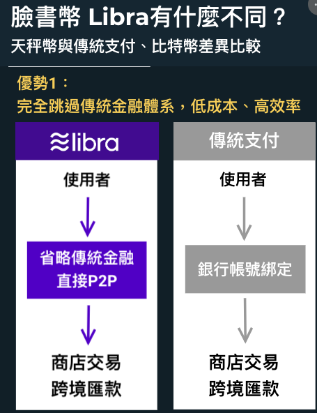
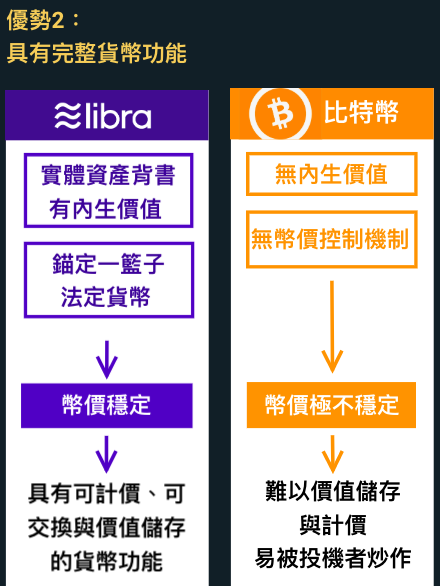
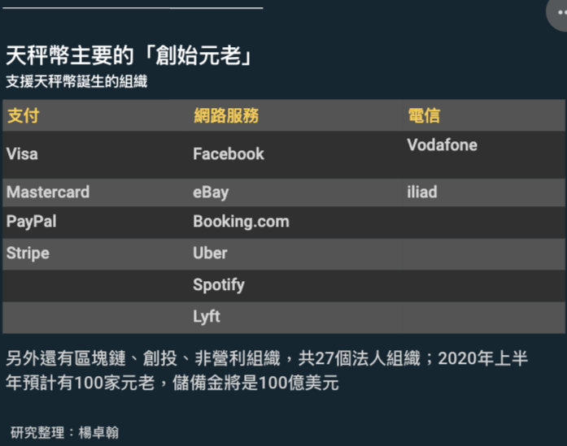

## 全球央行紅色警戒，臉書幣Libra為何可能超越比特幣？
### 楊卓翰  2019-06-25
#### https://www.cw.com.tw/article/article.action?id=5095751

全球最大資訊平台的臉書上發幣
- 就像是全球網路的中央銀行！

這個全球網路的中央銀行，果然一出現就
- 成為各國政府的恐懼。因為從未有像臉書這麼有影響力的機構發行虛擬貨幣

未來負責管理天秤幣的，是
- 總部設在瑞士的非營利性組織「Libra Association（天秤幣協會）」
- 由會員出資儲備金，並共同經營區塊鏈節點

**中央銀行副總裁陳南光以經濟學家**，向《天下》記者解釋
- Libra屬私人貨幣（private money）的一種
 - 就是要挑戰主權貨幣（美元、歐元、新台幣等）
- 提供民眾另一種選擇

如果
- 一種新興的貨幣有潛力與主權貨幣競爭，當然非央行所樂見
- 尤其是具跨境支付功能。因此引來**各國政府與金融監理機構的圍剿**

央行總裁楊金龍雖然看法較保守
- 認為天秤幣仍是「代幣」
- 它會對全球支付產生影響，牽涉到**匯兌議題**
- 如果成功，Libra會比比特幣更有影響力。

在對虛擬貨幣態度開放的英國，央行總裁卡尼（Mark Carney）表示
- 考慮將天秤幣納入銀行間的「隔夜銀行拆款」系統
- 如果成真，天秤幣將成為被傳統金融體系認可的「貨幣」。

天秤幣有機會超越比特幣，因為比特幣無法滿足的「貨幣三要素」：
- 被當成交易媒介
- 成為計價單位
- 可以儲存價值

天秤幣都有潛力滿足

### 研究整理：楊卓翰

  

### 天秤幣「白皮書」
- Libra預計2020年上半年上線
- 用戶只要在手機安裝錢包app「Calibra」，就可以使用天秤幣的兩大功能。

#### 第一個功能
就像湯姆熊遊樂場的代幣：要玩遊樂設施，就要先換天秤幣

換到天秤幣後，就可以在參與天秤幣聯盟的單位上使用
- 包括臉書、Whatsapp、Uber、Spotify、eBay、Booking.com、英國電信商Vodafone等與生活息息相關
- 隨著更多商家加入，支付的範圍也會更大
  - 預計在2020年上半年發行時，會有100個會員商家及機構。

  

 
換言之，以後坐計程車、買音樂串流服務、訂旅館都可以用Libra付。隨著Libra使用場景變多，大家就有以Libra做交易媒介的意願。（延伸閱讀：搭上行動支付潮　台灣大車隊如何跑出營運新模式？）

#### 第二個功能 跨越國境匯款及轉帳

使用者之間可以透過臉書的通訊軟體——Messenger與Whatsapp
- 用極低的手續費跨越國境匯款及轉帳。

雖然中國的支付寶及微信支付、台灣的Line Pay及街口也能做到用戶間匯款
- 這些「傳統」行動支付仍要求綁定銀行帳戶，而計價單位也是該國法定貨幣

更大問題是，現在的
- 國際匯款仍需要透過SWIFT（環球銀行金融電信協會結算系統）機制
  - 手續費與時間成本極高
  
但天秤幣完全獨立於傳統金融體系
- 跳過銀行及SWIFT匯款
- 比目前的行動支付成本更低
- 便利性更高
- 它不使用任何一國的法定貨幣，自成記帳單位，發展性更強。

透過這個特性，臉書舉起普惠金融（Financial Inclusion）道德大旗
- 宣稱要讓全球17億沒有銀行帳戶的人也能使用金融服務

天秤幣夠穩定，從支付貨幣變成計價貨幣  
花旗銀行業研究主管高思（Ronit Ghose）認為
- 天秤幣的初始業務「支付」僅佔全球銀行獲利的**7%**
- 一旦天秤幣變得普及，臉書將會變成金融服務平台。

從區塊鏈技術端，沛理科技創辦人陳品解釋
- MOVE補足了以太坊容易出現漏洞的缺陷
- 它將使用先定義好的『模組』，其餘金融服務的開發者只能像積木組合
- 雖然較不自由，但理論上也較穩定，適合不能出錯的金流系統

天秤幣的共識機制不像比特幣
- 不用挖礦，因此不需要大量礦機浪費能源
- 同時，「比特幣裡所有的參與者平起平坐，但天秤幣的決策機制像董事會，需要原始會員投票。雖然比較集中化，但也比較有效率。」

### 儲備金
- 每一枚天秤幣，都有儲備金（Libra Reserve）做資產背書
- 每生產一枚，就要投入等值的儲備金
- 天秤幣也不像比特幣由市場買賣定價
  - 是一種錨定法定貨幣價格的穩定幣（Stable Coin）
  - 它會與美元、日圓、歐元等一籃子法幣幣值掛鉤，作為匯率標準

天秤幣有準備金，不會像比特幣暴起暴落
- 這解決了比特幣的致命缺陷。高思指出
- 比特幣之所以難作為貨幣成為交易的媒介，是因為它沒有內生價值（Intrinsic Value）
- 因此價格波動大

高思在研究報告中指出
- 天秤幣以低風險的資產（包括銀行存款及短期政府債劵）作為儲備金
- 其幣值與法定貨幣掛鉤，能穩定價格，而且能夠作為價值儲存

陳南光
- Libra若能被廣泛接受作為交易媒介，當然就是經濟學上所理解的貨幣（或通貨）
- 天秤幣當然**不可能沒有違約風險**
  - 但「若能被廣泛接受，將是一大突破，因為目前既存的虛擬通貨絕少被接受作為交易媒介，而是被視為代幣、資產或證劵。」

源鉑資本創辦人暨執行長胡一天
- 它如果成為了一個清算平台，就會和美元、歐元為主的清算體系競爭
- 非常神似國際貨幣基金（IMF）設計中的SDR特別提款權（Special Drawing Rights）
- SDR不是貨幣，卻是一種貨幣的請求權，類似穩定幣

資誠聯合會計師事務所金融產業服務副營運長郭柏如
- Libra體系要成真，還是得看各國金融監理機構的臉色
- 天秤幣若要在台灣營運，要先遵守通過電子支付法規
  - 「匯兌業務限制更嚴格，在台灣是「銀行法」下的特許行業。未來能否開放科技業，都需要更多討論。」
