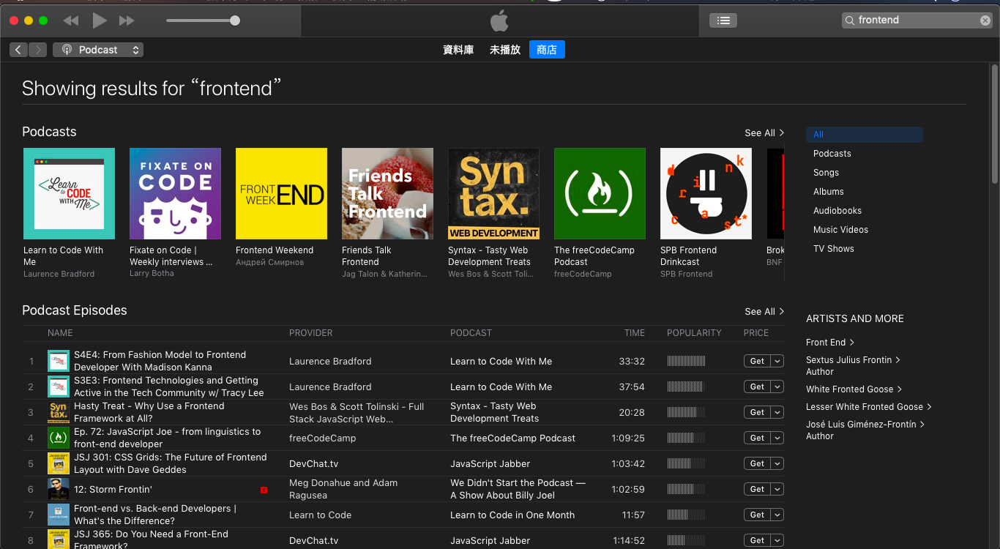
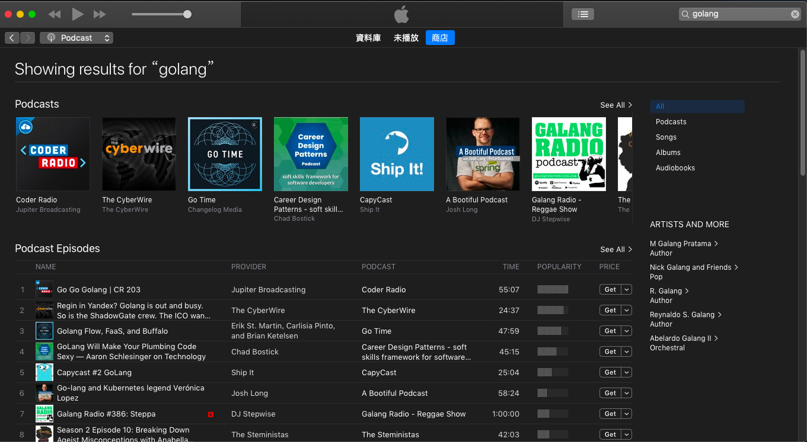

# Ｑ：請問你是怎麼學習的？有什麼 mindset 嗎？

一位新同仁（非新鮮人），進辦公室約 2 個禮拜左右而已。突然來到旁邊問了這幾句話：
- Jacky，請問你是怎麼學習的？有什麼 mindset 嗎？

當下被這樣問，還真不知道能怎麼好好回答，所以當時也只是隨口回答、聊幾句。

但後續幾天的交流下，我很清楚的感受到他有著**學習的渴望與焦慮的情緒**  
- 渴望把技術學好
- 焦慮著自身的能力與不足

我能感受到這種情緒！因為，**我也一樣，一直有著相同的情緒**。

雖然不一定有資格來聊這些，但覺得，有人有著這些情緒去請教別人，試著向對方學習  
那我還是想多多分享給對方  

過去幾個禮拜，我都有跟他討論與分享看法  
但有時候，用文字寫下來，還是能呈現不同的內容與格式  
故這邊做整理  

## 下面分享的是「好的」學習方法嗎？ -＞ 不是

我想關於「學習」，從大方向來說
- 沒有「**學習方法好不好**」的區別  

只有
- 「學習方式，對**你**個人，**有沒有效，有沒有幫助？**」

所以下面的內容，就只是
- 我個人，這段時間工作時間之外幾種的學習方式、方向
- 是個事後的歸納。

## 1. 多參加活動
多多參加技術、業界的活動  
- 聽別人的架構
- 聽別人選用的技術
- 聽別人的踩坑經歷

參與活動聽這些東西時，我聽到的有
- 情境（大家是面對什麼問題、什麼需求、什麼目標）
- 採用的技術、架構、管理方法來達到目標
  - 各種考量的因素與面向
  - 新的工具、技術
  - 靠這樣的架構面對問題

這些根本就是**一場場的 case study**  
以下是我經常的**活動資訊來源**  

facebook
- [Gopher Taipei](https://www.facebook.com/Gopher-Taipei-710350419319353/?eid=ARAlkb4YTpqdvN9h1QZsLQSkAkAleC0KHE2suEHHuFFsEtfTvuUEnyPZ42O_7O6dH0zWyR3aDw1MBqZG)
- [Microsoft Taiwan](https://www.facebook.com/MicrosoftTaiwan/?__tn__=%2Cd-k-R&eid=ARC1eUmTCqYBZ4mInJWTONd7QAm13gtmh5TkNjQobtn-wPFrjEdxSafpqW-yx6DfrsFK7mv8qaMlN_Kv)
- [AWS User Group 台北小小聚](https://www.facebook.com/awsugtw.tpe/?__tn__=%2Cd-k-R&eid=ARBDlTlrgiJd-J3HyoZVTBgIsVROe9igc0Wktqi-86oTlI7rTToBX96SVnuVrzaSw-RVLBPUlxFal2hR)  
- [Taiwan Java User Group](https://www.facebook.com/groups/twjug/)
- [iOS ＠ Taipei](https://www.facebook.com/groups/ios.taipei/)
- [Domain Driven Design(DDD Taiwan)](https://www.facebook.com/groups/dddtaiwan/)
- [LINE Developers Group Taiwan](https://www.facebook.com/groups/linebot/)
- [Scrum Community in Taiwan](https://www.facebook.com/groups/179345672472/)
- [Agile community in 內湖](https://www.facebook.com/groups/AgileNeihu/)
- [Cloud Native Taiwan User Group](https://www.facebook.com/groups/cloudnative.tw/)
- [Kubernetes Taiwan User Group](https://www.facebook.com/groups/k8s.tw/)
- [Azure Taiwan User Group](https://www.facebook.com/groups/AzureTWUG/)
- [GCPUG.TW(Google Cloud Platform User Group Taiwan)](https://www.facebook.com/groups/GCPUG.TW/)
- [UI/UX Taiwan](https://www.facebook.com/groups/iOSUIUX/)
- [AWS User Group Taiwan](https://www.facebook.com/groups/awsugtw/)
- [Go程式語言 (Golang Taiwan, Gopher Taipei)](https://www.facebook.com/groups/269001993248363/)
- [台北前端社群](https://www.facebook.com/groups/f2e.taipei/)
- [Facebook Developer Circle: Taipei](https://www.facebook.com/groups/DevCTaipei/)
- [Backend 台灣 (Backend Tw)](https://www.facebook.com/groups/616369245163622/)
- [Front-End Developers Taiwan](https://www.facebook.com/groups/f2e.tw/)
- [node.js台灣](https://www.facebook.com/groups/node.js.tw/)

meetup
 - [Google Developer Group Taipei](https://www.meetup.com/GDGTaipei/)
 - [GDG Cloud Taipei](https://www.meetup.com/GDGCloud-Taipei/)
 - [Azure Taiwan](https://www.meetup.com/Azure-Taiwan/)
 - [Golang Taipei](https://www.meetup.com/golang-taipei-meetup/)
 - [Cloud Native Taiwan User Group](https://www.meetup.com/Cloud-Native-User-Group-Taiwan/)
 - [Women Who Code Taipei](https://www.meetup.com/Women-Who-Code-Taipei/)
 - [Taipei Blockchain Meetup](https://www.meetup.com/Taipei-Blockchain/)

這些只算是舉例，**快去找看看跟你相關的 group 吧**
- 去 fb, meetup 搜尋你有興趣的、相關的 keyword 吧！
  - 很多活動都是 **free or 100 ~ 300$** 而已
- 去聽聽，總是能學到點觀點、知識、keyword
  - 後續更會引發我思考，我就會拿聽到的東西去 google 相關東西，又多看點東西
- 去聽活動是很輕鬆的，因為只需坐在那邊
  - 倒是交通有時是比較麻煩的，晚了回家也晚

另外，我也不是這麼有毅力、這麼投入學習的人，但我會想  
- 如果我沒去，那天晚上回到住處，我會？不外乎是上網、聽音樂、聊天、放空、發呆
- 如果我去了，多多少少能聽點東西

去，總有一些收穫，不去，就... （有點博弈論的感覺）
- 這單純的 trade off 常能說服我多去幾場活動

可惜！這些活動很吃地點、時間  
- 台灣就集中在台北
- 平日大多都集中在晚上

這也沒辦法，實體活動就是有這樣的限制  
如果你不方便，那可以朝影片方面多多投入  

## 2.影片、直撥
（只是供參考）我訂閱的 youtube  
- [Firebase](https://www.youtube.com/channel/UCP4bf6IHJJQehibu6ai__cg)
- [ReactNext](https://www.youtube.com/channel/UC3BT8hh3yTTYxbLQy_wbk2w)
- [The Futur](https://www.youtube.com/channel/UC-b3c7kxa5vU-bnmaROgvog) (設計相關)
- [Fun Fun Function](https://www.youtube.com/channel/UCO1cgjhGzsSYb1rsB4bFe4Q)
- [Hacker Noon](https://www.youtube.com/channel/UChu5YILgrOYOfkfRlTB-D-g)
- [Talks at Google](https://www.youtube.com/channel/UCbmNph6atAoGfqLoCL_duAg)
- [InfoQ](https://www.youtube.com/channel/UCkQX1tChV7Z7l1LFF4L9j_g)
- [React Conf](https://www.youtube.com/channel/UCz5vTaEhvh7dOHEyd1efcaQ)
- [Microsoft Taiwan Tech Hub](https://www.youtube.com/channel/UCY9EGjxz7pw-g4IPaJLnjug)
- [Microsoft Azure](https://www.youtube.com/channel/UC0m-80FnNY2Qb7obvTL_2fA)
- [Google Cloud Platform](https://www.youtube.com/channel/UCJS9pqu9BzkAMNTmzNMNhvg)
- [Amazon Web Services](https://www.youtube.com/channel/UCd6MoB9NC6uYN2grvUNT-Zg)
- [freeCodeCamp.org](https://www.youtube.com/channel/UC8butISFwT-Wl7EV0hUK0BQ)
- [Coding Tech](https://www.youtube.com/channel/UCtxCXg-UvSnTKPOzLH4wJaQ)
- [Netflix UI Engineering](https://www.youtube.com/channel/UCGGRRqAjPm6sL3-WGBDnKJA)
- [Facebook Developers](https://www.youtube.com/channel/UCP_lo1MFyx5IXDeD9s_6nUw)
- [JSConf](https://www.youtube.com/channel/UCzoVCacndDCfGDf41P-z0iA)
- [hsiang an chi](https://www.youtube.com/channel/UCWyojczht33LY1TQbw2k4Sg) (**線上讀書會**，由 [技安](https://www.facebook.com/polo13999?fref=gs&__tn__=%2CdlC-R-R&eid=ARAxHe4xjsT-Sx0JQy1AyIO4cGACmrgmXjAgBd_W8u1rzmU2OD0EsgWci8t3HFuj8cT6j0ZlYbVYDkNR&hc_ref=ARS1ByZavbR9wYJqAZLTgb2vOJBS0OiIWHb0Bb5Bsu-Eg-GWxmUiQhbtMRDYvP8LA-s&dti=906048196159262&hc_location=group_dialog) 大熱血組織的。邀請各方高手上來針對某一主題講解、教學。**中文**)
- [Google Chrome Developers](https://www.youtube.com/channel/UCnUYZLuoy1rq1aVMwx4aTzw)

但是，你大概會覺得 -> **靠，這麼多是要給鬼看膩！？**  

當然沒辦法全部去看，所以我列出幾個建議的方向

### 有興趣的影片
硬看不懂的影片，真的很難看下去。所以自己還是要找感興趣東西  
這邊提的興趣，當然不像是 `吃美食`、`聽演唱會` 之類  
比較偏向是
- `golang` 真的有這麼好？好像待遇很好啊。
- 一直聽到人家說啥 `k8s`、`kubernetes` 的，好像很威啊？
- 到處都有聊到 `docker`、`container`，是不是要學一下？
- `CI/CD`、`devOps` 什麼啊？不懂不能寫 code 膩？

對於一些陌生的主題，有時候網路上的文章都很發散。  
直接去看官網的 document，也沒有很好切入（那個... k8s...）  
所以這時候去看一些關於快速介紹的影片，其實蠻好有基本方向的
- 去上面的 channel 的影片 list，**隨意瀏覽標題，挑個有興趣的看看**吧  
- 找找跟你相關、有興趣的 channel

### 特定主題的 channel
有一些 channel 專門是講解某一領域 or 某一語言的  
這類影片可能都會有固定幾位高手來講解  
你有興趣這類主題 and speaker 又合你胃口的話，是很好的資訊來源  
有的時候，我會直接去挖該 channel 的過去影片，把有興趣都拉出來看看  
但是！這類的 channel 其實不太好找  
通常是要泡在 youtube 一陣子 or 相關社群一陣子，才會有知道這類 channel 的存在  
因為已經認定這些 channel 是想學的、是有料的，所以這邊的影片的學習意願會蠻高的  

舉例
- [HTTP203](https://www.youtube.com/playlist?list=PLNYkxOF6rcIAKIQFsNbV0JDws_G_bnNo9) (frontend, js 相關)
- [Totally Tooling Tips with Addy Osmani & Matt Gaunt](https://www.youtube.com/playlist?list=PLNYkxOF6rcIB3ci6nwNyLYNU6RDOU3YyL) (偏向 frontend 開發相關)
- [Paul Lewis](https://www.youtube.com/channel/UCRDEsZDDhVhtHLi0L8-5fow) (JS)

### 關注開發者大會 or 大型 conferencer
例如**某些公司主導、語言、framework 的開發者大會**，這些都很有料！  
都會談要解決大公司、技術、產業大方向面臨的問題，跟解決方法  
都是在談**業界現在的痛點 or 突破方向**  

例如
- google I/O
  - https://www.youtube.com/user/GoogleDevelopers/playlists?view=50&sort=dd&shelf_id=81
- microsoft build 2019
  - https://www.youtube.com/results?search_query=microsoft+build+2019
- facebook f8 2019
  - https://www.youtube.com/results?search_query=facebook+f8+2019
- jsconf
  - https://www.youtube.com/results?search_query=jsconf

從中去找自己接觸的東西、有興趣的東西，常常能
- 了解問題
- 知道一些
  - best practice
  - solution
  - articture
  - 趨勢

去找找自己相關領域的大公司有沒有定期舉辦這些活動吧，有的話，應該 youtube 上都能找到

### 提高播放速度！
一定要調整播放速度！不然太浪費時間了，也**沒有這個集中力與耐心**  
一段影片，最核心的主軸可能只有 1 ~ 2 個，所以加快速度了解前因後過就夠了  
甚至很多地方，有個印象，跳過也ＯＫ  
想弄懂，但真的聽不懂的地方，再放緩速度、反覆聽幾次就好  

**播放速度真的太重要了**，之前 facebook F8 活動影片，沒上 youtube，我根本懶得點下去


## 3.去看些深入的技術文章
時常讀一些深入的討論，讓自己有辦法深入技術問題  
當我想更深入某些主題 or 議題 or 想要知道更好的做法時，有些關鍵字會是我 google 的方向
- 該技術 or library or 服務的官方文件
- `* best practice`
  - api best practice
  - restful best practice
  - golang best practice
  - nodejs best practice
  - docker best practice
- `* performance`
  - golang performance
  - javascript performance
  - reactjs performance
- `* optimism`
  - reactjs performance
- `* mistake`
  - kubernetes mistake
  - microservice mistake
- `* tips`
  - kubernetes tips

不光是文章，影片大多也可以用這些關鍵字  
太累不想看文字時，看影片也是好方法  

github 有些特定關鍵字，大家會整理很多有用的東西
- `awesome *`
  - 常見的是整理很多實用的 library
  - awesome-nodejs
  - awesome-go
  - https://github.com/sindresorhus/awesome
  - 就去 github 搜尋 [awesome](https://github.com/search?q=awesome) 看看有沒有勾起你興趣的東西吧
- `checklist *`
  - 通常是針對某一主題 or 方向的 checklist
  - Front-End-Checklist
  - API-Security-Checklist
  - https://github.com/huyingjie/Checklist-Checklist

github 也可以搜 [best practice](https://github.com/search?q=best+practice)，也有很多整理

case study 也是很好的資訊
- [infoq.cn](https://www.infoq.cn/)
- [infoq.com](https://www.infoq.com/)

偶而 infoq 看一些 case study 資訊，例如  
- 公司為了實現某些功能 or 支撐業務壓力，而採用什麼技術架構  
- 公司為了管理 or 支持業務成長，採取如何的管理模式

這類的資訊有時候是描述情境與問題  
這方面我還是比較常看中文的資訊，理解比較快速，沒負擔。  

去找看看各大公司的 tech blog  
- Netflix: https://medium.com/@NetflixTechBlog
- airbnb: https://medium.com/airbnb-engineering
- uber: https://eng.uber.com/
- fb: https://code.fb.com/

這邊的文章我看的頻率很低！因為
- 它們發佈的速度不快
- 通常非常硬...、主題跟自己有沒有相關、有沒有興趣也是相關

但，能花時間讀的話，一定能學點東西 or 觀念  
所以想到的時候，我還會逛逛  
做 AI 的人可能有些幫助，最近一年 AI 文感覺多很多  

## 4. 其他
這些來源是比較沒有具體特定主題性的 or 我目前沒有投入地方  
但也確確實實是好的資訊來源  

### twitter
很多高手都有玩 twitter，當看到某些 speaker or 好文時，可以去看看他有沒有 twitter
- 但就算 follow 這些人，偶而看到他們討論一些議題，但還是很隨機的
- 主題性也很不確定
- 所以能學到的東西，可能只是很特定特定主題的一個觀念之類的

但
- 他們經常會**推薦一些好的文章、talk**
- 更多時候他們會分享一些業界的事件 or 趨勢


### podcast、有聲書
我自己一直沒有深入這塊
- 英聽太弱
- 光用講的，我自己覺得很難去說出太多、聽懂這些技術議題
  - 所以我其實看到很多人推薦的大神，大多都偏向議題 or 趨勢的主題，而不是技術的實作 or 細節
- 我自己比較沒有適合的時間
  - 有些人是通勤時間久 or 某些時段可能空下來聽
  - 聽這些時，我蠻需要專心的，才能抓懂在講什麼

最近聽到一個 podcast 的特點，我覺得也蠻有道理的
- podcast 通常能聽到**最新、第一手的議題討論、資訊、概念、論點**

假設一位高手、大神，在某一議題 or 觀點上
- 最早一定是跟某某人**聊天**時談出來，可能該 idea 還沒成型，只是抽象的概念階段而已
- 後續稍微比較成型了，他有空才會去寫點**文章**之類的
- 驗證好一陣子，可能剛好有大型活動了，他才有機去會大家面前 **talk** 
- 最後成型，業界也有人這樣用了，才有人寫成**書**

我覺得也算是有點小道理在：）

一樣，還是依你自己的方向，看看這方面有沒有料可以挖吧！絕對是有東西的  
- [buzzorange 你不能錯過的聲音——推薦給科技人的 10 個 Podcast](https://buzzorange.com/techorange/2018/09/24/havinge-mooncake-and-some-podcasts/)
- [Star Rocket 三創育成 你不能錯過的聲音——推薦給科技人的 10 個 Podcast](https://medium.com/starrocket/10-podcasts-we-recommend-5f47de31e190)
- [weak self podcast](https://weakself.dev/)
  - 三個在 iOS 開發圈打滾的台灣工程師，專為 Apple/iOS 開發者而製作的 Podcast。主講人一三、波肥、喬喬。
- 另外 iturn 上可以搜尋一些 keyword，還是有很多東西的
- 不只是 iturn，其實還有很多 podcast 來源
  - google 「技術 推薦 podcast」吧

  
  

## 5. 常常看不懂

學習的時候，常常看不懂我覺得**是很正常的事情**
- 就是不會、不熟啊，當然需要時間理解、消化
- 一看就懂、就了解大方向、就抓到感覺，這種通常是你已經在該議題上有一定的基礎與水平了

還有一種論點是  
好的 code、架構
- 一步步解讀下來，可以有邏輯的看懂它
- code as document

但！神的 code、架構
- 一步步解讀下來 -> 這什麼鬼？什麼天書？
- 用了一陣子（甚至是年為單位），才意識到，齁！？原來是這樣的架構，真是神

我也常常看一些文章抓不到要點
- 不需要因此有壓力


## 6. 小結

上面所說的，說穿了，我其實是做
- 優化學習途徑（擴大資訊來源）

一年多前，我有意的去嘗試改善我的資訊來源
- fb 加 group
- meetup 加 group
- youtube 加 channel
- twitter follow 可能的高手

除了公司工作上的時段之外
- 我找了許多不同的管道來吸收知識
- 透過不同方式來學習
  - 隨興去參加活動
  - 隨手看點小文章
  - 晚上放空時，有時逼自己看 1 ~ 2 部影片

泡在這些地方，我慢慢有了相對應的行動
- 參加活動
- 有人推薦某個影片、文章，會引起我好奇去看看
- 大家都在討論即將到來的大會（如：google I/O），促使我去看這些直播 or 影片
- 同事聊技術問題時，不時我就能了兩句說，我看了一個什麼 case （時不時的開始討論相關議題）
- 一次又一次的知道 keyword、case study 讓我不時的會去思考相關的問題，讓我自己消化了一些結論
- 雖然公司不怎麼「敏捷」，但聽聽大家分享 team 的話題，也會有所感想。
  - 不然平常根本沒人跟你認真聊 team 相關的話題。

前陣子，我接觸到幾位強調一個觀念  

[王永福(福哥)](https://www.facebook.com/afuwang)，他每次演講完  
- 都會給自己列一張 list，寫下哪邊可以改進  
- 他說不是要列出自己做的多爛，只是總有可以改進的地方

但！不要忘了
- **我們有做得好的地方，treat youself fairly**  

[李開復](https://www.facebook.com/kaifulee/): 無需“自律”也能高效工作的6個方法!  
明明是[時間管理的文章、方法](https://www.facebook.com/kaifulee/posts/2764686390225328?__tn__=K-R)，最後卻列一個**中立思維**  

```
▌06中立思維（Neutral）

最後，簡單提一下“中立思維”。  
什麼意思呢？
- 許多人經常會患得患失、自我批判
- 尤其是內向的朋友，這種現象會非常明顯

你是不是經常這樣
- 在內心裡對自己說：我的表現怎麼這麼差；別人會不會介意
- 我當時要是如此這般就好了；如果重來一次，我會...

這種思維有一定作用，但
- 沉溺於此，會持續造成壓力和焦慮
- 我們會不斷活在自我批判中，難以留出精力，去應對未來的新挑戰

所以，試一試：
- 學會用中立的目光，去反思和審視自己。
- 只分析，不批判。

用這樣的句式去做自我反思：
- 在過去的__________事件中
- 我採取了___________的做法
- 如果有下次，我可以試試____________

慢慢的，你會感受到改變：
- 你可以擺脫對自己的枷鎖，接納“並不完美”的自己。

大多數時候，我們的煩惱，往往都源於內心。
- 因此，解決的鑰匙，也在於內心。
```


時間
- 任何事物在**質變**以前，都**需要時間累積能量**的
  - 會不會有結果，我們不清楚
  - 但肯定不是馬上變高手，大神
- 我參加了好幾場活動、聽了不少 talk
  - 沒有任何一場能讓我技術就直接 level up 的
  - 沒有任何一場是聽到什麼全面性的超強技術，讓我全面改善了觀念、概念 or 思維
  - 每場都是個小細節、小觀念、大方向概念、某些 keyword、某些注意細節等等，每次聽點東西

給自己一些時間
- 我們嘗試在對的方向上走
- 也許學習就是這樣一回事


那我去這做這些事情，真的有學習？到底學了什麼？  
前陣子跟主管一次深入的談話中，他對我的看法是  
- Jacky，你已經逐漸的在一個提供 solution、articture 的階段了
- 剩下的就只是到時去實做、實踐出來而已（這句話是指出他認為我的焦慮有些沒必要、方向不對）

那我有成長嗎？
- 也許我有些進步吧：）
- 此整理也是寫給來 review 我自己的
  - 一看就懷疑，這樣學習不會太亂槍打鳥嗎＠＠？
- 學習的路上，有我有你，互勉之

## 7. 壓力
無論你的職位高低、事業成功與否，只要你覺得「壓力」是你的問題之一  
那我很希望你看看下面介紹，希望讓你有興趣去看看這堂公開課

會特別有這個主題，是因為同事有意無意透露出
- 進入公司後，他自己有壓力
- 壓力來源大多不是公司、team 或 co-worker 給他的
- 比較是算是他自己的自我要求，所帶來的壓力（可能影響到健康


在公司時，我大概只能
- 討論工作時，跟他說
  - 別擔心自己寫不出來
  - 有些東西大家可能都沒玩過，大家也都不會
  - 後續我們靠 team 的力量，大家一起研究，來解決問題
  - team 會 cover、team member 每人多幫忙一個地方就ＯＫ了
- 或者，時間到了，就過去叫他快點下班。

其他我能想到的，就是推薦一堂公開課，網路上稱「幸福課」  
- [youtube 幸福課](https://www.youtube.com/results?search_query=%E5%B9%B8%E7%A6%8F%E8%AA%B2)

（有跟我同事提過這課程，但怕塞太多東西給他...，故寫在這邊做介紹。讓他看到時，有興趣才去看吧）  

這類的課程，可能無法幫到什麼實際上的生活壓力（例如金錢壓力）  
但**心理上的壓力、思維，我認為是有幫助的**  

以下的印象，是好幾年前看的，可能會有些出入  
希望能勾起各位的興趣，去看看這課程  

### Tal Ben-Shahar 教授
原是哈佛大學 computer science 二年級生
- 運動方面也不錯，好像之前壁球有全國冠軍
- 人際關係自己也覺得也不錯

看似都很不錯，但是
- 他覺得**自己不快樂！**  
- 他毅然決然要找出問題，所以放棄 computer science，改攻心理學  
- 他想要找出問題、改變問題  
- 所以後來他開設這堂課程「幸福課」
  - 背後的主軸其實是「正向心理學 Positive psychologists」

聽起來很心靈面向的課程？
- 但背後都是用理論與證據支持

### 誤解

教授第一年開課的時候，只有 6 位同學  
有一天，在餐廳遇到一位學生跑來跟教授聊  
```
學生：Tal 我聽說你開了一堂 Happies 課？我有兩位室友有去上你的課。

Tal：Oh, that's grest.

學生：Tal 從現在你，你要小心了。

Tal: what！？

學生：從現在起，我會注意你，你不要讓我發現現你「不快樂」。
```

教授說明：這堂課，目的不是讓你快樂，而是希望**讓你有方法去面對「不快樂」**  

### 關於這些方法
第一堂課（第二週的影片），Tal 講了一個重要的觀點  
所有我要教的方法
- 都是經過嚴謹的學術研究或者是實驗，驗證出這些都是有效的方法！  
- 但是！沒有任何一個方法說，它適用於每一個人、所有的人。  

教授希望的是，你聽了某個方法後，你覺得好像不錯、好像可以去試試看
- 那試試看吧
- 別抱持「這些方法一定能改善我」的心態，這反而是壓力

也許不能幫到「現在」的你，也說不定 (<-- 我自己的話)  

Tal 期望是希望他教這些東西時，希望大家的反應是
- 喔，其實我知道這個（事情 or 方法），謝謝你提醒了我

很多東西，我們日常都知道了、都稍微暸解了。Tal
- 沒有要講授什麼全新的方法給你  
- 而更多的是用不同的角度來說明這些方法，效果

你有點興趣的話
- 當被騙，去看看前三堂課吧（因為是大學課程，第一週也是沒教內容的。所以我是指到第四週）


### 供參考

還是列出我自己的一些記錄，純粹做為參考  
這些是**我個人**有興趣去看看的東西  
**對別人來說，可能就完全偏掉了，大家畢竟有不同的方向、期望或興趣**  
所以真的只是參考而已  

#### 實體活動
01. 2019/08/08 (3xx$) 區塊鏈應用法律高峰論壇
02. 2019/07/31 (**free**) LINE Developer Meetup 開發者小聚系列活動
03. 2019/07/20 (**free**) WTM Panel Discussion - Measuring the User Experience (UX)
04. 2019/07/19 (100$) Agile Neihu Sprint 敏捷雙打聯手主題 PO 在做的事 ❌ SM 在做的事
05. 2019/07/18 (**free**) Google Cloud for Startups (google 主辦)
06. 2019/07/11 (**free**) Serverless Mobile Apps with Firebase and Google Cloud
07. 2019/07/03 (**free**) LINE x iOS@Taipei , WWDC recap
08. 2019/07/02 (1500$) 2019 亞洲區塊鏈高峰會 (兩個全天的活動)
09. 2019/06/21 (500$) CMX 人物小聚六月份- 台灣微軟產品行銷經理 Crystal Pai (純職場議題)
10. 2019/06/13 (100$) 帶著認真工程師跑design sprint的初體驗
11. 2019/06/05 (200$) Flowchain Crypto Night 小聚活動#9
12. 2019/06/01 (400$) TGONetworks x 資策會
13. 2019/05/10 (**free**) F8 Meetup Taipei 2019 
14. 2019/05/03 (350$) Domain Driven Design Taiwan Community
15. 2019/04/25 (忘了) Agile Taipei 四月聚會: 微服務背後的基本能力
16. 2019/04/24 (**free**) Google Cloud Next 19
17. 2019/04/24 (200$) Flowchain Crypto Night 小聚活動#8
18. 2019/04/23 (**free**) Golang meetup #40
19. 2019/04/20 (**free**) WTM UX Workshop
20. 2019/04/19 (500$) CMX 給社群經理的社群-Twitter 大中華區董事總經理 Alan Lan

...

#### 影片
只記得大活動了＠＠

- [Web at Google I/O 2019](https://www.youtube.com/playlist?list=PLNYkxOF6rcIATmAmz7HcCzongGvQEtx8i)
  - 看了大概有 20 個 talk
  - 印象非 web 的也有看一些
- [JSConf EU 2019](https://www.youtube.com/playlist?list=PL37ZVnwpeshHwJPVBqEnZild7QHWhdufu)
  - 10 個 talk 以上
- [HTTP203](https://www.youtube.com/playlist?list=PLNYkxOF6rcIAKIQFsNbV0JDws_G_bnNo9)
  - 大約也是 10 個 talk
- F8 的也有看幾部
