## 一些關於 z-index 的東東

### 1. Index fun
#### July 7, 2019
##### https://psuter.net/2019/07/07/z-index

作者爬了
- 112.7M 個頁面來統計 z-index value
- 數字其實不太有規律

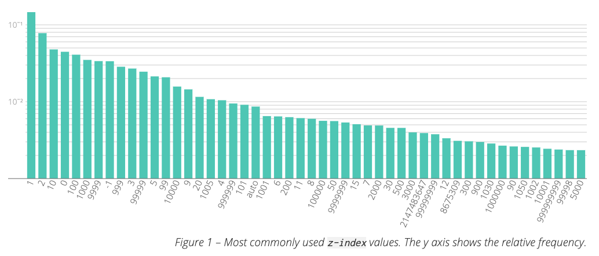

作者觀察的特性有
- They are small: e.g. all the ordinals from 0 to 12 are in the top 50
- They are powers of ten, or multiples of power of tens: 10, 100, 1000, 2000
- They are “close” to a power of ten: 1001, 999, 10001

還有，關於**負數**
- top50 中，只有一個負數 **-1**
- 70th 是 **-2**

36th
- **2147483647** 是 z-index 的最大值（ 2^31-1）
- 不同 browser 可能有差

**1030, 1050**
- Bootstrap’s **navbar-fixed** and **modal** 的 default value

這研究我個人想法，總結來講
- 沒法看出更有規律的事實
- 或者就 web design 來說，z-index 不存在更好的 best practice

### 2. material-ui
#### https://material-ui.com/zh/customization/z-index/#z-index

material ui 有針對幾個 component 設計 z-index
```js
const zIndex = {
  mobileStepper: 1000,
  appBar: 1100,
  drawer: 1200,
  modal: 1300,
  snackbar: 1400,
  tooltip: 1500,
};
```

#### mobileStepper 1000
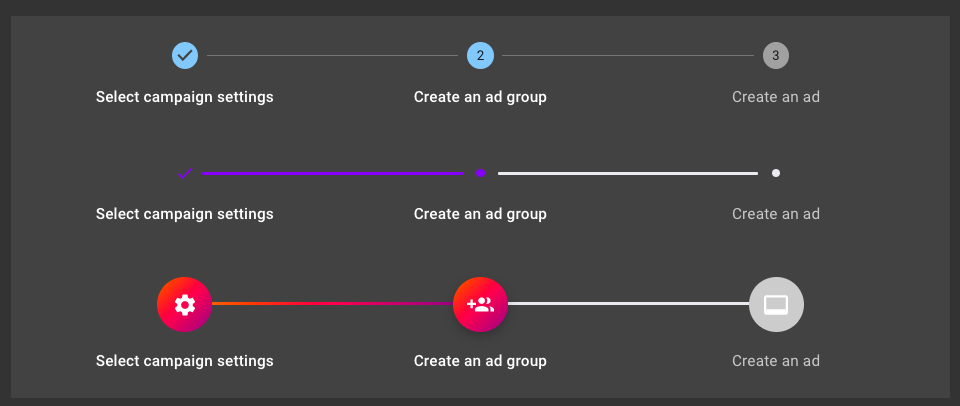  
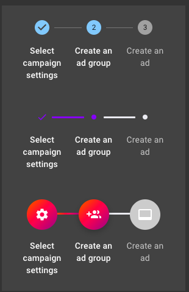  

#### appBar 1100
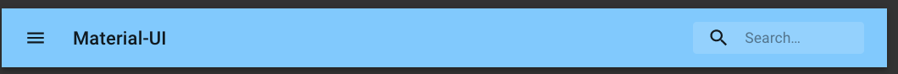  
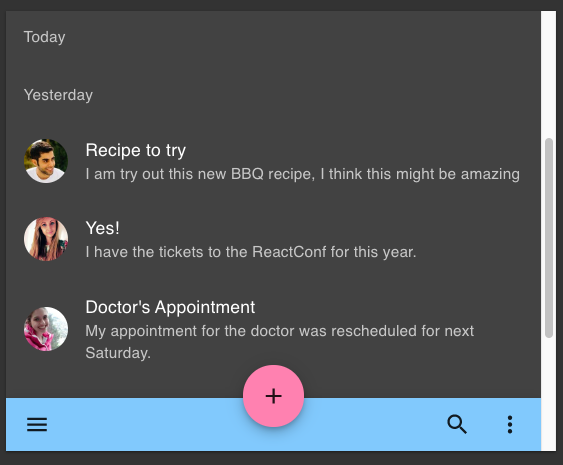  
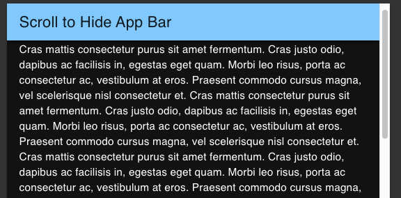  

#### drawer 1200
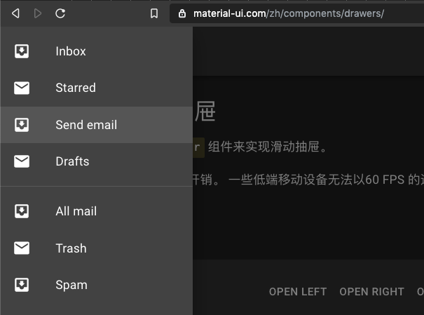  
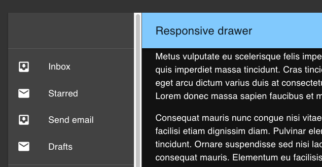  
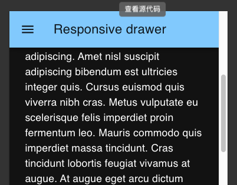  

#### modal 1300
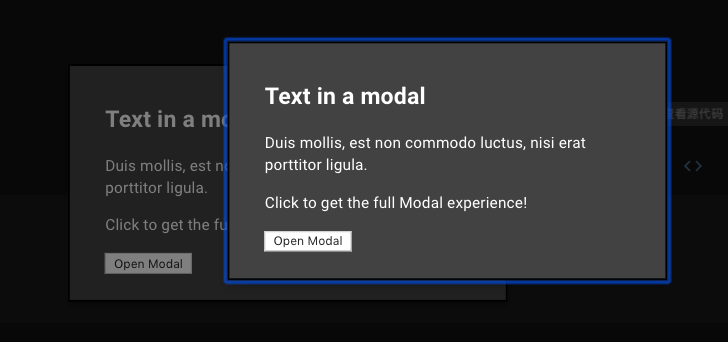  

#### snackbar 1400
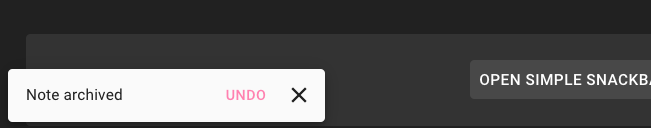  

#### tooltip 1500
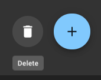  


### 3. Bootstrap
#### https://getbootstrap.com/docs/4.0/layout/overview/
These higher values start at an arbitrary number, high and specific enough to ideally avoid conflicts. 


```
$zindex-dropdown:          1000 !default;
$zindex-sticky:            1020 !default;
$zindex-fixed:             1030 !default;
$zindex-modal-backdrop:    1040 !default;
$zindex-modal:             1050 !default;
$zindex-popover:           1060 !default;
$zindex-tooltip:           1070 !default;
```

#### modal-backdrop 1040
就是 modal
modal-backdrop 是一個屬性，讓 user 點擊 modal 之外時，不會關閉 modal  


#### popover 1060

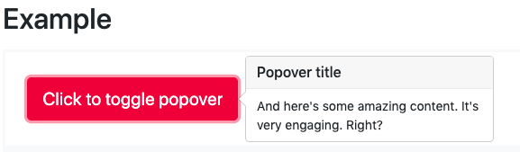  
