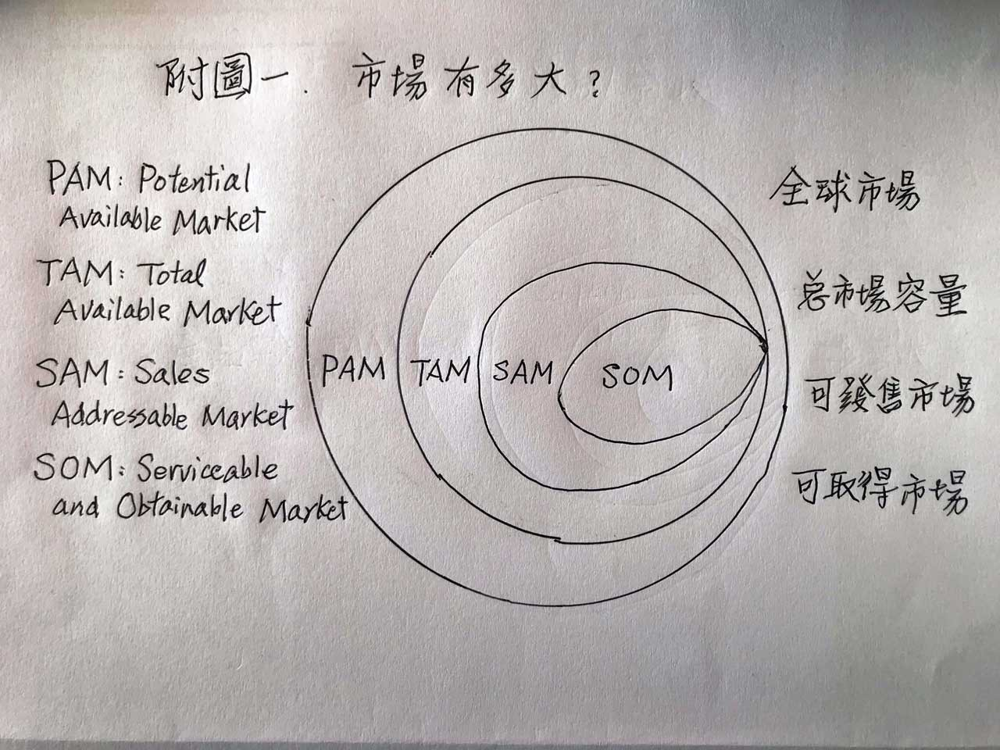
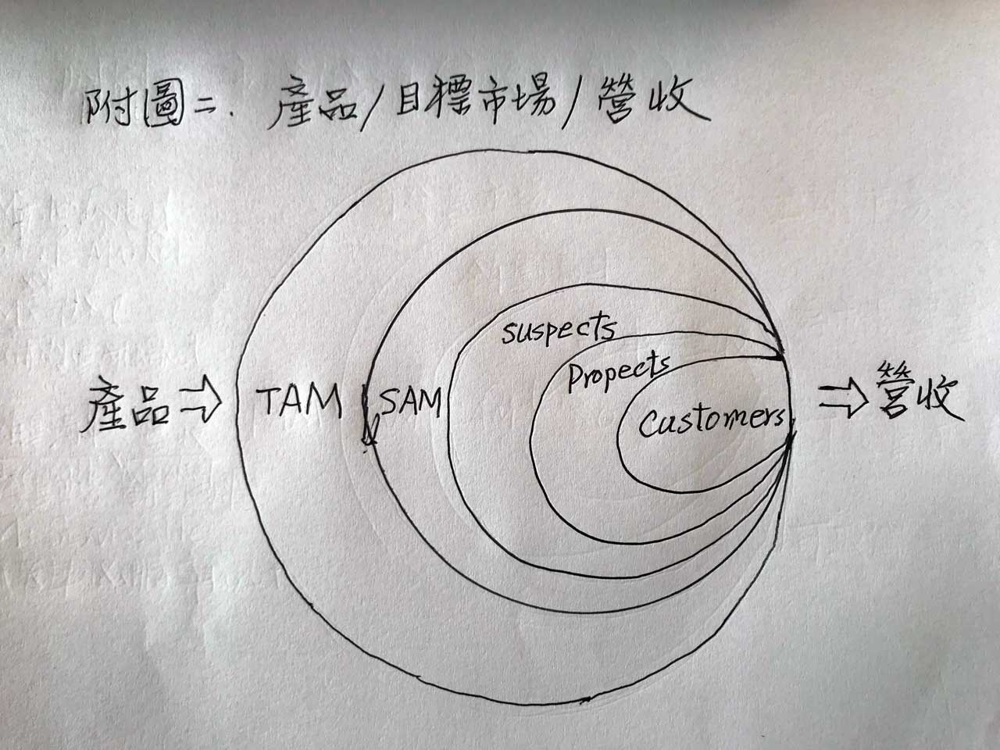
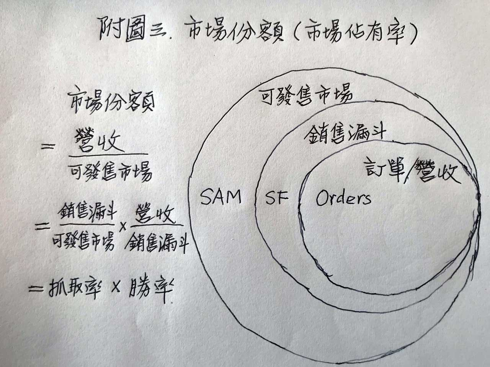

## 程天縱：年度業績目標數字是怎麼來的？：績效管理誤區系列#3
### 程天縱 Nov 16, 2018
#### https://tuna.to/annual-forecasting-cc763089a779

### 情境
報告董事長  
在一個年度業績目標會議中，發生了以下這段老闆和產品事業部主管X博士之間的真實對話：

```
老闆：X博，你的工業機器人明年準備做幾台？
X博：報告董事長，10萬台。
老闆：投資了那麼多年，10萬台也敢說出口？再說一次！
X博：報告董事長，我們明年做20萬台。
老闆：我有沒有聽錯？20萬台？我們自己集團內部要用的，都不止這個數目了。再說一次！
X博：報告董事長，我們明年做40萬台。
再來幾次來回問答之後，終於數字上升到 100萬台。
老闆：這個數字是你說的齁，我沒有逼你哦，你做得到嗎？
猶豫了約莫半分鐘以後⋯⋯
X博：報告董事長，我們一定要做到100萬台！
話題轉到別處之後，突然老闆又回頭問主管⋯⋯
老闆：X博，去年全球工業機器人出貨多少台？
X博：報告董事長，去年全球廠商總共銷售了20多萬台。
老闆：@#%$～，怎麼不早說！
X博：⋯⋯
```


### 市場到底有多大？

成長數字毫無根據
- 但憑著老闆一己之意志而決定。
- 負責業務的主管也常常會說，「不管去年做得多好，新年度開始時一切歸零。」

那麼，到底要怎麼訂定新年度的業務目標才合理？  
要怎麼樣，業務部門才能有可行的計劃去達成？  

### 「目標市場」到底有多大
現在來仔細瞭解一下「目標市場」的結構  
在產業界的分類之下
- 有所謂的 PAM（Potential Available Market，全球市場）
- 泛指你的產品類別在全球市場的總量  

  

> 全球市場 > 總市場容量 > 可發售市場 > 可取得市場

很少有企業
- 能提供產品類別中的所有細分產品、並且可以銷往全球市場

因此「市場規模」就縮小為TAM（Total Available Market，總市場容量）
- 例如你的產品只針對台灣市場銷售，**TAM 就只計算台灣市場的總量**

如果在這個產品類別中
- 你的企業並未提供所有規格的產品
- 那就只能計算「本企業所提供產品」的「市場規模」
  - 就是 SAM（Sales Addressable Market，可發售市場）

最後，即使有了明確的目標市場SAM
- 但受限於種種因素，有些細分市場是無法進入的
- 如果排除掉這些細分市場，剩下的就是可以進入、有產品提供、也有競爭對手存在的市場
- 那就是 SOM（Serviceable and Obtainable Market，可取得市場）

以「工業機器人」的產品類別為例，又可分類為：
- 多軸機器人
- SCARA 機器人
- 坐標機器人
- 串聯和並聯機器人等等

而每一個類別又可以
- 依重量、大小、速度、精密度、應用等等，再加以細分。

以企業所能提供的
- 產品分類
- 地區

就可以定義出
- TAM 與 SAM

但在 SAM 裡面
- 有些細分市場會因為資格問題而無法進入
  - 例如國防軍工
  - 或者是應用技術無法做到，例如軟體演算法無法滿足需要

排除掉這些無法進入的細分市場
- 剩下的就是SOM

有的
- 企業規模比較小，資源有限
- 還可以用「市場區隔」的技巧來進一步切割SOM

--> **直到找到勝算最高、投資回報率最大的市場為止**

### 計算市場規模
計算 TAM 或 SAM 的市場規模時，大致有三種方法：
1. Top-down（由上而下）
    - 引用產業研究報告和數據。
2. Bottom-up（由下而上）
    - 使用自己企業過去的銷售量和數據去推估。
3. Value theory（價值推算）
    - 依據產品為客戶創造的價值和產品價格，預測市場的替代性；這個方式通常用於創新產品。

一般企業來講
- **SOM 或是目標「市場區隔」最重要**
- 因為，「市場行銷計劃」就是針對這個來做的

在做「年度市場行銷計劃」時，必須
- 先往外看
  - 瞭解客戶需求
  - 銷售通路
  - 競爭對手產品等
也必須往內看
  - 瞭解自己產品功能
  - 團隊核心能力
  - 核心競爭力等條件

TAM 和 SAM，需要
- **透過市場部門的行銷活動**
  1. 有效率的找到「潛在客戶」（Suspects）
  2. 然後先過濾掉只是來要資料、或是競爭對手派來探路的人
  3. 再確認確實有採購預算，最後剩餘的人就成為「目標客戶」（Prospects）


接下「目標客戶」資料就進入「銷售漏斗」
1. 由「市場部門」移交給「業務部門」
2. 「業務部門」再進「入銷售流程」，與競爭對手進入肉搏戰，希望能透過臨門一腳來贏得訂單。

  

在 TAM 和 SAM 的茫茫人海中
1. 找出Suspects
2. 然後篩選出Prospects
3. 最後由業務部門贏得訂單，將Prospects轉換成正式的客戶

Suspects 到 prospects 到 customers 的整個轉換過程，都是在 SOM 裡面進行的。

### 由市佔率決定業績目標
請參考10月29日於本站發表的〈如何設定部門的績效項目〉文章中，「市場部與業務部分工合作的例子」附圖二和附圖三的「訂單產生流程」和「績效項目拆解公式」。  

以本文的「市場結構」概念來顯示，就是附圖：  
（「市佔率」可以用「數量」或「金額」來計算）  
  

本文一開始時所用的真實案例
- 是以六軸工業機器人的SAM（可發售市場）數量為基礎，來訂定次年的銷售目標

由於六軸工業機器人
- 已經是個「成熟期產品」
- 對於 TAM 或 SAM 的年度市場出貨量，都可以用前述的「Top-down」或是「Bottom-up」模式來預測

如果
- 年度出貨量約20多萬台
  - 縱使該集團自己大幅採用，因而可能衝高SAM的數量
- 然而對外銷售的數量也不可能超過20萬台

因為競爭對手們不會坐以待斃，而失去他們的市場佔有率  

合理的做法是
- 以自己內部採用的數量
- 加上原本的市佔率的數量作為基礎
- 然後再將目標往上提升一點，以增加挑戰性

很不幸的是
- 大部分企業的老闆對於合理、合邏輯的市場分析，都沒有耐心去理解
- 反而喜歡以老闆的權威和意志力，迫使下屬接受不合理、無來由的業績目標。

還是做不到。也難怪「業績目標訂定」就變成了每年都要唱一次的大戲了。
身為企業領導者的老闆們，是否應該反思一下，重新考慮採用科學化、邏輯化的市場分析模型，來合理訂定年度業績目標