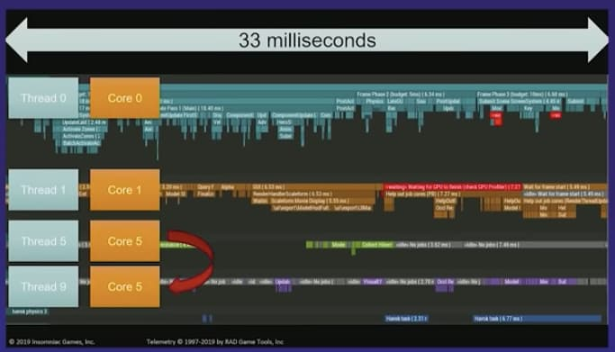
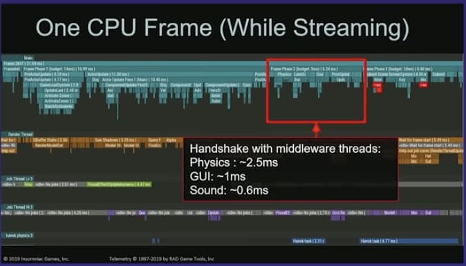

# Guillermo Rauch 2019 in Review
## https://rauchg.com/2020/2019-in-review (January 2, 2020)

Guillermo Rauch 寫了一篇他自己 2019 年的回顧，其中也是有再次聊到他們說的 `JAMstack` 架構  
也是可以再看這篇，體會看看，我自己還是要慢慢體會其中的精神。  

前面兩篇分別是
- [2019-11-30：jsconfjp (Javascript Conferences Japan) 2019](https://github.com/flameddd/blog/blob/master/2019-11-30%EF%BC%9Ajsconfjp%20(Javascript%20Conferences%20Japan)%202019.md)
- [2019-12-12：Gatsbyjs 對未來 frontend (CMS) architecture 思考與看法](https://github.com/flameddd/blog/blob/master/2019-12-12%EF%BC%9AGatsbyjs%20%E5%B0%8D%E6%9C%AA%E4%BE%86%20frontend%20(CMS)%20architecture%20%E6%80%9D%E8%80%83%E8%88%87%E7%9C%8B%E6%B3%95.md)

## 我們
下面文章提到的 We, 我們 => 基本上是指他們公司 `zeit`

## Static is the new Dynamic
這個標題，相信是表達他們想要傳達的
- static + CDN 才是現在最好的 scaling Web App 的架構
  - build 靠 `nextjs` or `Gatsby.js`, deploy 靠 `zeit`

now
- client-side JavaScript (like React and Vue) and
- APIs (like REST and GraphQL)

上面這兩個已經算是現在(2020/01/03)的主流了  
Guillermo Rauch 說他最 favorite 的是
- the assumption that your `markup` will be `static`

(JAM = JS + APIs + Markup. 上次我就是聽不懂他 markup 的含義)  

### First: Why Static?
- Static is **globally fast**
  - (他們在提供的方案都是 global 等級的，跟我平常接觸到幾台 server 就搞定的規模不一樣)
  - 我們能 hoist all your **static assets to a global CDN network**
  - 移除 server 檔案的同時，能 maximize availability by reducing and even altogether eliminating cache misses
    - 也就是說，大多都是 static 整包上去，你不會有其他有的資源 or 服務還沒 上
- Static is **consistently fast**
  - always O(1) TTFB (Time to first byte)
    - 因為是 static file，而不像其他 csr/ssr 要把 js file download, compile, render，其中可能會等待很多延遲
  - O(1), 所以 you get stable and predictable latency to the first byte of the screen
- Static is **always online**
  - 說是 static asset 沒法被 CDN 提供的機率幾乎為 0，所以 always online

### Second: Really, Static? I have dynamic needs.
但 User 還是需要 dynamic 的地方  
server 這層沒有消失，只是 are moving around and hiding  


- **Static Site Generation (SSG)**
  - 可以想成把它移到 server 的周邊（而不是放到 server 裡面），把它們從 hot path 上移走（這些就不會是 server 的 loading 了）
  - 與其讓 server 接受 user 的 request，然後 response。static 的方式等同是我們提前先把 response 準備好！不用當下給 server 負擔、計算
  - 優點１：任何會出錯的東西，很多會在 build static 就出問題了，我們能提早抓到問提。
  - 優點２：build static 一次，後面都可以覆用，大大減少 server、API 的負擔
  - 優點３：build static html is fast.
- **Client-side JS and APIs**
  - client-side JS 跟 APIs 相關的會比較晚才執行，等 markup 跟 code 下載完後執行。
  - Pre-computing 所有頁面是不太可能的，也不應該這樣玩
    - 例如，當處理一些「不是所有 user 都能存取的 data」時，這些 data 我們不會想把它 cache at the edge (CDN)

### 下一代 frontier, Next.js
已經有一狗票的人使用 Next.js 了  
- Hulu, Tencent News, Twitch, AT&T, Auth0
- https://nextjs.org/showcase
  - https://xw.qq.com/
  - https://m.twitch.tv/

`Next.js` 的 秘訣，就是維持單純的 `pages/` system
- 頁面可以這樣定義 `pages/r/[subreddit].js`
  - dynamic path segments with no configuration or custom servers
- 當頁面是 **static** 和沒有 **server-side data props** 的時候
  - `next build` 會輸出成 static `.html`
- 如果定義 **static data props**
  - 在特定頁面時，可以在 build time 時，就 fetch data
  - 個重要的可以 "explode" dynamic path segments into many discrete pages
    - （這段說明看不懂）
- 當建立了 `pages/api/myApi.js`，這基本上就是宣告了一個 **serverless function**
  - 基本上就是 JSON API

**server-side data props**
- https://nextjs.org/blog/next-9#automatic-static-optimization

**static data props**
- https://github.com/zeit/next.js/issues/9524

**serverless function**
- https://nextjs.org/blog/next-9#api-routes

所以 Next.js and JAMstack
- J: 就是 Client-side JS injected via React Hooks
- A: 是指 API，API pages inside the `pages/api` directory.
- M: 是上面提到的 **頁面(Pages)**，沒有 data dependencies 或者只有 **static data deps**
  - 這樣 build-time 產生 static site

### Deploying the JAMstack
我們認為，讓 developer team
- 可以立即 build, deploy JAMstack 的 website
- 不需要管理或設定 servers or infra

這樣能給 team 極大的好處

用我們的方式部署任何 static, complex and full-featured frameworks like Next.js, Gatsby, Gridsome，只要這樣做就好

```
$  now 
✅ Preview: https://blog-p2pe8jedz.now.sh
```

`ZEIT Now` (https://zeit.co/) platform
- 提供一致性的 workflow
- built-in CI/CD and global CDN
- 最最重要的是，away from code review，而是靠 **deployment preview**

Code review 當然重要（尤其 **speedy code review**），但
- team 合作時，有個 sharing URLs 來看實際的 site，來實際看到、實際感受的效果更好！

**speedy code review**
- Why Should Code Reviews Be Fast?
  - https://google.github.io/eng-practices/review/reviewer/speed.html


透過設定 **Git integration**
- 每個 `git push` 都有自己的 live deployment URL

**Git integration**
- https://zeit.co/github#features

### The Deploy URL, the Center of Gravity
- `Deploy URL` 就是重點所在
- 能夠 **快速、頻繁** 的部署的能力，大幅度改善 **testing and quality assurance**

每個 URL，像是這樣
- https://blog-p2pe8jedz.now.sh
- 都是這個 blog 的 deployment preview
  - 就像 rauchg.com 的 production 環境一樣

這種方法
- 取代了 test，和 test 中假設的 environment
  - （因為根本就像 run production 了，所以減少 dev, prod 的環境差異）

這種 `Deploy URL` 還帶來其他好處！ -> URL to other services
- Cross-browser Testing
- Performance Testing
- User Testing
- Manual QA
- Screenshot Diffs
- Product Feeack
- E2E Tests
- API Assertions

也就是說，有 URL，能傳到其他服務去做 test
- 甚至能直接靠 CI 去處理，應該都有機會

  

### Serverless means infrastructure that upgrades itself
Serverless 的發展跟趨勢很有趣，如果在 2018 跟 2019 年分別問 Serverless 的定義  
你大概會得到完全不同的答案

Guillermo Rauch 本人自己最推崇這句
- serverless means your infrastructure upgrades itself.

### Microservices increase complexity and reduce availability
- 難管理
- availability 也低

你就 Statically bind the dependencies of each (serverless) function 就好了
- Next.js API routes 就是這樣做
- Go compiler 也是這樣做 (應該是關於 go 的 library import 的模式)

### Native means Platform Fidelity, not Native Code
大家討論的 **Native**，其實重點是 **Platform**，而不是**語言**  

Rauch 定義 native 是  
> an app that behaves to the quality standards of the platform it's deployed to.

這解釋了為什麼 `Electron` 從 web stack 重新轉換成 Desktop platform 如此成功  
好的 `Electron` app 給 user 像是 "native" platform 一樣，無關 language 是哪種  

要達到 platform fidelity，一定需要能**存取 platform APIs**  
無關 performance or JS and HTML

Tobi Lutke (@Shopify CEO): 
> The @discordapp is the fastest app on my phone and is fully written in react-native. Go figure.

#### ref
- https://blog.discordapp.com/how-discord-achieves-native-ios-performance-with-react-native-390c84dcd502

這代表著說，`React Native` 複製像 `Electron` 在 desktop 一樣的成功只是時間問題而已  
solid engineering 和當 API 被開放時，React Native 就能達到 full platform fidelity (exhibit great performance)  

### Settings are for successful products
Great products usually start with a dead simple onboarding journey that minimizes or entirely eliminates options.

(上面這句話的含義，應該是說一個好的產品、MVP、startup，最好的狀態應該是它的 setting 為 default 的時候。User 的使用習慣，不會去改 seting 的)

從 startup evolution 或 product management 的角度思考
- 除非有大量證據顯示「沒有某些功能，產品就不能成功」，不然就絕對不要加入此功能 (options)

## （後面的內容感覺像是提一些，讓 Guillermo 驚艷 or 期待未來的主題，跟上面的 architech 沒有太多關係了）
### Game engineering continues to show the way
Guillermo 提到，當聽到 `React` 的介紹時，最有趣的事是說 `React` 並不是受到之前的 library 啟發的，例如 `jQuery` (「之前」指的是 frontend 領域，比 `React` 更早期的主流開發 libaray)  

而是受到 `game engines` 領域中，對 **rendering pipeline** 超強的 performance 所啟發  

Guillermo 提到他聽了 Elan Ruskin 他們開發 `漫威蜘蛛人 Marvel's Spider-Man` 真的很驚艷  
- https://www.youtube.com/watch?v=KDhKyIZd3O8

Elan Ruskin 的 talk 講到他們花很多時間來了解他們的 **limits of the platform**，然後來開發、優化等等，來達到好的成果  
  
  
  

Guillermo 認為，這種 **嚴格、精準** 是目前  web engineering practice 中還缺手的  
即使我們的 boundaries exist and are well documented.  

####  Joe Walnes (@joewalnes)
Numbers every `frontend` developer should aim for:
- 16ms: refresh animation frame without jank
- 100ms: UI updates perceived as instant
- 1s: App/site load time
- 3s: Hold attention long enough to prevent Alt-Tabbing to see what’s on Reddit

到目前為止，我們已經有很多工具來 **建議** 限制，例如
- warnings in `webpack`'s colorful output for **oversized bundles**
- scoring systems like `WebPageTest` and `Lighthouse`
- 其他還有很多常常會看到的「**提醒**」，關於 speed 是跟你的 business 成功息息相關的，例如
  - google 排名順序
  - `Amazon 100ms rule` -> Latency Cost them 1% in Sales
- `AMP`  (雖然有爭議)，是個系統面的幫助 performance problem
  - https://www.infoq.com/news/2019/02/chrome-never-slow-mode/
  - https://nextjs.org/blog/next-8-1#amp-in-nextjs


## Notion: the fanciest datastructure
- https://www.notion.so/

2019 年，Guillermo 愛上了 Notion，這個 all-in-one 的 solution
- company/personal wiki + full MS Office-like suite.

一個能解決一大票問題的工具，聽起來像騙人的，但 Notion 成功的原因是
- its elegant, flexible and user-transparent datastructure.

Notion's datastructure 大概可以這樣形容
- a mutable, realtime graph of documents structured as a list of known blocks.

## Breaking: inputs should look like inputs
這邊就講到 `Material Design` 動用了
- 1 researcher
- 2 designers
- 600 participants

跟大量時間，確認了 -> **inputs should look like inputs.**
- https://medium.com/google-design/the-evolution-of-material-designs-text-fields-603688b3fe03

(看到這段，讓我想起來之前看過人家討論。隨著這 10 ~ 20 年的發展，我們的 UI 雖然變得好像很華麗，但其實失去了一些重要的設計。例如以前的 windows，上面的 Button 就很 Button，一看就知道可以按，但現在最熱門的 UI framework 是這樣...)  

  
  


## Shared CDNs have their caches busted
這邊提到，browser 的每個網頁(每個 tab)之間，應該有機會可以 share caches  
如果能 share 的話，會是很強的功能  
- e.x.: TabA 有載入了 `jQuery`、TabB 就不用去載了，直接取用就好

看到 Guillermo 這邊寫，才知道原來這議題早就有很很多討論了，但感覺機會可能不大了了... 
- https://www.jefftk.com/p/shared-cache-is-going-away

文中提到，最大的難題 -> **privacy leak**  

前陣子在 `jsconf japan` 聽到 `Pika` 也在挑戰這件事情！  
- https://www.snowpack.dev/#quickstart
- https://github.com/flameddd/blog/blob/master/2019-11-30%EF%BC%9Ajsconfjp%20(Javascript%20Conferences%20Japan)%202019.md#1715-1745-pika-reimagining-the-registry


## All Code is Wrong
這邊沒有說什麼，但就是提最近開始有點話題的 `noCode`  
我想其實也是指能幫助盡快 protoTyping or 快速 startup 來 run business、驗證 business


## Get busy demoing
Guillermo 說，他經常被很多 incredible product-improving and life-improving 的產品 demos 驚艷到。**Giving frequent demos** 就是創造 **iPhone** 的重要一環！  


**Ken Kocienda** (前 Apple 工程師)在 twitter 上說
> Demos were an essential part of how we created products like the iPhone at Apple. I wrote about demos at length in my book “Creative Selection”.


source:
- https://twitter.com/paulg/status/1163863181518766082?ref_src=twsrc%5Etfw%7Ctwcamp%5Etweetembed&ref_url=https%3A%2F%2Frauchg.com%2F2020%2F2019-in-review%23s5


## NoCode and LowCode are real, and they are on a collision course
Guillermo 認為，`NoCode` 跟 `LowCode` 都是真的有用的  
這兩個名詞，大家很容易講的天花亂墜 or 反對炒錯名詞  

Guillermo 認為他們的
- Next.js is
- data-fetching library [SWR](https://github.com/zeit/swr)
- Zero-config deployments [NOW](https://github.com/zeit/now)

都是 `NoCode` 跟 `LowCode` 例子  

Guillermo 認為還會有更多這類的東西出現  
像是 `react` 有很多 share 的 UI Component  
還會有很多 visual tools 
- https://blocks-ui.com/
- 還有一些 設計 轉 code 的工具

## More Hardware that merges with our Software
更多的硬體會來整合軟體
- ARM 之前有做 [JS-optimized instruction](https://twitter.com/gparker/status/1047246359261106176)
- Samsung 也有 [key-value optimized SSDs](https://www.anandtech.com/show/14839/samsung-announces-standardscompliant-keyvalue-ssd-prototype)

## Everything is code. Roll everything like code
這邊提到一位 Chris (google firmware security stuff) 的 twitter
- https://twitter.com/hugelgupf/status/1146230484541722624?ref_src=twsrc%5Etfw%7Ctwcamp%5Etweetembed&ref_url=https%3A%2F%2Frauchg.com%2F2020%2F2019-in-review%23s5

是在講 **cloudflare** 之前出事，只因為一個 `regex` 錯誤的關係  
所以 Chris 說到
> Configurations, rules, policies, whatever you call them -- they're all code. Roll em out like code.

後續 **cloudflare** 報告，也是打算這樣改善
> The only real solution, short of fully re-writing the pattern to be more specific, is to move away from a regular expression engine with this backtracking mechanism. Which we are doing within the next few weeks.

ref:
- https://blog.cloudflare.com/details-of-the-cloudflare-outage-on-july-2-2019/

（再次提醒自己，`regex` **不能信**，未來有重要的地方，別用。這段蠻有意義的，什麼 rules, policies 之類的，都改寫 code 吧！可讀性才是最高的。）

## Webassembly is faster than you thought
## QUIC (HTTP/3) is faster than you thought
這兩段就在談 `Webassembly` 跟 `HTTP/3` 很快、效能很好  

`Webassembly` 漸漸有一些 real case 了，之前的 jsconf MongoDB 的 case
- https://github.com/flameddd/blog/blob/master/2019-11-30%EF%BC%9Ajsconfjp%20(Javascript%20Conferences%20Japan)%202019.md#%E5%90%8C%E4%B8%80%E6%99%82%E9%96%93%E9%82%84%E6%9C%89%E5%8F%A6%E4%B8%80%E5%A0%B4%E9%97%9C%E6%96%BC-webassembly-%E7%9A%84

另外 Google 同仁跟 Mozilla 合辦的第一屆 Webassembly Summit 這兩天進行，相信能看到更多 real case
- https://www.youtube.com/watch?v=WZp0sPDvWfw
  - (希望有人做 timestamp = =||||)

`HTTP/3` 不用說了，肯定會提升的。期待未來有一天能全面轉換  
但目前 2020/02/11 還沒有任何 brwoser native support，還有一段路要走  


## We are interested in stablecoins not bitcoin…
這邊提到 European Central Bank 主席 **Christine Lagarde** 說到  
在 digital currencies 方面，未來重點是 **stablecoin**，而不是 bitcoin。而且也確實看到 **stablecoin** 有需求。  

ref
- https://twitter.com/ecb/status/1205225680453210112?ref_src=twsrc%5Etfw%7Ctwcamp%5Etweetembed&ref_url=https%3A%2F%2Frauchg.com%2F2020%2F2019-in-review


## Zoom just works better
`Zoom` 上市之後，表現更好了  
ref:
- https://twitter.com/mvolpe/status/1109207974994735104?ref_src=twsrc%5Etfw%7Ctwcamp%5Etweetembed&ref_url=https%3A%2F%2Frauchg.com%2F2020%2F2019-in-review


## Google's engineering practices go open-source
Google open-source 他們內部的 engineering practices
- https://github.com/google/eng-practices

Guillermo 最喜歡裡面一段關於 **speedy code-review** 的強調描述
> At Google, we optimize for the speed at which a team of developers can produce a product together, as opposed to optimizing for the speed at which an individual developer can write code. The speed of individual development is important, it’s just not as important as the velocity of the entire team.

Google 進一步把 cryptography practices 也 open 出來
- https://twitter.com/tdierks/status/1112377964942028805?ref_src=twsrc%5Etfw%7Ctwcamp%5Etweetembed&ref_url=https%3A%2F%2Frauchg.com%2F2020%2F2019-in-review
- https://github.com/google/tink


## AWS shares how they build ultra-reliable services
AWS architect Colm MacCárthaigh shares 10 patterns for controlling the cloud and ensuring its reliability:
- https://twitter.com/colmmacc/status/1071084058841559041?ref_src=twsrc%5Etfw%7Ctwcamp%5Etweetembed&ref_url=https%3A%2F%2Frauchg.com%2F2020%2F2019-in-review
- https://www.youtube.com/watch?v=O8xLxNje30M
