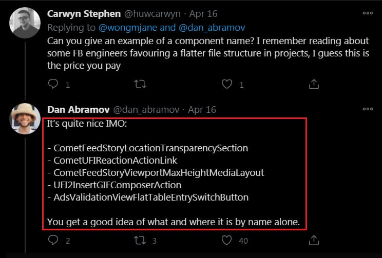

# Long file names, flat folders.

ref: 
- https://twitter.com/dan_abramov/status/1145355874719977473
- https://twitter.com/wongmjane/status/1250726774884859905

Long file names' **pros**
- exactly what it is by its name alone
  - You get a good idea of what and where it is by name alone.
- can find all references by global search
- can jump to file from IDE
- Don’t care for folders, flat folders are much easy manager or cli operate

long file name example
- CometFeedStoryLocationTransparencySection
- CometUFIReactionActionLink
- CometFeedStoryViewportMaxHeightMediaLayout
- UFI2InsertGIFComposerAction
- AdsValidationViewFlatTableEntrySwitchButton
- AdsManagerCustomAudienceSelectorTypeaheadToken.js

New Facebook site's React component use long file name.
  
  
  
 
