# 2022-04-11：HTTP 203 Top 10 performance pitfalls.md
## Jake & Surma 
### [Youtube: Top 10 performance pitfalls - HTTP 203](https://www.youtube.com/watch?v=Lh9q3h2khlc)
### [https://jakearchibald.com/2021/f1-perf-part-1/](https://jakearchibald.com/2021/f1-perf-part-1/)
---------------------

一開始是 Jake blog 來 case study 好幾間 F1 廠商的 homepage performance，後續 Jake 拿來當 HTTP203 的主題講一集。從 HTTP203 開始看，再回去看 blog 文章，這樣順序比較好理解  

## 10 大 Web performance 陷阱  

首先，簡單了解一下 page 是怎麼被 load 的（順序）
1. Core content render
    -  text or the image if the image is part of the core content...
2. First interaction
3. 其他...

這是最簡略的版本

## 10. Sprites and icon fonts
- 載入太多不需要的東西
- Sprites 這技巧，HTTP/1.1 時，很常見，那時候一次只允許下載一個東西
  - 這比較少看到了

也就是說，不要把不需要的整張 icon or fonts 載下來 (or 一次、一開始就載下來)  

之前 Google I/O 的網站，把整張 icon font 下載下來，只為了使用 hamburger icon
- 50k vs 30 bytes


## 9. DOM ready delay

```html
<head>
  <script defer src="first-interaction.js" ></script>
  <body>
     <p>...</p>

    <script defer src="https://other-original/analytic.js" ></script>
    <script defer src="https://aother-original/tools.js" ></script>
  </body>
</head>
```

head 裡面放 `main` script
- 有 `defer`，所以不會 block rendering.

body 放比較不重要的 script
- 也用了 `defer`
- 也不會 render blocking 

但是，他們做了類似這樣的事情
```js
addEventListener('DOMContentLoaded', () => {
  AddInteractivity()
})
```

`DOMContentLoaded` 會等待所有的 `defer` 下載完，才執行!!!!
- https://developer.mozilla.org/en-US/docs/Web/API/Window/DOMContentLoaded_event


這樣，如果你本來已經 HTML 就有畫面的話，就要等到所有 js 被下載完執行，才行了  


## 8. Bad inlining

bundle 時 inline 某些檔案，這有好幾個不同的面相
1. inline Fonts
    - block rendering whole page
    - 有時候，第一頁根本沒用到那個 font，也去下載了這些 inline fonts
    - 要的時候，可以考慮 subset 只針對幾個自己要的 letter 來 inline
2. SVG
    - inline image 比較少見、但 inline SVG 很常見，所以單獨拿出來談
3. inline image
    - Jake 看到一個例子、SVG 裡面有 inline 1.9mb 的 png
      - base64 又把檔案變大
4. inline JS
    - inline JS 非常正常，但有些人會 inline 很多跟 first render 無關的 JS 進去，造成檔案太大。這些都要被 browser 下載、解析完才能讓 first render 出來
    - 這些可以稱為 blocking script 了，因為 browser 要花時間下載。這樣拖慢 browser 去知道其他有更重要的資源需要下載
    - 小心使用、保持 small

inline font sub set example (Squoosh)
```html
<style xmlns="http://www.w3.org/2000/svg">@font-face{font-family:font;font-weight:700;src:url(data:font/woff;base64,d09GMgABAAAAAASoAA4AAAAACOQAAARUAAEAAAAAAAAAAAAAAAAAAAAAAAAAAAAAGhYbgnYcgXAGYABkEQwKhHiEFgsUAAE2AiQDJAQgBYJaByAbeQfIxId/N/1zb0JJk7qwVQyoSyhM6qJf2zN3wnP5MyX/c6mabKKFAVwk4QDd+3f7Z41FoYvttryoVK6NsWls0wJjfeO38YjNiCJjtHr/1Q8CwAqDCAUBr2QweT2PEoyA1elzSuDRPDnUg8D2odZuRPU0jvQhDaxz5rMh0dmYGFMJs4nu1qE+eGjM/weALmNBwUEBOxTgRXxFMYpg//e8Ci0oLAD5Z/l7jALyz0eIk0p5wwIKMGmoUVDk+I2Voc2UQOpf+V8SHykzsc2YglhhpAxij4qYCCDLLiZGpIxaxGLgdEfA8VXagNHBPOEGN4kdxIwSYCOPFjwtuDxUnqS+IGdGuWtrAgUsQYZRHpDu7Qiw6ukb7cWFrWzAQoFsxEIZPaFS7IAQDQ4cvEx4DjEL+W8XY9w93bi6CVjaTB8XOUO3aIVhv7jXI3UoIVGDVOAYRkFZmv6lSiyebcjPN+BqWJ91Zp43fwUwPxAfFchViYiY6etaTAWH6kKIhE7SgEaAL0DMDnZmf6FCMTrQj0EMY1SW726Rv5Tvki/Jp/KJfCwf5XNoQXWWGi/LsNXQcgvxSnnJ8wFi43KUbaZAdno0JKEudnYudkHOvy6ZysqvkYTtt8jiu2VxJhNZfP99YVuKLLnyTX7rdSy8cT5WkrBgNPL1AkqEuyzOB+WZxXf5LSMoLzmnXHS9/9b7ZNHk7wAjFqQ3hMZy/nbFtQXbNAIRWP4jQ8kUVX7FG8L2Y4VH4/QvOjyltORefuthLJSWBnyUZCKMQBfeEbbfP3h5MvqPEuA12/1Or4a5yB8MYpzmv+DgZ3O9ntK5NjZdTEis7owRG/urcsYir+4JU2+cUdUY36zxbeoo1RsaBsJTkP7a8gPKCq64OCyytqmvKXVZE5mtjskqTmWW8Y3ttF43lZujm57W5+dN63XTObm6qWl9XsDErwGiVhMg/hoY+GugqNEE6n4NxH280sBFFITFZA/oMqby8zKmB3TZMfnqDC5tyrRUm/F7gKhWB4i/Bfj/FiCq1QHi7/643nboYs9I1K/XB/n/4eH+8COPf1aYl6yOya4KiL8ypq8/Qso6O+HoL9pfsL/okJObGJlwoSkkBZds6wfb4pYDYzxCEjIL09ll83QG11IUGgUAAJrLVRQvuOTOlNTbpvzOCcwPZllp+cGK/bUffKT+wRxg/trKyDwPAmVzJTtUmnnR/Ca2bGU0B5hvtjI2u3ZLmoci/IQP0Fz40ipk0Hb402H4k7/hScuRQrJj7rXEg+BR85QaWsDzADqVUNUxBLbRYp0JnCMELkwBnsiOEWgYqDGjYaHCzRoFPPDyyy3gg68goh8DmMQQOtGODoxAhShEIBKx9DgD+tGPdvSgFSrkIAcitEolEz3oIVeRDxy+4lvVSiuGMEbLtUDr97BiNKIPw8hCvzLeYjOefMW4mq5hUSguFWNZnL3D6EQ/+tLPa3ktEYgO08G8O9bbQgkWAA==) format('woff2')}</style>
```


## 7. Big images
browser 下載 images 是很聰明的
- image download 不會 block render，跟 css 不一樣
- image download 是 parallel 了
- browser 會看 image 的 viewport，然後給出優先級，哪些 image 需要先下載

image 如果載 viewport 的話
- 跟 script 有相同的優先級、有時更高
- image 大的話，會跟 script 搶頻寬

格式很重要
- 積極使用更好的壓縮模式 WebP, AVIF
- dataset

這個例子，image 還是會被下載
- download image 的 task css layout 還早
```html
<div style="display: none">
  
</div>
```

加上 `lazy` 的話，就不會直接下載，會根據 layout
- 但也不要把所有的 image 都加上 lazy，這屬性也是有 cost 的
- browser 看到這屬性，會去 download css 來計算 layout 來決定要不要 download image
```html
<div style="display: none">
  
</div>
```

## 6. Loading MAIN images with JS

HTTP/2 能夠 parallel 方式 download file   
browser 能夠弄清楚哪些東西有較高的 priority  

今天如果是透過 JS，JS 必須先下載、載入，然後執行，這樣 brower 才能知道  

像類似這樣的例子，是透過 JS 去 create image 來 download 的  
- 可以的話，還是要直接使用 element 處理

```html
<div class="carousel">
  <div data-src="main-image.webp"></div>
  <div data-src="second-image.webp"></div>
</div>
```

另一種 workaround 可以用 `preload` or `prefetch` 改善這 case

```html
<link rel="preload" as="image" href="" />
```

## 5. primary resources on other origins

```html
<head>
  <script src="https://unpkg.com/idb-keyval"></script>  
</head>
```

這個 case，因為是在不同的 server，那就需要 build 另一條 connection
- 3G 下，這就稍微能感受影響了

roundtrip time, create connection 到其他 server，這是 first load page 中，最耗時間的其中一件事情  

另外，這 case，unpkg 甚至還會 redirect user 到其他位置，去拿 latest 的 package  

## 4. external font services.

跟 5 很像，但這更常見，單獨來談  

```html
<head>
  <link rel="stylesheet"
        href="https://font-service/whatever.css" />
</head>
```

上面這個是 render-blocking resource CSS 的 case  
- 而且還在另一台 server、因次需要 conneciton

然後 css 裡面
```css
@font-face {
  font-family: '...';
  src: url('https://font-service-cdn/...');
}
```

url 裡面，無論是不是同一台 server
- font file 會用 CORS 的方式 request，這一定會 build 一條新的 connection  
- (fetch or XHR)

如果再來一個
- css 裡面要 import 另一個 css、更久的 blocking time
- 這要等第一個 css 載完，讀取後，browser 才會知道，代表又是一條 roundtrip  
- 用 preload 處理這問題 `<link rel="preload" as="stylesheet" href="" />`
```css
@import 'more-stuff.css'
```

font 也能靠 preload
- `<link rel="preload" as="font" crossorigin href="" />`

如果 URL 不確定，用 `preconnect` 多少能改善
- `<link rel="preconnect" crossorigin>`

另外一種處理，async 的方式 load css
- preload 代表優先級高
- print media 代表 low 優先，但上面已經先下載了，這邊目的是不要 block render
- 載入結束後，用 onload 把 style apply 上去
  - 另外還要設 font swap 屬性
```html
<link
  rel="preload"
  href="https://font-service/whatever.css"
  as="style"
/>
<link
  rel="stylesheet"
  href="https://font-service/whatever.css"
  media="print"
  onload="media='all'"
/>
```


最好的解法，還是把 font 放到自己的 server 去  

## 3. layout instability
這點跟上面的比較不一樣，偏向 User 感知上的問題  
這種 layout shift 問題，讓 User 正在看的東西跑掉，覺得還沒有載入好  


這邊，只要給 img width height，不需要完全精準，只要正確比例就好
```html

```

```css
.img {
  display: block;
  width: 100%;
  height: auto;
}
```

如果不是 ``，那可以用 `aspect-ratio` 屬性來達成一樣的事情、保留空過  


## 2. over-bundling (under-splitting)
包太多沒用到的東西進去初始的 bundle 了  

chrome 有 coverage 的 tool 可以讓你做點檢查，看看有多少 % 是 unuse 的 JS and CSS  
太多沒用到的東西在第一包，意味著你要
- 花時間下載它、解析它  


## 1. Content revealed/loaded with JS
最快 render first page 的方式是靠 HTML, CSS  
- 用 JS 永遠慢很多，努力優化，能改善一些，但還是比較慢

Sam 推薦大家去聽之前他們講 JAMStack 的 talk，也是提到類似的觀念
- https://www.youtube.com/watch?v=TsTt7Tja30Q

多舉一個例子
- 這舉例，一開始 hide 住 content
- 等 main.js load 後，spinner 會被移除，顯示 content
```html
<body>
  <div class="block-overlay-with-spinner"></div>
  <div class="content"></div>
  <script defer src="main.js">
</body>
```

上面這題是 priority issue  

如果我們把 script stylesheet 放在 header，browser 會知道這些很重要
- 會知道那些東西會 blocking render，所以最優先、分配最多頻寬給這些資源

如果把 script 放在 body 裡面，優先級會很低，甚至如果 html 裡面有 image 在 viewport 上  
image 的優先級可能都會比上面 main.js 還高   

所以說，上面的例子是
- developer 做了改善 blocking 的 UX 
- 但 browser 不認得這情境  

用
- static
- or preload （優先級）來改善問題（光加個 preload，花 10 分鐘就能改善很多）

------------------------------
下面就是 Jake 的 blog，他原本是先寫 blog，才有上面這段 talk 的  
下面就等於是一個個的 case study 了

影片測試網站時，都是用 `Fast 3G` 做測試  
另外配合
- https://www.webpagetest.org/
- dev tool  


Jake 寫了一個 script 來下載這些網站
- https://github.com/jakearchibald/f1-site-optim/blob/main/index.ts
- 用來他自己測試，看能改善多少。不是 100% 正確，但也可以作為參考了

------------------------------

## Case1: Alpha Tauri
- https://scuderia.alphatauri.com/en/


測試影片(稍微看過影片，會比較快理解文章內容在說什麼)
<p align="center">
  <video  height="250px" muted loop  autoplay loading="lazy"  src="https://github.com/flameddd/blog/assets/22259196/0c1019b6-bab4-4b4f-8e3f-90789ad89a16" ></video>
</p>  

(影片來源: [assets/img/alpha-tauri-246a6b3a.mp4](assets/img/alpha-tauri-246a6b3a.mp4))  

載入的縮時圖(開新頁面比較容易看)  
  


有機會改善的地方
- 7 second delay to content-render caused by CSS font tracker.
- 1 second delay to content-render caused by preload resource priority issues.
- 1 second delay to content-render caused by unnecessary SVG inlining.
- 5 second delay to primary image caused by unnecessary preloading.
- 1 second delay to primary image caused by poor image compression.
- 40+ second delay to content-blocking cookie modal caused by  a number of things.

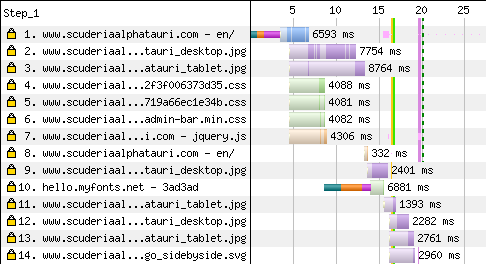  

1-10 行:
- HTML, row 1 (213kB gzipped)
- 3 big images, rows 2, 3, 9 (~1MB)
- 4 CSS files, rows 4, 5, 6, 10 (~100kB)
- 2 JS files (~40kB)

### 主要問題: CSS font tracker
- CSS font tracker 是 host 在其他 server (第 10 行)
- 它 delay `first-content delay` 將近 **7** 秒
  - 還有結合其他問題

用 DevTool 查看


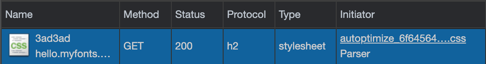  


`initiator` 裡面看到，這裡是某些 CSS
- 這是 render-blocking resource 去 load 更多的 CSS 的狀況

css 裡面去 import 其他 css
```html
<link rel="stylesheet" href="autoptimize_etcetc.css" />
```
```css
@import url('//hello.myfonts.net/count/3ad3ad');
```

browser 能夠 parallel 下載檔案，但也必須要在知道有哪些目標的情況下
- 這個 case，只有等 `autoptimize_etcetc.css` 下載後，才會知道要去下載 `3ad3ad`
  - 這又是一種 block

可能的改善方法
- delete `@import`、改用 preload
- 這樣可以省好幾秒，至少比 7 秒更好了

```html
<link
  rel="preload"
  as="stylesheet"
  href="https://hello.myfonts.net/count/3ad3ad"
/>
```

會用 import 可能是 font 廠商要求的，確保網站使用的 font 是有付費之類的  
另一種方案就是切換成別的 font、沒有這樣限制的 font

避免 blocking resources 在別的 server
- 在 `HTTP/1.1` 時代，這是好的方案，那時候一次只能載一個檔案
- 但現在可以平行 2-8 connectino per server 了

  

1 ~ 9 行就是同一個 server，所以共用一次 connection
- 第 10 行，就需要另外 build connection
- 這個 build connection === 5 秒的 blocking time
  - preload tag 可以稍微改善這問題
  
但剛好這個檔案是 tracker，所以這檔案也沒辦法移到我們自己的 server 上  
另一種方案

### Load cross-origin font CSS async

the best thing we can do is
- remove the render-blocking nature of that separate connectio

我們能把所有有相關 `@font-face`、`@import` 的 css 都採用 async 的方法 load  

```html
<link rel="preload" href="/font-css.css" as="style" />
<link
  rel="stylesheet"
  href="/font-css.css"
  media="print"
  onload="media='all'"
/>
```

Browser
- 會提前下載 `print` 的 stylesheets (at a low priority)
- 但，這不會 block rendering
- 利用 `preload` 把它轉為 `high priority`
- 下載後，改 `media` 來把樣式套用上去

缺點就是 font 會做切換，要確認這樣看起來是否 OK
- 或者用 `font-display: swap`  

不喜歡 swap 的話，[Web Font API](https://web.dev/optimize-webfont-loading/#the-font-loading-api) 能做更多的細部控制

### Preload fonts
只有當 browser 在頁面上找到需要字體的內容時，字體才會開始下載
- 這在某些方面很有效，因為它避免了加載不需要的字體
- 但是，這也意味著他們可以很晚才開始下載。

如果確定頁面上需要特定字體，用 `preload` 早一點開始下載

```html
<link
  rel="preload"
  href="/path/to/font.woff2"
  as="font"
  type="font/woff2"
  crossorigin
/>
```
font requests 也是一種 CORS requests
- 在 preload 裡面用 `requests` 確保 perload 也是 CORS request


### 主要問題2: Late modal

  

在用戶使用頁面 30 秒後拋出一個 modal 是一種 bad UX
- 顯示其中一種模式是在頁面頂部使用盡可能小的 JS
- 因此可以在其他任何內容之前顯示它，並且用戶可以 儘早擺脫它

關於 `同意 cookie 的 modals`
- Jake 認為他們正在對 internet 造成巨大的破壞
- 而他們試圖解決的問題也發生在其他平台上
- 另外，不認為他們解決了他們試圖解決的問題
- 但是，Jake 說他不是律師，所以在這次測試中大多忽略了它們，也沒有將它們計入網站的分數。

### 主要問題3: Preload 的 priority

  

這邊
- 驚訝地看到 image 在 CSS 之前被載入 (line 2 ~ 6)
- 因為 CSS 是 render-blocking 的，但 image 不是
- image 正在佔用 CSS 的頻寬

查看了一下是這些
```html
<link rel="preload" href="alphatauri_desktop.jpg" as="image" />
<link rel="preload" href="alphatauri_tablet.jpg" as="image" />
```

我很驚訝 browser 在 CSS 之前發送了 preload request
- 但是 request priority 是 browser 請求的內容和 server 選擇發送的內容之間的一個非常微妙的平衡
- 也許將 preload request 稍後放在 source code 中會有所幫助，或者完全避免 preload request，而是使用 ``（目前它是 CSS 背景）

> Update: Performance expert Andy Davies has encountered this priority issue before too, and told me why it happens, and it's AppCache.
> https://twitter.com/AndyDavies/status/1375398840057102338

### 其他問題: Unnecessary preloading

Chrome DevTools' console 出現警告

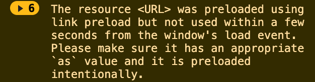  

這些 preload 其實一開始沒用到，一開始去 load 等於浪費
```html
<link rel="preload" href="alphatauri_desktop.jpg" as="image" />
<link rel="preload" href="alphatauri_tablet.jpg" as="image" />
```

這些 image 是用在主要的 carousel 上面的
- developer 考慮了某些因素，所以特別 perload
- carousel 是 JS 去 create 的、然後才會有 image tag 來 trigger download image
- 所以 developer 加 preload 改善這問題

但，他們沒有利用 responsive images 優勢，同時去把 desktop 也下載了  

preload 可以這樣寫
```html
<link
  rel="preload"
  media="(max-width: 399px)"
  href="alphatauri_tablet.jpg"
  as="image"
/>
<link
  rel="preload"
  media="(min-width: 400px)"
  href="alphatauri_desktop.jpg"
  as="image"
/>
```

或者，單純用 `` 和 `srcset` 來做也行
- https://jakearchibald.com/2015/anatomy-of-responsive-images/


### 其他問題2: Inlined secondary content
HTML 是 `213kB`，是很大的一份檔案

    

深色的區塊，代表開始接受 bytes  
- 看了 HTML source code 後發現，裡面一堆大型 inline SVG
- [inline SVG](./assets/img/tauri-svg-4e5ce2a6.svg)


  

改善方法
- 用 [SVGOMG](https://jakearchibald.github.io/svgomg/) compress，大小差 7 倍
- ([squoosh](https://squoosh.app/)) 轉 WebP 會更小

這邊的問題是 `inline` 的含義
- `inline` 代表著檔案是放在一起
- inline 可以避免額外的 request cost 或者其他 request block 住。相反的說
- inline 也就意味著你要把整個檔案下載完，browser 才能處理下一件事情

就這邊的情況，這張圖是頁面下方的一個標示，它應該不是這麼重要
- 它卻佔用了本該用在更緊急地方的頻寬

如果是 ``，browser 自己能夠分析，了解它的優先級
- 減少大約 1 秒的內容時間

避免 inline
- 除非它是會 render-blocking content，又或者它非常小
- 多多思考分析其使用情境

### 其他問題3: Large primary image
有一張最主要動片是顯示給 user 的


  


重新 compress 後，雖然品質差一點
- 但，請記住，這種 user case，通常我們追求的是 **「快速且看起來不錯」**，而不是 **「慢而完美」**

大小(所有的圖，在 Jake blog 都有放出來)
- Original JPEG (195 kB)
- Optimised JPEG (30.7 kB)
- WebP (23.2 kB)
- AVIF (19.5 kB) (上面那張是 AVIF)


browser 支援的問題，靠 `<picture>` 處理
```html
<picture>
  <source type="image/avif" srcset="img.avif" />
  
</picture>
```

-------------------------  

## Case2: Alfa Romeo
- https://www.sauber-group.com/motorsport/formula-1/

測試影片:  
<p align="center">
  <video  height="250px" muted loop  autoplay loading="lazy"  src="https://github.com/flameddd/blog/assets/22259196/d9341806-8d3b-4862-b1dc-529cb455df01" ></video>
</p>  

(影片來源: [assets/img/alfa-romeo-e57e8446.mp4](assets/img/alfa-romeo-e57e8446.mp4))  

載入的縮時圖(開新頁面比較容易看):  
  


這邊的 `loading spinner` 不拿來當作所謂的 `first content render`  
- loading spinner 可以說是一種因為 slow 的道歉

有機會改善的地方
- 10 second delay to content-render caused by low priority render-blocking JavaScript.
- 1.5 second delay to content-render caused by other-server sequential CSS.
- 11 second delay to primary image caused by blocking request on JavaScript.
- 2.5 second delay to primary image caused by poor image compression.

### 主要問題: Low priority 的 render-blocking JavaScript

   

`<head>` 中有一些 render-blocking JavaScript
- 第 4 行，但這個很小
- 72 行，真正的問題是這個 render-blocking script

長長、淡黃色的長條，是
- browser 知道這個 resource 會花很久時間
- 但，browser 選擇先下載其他東西
  - 這可以用 DevTools 近一步確認

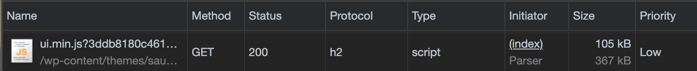   

可以看到，`low` priority，但，這是 render-blocking 的 script，為什麼 browser 認為是 low ?
- 因為 browser 不知道這是 render-blocking 的 script

當我們講 `render-blocking scripts`，我們指的是
- script 出現在 source (html) 的 content (body) 之前
- 並且「不」具有下面任何一個 attributes
  - `async`: DONT block parser. Execute whenever loaded.
  - `defer`: DONT block parser. Execute after the document has parsed, and in order with other defer scripts.
  - `type="module"`: Load as a module, which implies `defer` by default.

If you use one of the above, the script doesn't block the parser, and therefore doesn't block rendering.  

如果把 script 放在 `<body>` 最下面
- 它就像 defer
- browser 會假設這不是 render-blocking
- browser 會把它排在 image 和其他 sub-resources 之後

把 script 拿到 `<head>` 中，可修正這問題  
browser 仍會認為是 `low` priority，可是這 case，它應該要在上面那些 image 之前，因為它是負責 render content 的 script。這能利用 `preload` 來拉高 priority，可是這

```html
<link rel="preload" as="script" href="…">
```
 
最佳解是，不要依靠 JS 來做 initial render
- JS 用 load lazily，然後 gradually enhance content 就好

### 其他問題1: Other-server sequential CSS

第 7 行的 CSS
- CSS loading CSS，這是有依序 loading file 的 blocking
- 這 CSS 在其他 server 上 

跟上一個 case 一樣，但這邊的情況稍微不一樣
- 上一個 case 是有 font-licencing 限制
- 這邊是 google font，是 open source

另外一個細節，因為他們使用 `Roboto`，這是 Android 內建主要的 font  
對 Android user 的話，這邊就是不必要的 download 了  


Google Fonts 的 CSS 是很聰明的
- 它提供最佳的 CSS 跟 font format 給特定的 browser
- 但自從 WOFF2 已經廣泛被支援
- 我們可以直接  copy & paste the font CSS，來避免 host another server  

### 其他問題2: Delayed primary image

從前面的**縮時圖**可以看到，image 出現的有點晚（這種 case 通常有很多不同原因，只能一步步查看可能性）  
- (把圖片開新視窗比較方便查看、這邊指的是最後一張 frame)


第 74 行 (waterfall)
- 其實，browser 會很早就去找 `` tag，image 可以在 CSS ready 之前就開始 download
- 所以，上面這張圖可能不是 ``
- 如果上面的圖是 CSS background 也應該會在早一點 downlaod (但會在 CSS 之後)

看看 DevTools  
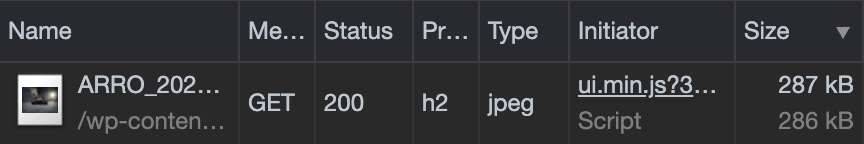   

`initiator` 裡面告訴我們，這 image 是由後來載入的 JS 去下載的  

看看 source code
```html

```

有些 data attributes，但 browser 好像沒做什麼事情
- developer 似乎用了某些 polyfill 還實作 responsive images，而且，最後還是去 download 了 5x4 這張 
- (Jake 用 mobile 測試，不應該 download 這張)

直接用 browser 內建的 responsive images feature 就好了
- https://jakearchibald.com/2015/anatomy-of-responsive-images/ 

### 其他問題3: Large primary image

這張主要的 image 有壓縮過了，但壓縮的比例不夠好，另外圖片尺寸也不合適

   

大小(所有的圖，在 Jake blog 都有放出來)
- Original JPEG (286 kB)
- Optimised JPEG (30.2 kB)
- WebP (24.3 kB)
- AVIF (15.7 kB) (上面那張圖，是這個 AVIF 的版本)

壓縮後，就算品質差一點，User 也很難用肉眼分辨出來  

-------------------------  

## Case3: Red Bull
- https://www.redbullracing.com/int-en

測試影片:  
<p align="center">
  <video  height="250px" muted loop  autoplay loading="lazy"  src="https://github.com/flameddd/blog/assets/22259196/5f8a67e7-f0b3-4a51-a723-4da48678dcab" ></video>
</p>  

(影片來源: [assets/img/red-bull-bc1c17cd.mp4](assets/img/red-bull-bc1c17cd.mp4))  

載入的縮時圖(開新頁面比較容易看):  
   

有機會的改善
- 3 second delay to content-render caused by unnecessary inlining.
- 10 second delay to main image caused by a JavaScript responsive images implementation, like we saw in part 2. These should be real responsive images.
- Additional 2 second delay to main image caused by an extra connection.
- Additional 2 second delay to main image caused by poor optimisation.
- 40 second delay to key image caused by loading it with JavaScript.
- Additional 30 second delay to that image caused by poor optimisation.
- 2 second delay to fonts caused by extra connection.
- 40+ second delay to content-blocking cookie modal caused by a number of things

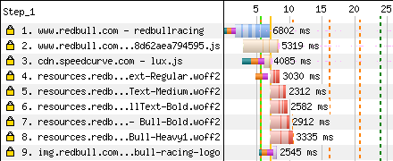   

### 問題1: Unnecessary inlining
直到第 6 秒左右，HTML 仍在下載
- HTML 能夠 streaming HTML，也就是邊下載、邊 render 已經下載的部分
- 但如果有 blocking resources 的話，幾乎等於無法利用到這優點

從上面的圖上看，這裡沒有其他 blocking resources
- 頁面就靠這一個 resorce 來 render
  - (`First Contentful Paint` 馬上出現在 HTML 下載之後)

查看 source code 後，了解到這邊 CSS 是用 inline 的方式  
- inline 可以避免過多的 request/response，可以拿來避免 render-blocking resources
- 但也要小心，它是雙面刃。你下載的檔案因此變大，需要載完，才能接續 task

用 DevTools 的 coverage panel 確認
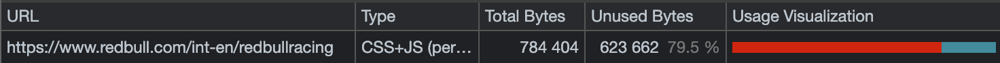   


這頁面
- `79.5%` code，是 init render 時沒用到的
- 將近 600kb 都沒用到

相比一下 [Squoosh App](https://squoosh.app/)  
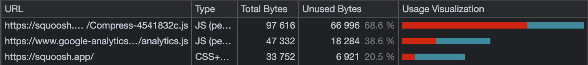   

inline style 和 script 應該要盡量只放 first render 和 first interaction 相關的就好  

### 問題2: Large primary image

  

他們用 WebP，但品質設很高
- 壓縮雖然差一點，但 UX 真的沒什麼差

大小
- Original WebP (99.1 kB)
- Optimised WebP (24.8 kB)
- AVIF (13.9 kB) (上面的圖是 AVIF 版本)


### 問題3: Large overlay image
  

這圖用在 main carousel，主要的背景
- 是設計的重要部分
- 同樣使用 WebP
- 但 config 不正確，即使優化後，仍然很大

create WebP 時
- 它們設計用 [alpha channel (阿爾法通道)](https://zh.wikipedia.org/wiki/%E9%98%BF%E5%B0%94%E6%B3%95%E9%80%9A%E9%81%93) 環繞某個主題
- alpha channel 佔了大部分面積  

大小
- Original WebP (1.1 MB)
- Optimised WebP (620 kB)
- AVIF (132 kB)
- AVIF for mobile (47.8 kB) (<- 上圖的版本)

| Full image | Alpha channel |
| :---: | :----: | 
|  |  |

因為這個原因(Alpha channel)，所以他們採用 `lossless mode` 的 WebP
- 如果是很多顏色的圖，lossy mode 是ＯＫ的，但這個 case 剛好是個例外  

| Full image | Alpha channel |
| :---: | :----: | 
|  |  |

alpha channel 經常變化的地方
- lossy codec 可以處理得更好
- AVIF 能對各式 channel 做 lossy encoding (包含 alpha)
  - so it performs an order of magnitude better than WebP in this case.

真正需要 lossless images 時
- WebP 是更好的選擇
- AVIF 的 loseless ，size 通常是 WebP 2 倍大


### 問題4: Overlay image loaded with JavaScript

超過了 50s，overlay 的那張 image 才開始下載
- 這代表一定有些事情 blocking 住 image
 - (這個 case，剛好用 DevTools `initiator` 看不出所以)

研究了 souce code 後
- 它是放在 document 底部的 blob of JSON
- 它是 JSON，也就意味這是靠 JS 來處理的

Jake 說，他會改用 `` + responsive images 來處理這張圖，這樣最簡單  

massive WebP 也會佔用太多頻寬
- 導致其他東西 delay
- 可以使用 `preload` 來調整其他重要的資源

### 問題5: Large inlined blurry image

Red Bull 用了一張 blur 的圖，來改善 UX
- `blur(7px)` effect

但，這圖
- 他們使用的圖不是正在載入的圖的正確 preview
- 因為它 cropped 錯了，所以當最終版本載入時會有一個 jump
- 但是，我真的很喜歡這種方法，因為它提供了比 BlurHash 之類的更多的結構，但它確實使用了更多的字節。


這邊 blurred images 每張 6kB
- 這對 inline 而言Ｍ這些圖，很佔大小
- 選用 `150x150` 來建立 tiny JPEG 也是個奇怪的選擇。 JPEG 是 `8x8` 一個 blocks
  - https://www.youtube.com/watch?v=F1kYBnY6mwg&t=294s


Jake 玩玩看這張圖
- Original 150x150 JPEG, blurred (6.04 kB)
- 48x32 JPEG, blurred (1 kB)
- 80x56 WebP, blurred (1 kB) (<-- 上面那張圖)
- 136x91 AVIF, blurred (992 B)

JPEG 有嚴重的 blocking artifact
- 因此，Jake 加強 blur 
- WebP 成果更好，所以可以調高 resolution，減少 blur 程度

如果你要建立像這樣的超小圖像
- 需要在 codec 中 disable `chroma subsampling (色彩採樣)`
- `chroma subsampling` 會採用較低分辨率的顏色，這通常適用於壓縮，但在像這樣的小尺寸下它會很突兀、改變很明顯。


但 WebP 因為格式問題，沒法 disable `chroma subsampling`
- Squoosh 中 WebP 有 `sharp RGB to YUV` 可以改善這問題，上面的圖就是有開啟

`AVIF` 這邊表現也不錯
- loss 比 WebP 少
- 但 AVIF format 有大約 300B 的 header，所以這邊跟 WebP 大小差異不多

通常像這種 inline preview 時
- WebP 是不錯的選擇。品質、browser 支援程度


---------------------------

## Case4: Williams
- https://www.williamsf1.com/


測試影片:  
<p align="center">
  <video  height="250px" muted loop  autoplay loading="lazy"  src="https://github.com/flameddd/blog/assets/22259196/d3006dba-0d27-47bf-8962-250f69f86e95" ></video>
</p>  

(影片來源: [assets/img/williams-9b20d5bf.mp4](assets/img/williams-9b20d5bf.mp4))  

載入的縮時圖(開新頁面比較容易看)  
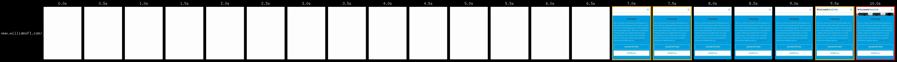  


有機會改善的地方
- 2 seconds delay to content-render caused by CSS serving issues.
- 4 second delay to main image caused by HTTP/1.1 and priorities, and additional connections.
- Layout instability caused by ``s.

### 主要問題1: Delayed CSS
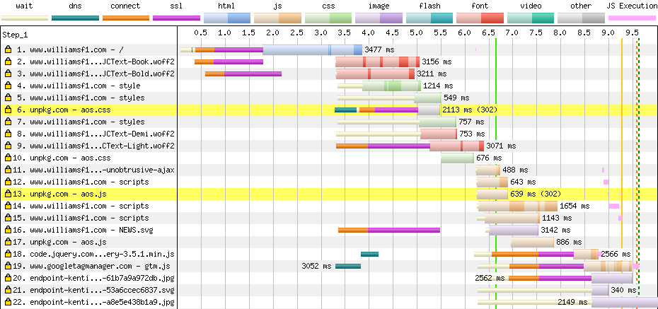  

第 6 行
- 在另一台 server 上，這個 connection 耗時間
- 另外有 server redirect 的問題
  - 直到第 10 行，才拿到真正的檔案

解法：
- 放到同台 server 紹，這可以省約 1.5s (connection) + 0.5s (redirect)
  - (on bundle into main style file)


### 主要問題2: HTTP/1.1

可以看到 1 ~ 3 行，有三條連線到「同一台」 server
- 第 9 行也是
- 這是 `HTTP/1.1` 這限制

從 DevTools 來確認
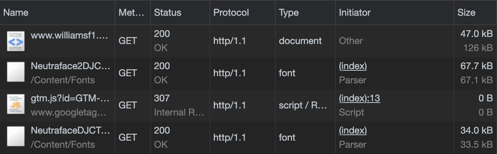  

HTTP/2 能平行處理多個 request/response
- 為了解決 HTTP/1.1 缺點，browser 跟 server 建立了多個連線

這邊，雖然不太肯定對 first-render 影響多少
- 但可能會影響其他資源的優化

### 主要問題3: `` 造成的 layout instability

<p align="center">
  <video  height="250px" muted loop  autoplay loading="lazy"  src="https://github.com/flameddd/blog/assets/22259196/13911e30-8b71-4c42-af9b-a439bc571e2d" ></video>
</p>  

(source: `assets/img/layout-e199c09c.mp4`)  

上面影片，可以看到 layout instability (layout shift)

粗略的 HTML and CSS
```html

```
```css
img {
  display: block;
  width: 100%;
}
```

這邊的問題是
1. 一開始 image 佔用 0 space，直到 browser download 到一定程度，知道了 image 的 width and height
2. 然後 browser 才開始保留出需要的空間

理想上，我們需要在 image 開始下載前，就保留這空間  
這不難

(width and height give the correct aspect ratio of the image)
```html

```

```css
img {
  display: block;
  width: 100%;
  height: auto;
}
```

這樣，browser 就會在開始 download 之前，就假設 image 為 600/315 比例來保留空間
- [調整過後的影片](https://jakearchibald.com/c/layout-fixed-380ed79d.mp4)

### 其他問題1: Delay to main image

主要的圖片，出現在第 20 行
- 它在另一台 server 上，connection delay 下載它的速度
- 這些圖片是 `` 裡面的，我們希望在 CSS 完成前拿到它

Jake 認為，當改用 `HTTP/2` 後
- 這問題影響就不大了
- 但 Jake 還是想弄清楚，為什麼這張圖這沒晚才下載

Jake 找高手幫忙研究（從事 Chrome 裡面 networking 的人），關於 image 的 priority
- image 一開始是 `'lowest priority'`
- image 位置在 viewport 中，所以被調為 `'medium priority'`
- Chrome 只會一次下載一個 `lowest priority` 的東西，並且還會排在 `medium priority` 的東西之後

所以，可能的情境是
- 直到 layout-blocking resources 載入之前，都沒辦法知道 image 在不在 viewport 中
- 上面有提到，CSS delay 的問題，所以讓這些重要的 image 還是維持 `lowest priority`
- Font preloads (第 2, 3, 8, 9 行) 為 `medium priority`，所以比這些 image 早
- `HTTP/1.1` delay 了第 9 行，因為正在等待盡力另一個 connection
  - (`HTTP/2` 就不會有這問題)
- 這些圖在另一台 server，所以當 browser 最後找到(知道)它時，又更 delay 了 (connection)


所以這是一個真正的問題大雜燴，加起來是一個很大的 delay

### 其他問題2: Large main image
一樣，主要的 image 太大了
- desktop and mobile 都用了同樣大小
- 用 responsive 來為不同 platform 選擇更適合的 image

  

大小
- Original JPEG (146 kB)
- Optimised JPEG (19.6 kB)
- WebP (11.5 kB)
- AVIF (8.5 kB)


--------------------------------

## Case5: Aston Martin
- https://www.astonmartinf1.com/en-GB/


測試影片:  
<p align="center">
  <video  height="250px" muted loop  autoplay loading="lazy"  src="https://github.com/flameddd/blog/assets/22259196/d53e3b8b-c4e2-49e5-92b9-8b2db96f536c" ></video>
</p>  

(影片來源: [assets/img/aston-f3b7081b.mp4](assets/img/aston-f3b7081b.mp4))  

載入的縮時圖(開新頁面比較容易看):    
  

首先，有一點另外提出來非常好，在 `<body>` 的底部看到這行
```html
<script nomodule src="https://polyfill.io/v3/polyfill.min.js?…"></script>
```

他們用 [Polyfill.io](https://polyfill.io/v3/) 來載入 polyfills
- `Polyfill.io` 會看 User 的 `User-Agent` 來決定提供哪些 polyfill
- 如果是 modern browser 的話，就會是 empty script
  - [點看看這邊](https://polyfill.io/v3/polyfill.js?features=Array.prototype.forEach%2CNodeList.prototype.forEach%2CArray.from%2CString.prototype.startsWith%2CObject.assign%2CArray.prototype.entries%2CObject.entries%2CObject.fromEntries%2CDocumentFragment.prototype.append%2CPromise%2CPromise.prototype.finally%2CArray.prototype.includes%2Ces6%2CEvent%2CElement.prototype.remove%2CElement.prototype.append%2Cfetch%2CCustomEvent%2CElement.prototype.matches%2CNodeList.prototype.forEach%2CAbortController%2CIntersectionObserver)
- 而且，為了**避免多餘的 request**，這邊還使用了 `nomodule`
    - `nomodule` 會要求支援 `ES2015 modules` 的 browser，**不執行**裡面的程式。這通常用來給不支援 JavaScript modules 的 old browser，提供用於向下支援的服務。

有機會改善的地方
- 3.5 second delay to content render caused by font foundry CSS.
- 1.25 second delay to content render caused by additional CSS on another server.
- Paragraph layout shift caused by late-loading fonts which could be performed earlier using some preload tags.
- 0.5 second delay to main image caused by poor image compression.

### 主要問題: Font foundry CSS
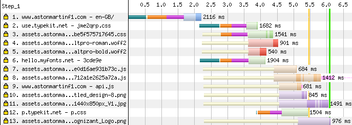  

第 2, 3, 6, 12 行都有額外的 connection  
第 3 行 CSS 是屬於這網站的，應該要拉到同台 server，避免多一條 connection  

第 12 行，這條這麼晚，是因為它是由其他 blocking resource 所發動的  
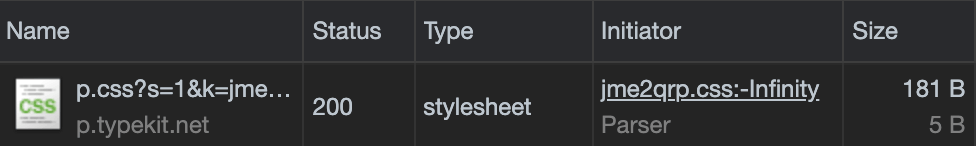  

(`-Infinity` 應該是指行數，但這邊顯示顯示錯誤。這是 chromium 的 bug，這邊可以不用理)    

這邊一樣可以用 load async 的方式改善 --> [Load cross-origin font CSS async](#Load-cross-origin-font-CSS-async)

這邊還有其他細節  
- 第 6 行 `hello.myfonts.net` CSS 跟第 3 行是同時發生  
- 第 3 行應該是比第 6 行更為重要的東西才對，但這邊卻同時開始

這是因為 developer 注意到這些資源在其他 server，而且有想辦法改善這問題  
看看 html
```html
<link rel="preconnect" href="https://p.typekit.net" crossorigin />
<link rel="preconnect" href="https://use.typekit.net" crossorigin />
<link rel="preload" href="//hello.myfonts.net/count/3cde9e" as="style" />
```

`preload` 讓 request 同時發生
- 這雖然沒有 async load 有效，但有改善問題

這邊也用了 `preconnect`
- 當不清楚重要支援的完整 URL 時，就能用 `preconnect`

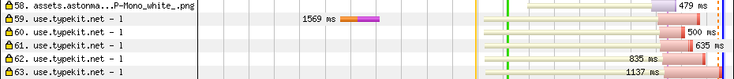  

第 59 行就是 `preconnect`，然後後面要下載資源時，就不需等待 connection  

   

上面，第 12 行發生的很晚，但我們看到 `<head />`
```html
<link rel="preconnect" href="https://p.typekit.net" crossorigin />
```

這邊有 `preconnect` 但，為什麼沒效果？因為這沒有被使用到

### Connections and credentials

當執行 `CORS requests` 時，預設是 `without credentials`
- 也就是沒有 cookies 或任何能辨識 user 的資訊的 request

如果 browser 通過與 credentialed requests 相同的 HTTP connection 發送 no-credentials requests
- 整個事情就毫無意義了
- 想像一下，如果在通話中途，你換了一個聲音，假裝是別人。對方不太可能被愚弄，因為這是同一個電話的一部分
- 因此，對於到另一個來 origin 的請 request，browser 對 `credentialed` 和 `no-credential` request 使用不同的 connections

所以，這邊可以這樣改
```html
<link rel="preconnect" href="https://p.typekit.net" crossorigin />
<link rel="preconnect" href="https://use.typekit.net" crossorigin />
```

`crossorigin` 告訴 browser，建立 `no-credential` connection
- 這是針對 CORS request 理想的做法
- 所以上面的第二個作法、`use.typekit.net` 這樣是好的


但，關於第一個 connection
```css
@import url('https://p.typekit.net/p.css?s=1…');
```

資源是在 CSS 裡面的 `@import`，這不會用 CORS 去 request resource
- 這會 credentialed request
- 上面還是會有 preconnect，但其實沒用到 （第一張圖第 9 行）

DevTools 不會顯示 extra connection
- Jake 進一步用 `chrome://net-export/` 來 debug  
- `chrome://net-export/`，有更詳細的 network 紀錄

  

第 2691 行，請求建立 `p.typekit.net` connection  
第 2695 行，socket
  - The pm (privacy-mode) code in the connection identifies this as a no-credentials connection.

上面這兩個就是 `preconnect`  

第 2872 行，request CSS resource
第 2883 行，拿到另一個 socket，這 connection 沒有 `pm code` 因為這是 `credentialed requests`
 
所以，這個 `preconnect` 反而不能加 `crossorigin`  

### 其他問題: Main image compression
Aston Martin 的 image 基本上都處理得很好，除了主要這張

  

大小
- Original JPEG (240 kB)
- Optimised JPEG (57.6 kB)
- WebP (24.6 kB)
- AVIF (13.2 kB) (上面那張的版本)

看得出來，壓縮過後圖片變的稍微 smoothing 了，但網站上，這張圖上面還有其他 text 蓋在上面  
UX 角度來看，User 對這張圖的感受一定沒有什麼差別  

--------------------  

## Case6: Ferrari
- https://www.ferrari.com/en-EN/formula1

測試影片:  
<p align="center">
  <video  height="250px" muted loop  autoplay loading="lazy"  src="https://github.com/flameddd/blog/assets/22259196/7ff40176-73d5-41e5-b1d1-5536d1d9e8ac" ></video>
</p>  

(影片來源: [assets/img/ferrari-dfd9455b.mp4](assets/img/ferrari-dfd9455b.mp4))  


載入的縮時圖(開新頁面比較容易看):   
  

有機會改善的地方
- 25 second delay to content render caused by manually-blocking JavaScript
- 3 second delay to content render caused by unused CSS.
- 5 second delay to content render caused by other blocking script
- 5 second delay to main image caused by render-blocking CSS & script. Important images should be part of the source, or preloaded.
- Additional 2 second delay to main image caused by an extra connection
- 50+ second delay to content-blocking cookie modal caused by… a number of things


### 主要問題1: Manually-blocking JavaScript
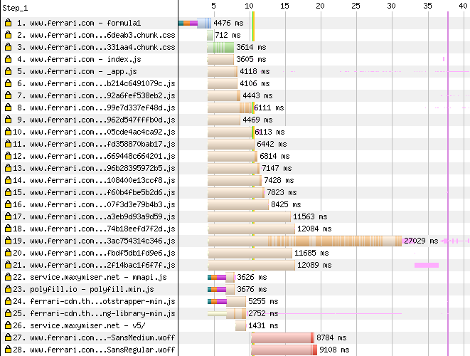  

4 ~ 26 行，全部都是 JS，這看起來怪怪的
- 但，JS 並不一定全是問題
- 第 19 行，比較讓人擔心，size 比較大

約第 11 秒時、綠色垂直線是 `first content render`
- 但，從影片上看到（or 時間縮圖看），這時候是一片黑
- 所以這一點是寫 `manually-blocking`
  - 不是被 script block 住的，而是由 developer 選擇把它蓋住，直到某些資源載入完成

他們用了 `<link rel="preload">` 嘗試改善問題
- 但 script 太大了、`gzip` 過後還有 1.2MB，解壓後為 6MB
- 對 old device 來說，parse 這些 JS 花很多時間

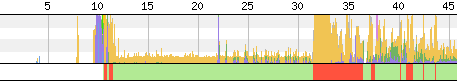  

綠色線代表 CPU 正在使用中，載入後，這大概鎖住了 main thread 5 秒  
- coverage 上來看，有 75% 都沒用到

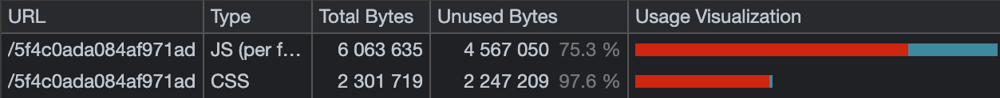  

這邊沒有輕鬆的解法
- 大概必須要把 script 拆小。理想狀況就是每段 function 有獨立的入口
- 讓每頁在需要的時候才載入所需要的 script

### 主要問題2: Render-blocking JavaScript

22 ~ 25 行為  render-blocking scripts，都是在 `<head>` 裡面的
- 而且都在不同的 server 上

22, 24, and 25 行看起來都是某種 trackers
- 這種，應該要使用 `defer` or `async`，別讓它們 block render

23 行是 polyfill，應該也要使用 `defer`，但，因為 browser 已經支援了，這邊只會拿到 empty script
- 應該利用 `nomodule`，來避免‘沒意義的 request


### 主要問題3: Unused render-blocking CSS

第三行的 CSS 看起來很大
- 200kb、unzip 後約 2.1MB (跟 JS 相比，CSS 比較沒這麼負擔，但還是需 CPU 去處理)

第 10 秒的時候，大約 delay 了 1s  
97% 的 CSS 幾乎沒用到  

  
  

這邊也沒有 quick fix
- CSS 需要拆分，把最一開始所需要的 CSS 拿出來用
- 可以考慮把最初所需要的 CSS inline，雖然會辦法 cache，但不大的話，說不定在這個 case 是輕鬆的解法

### 其他問題: Image optimisation
就 image compress 來說，目前為止 Ferrari 是做得最好的  

主要的 image  
  

大小
- Original JPEG (34.2 kB)
- AVIF (7.52 kB)

AVIF 沒有省非常多
- 圖片在文字後面，所以這張圖片品質變稍稍為差一點，UX 影響不大

其他圖片  
  

大小
- Original JPEG (127 kB)
- Optimised JPEG (82.2 kB)
- WebP (51.4 kB)
- AVIF (34.8 kB)

Ferrari 網站上的很多圖都沒有針對 2x screen 進行優化
- 這對上一張圖片沒有那麼重要，因為它在文字後面
- 但上面的一張可以做一些清晰度。上面的原圖是 480px width，但優化後的版本是 720px（取自其他的來源），所以在這種情況下優化後的 resolution 也更高

-------------------  

## Case7: Haas
- https://www.haasf1team.com/

測試影片:  
<p align="center">
  <video  height="250px" muted loop  autoplay loading="lazy"  src="https://github.com/flameddd/blog/assets/22259196/c338b6ae-b2eb-491e-bb1d-e17fa38b94e3" ></video>
</p>  

(影片來源: [haas-3695ed59.mp4](assets/img/haas-3695ed59.mp4))  


載入的縮時圖(開新頁面比較容易看):  
  

有機會的改善
- 5+ second delay to content render caused by a CSS font tracker.
- 3 second delay to content render caused by CSS on other servers, plus a redirect.
- 3 second delay to content render caused by blocking JS on another server.
- 10+ second delay to main image caused by JavaScript.
- 10+ seconds of layout instability caused by JavaScript.

### 多個小檔案 vs 一個整包的大檔案
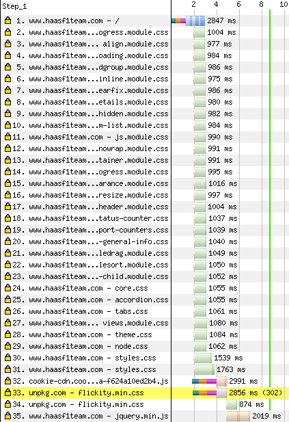  

這邊有很多 CSS
- 這是問題嗎？因為 `HTTP/2` 能 parallel request，所以沒問關係

但如果跟「單一一個 CSS」相比呢
- `gzip` 和 `brotli` 都很依賴 back-references，例如，「接下來的 50 bytes 都跟前面一樣」
  - 因此，「多個小的壓縮資源」成效，會低於「一個壓縮的資源」
- 另外，每一個 request 都帶有基本的 request/response header，雖然，HTTP/2 可以使用 HPACK header compression 將這些反向引用到同一 connection 中的其他 request/response

Here's the size difference, including brotli compression and headers:
- 32 CSS resources: 48.2 kB
- 1 combined CSS resource: 37.7 kB

雖然這邊有著 `28%` size 差距，但也只有 `10.5 kB`  
還有沒有其他跟 size 無關的東西造成 delay ?  

Jake 自己弄幾個版本出來，調整成除了 CSS 以外，沒有其他 render block 的東西，分別這三版
- One with 32 CSS resources
- One with one combined CSS resource
- One with the CSS inlined as a `<style>` in the `<head>`

分別用 `WebPageTest` 測試 9 次來看看 first-render  
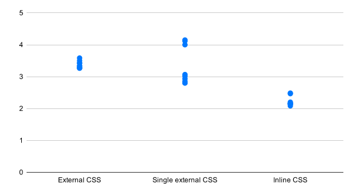  

結合成一個檔案大約省 0.5s。另外這裡有些 4s 的 case，是因為 
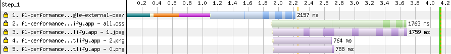  

主要的 image 搶先在 CSS 前，搶走了 CSS 的頻寬
- optimising image 可以改善的問題
- 如果使用 inline CSS，就不會有這問題
  - 但，inline 的話，就要確保是這個頁面所需的，不要 inline 不需要的資源進來

### 主要問題: Layout shifts as interactivity lands (當可以互動時，發生了 layout shifts)

整頁載入完畢後，有一個 carousel 在上面(縮時圖)
- 9 ~ 14 秒時，能看到整頁的 links
  - 這是一個合理的 `no-JavaScript` UX
  - 但，這不是一個好的 `before-JavaScript` UX
  
有些人，可能
- disabled JavaScript
- 網路問題，所以 JS 沒能載入
- JS 執行有錯誤，所以沒執行成功

所以有可能有所謂的 `"No-JavaScript"` 的 User  

可能你會認為，你們沒有太多這樣的 User
- 如果有充分的證據，這樣思考很合理的
- 或者使用在 Aston Martin 上看到的 `nomodule` 技巧

我們需要針對這些情況下，在考慮實際 User 的情況下設計
- 如果可以為兩者使用相同的設計，會容易很多

Haas 的 carousel，有合理的 no-JavaScript experience
- 在沒有 JS 下，carousel 提供了所有 item 的 連結
- 但它是 before-JavaScript experience，因為當 rearranges 時，有 content jumps
  - 15 秒和 22 秒時

### Progressively-enhancing 的 carousel
常見的 carousel 是靠 JS 支援的  
現在有 [CSS scroll snap](https://caniuse.com/?search=scroll%20snap)  
- 能 without JavaScript 實現 carousel-like experience
- 另外可以 scroll bar 給 hide 掉
  - 這做為 `before-JS` 的 UX 還不錯 experience
  - `no-JS` 的 UX 就不好，因為這會讓 User 無法移去 carousel 的其他 item
  - 如果有這樣問題，要區別出 `no-JS` 的 User 來另外處理


`before-JS` 的 render 也會包含 image
- 這代表 browser 能夠跟 JS 一起平行下載這些 image
- 目前 Haas 這主要圖片在 carousel 中，這會 delay donwload
  - 因為 browser 直到 JS 載入後，才知道這些 image 的存在
- 另外，如果將 carousel 主要的 content 放到 HTML 中，那就比較少會有 layout shift 的問題

`before-JS` 階段
- 不應包含 carousel 的  back & forward buttons，因為不起作用
  - 這是很多框架會出錯的地方。他們鼓勵 before-JS render 與 enhanced version 相同
  - 但不能用的 btn 是 bad UX

最後
- JS 出現後，加上了 scrollTo 的後退和前進按鈕
- 加這些按鈕時不應該影響其他東西的 layout，它們應該只是出現

### 其他問題: Image optimisation
頁面上主要的這張 image  
  

大小
- Original JPEG (82.9 kB)
- Optimised JPEG (18.5 kB)
- WebP (13.2 kB)
- AVIF (8.12 kB)

原圖是 1440 pixels，對 mobile，這邊 resize 到 720 已經很夠了


------------------------

## Case8: McLaren
- https://www.mclaren.com/racing/

測試影片:  
<p align="center">
  <video  height="250px" muted loop  autoplay loading="lazy"  src="https://github.com/flameddd/blog/assets/22259196/4afe3243-7af9-4ba0-b52a-927e62c85665" ></video>
</p>  

(影片來源: [assets/img/mclaren-3743ce5b.mp4](assets/img/mclaren-3743ce5b.mp4))  


載入的縮時圖(開新頁面比較容易看):  
  

有機會的改善
- 14 second delay to first render caused by font CSS. This is kinda different to other sites I've looked at in this series
- 2 second delay to first render caused by a CSS on a different server
- Additional 2 second delay to first render caused by large CSS, only 6% of which is used
- 20+ second delay to content render caused by a number of JavaScript loading issues
- 20+ second delay to main image caused by bad image priorities and poor optimisation
- Large delay to small icons due to a sprite sheet

### 主要問題1: Font CSS loading
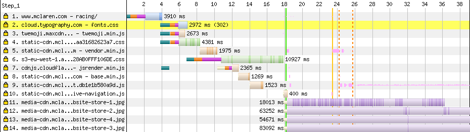  

第 2 行，因為是在別的 server，這是 blocking request  
- 而且它還 redirect 到另一台 server (第 6 行)，這邊又浪費另一次 build connection  
- 能有 `<link rel="preconnect">` 提早連線
  
  
第 6 行還有其他問題
- 檔案為 `140kB`，而且全部是 `base64-encoded` 的 font 資料
- base64 會讓檔案更大
- 更糟的是，這邊用 `HTTP/1.1`，而且 uncompressed
- 雖然 `WOFF2` 的 Brotli 壓縮效果不好，但 base64 的 Brotli 壓縮效果不錯
  - 它是一個有限的字元集。 Brotli 可以將 response 減少近 30%  
  

但這並不是主要問題。有幾種不同 load web font 的模式  

`swap`: 當 web font 載入後，立可替換文字
- 不會 blocking text
- 不會 blocking 其他 content
- (bad) 當 swap 的時候，會有 `layout shift`，雖然這可以靠 [CSS font loading API](https://developer.mozilla.org/en-US/docs/Web/API/CSS_Font_Loading_API) 做某種程度的調整來減少 shift 問題
  - https://meowni.ca/font-style-matcher/

`block`: 所有 text 會隱藏住，直到 web font 載入，或者超過 3 秒會 timeout，如果超過 3 秒，會像 `swap` 一樣行為
- 不會 blocking 其他 content
- (bad) Potentially key text is delayed
- (bad) font 載入時也會有 `layout shift`，跟上面一樣，可以想辦法減少 shift 程度

`optional`: 當 font 有 cached 了，或者 font 載入「非常」快，就會使用它，不然會直接使用後備 font
- 不會 blocking text
- 不會 blocking 其他 content
- (bad) ㄧ些 browser 會有 layout shift 的狀況
- (bad) 沒有顯示出 font 時，designer or branding people 當然就會覺得差、不開心

`fallback`: 類似 `optional`，但 font load and swap 的時間稍稍為久一點
- 不會 blocking text
- 不會 blocking 其他 content
- (bad) ㄧ些 browser 會有 layout shift 的狀況
- (bad) 沒有顯示出 font 時，designer or branding people 當然就會覺得差、不開心

上面這些都是 `font-display` 的選項，但也都能靠 CSS font loading API 來實現  
另外一種方法，就是像 McLaren 這邊這種 inline base64 font
- 沒有 `layout shift` !!
- (bad) Block text 直到 font 下載完成。更進一步的是
- (bad) 下載時，其實是把「所有」東西都 block 住了（再看一次上面的圖）

font load 策略中，沒有完美的選擇，只有找出一個影響較少的方案
- 這邊的問題，並不是因為採用了 base64 而已，compress, serve and size 都是影響
  - 像 base64 這邊，就沒有 `layout shift`

[Squoosh (Jake 所在的 google team 開發的專案)](https://squoosh.app/) 就有用到 base64
- 但，它抽出 app 所需要的字體來用，而不是整包放進去，這樣就小很多
- (最上面 top10 的第 8 點有 code)

[Google fonts](https://fonts.google.com/) 有一個 `text` 參數，可以針對想要的字產生 subset
- `https://fonts.googleapis.com/css2?family=Patrick+Hand&text=hello` 
- 上面這就是 `Patrick Hand` 自行、字指包含為 `hello`、`WOFF2`，這樣整個才 1kB

McLaren，就沒有 subset、base64
- 而且因為 css 是 resources block rendering，所以導致 first render 被 block 14 秒
- 這個狀況下，`swap` 是可理想的選擇
- `layout shift` 嚴重的話，就用 CSS font loading API 來減輕狀況
- 如果字體無法 subset 的話，就用 async load 的方式，避免 render-blocking


### 主要問題2: JavaScript delay
縮時圖，雖然第 19 秒的時候開始 render
- 但主要的 content 是第 26 秒，被 JS 載入的

  

第 3 行是在 `<head>` 裡的 JS
- JS 是 parser-blocking script  
- 在另一台 server 上

第 5, 7, 8, 9 行 JS
- 這些也是 parser-blocking scripts
- 但它們在 `<body>` 底部，所以不會 block content

第 6 行 CSS 就 block 了 content  

這些資源一個個下載，而不是同時，這是 priority 問題
- chrome 知道，第 6 行的 CSS 正在 blocking，所以避免同時下載太多其他資源

不過，這些 JS 也是在 CSS 這附近時開始下載的，為什麼花這麼久，才在畫面上顯示內容呢？  
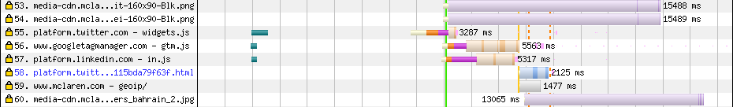  

第 55 ~ 57 行，也是在 `<body>` 的 parser blocking scripts  
不過，他們用這了樣的方法  

```js
addEventListener('DOMContentLoaded', () => {
  // …Add the main content to the page…
});
```

McLaren 的 script 等待 `DOMContentLoaded` 才去做事情
- 因為 55 ~ 57 行的 script 是 parser blocking scripts，會拖慢 `DOMContentLoaded`

這邊 McLaren 不應該等待 `DOMContentLoaded`  

第 59 行看起來像 XHR/fetch
- 它也應該會 delay 頁面上出現的內容
- 但 Jake 沒看到哪邊有被 delay，所以沒有深入研究

最好的方案還是把內容放到 HTML 中
- 避免透過 JS 來 render 主要的 content

### 主要問題3: Image priorities and optimisation


縮時圖一直到 39 秒時，主要的 image 才出來  
- waterfall 到第 11 行下載了第一張圖
  - 這圖可以在小一點

  

大小
- Original JPEG (1.21 MB)
- Optimised JPEG (6.58 kB)
- AVIF (2.88 kB)

而且這張根本是不主要的圖片，這張圖在哪個位置？  
<p align="center">
  <video  height="250px" muted loop  autoplay loading="lazy"  src="https://github.com/flameddd/blog/assets/22259196/3061908f-f5c7-4dd9-851a-f21395e339ec" ></video>
</p>  

(source: [assets/img/image-b969b0ba.mp4](assets/img/image-b969b0ba.mp4))  


這些圖在 menu 裡面
- mobile device 還沒辦法看到它們(需要 hover)
- 每張都 500kb ~ 2MB ...


`` 會立刻觸發下載 image
- image 不會等待 layout，除非有 `loading="lazy"`

這些圖是 source 中第一個 image，所以它排很前面
- browser 當發現 image 在 viweport 當中，會調高優先級
- 但是 layout 有所改變時，這個判斷就變得比較困難

一旦 CSS font 問題解決，而且這些 image 優化後，這問題可能就不大
- 但如果他們還是這麼優先被下載，就會因此搶用其他更重要資源的頻寬
  - 這時候可以考慮 `loading="lazy"`
- 另一種做法是，針對這些 image，等 menu 被打開時，我們才加進去

而真正 main image 被排在很後面
- 因為它們是用 JS 來加入這些圖片，所以 browser 直到 24 秒才知道這些圖片
- 放到 HTML 來改善這問題


### 其他問題: Sprite sheets are bad now
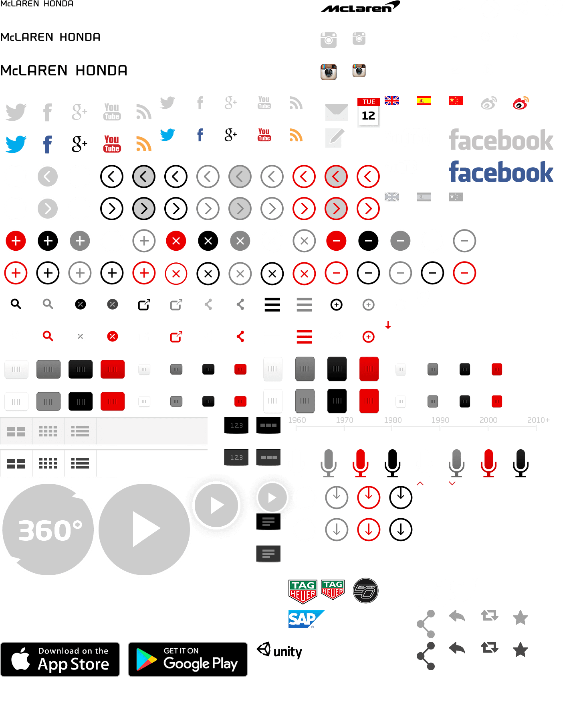  

大小
- Original PNG (292 kB)
- Optimised PNG (96.7 kB)
- Lossless WebP (80.4 kB) (<-- 上面那張圖的)

以前，因為 `HTTP/1.1` 有 parallel request limit，所以用 sprite 把多張圖綁成一張來改善這問題  
現在 `HTTP/2` 比較沒有這問題  
- 類似 `Case7: Haas`，多個 request 的 cost 已經不大了
- 把圖各自拆開，我們也只需要下載所需要的 image 就好，而不是整張
  - 這裡用到的這些 icon，每張通常不到 300 bytes


-------------------------

## Case9: Google I/O event pages
- https://events.google.com/io/session/fa14e5ee-a3e2-408c-b0fc-6a8f427411d5?lng=en

測試影片:  
<p align="center">
  <video  height="250px" muted loop  autoplay loading="lazy"  src="https://github.com/flameddd/blog/assets/22259196/b693a0dc-7278-4acb-bce3-d7cc467354cb" ></video>
</p>  

(影片來源: [assets/img/loading-c284be74.mp4](assets/img/loading-c284be74.mp4))  


載入的縮時圖(開新頁面比較容易看)  
  

9 秒左右開始有 spinner，到 26.3 秒才開始有內容  

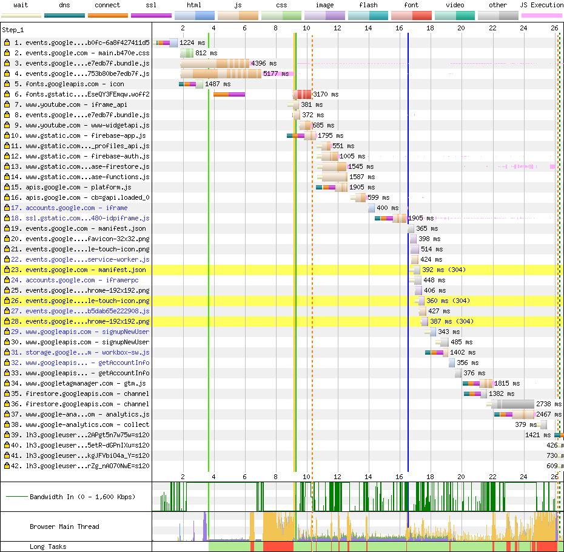  

Jake 說他沒參與這網站製作，所以也跟其他網站，是用同樣這些工具來研究  

page source 很空，所以問題無關是不是 render block resource  
主要都是由 JS 來呈現 content  

第 3, 4 行是主要的 JS
- 大約有 750km
- 考慮到這頁面主旨，這算蠻大的
- unzip 後有 3.2MB

第 7 ~ 9 秒這邊粉紅色細長條，這是代表 JS execution
- 這段時間 browser 的 main thread 會被佔用、browser 會被鎖定幾秒

DevTools
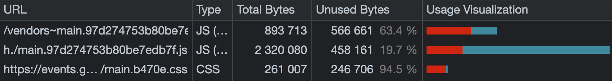  

這邊顯示超果 2MB JS 有被使用，但是！這並不代表這些是必要的
- 這網站一開始只是要顯示一些標題、內容和段落，只是簡單的 render，是不需要 2MB 的
- 所以這反而是另一種訊號，有很多 JS 被執行了（but why?)

查看了 source 後，大約有一半好像是 [Bodymovin](https://github.com/airbnb/lottie-web) 的指令
- Bodymovin 是 Adobe After Effects export 出來的 JSON
- 初始畫面沒有任何的 animation，所以這些執行都是浪費。不應該一開始就執行

source 中另外有很多不同語言的 text，這也是浪費
- 應該要針對 User 的語系作為 HTTP header，來只提供特定的語系就好
- 像 [Netlify](https://docs.netlify.com/routing/redirects/redirect-options/#redirect-by-country-or-language) static server 也提供這樣功能，所以即使是 static site 也能做到

上面這些應該能透過 code splite 做到改善  

最主要的問題還是是用 JS 來初始呈現內容
- 呈現 title description 這些用不到 JS


JS 下載後，接著馬上下載 `Firebase` 的 JS (第 10 行)
- 這些在另一台 server，所以又有 connection cost
  - `<link rel="preload">` 能稍微改善問題 

Firebase JS 又去載入更多 Firebase JS（11 ~ 15 行）
- 這種串連而不是並行，能 `<link rel="preload">` 稍微改善

第 15 行的 JS 似乎用來 get login info
- 它在另一台服務器上，又有 connection cost
- 繼續在第 16 行 request 更多 JavaScript
- 第 17 行載入一個 iframe
- 在第 18 行載入一個 script（another server）

所以，從第 2 秒，到第 16 秒都在載 script


第 29, 30, 32, 33 行是更多的 login info 相關的 request
- 而且還是連續呼叫

到第 20 秒了，才開始要取資料，第 35 行向 firestore request
- 另一台 server ...，這邊用 `<link rel="preconnect">` 甚至 `<link rel="preload">` 可能可以改善

第 36 行。是個 3MB 的 JSON
- 其中包含有關 Google I/O 上每個 session 和 speaker 的 info
- Parsing and querying 這會嚴重影響 main thread，device 會鎖住幾秒

更糟糕的是
- 這資源不能 cache
- 進入該站，所有 navigations 都是 SPA，未來每次來，都需要再下載和處理該 3MB JSON
- 即使您只是想獲得一次會話的時間。不幸的是，由於要查詢的數據量很大，即使是 SPA 導航在高端 MacBook 上也很遲鈍。
 
網站應該首先專注提供 first interaction
- 這邊的 case，就是要先提供 title, time, and description of the session
  - 這只需要 HTML and CSS，不需要 JS，更不需以幾 MB JSON
  


此外，`I/O` 利用了 login 功能，讓 User 能夠 mark 自己有興趣的東西
- 但是 auth 會因一長串 HTTP request 而嚴重損害 perf
  - Jake 沒有 Firebase Auth 的經驗，所以不知道這裡有沒有正確使用
  - Jake 指出，他知道當構建 Big Web Quiz 時，能夠在單個 request 中取 auth info
    - 但 Big Web Quiz 有自己的 server，因此 `I/O` 可能沒法做這點
- 應該要先呈現未登入的狀態，然後在背景準備好 login 的資訊，等到一切好了之後，才找時間點更新畫面


第 6 行是 sprite sheets，也是不好  
- 這邊，只有看到使用 hamburger icon 而已，下載了 50kb，只用 125bytes
