# 2022-04-19：Josh: The Rules of Margin Collapse
## June 9th, 2021
### https://www.joshwcomeau.com/css/rules-of-margin-collapse/


CSS 中，有時相鄰的 `margin` 會 overlay，這稱為 `margin collapse`  

```html
<style>
  p {
    margin-top: 24px;
    margin-bottom: 24px;
  }
</style>
<p>Paragraph One</p>
<p>Paragraph Two</p>
```
|||
| -| - |
| 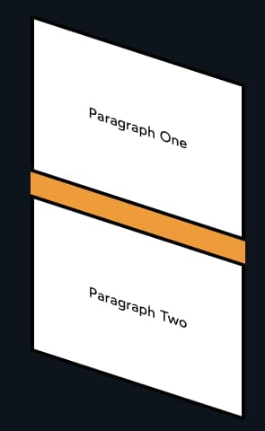 | 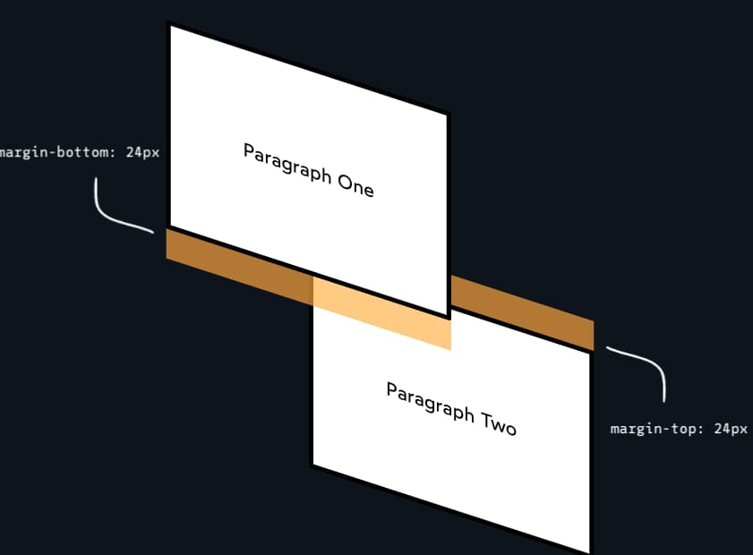 |

上面圖片，中間距離是 `24px`，而不是 `48px`，兩個空間合併在一起了  

這篇文章來解釋這個機制  

## 只有垂直的 margin 會 collapse

當 CSS spec 加入 `margin collapse` 時，做出了一個奇怪的選則
- 水平的 margin 不應該 collapse

在早期，CSS 不打算用於 layout
- 編寫 spec 的人想像的是標題和段落，而不是列和側邊欄

所以這是第一條規則：
- 只有垂直的 margin 會 collapse

這是一個可實時編輯的示例。如果您使用的是桌面瀏覽器，請打開開發人員工具並自己檢查邊距：

|||
| -| - |
| 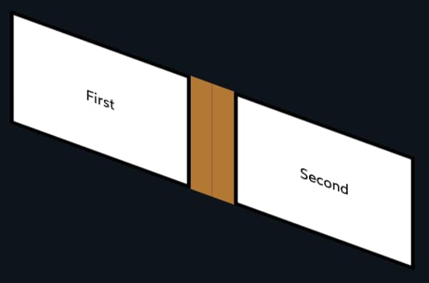 | 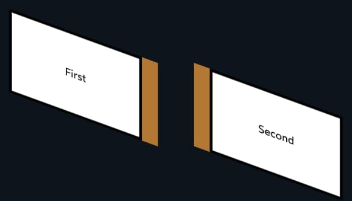 |

例外
- CSS 能讓人切換書寫模式 `writing-mode: vertical-lr;`
  - 這時候 element 就是水平 stack，而不是常見的垂直 stack
- 在這種情況下，collapse 就只會發生在水平上，而不是垂直的

所以，更嚴謹說法是
- block-direction margins collapse

### 只有相鄰的 elements 會 collapse

使用 `<br />` 來增加元素間的空間是很常見的做法  

```html
<style>
  p {
    margin-top: 32px;
    margin-bottom: 32px;
  }
</style>
<p>Paragraph One</p>
<br />
<p>Paragraph Two</p>
```
|||
| -| - |
| 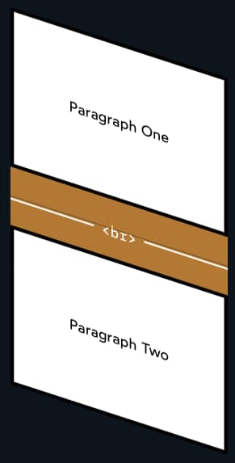 | 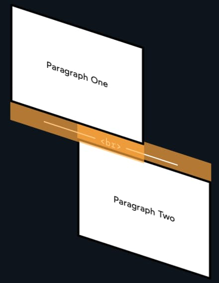 |

兩個 element 中間如果有任何 element，及使是看不見、不占空間的，都會阻止 `margins collapse`
- 只有 element 為相鄰的時候，才會 `margins collapse`

### 更大的 margin 一方為主

如果一邊的 margin 是 `72px`，另一邊是 `24px` 會怎麼樣？
- 數字大的為主

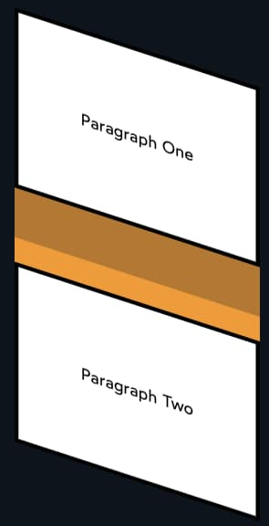  

### Nesting 也不能避免 collapsing

這邊開始，就是詭異的地方了

```html
<style>
  p {
    margin-top: 48px;
    margin-bottom: 48px;
  }
</style>
<div>
  <p>Paragraph One</p>
</div>
<p>Paragraph Two</p>
```

這次，第一個 `<p />` 包了一個 `<div />`，但還是有 `margins collapse`  

|||
| -| - |
| 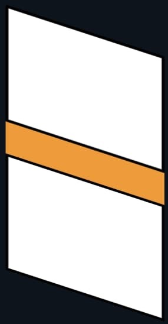 | 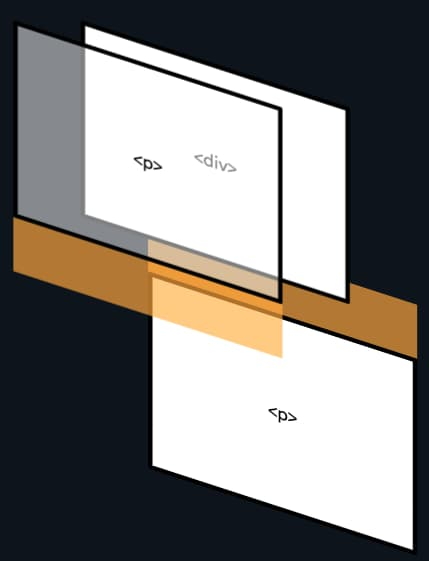 |

`maring` 是為了在相鄰 element 之間增加距離用的
- 不是用來增加 child 跟 parnet's bounding box 之間距離的（這是 `padding` 的工作)
- `maring` 永遠會嘗試增加 siblings 之間的距離，即使將 margin 轉移到 parent element


為了保證 `margin` 轉到 parent（並 collapsed），必須滿足一些條件：
- 中間沒有其他 element（像前面的 `<br>`）
- parent element 沒有 `height` set
- parent element 沒有任何 `padding` or `border` along the relevant edge

最後一種情況很常見
- 可以把 `padding/border` 視為牆壁，如果在兩個 `margin` 之間，就沒辦法 collapse

|||
| -| - |
| 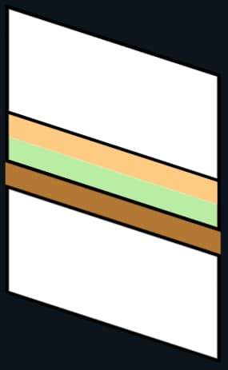 | 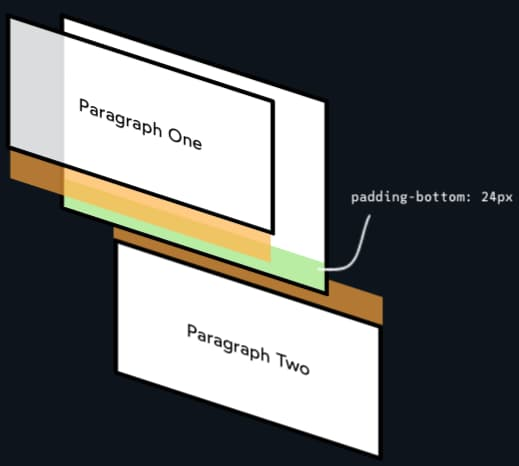 |  

### Margins 的 collapse 能夠都是同一方向

上面的例子，都是 `margin` 在相鄰的位置，但令人驚訝的是
- 在相同的方向上，`margins` 也會 collapse

```html
<style>
  .parent {
    margin-top: 72px;
  }
  .child {
    margin-top: 24px;
  }
</style>
<div class="parent">
  <p class="child">Paragraph One</p>
</div>
```

|||
| -| - |
| 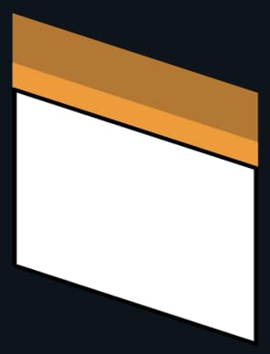 | 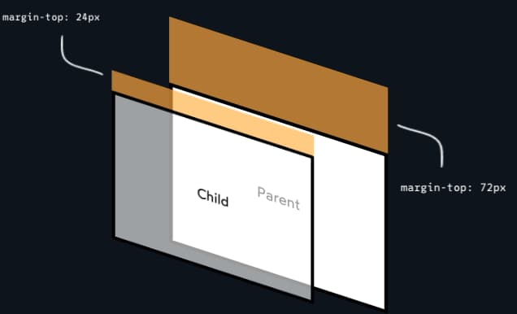 |  

可以把這個視為前一個 case 的延伸
- child maring 被 parent maing 吸收了 (這個 case，另外符合「margin 大的為主」)

這個狀況常令人頭痛

```html
<section class="blue">
  <p>Paragraph One</p>
</section>
<section class="pink">
  <p>Paragraph Two</p>
</section>
```

```css
.blue {
  background-color: lightblue;
}
.pink {
  background-color: lightpink;
}
p {
  margin-top: 32px;
}
```

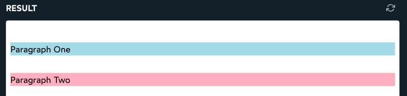  


上面的 case，大家可能會以為 `margin` 會被 collapse、兩個 element 會相鄰在一起  
- 問題是 `0px margin` 也是種 `collapsible margin`
- 每一個 `<section />` 有 `0px top margin`，所以就 parent and child `margin collapse`  
- (再加上 `margin` 大的為主)

這個 case 加上上一個 case 常常讓人頭痛，如果想要 disable 這行為的話
- `display: flow-root;`
  - (IE 不支援)
- `flow-root` 類似於 `display:block`，但它建立了一個新的 [Block Formatting Context](https://developer.mozilla.org/en-US/docs/Web/Guide/CSS/Block_formatting_context)  

一個標準 HTML，沒有加入任何 CSS 時
- 這時候，只會有一個 BFC (Block Formatting Context)，而存在於 `<html />` tag
- 可以把 BFC 視為遵循 `display: flow;` layout 規則的一組元素。
- 當新建 BFC 時，就像在 document 裡面嵌入一個 document。這 document 的邊界是堅固的強，沒有 `margin` 可以穿過它

`display: flow-root` 通常用於 `floats`
- 因為 `floats` element 也不能穿過這邊界
- 我們可以用它來防止 margins collapsing

```css
.parent {
  display: flow-root;
  margin: 24px;
}
.child {
  margin: 24px;
}
```

### 兩個以上的 margins 也能 collapse

看看這個 csae

|||
| -| - |
| 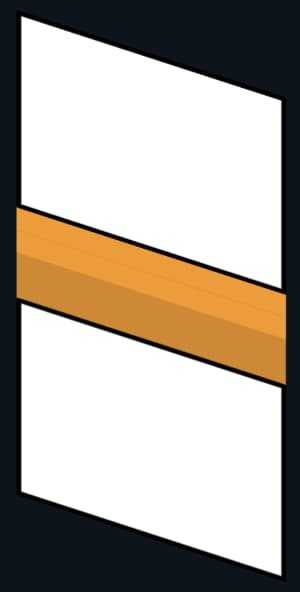 | 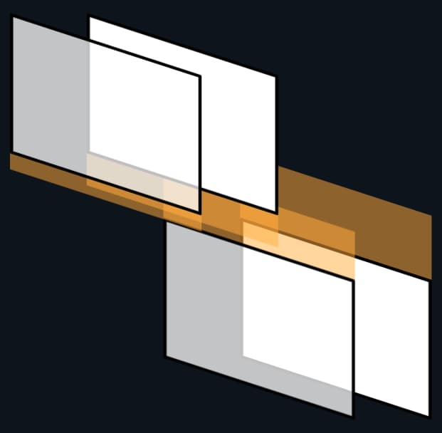 |  

相鄰的 element 能夠 combine margins
- 第一個 element 有 `margin-bottom`，第二個有 `margin-top`
- parent and child 有同方向的 combine margin
- 

```html
<header>
  <h1>My Project</h1>
</header>
<section>
  <p>Hello World</p>
</section>
```
```css
header {
  margin-bottom: 10px;
}
header h1 {
  margin-bottom: 20px;
}

section {
  margin-top: 30px;
}
section p {
  margin-top: 40px;
}
```

有分別 4 個 `margin` 在競爭  
- `header` 和 `h1` 都有 `margin-bottom`，它們先 collapse 到 parent 去
- `section` 和 `p` 一樣 collapse 到 parent
- 然後 margin 大的為主，最終是 `40px` 將 `header` and `section` 隔開

### 負的 margins

負的 margins
- 能減少兩個 element 之間的 space，甚至能 overlay
- 能把 child 拉出 parent 的 bound box 之外

|||
| -| - |
| 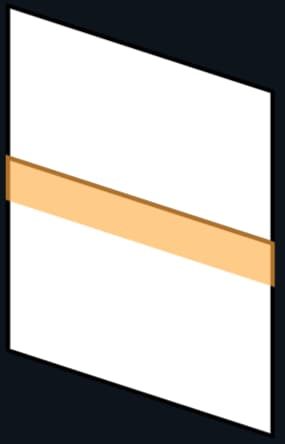 | 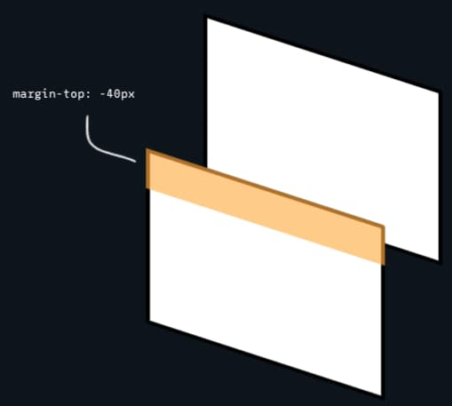 |  

那「負的 margin」會如何 collapse ?
- 跟 positive 很相似，負的會共享同一個空間
- 「負最大」的為主
  - `-75px` 跟 `-25px`，會由 `-75px` 為主

|||
| -| - |
| 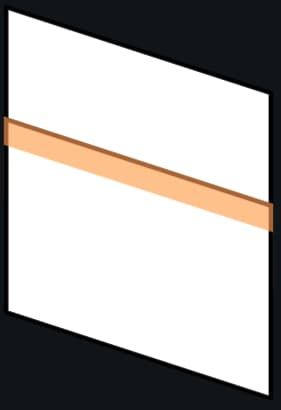 | 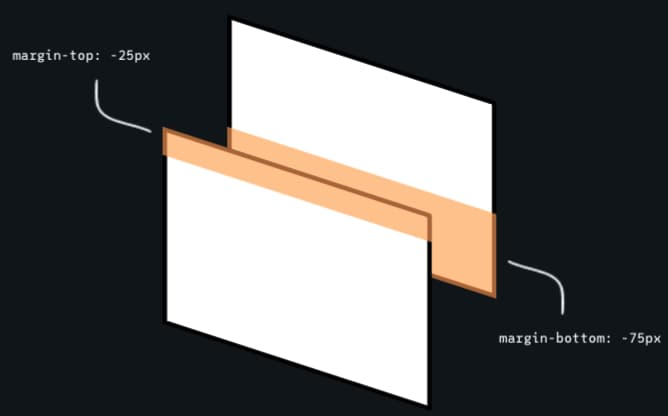 |  

當 negative and positive margins 一起時
- 數字會相加
- `-25px` 跟 `25px` 會變成 `0`


|||
| -| - |
|  | 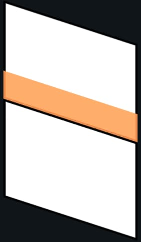 |  

上面這種應用很少會用到，例如
- 有時候，我們沒辦法控制其中一邊的 margin
  - (有可能是 legacy or 事先設計好成為一組的 component)
- 這時候，就能用這種方式，來移除 margin
  - 最好的做法還是拿掉不需的 margin，但某些情況、情境下，這招還是有用處
  
### 多個 positive and negative margins

OK，最麻煩的 case，如果是多個、而且有正有負 margin 時呢？
1. 找出最大的正 margin
2. 找出最負的負 margin
3. 相加上面兩者

```html
<header>
  <h1>My Project</h1>
</header>
<section>
  <p>Hello World</p>
</section>
```

```css
header {
  margin-bottom: -20px;
}
header h1 {
  margin-bottom: 10px;
}

section {
  margin-top: -10px;
}
section p {
  margin-top: 30px;
}
```

   

這例子
- 最大正 margin `30px`
- 最負 margin `-20px`
- 最後結果 `10px`

### Flow layout only
目前為止的例子，都是假設在 `in-flow` 之中，而沒有討論到 `Grid` and `Flexbox`  

當 `Grid` or `Flexbox` or `out-of-flow` (eg. `floats`, `absolute` positioning) 時
- 永遠不會有 `margins collapse` (有需要 space 的話，用 `gap`)
