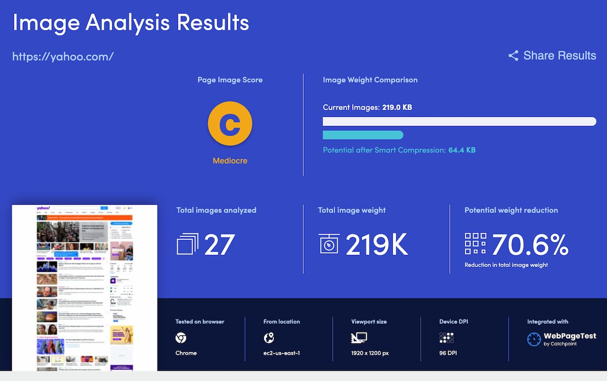

# 2023-03-14：4 個 WebPageTest 技巧
## Ref: https://www.youtube.com/playlist?list=PLf7Af0gctXvTs7CDKRu6kv4VYNo5ZVK4N

------------

[WebPageTest](https://www.webpagetest.org/) 是個測試 website performance 的網路服務，如果你是有點資歷的 web developer，應該多多少少在網路上看過別人用這個服務來分析 perf。

下面介紹一些技巧，來做更多情境測試，**尤其是第一招！至少看完第一招才關掉這篇分享**。  
(`WebPageTest` 是個非常強大的測試工具，這邊介紹的都是基本操作，但已經很好用了)    

|||
| :------: | :------: |
|  |  |

------------

## 1. 同時比較 2 or 多個網站，並產生載入時的影片比較

如果你常看網路上的 web performance 相關分享，下面這種比較影篇你應該多少有看過。  

  

這個比較 website loading 的影片就是靠 `webpagetest` 產生的  

方法
1. Open [https://www.webpagetest.org](https://www.webpagetest.org)
2. 下拉選單選 `Visual Comparison`
3. 輸入測試網址，並且每個網址給一個 label (後面產生報告時，會標注這些 label)  
    - (有需要的話，點 `Add URL` 來多增加目標)
4. 點 `Start Test` 來開始測試

  

產生出來的報告就會同時包含所有網址  

  

輸出影片的方法
1. 點開右上方 `Adjust Filmstrip Settings` 選單
2. 選單下到最下面（其他上面的選項基本不用動）
    - (有時候我會調整 `Comparison Endpoint`，但看你的目的。如果只是測試 init load 的話，選項都不用)
3. 點選 `View Video`
    - 如果網站非常快速就載入(2 秒內)，可以考慮把 `Slow Motion` 勾起來，視覺上比較看得出差異

|||
| :------: | :------: |
|  |  |

影片就產生出來了。上面有註明前面所輸入的 `label`，下面可以下載 `mp4` or `gif` file  

  

上面範例匯出來的結果 (可以播放體驗看看 `Slow Motion` 的速度):  

  <video width="80%" muted loop controls loading="lazy"  src="./assets/img/webpagetest_08.mp4" ></video>

  

------------------------

## 2. 針對不同國家、裝置、browser 來測試 perf  

方法
1. 輸入目標網址
2. `Simple Configuration` 這區有些標準的設定組合可以選
3. `Advanced Configuration` 這邊就非常細部的選項，包含國家、裝置、Browser 等等
4. 選完後就 `Start Test`

  
  

------------------------

## 3. 模擬 `Single Point Of Failure`  

模擬某個 3rd 資源 fetch failed 情境  
方法
1. 輸入目標網址
2. `Advanced Configuration` 選擇 `SPOF`
3. 把 3rd 資源的 domain 輸入進去
4. `Start Test`

  

測試會測試 `沒有 SPOF` vs `有 SPOF` 的情況  

看看下圖，最下面的結果，可以看到關鍵資源 `有 SPOF` 時，Github 首頁都無法順利載入  

  

------------------------

## 4. 分析 image，看看有沒有優化空間  

Content 相關的 web app 最常見的內容可能就是一大堆圖片
- `WebPageTest` 可以分析這些圖片，告訴你還有沒有 compress 的空間
- 針對測試的 device 來說，image size 能不能再縮小一點來減少空間

一眼就能讓你看出來哪些 asset 你可以多研究看看有沒有優化空間  

方法
1. 產生報告之後
2. 展開左邊中間的 `Performance Summary`
3. 向下滑，點選 `Image Analysis`  

|||
| :------: | :------: |
|  |  |

這會另開網頁，然後稍微等一下下就會看到報告。往下滑有每張圖片的分析  

  

首先會先列出來最有改善空間的圖片，左下角 `SEE DETAILS` 有更多細節與操作（讓你看看不同 image foramt 的結果）  

  

  

其他所有圖片都有列在下面  

  

