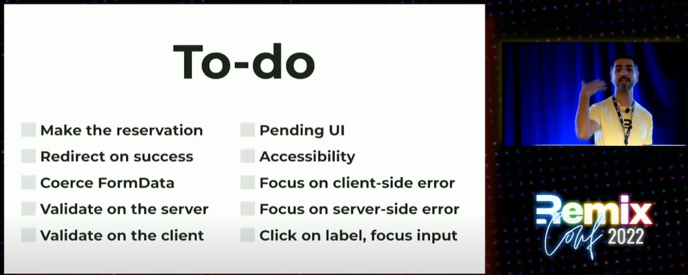
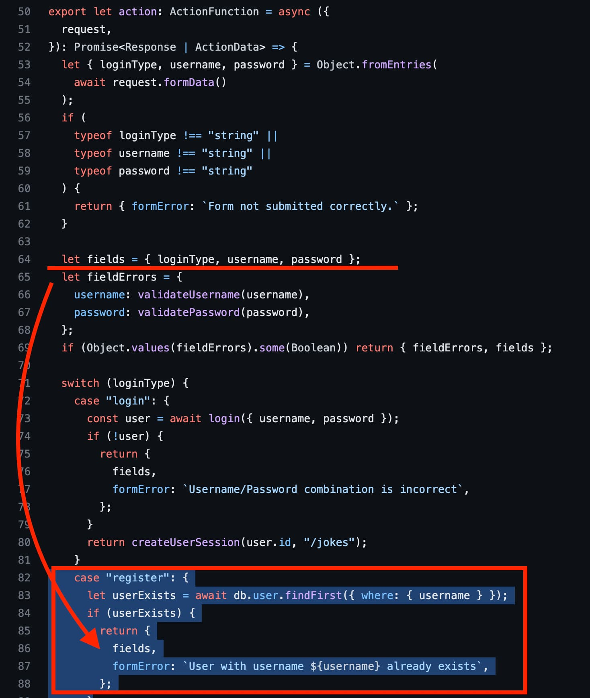
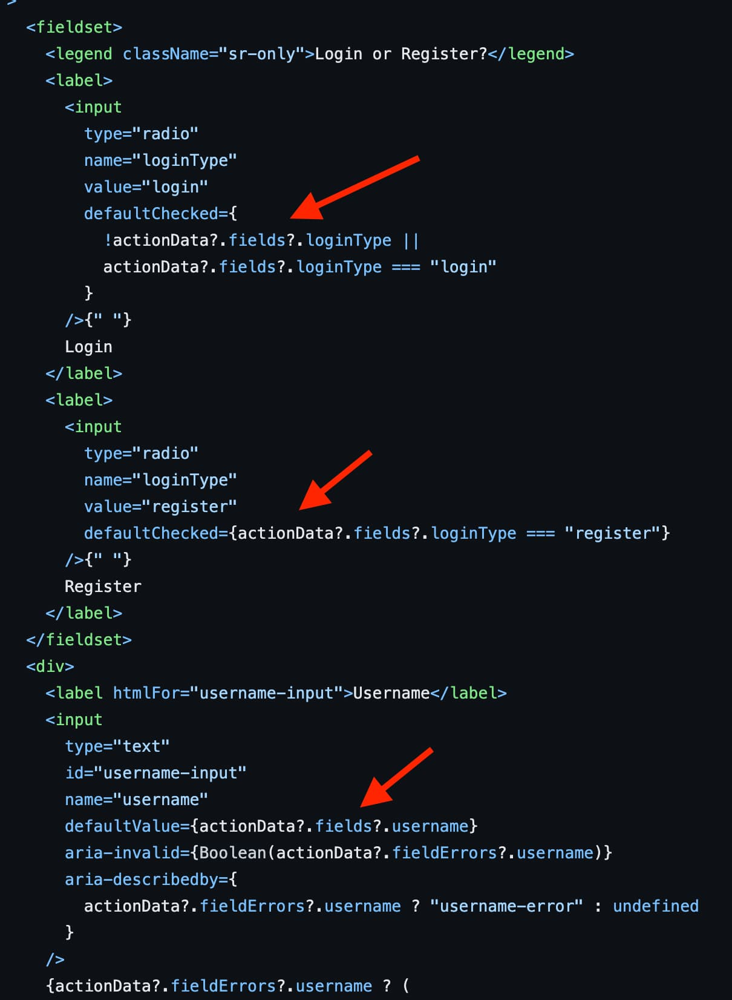

# 2023-03-29：技術角度來看一個好的 UI form 設計
## Ref: https://youtu.be/IN-TElTkVmU?t=212

------------

在看 Remix (React SSR framework) 的一個影片 (`"Magically Create Forms + Actions with Remix Forms"`) 時，看到講者 `Daniel Weinmann` 整理 10 點 UI form 必要的功能。  

我覺得彙整得很好，所以自己這邊做點筆記
  

------------

## 1. 保留輸入內容 (Make the reservation) 
這點的意思是，當 User 因為某些情況跳轉到其他頁面後，再轉回來時，User 所輸入的資料要保留著、仍然在 input 裡面。  
這樣 User 才不用重新打一次，UX 體驗好。  

第一種情況: User 輸入到一半，打開其他網頁，例如打開銀行官網確認行號
- 對應方法是 `persist data`，把 data 存到 `localStorage` 去。  
- 不管你是用哪種 framework，總之關鍵字朝 `persist data` 去 google 應該都有方案。
- 概念是 User 輸入的內容，同步 sync 到 storage 去，當 User 回到輸入頁面時，就把資料放回到 form 裡面。
- 資料送出後，就把 `localStorage` 資料清空。可以在 submit 時清除，也可以在收到 sucess response 時清除。

react 的話，如果用 `react-hook-form` 的話，可以試試看搭配 `react-hook-form-persist`  

第二種情況: User 送出資料後，backend 驗證後，User 的輸入是有問題的
這邊有區分 `CSR (Client-Side Rendering)` 和 `SSR (Server-Side Rendering)`  

`CSR` 的情況應該比較好解，因為 data 應該都還在 client。
收到 backend 的 error response 時，不清掉就好。  

`SSR` 比較麻煩，如果在上一種情況，我們在 submit 時就把 data 清掉了，那就要依賴 backend 的 error response 連同把 User 所輸入的 data 回傳回來  

這邊拿 remix 的 sample code 做參考
- https://github.com/remix-run/remix-jokes/blob/main/app/routes/login.tsx

|Backend 檢查到帳號名稱已經被註冊了，就把 data returen 回去|client 會預設把 data 放進 form 中|
| :------: | :------: |
|  |  |

## 2. 要有顯示送出成功的確認頁面 (Redirect on success)

這點實作上應該都沒有什麼問題。要有這點主要是 UX 考量，讓 User 清楚知道 sumbit 的東西有成功。  

## 3. Coerce FormData

這一點我沒有很懂講者要表達的東西。基本上有些欄位的資料型態/結構要小心處理，才好達到第一點 `Make the reservation`  

## 4. Backend site 驗證 (Validate on the server)  

題外話，無論 frontend 有沒有做資料驗證，**backend 都一定要有驗證**，避免有人刻意繞過 frontend  
這是 scrutiny 和 data 正確性的考量  

Backend 驗證的實作也不太會有難度，就是耐心寫就好  

## 5. Client site 驗證 (Validate on the client)

Client site 驗證能幫助 User 儘早發現錯誤，這算是 UX 上的考量  
但 client 不可能找出所有，有些 data 是需要 backend 才能驗證的，例如 username 有沒有被使用了。  

做法上也沒有難度，耐心點寫，用什麼方法都可以。  

## 6. 送出表單時，有處理中的狀態 (Pending UI)

Pending UI 也是 UX 上的考量，讓 User 體感上知道 server 正在處理你的 request  

## 7. Accessibility

這算是一個談不完的主題，很廣，我也沒有掌握太多。 
想深入的話，我推薦: `A11ycasts with Rob Dodson`
- https://www.youtube.com/playlist?list=PLNYkxOF6rcICWx0C9LVWWVqvHlYJyqw7g

## 8. Focus on client-side error
## 9. Focus on server-side error

這兩點一起講，也就是當 submit 出去時，client side 發現錯誤後，要
- 提示用戶錯誤並且把 focus 到那個錯誤的欄位

`server-side error` 就是當 backend error response 後，也要做到一樣
- 提示用戶錯誤並且把 focus 到那個錯誤的欄位

這兩點我都沒有特定的做法，直覺上就是寫 hard code 來處理  

## 10. Click on label, focus input
這點比較簡單，基本上就是 UX 考量  
