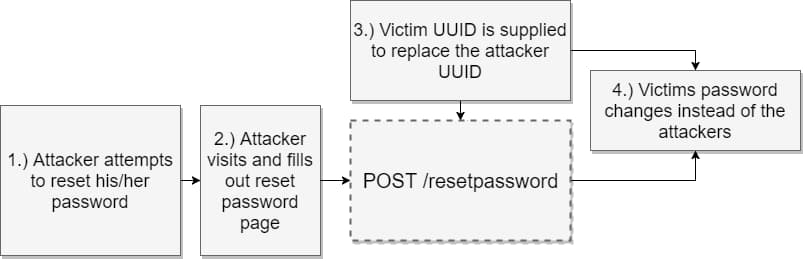

# 2023-05-09：筆記 samcurry 的 Permanent account takeover on Yahoo’s Small Business platform.md
## samcurry (samwcyo), June 25, 2017
### Ref https://samcurry.net/permanent-account-takeover-on-yahoo-small-business/

----------------

一篇 samcurry 的舊 blog

----------------


如果你決定開發一個 CMS (內容管理系統)，那麼最關鍵和必要的設置之一就是使用者帳號的認證
- 網站的這部分將被設計用來使那些自稱是使用者的人能夠成功登錄和建立會話，並禁止那些自稱不是使用者的人訪問使用者帳號
- 一般是通過指定使用者名和密碼（通常由使用者創照）來完成的
- 但現實世界通常很混亂

## Forgot password

在某個 bug bounty 的夜晚，我決定看看 Luminate 是如何處理 `forgotten passwords` 的
- 不出所料，他們有個方法來**重置使用者密碼**


  


該頁面的事件流程如下：
1. 使用者用他們的 email 送出 request，通知 server 他們忘記了自己的密碼

    ```
    POST /forgotpassword HTTP/1.1
    Host: login.luminate.com
    ontent-Type: application/x-www-form-urlencoded
    Content-Length: 861
    Connection: close
    Upgrade-Insecure-Requests: 1

    email=example@example.com
    ```

2. server 將產生一個一次性 token，發送到與使用者綁定的聯繫地址。

    ```
    https://login.luminate.com/passwordreset?sign=TMaJJnAjigfnprxqbcfnuBK8eJmJL2PHFByAA8OblfyHdZvxhXkeTmo5G_V1TNabJHUmSR9OSeYAnzm-yAlKbUfCYLsCQtrZnZF2IxCotLh_VEn7Px6nVTA3Sm_fF9t490t_x9-t1xKcVqRPLOgQGSHb3wXYBevsypDblPoO1c4
    ```

3. 使用者將使用這個一次性 token 來驗證他們是誰，並重新設置他們的密碼。


    ```
    POST /passwordreset HTTP/1.1
    Host: login.luminate.com
    Accept: text/html,application/xhtml+xml,application/xml;q=0.9,*/*;q=0.8
    Accept-Language: en-US,en;q=0.5
    Content-Type: application/x-www-form-urlencoded
    Content-Length: 463
    onnection: close
    Upgrade-Insecure-Requests: 1

    password=password&cpassword=password&uuid=6491c80b-2850-4d9c-9061-73a6122b3dca&sign=TMaJJnAjigfnprxqbcfnuBK8eJmJL2PHFByAA8OblfyHdZvxhXkeTmo5G_V1TNabJHUmSR9OSeYAnzm-yAlKbUfCYLsCQtrZnZF2IxCotLh_VEn7Px6nVTA3Sm_fF9t490t_x9-t1xKcVqRPLOgQGTiD-OCPPqBlpAWpi4yXgz0&email=example@example.com
    ```


## 實驗
問題中的密碼重置方法非常有趣，因為它包括了一些不必要的額外參數
- 如果看一下第二步，`sign` 參數是通過電子郵件傳遞的秘密密鑰
  - 可以保護使用者不被攻擊者利用可預測的 data 來重置他們的密碼
- 這是密碼重置的唯一必要參數，因為任何額外的 data 都會混淆或破壞系統
- 看一下第三步，我們可以看到重置密碼的實際請求給使用者提供了修改 `email` 和 `uuid` 等的選項
  - **當我看到這一點時，我真的很感興趣**
  - 但我以為 server 會問「**這個簽名是否與被重置的使用者 ID 相匹配？**」

經過一點點的探究，我意識到，改變 email 參數本身並沒有什麼作用。看來，`email` 參數只是一個視覺輔助(假象)  

  


這個 request 仍有東西困擾著我，`uuid` 參數是什麼？
- 如果 `sign` 參數是唯一必要的，為什麼在重設密碼時要控制一個獨特的`使用者 ID`？
- 從程式的角度來看，我覺得開發者必須超越自我，創造一個系統，使用 `sign` 參數來識別和 fetch data，將 fetch 的 data 印到一個隱藏的字段中，然後解析這些 data，並在以後的時間點上重新檢查。

```html
<input name="uuid" value="6491c80b-2850-4d9c-9061-73a6122b3dca" type="hidden">
```


## 攻擊發現的問題

根據假設和過去的經驗
- 我得出結論，`uuid` 參數實際上是一個唯一的使用者 ID，與使用者的帳戶相聯繫（朝這邊假設）
- 如果這種情況是可以利用的，我預測我可以提供其他人的使用者 ID，並在沒有匹配的符號參數的情況下重置他們的密碼

為了測試，我創造一個攻擊帳號
- 稱之為 `attacker@attacker.com`
- 這個帳號的目標是創造一個屬於 `attacker@attacker.com (UUID 1231c32b-2850-4e9c-9061-42k3022b3dcd)` 的重置密碼 token
- 但在傳輸過程中修改 `uuid` 參數以匹配 `samwcurry@gmail.com (UUID 6491c80b-2850-4d9c-9061-73a6122b3dca)`

按照重置密碼的標準順序（上述第1-2步），我來到了最後一個畫面
- 在那裡我將提供我的新密碼並提交修改
- 我使用 BURP suite 將 `uuid` 參數修改為受害者帳號的參數，並送出了與第三步幾乎相同的 POST request 請求，但在不同的會話中使用了不同的符號參數

這個請求的結果是什麼？

  

成功了，看起來 `uuid` 參數
1. 是屬於每個帳號的唯一標識符
2. 在 submit 密碼重置時能夠被 client 修改
3. 在密碼重置時不與 `sign` 參數綁定

## Exploitation
Taking us back to the top of this article, the way in which users say who they are is through the username and the way in which they prove who they are is through the password. If we can compromise the password, then we can compromise the account.

The unique user ID is tied to the victims account. The unique user ID can be paired with the “password reset” function to create new passwords.

If known — the unique user ID serves as a permanent gateway into the account.


回到本文的開頭，使用者通過使用者名說出自己的身份，而證明自己身份的方式是通過密碼
- 如果我們能破壞密碼，那麼我們就能破壞帳號。
- `unique user ID` 是與受害者的帳號相聯繫的。`unique user ID` 可以與密碼重置功能配對，創造新的密碼
- 如果知道 `unique user ID` 的話 ...




這個漏洞在 Yahoo’s business platform 上提出了一個重大問題
- 因為它對一些人的帳號具有立足點
- 攻擊者使用 `unique user ID` 來完全接管帳號。

## Timeline
June 14th, 2017 – Reported to vendor
June 14th, 2017 – Triage/validated as a vulnerability
June 15th, 2017 – Resolved
June 25th, 2017 – $4,000 bounty
