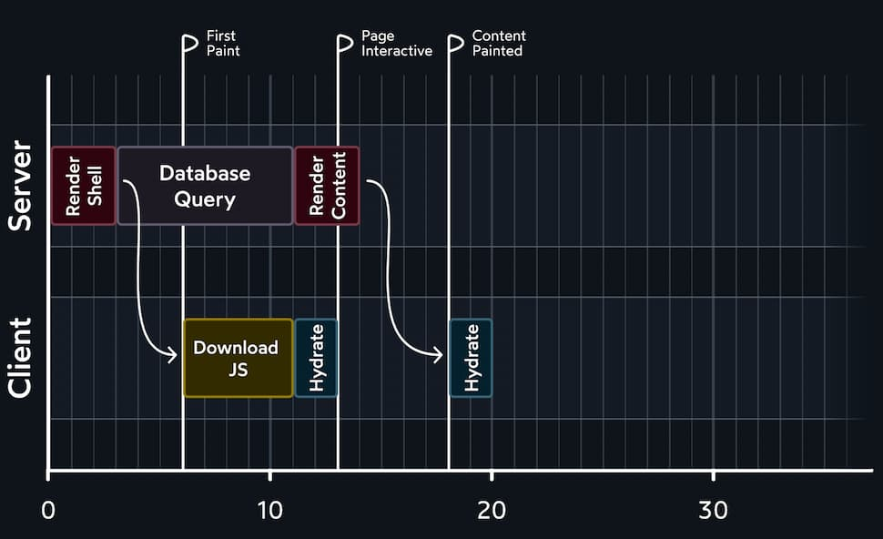

# 2023-09-08：筆記 Josh 談 React Server Components.md
## joshwcomeau, September 7th, 2023
### https://www.joshwcomeau.com/react/server-components/


----------------

 
## React Server Components 
了解 Server Side Rendering 能幫助你了解 React Server Components  
- React 2015 年時，大多數 React 都用 client-side rendering 策略
- User 會收到 HTML，看起來像這樣
 

```html
<!DOCTYPE html>
<html>
  <body>
    <div id="root"></div>
    <script src="/static/js/bundle.js"></script>
  </body>
</html>
```


`bundle.js` script 包含了我們掛載和運行 application 所需的一切
- 包括 React、其他第三方依賴項和所有程式碼
- 一旦下載並解析了 JS，React 就會整個 application 所有 DOM 節點，放在空的 `<div id="root">` 中
- CSR 的問題在於，完成這些所有工作都需要時間。進行工作的同時，user 只能盯著空白畫面
- 隨著時間的推移，這個問題會越來越嚴重：每推出新功能，JavaScript 包 size 增加，從而延長了 user 的等待時間
- Server Side Rendering 就是為了改善這種體驗而設計的
  - Server Side Rendering 的 application 以產生實際的 HTML，而不是發一個空的 HTML
  - user 會收到格式完整的 HTML


該 HTML 仍包含 `<script>`，因為我們仍需要 React 在 client 運行，處理任何互動
- 但 React 在 browser 中的工作方式略有不同：它不再從頭開始建立所有 DOM 節點，而是採用現有的 HTML
- 這個過程被稱為水合(`hydration`)


Dan Abramov 對 `hydration` 的解釋：

> Hydration is like watering the "dry” HTML with the "water” of interactivity and event handlers.


一旦下載了 JS bundle，React 就會快速運行整個 application
- 建立 UI 的 sketch，並將其 fitting 到真實的 DOM 中，附加 event handlers，啟動任何特效，等等
- 這樣 user 就不必在下載和解析 JavaScript 時盯著空白頁面
- 然後，client side React 會繼續 server side React 的工作，採用 DOM 並加入互動性


當談論 `Server Side Rendering` 時，我們通常會想像一個這樣流程:
1. user 訪問 `myWebsite.com`
2. Node.js server 接收 request，並立即渲染 React application，產生 HTML
3. 將 HTML 發到 client


這是實現 `Server Side Rendering` 的一種可能方式
- **但並不是唯一的方式**
- 另一種方法是在構建 application 時產生 HTML

通常，React application 需要編譯，將 JSX 轉為普通的 JavaScript，並捆綁所有 modules
- 如果在同一過程中，我們為所有不同的路由 `pre-rendered` 了所有 HTML，會怎麼樣呢？


這就是通常所說的 static site generation (SSG)
- 它是 Server Side Rendering 的一個子變體。

在我看來，`Server Side Rendering` 是個總括術語
- 它包括幾種不同的渲染策略
- 它們都有共同點：使用 `ReactDOMServer` API 在 Node.js 等 server 運行時進行初始呈現
- 至於何時發生，是 on-demand 還是在 compile-time 時，其實並不重要。無論如何，這都是 `Server Side Rendering`

---------

## Bouncing back and forth
讓來談談 React 中的 data fetching。通常有兩個通過網路進行通信的獨立 application:

1. client side React application 
2. server side REST API


client 使用 React Query 或 SWR 或 Apollo 等工具向 backend 發出 request
- backedn 從 db 中抓取資料並通過網路發送回來
- 我們可以用圖表來展示這流程:


  
 


底部數字代表一個虛構的時間單位。它們不是分鐘或秒
- 實際上，這些數字會根據大量不同的因素而發生巨大的變化
- 圖只是為了對概念有一個 high level 的理解，並沒有模擬任何真實的資料


上圖顯示的是 CSR 的流程
- 它從 client 接收 HTML 開始。文件沒有任何內容，但有一個或多個 `<script>` tag 
- 一旦下載並解析了 JS，React application 就會啟動，建立一堆 DOM 節點並填充 UI
- 但一開始，我們並沒有任何實際資料，所以我們只能通過 loading state 來呈現外殼(header, footer, layout)


經常看到這種模式。例如，UberEats 在取得實際資料時，首先會呈現一個外殼:

<p align="center">
  <video width="80%" autoplay muted loop loading="lazy" src="https://github.com/flameddd/blog/assets/22259196/343ce357-66f5-4912-81d0-e8e922763d21" ></video>
</p>  
(video source: https://www.joshwcomeau.com/images/server-components/ubereats-loading.mp4)  


User 將看到這種 loading state，直到網路請求解決，React re-render，用真正的內容取代 UI   

讓我們看看另種架構方式
- 下圖保持了相同的資料抓取模式
- 但使用了 `Server Side Rendering`:
 

  


在新流程中，我們在 server 上執行 first render
- 這意味著 user 收到的 HTML 不是完全空的
- 這是個進步，一個外殼總比一個空白要好
- 但歸根結底，它並沒有起到真正的顯著作用
- user 訪問 application 並不是為了看 loading screen，而是為了看內容

 
為了真正了解用 UX 的差異，比較下面兩張圖:

| **Client Side Rendering** |
| :------: | 
|  |
| **Server Side Rendering** |
|  |


每個 flag 代表常用的性能指標:

1. `First Paint`
    - user 不再盯著空白頁面
    - 總體 layout 已經呈現，但內容仍然缺失
    - 有時稱為 FCP (`First Contentful Paint`)
2. `Page Interactive`
    - React 已下載
    - application 已經渲染/hydrated
    - 交互元素現在已完全可以 responsive
    - 這情況有時稱為 TTI (`Time To Interactive`)
3. `Content Paint`
    - 頁面現在包含了 user 關心的內容
    - 已經從 DB 中取了資料，並呈現
    - 這有時被稱為 LCP (`Largest Contentful Paint`)


通過 server 進行 initial render
- 我們可以更快地繪製初始外殼
- 這可以讓載入體驗感覺更快一些，因為它提供了一種進度感，讓人感覺事情正在發生
- 在某些情況下，這將是一個有意義的改進。例如，user 可能只是在等待載入 header，以便點擊連結


但是，這樣的流程是不是感覺有點傻？
- 當看到 SSR 圖時，我不禁注意到 request 是從 server 開始的
- 與其需要第二次往返網路 request，為什麼不在初始請求時完成 DB 工作呢？

換句話說，為什麼不這樣做呢？


   

我們不需要在 client 和 server 之間來回切換
- 而是將 DB query 做為 initial request 的一部分，直接將填充完整的 UI 發送給 user
- 但是到底該怎麼做呢?


為了實現這點
- 我們需要給 React 提供一段 code，讓它只在 server 上運行，以完成 DB query
- 但在 React 中，這並不是一個選項，即使是 `Server Side Rendering`，我們的所有 component 也都是在 server 和 client 上渲染的


針對這個問題，生態系統提出了很多解決方案
- 像 `Next.js` 和 `Gatsby` 已經建立了自己的方法，可以完全在 server 上執行程式碼

例如，下面是使用 `Next.js` 時的情況(legacy "Pages” router)

```jsx
import db from 'imaginary-db';

// This code only runs on the server:
export async function getServerSideProps() {
  const link = db.connect('localhost', 'root', 'passw0rd');
  const data = await db.query(link, 'SELECT * FROM products');
  return {
    props: { data },
  };
}

// This code runs on the server + on the client
export default function Homepage({ data }) {
  return (
    <>
      <h1>Trending Products</h1>
      {data.map((item) => (
        <article key={item.id}>
          <h2>{item.title}</h2>
          <p>{item.description}</p>
        </article>
      ))}
    </>
  );
}
```

分解一下:
1. 當 server 收到 request 時，會呼叫 `getServerSideProps` 返回 prop object
2. 然後，這些 props 被導入 component，component 首先在 server 上渲染，然後在 client side hydrated


這裡的巧妙之處在於
- `getServerSideProps` 不會在 client 重新運行
- 事實上，JavaScript bundles 中甚至不包含這個 function

老實說，它非常了不起。但也有一些缺點
1. **這種策略只適用於 route level，也就是樹最頂端的 component。不能在任何 component 中這樣做**
2. **每個 meta-framework 都有自己的方法**
    - `Next.js` 有一種方法，`Gatsby` 有另種方法，`Remix` 有另種方法。這還沒有標準化
3. **所有 React component 都會在 client hydrate，即使在沒有必要的情況下也是如此**


多年來，React 團隊一直在悄悄地琢磨這個問題，試圖找出正式的方法來解決這個問題
- 他們的解決方案被稱為 React Server Components


----------------

## 什麼是 React Server Components ?
從 high level 講，`React Server Components` 是種全新 paradigm 的名稱
- 在這新世界中，我們可以建立只在 server 上運行的 component
- 這樣，我們就可以在 React component 中寫 db query 等操作！

下面是 `Server Component` 的 quick example:
 


```jsx
import db from 'imaginary-db';

async function Homepage() {
  const link = db.connect('localhost', 'root', 'passw0rd');
  const data = await db.query(link, 'SELECT * FROM products');
  return (
    <>
      <h1>Trending Products</h1>
      {data.map((item) => (
        <article key={item.id}>
          <h2>{item.title}</h2>
          <p>{item.description}</p>
        </article>
      ))}
    </>
  );
}

export default Homepage;
```


已經使用 React 多年的人，這段 code 起初看來絕對是天馬行空
- function component 不能 **async**！也不允許在渲染中直接產生這樣的副作用！


關鍵是要明白:
- **Server Components never re-render**
- 它們在 server 上**運行一次**，產生 UI
- 渲染後的值會發送到 client 並鎖定到位
- 對於 React 來說，這個輸出是不可變的，永遠不會改變


**這就意味著 React 的大部分 API 與 `Server Components` 不兼容**
- 例如，不能使用 `state`，因為 `state` 可以改變，但 `Server Components` 卻不能 re-render
- 也不能使用 `effects`，因為 `effects` 只在 client side 渲染後運行，而 `Server Components` 永遠不會在 client side 運行
- 也意味著很多舊規則不再適用
  - 例如，在傳統 React 中，需要將副作用放在 useEffect callback 或 event handler 中，這樣就不會在每次 render 時重複執行
  - **但如果 component 只運行一次，就不必擔心這個問題了！**


`Server Components` 本身簡單得出奇
- 但 `React Server Components` 模式卻複雜得多
- 這是因為我們仍有普通的(老式) component，而它們的組合方式非常令人困惑

我們熟悉的 傳統 React component 被稱為 `Client Components`
- `Client Components` 這個名字意味著這些 component 只能在 client 呈現，但實際上並非如此
- 客戶端組件同時在 client 和 server 上呈現


   


這些術語很容易讓人混淆，所以總結了一下:
- `React Server Components` 是這種新模式的名稱
- 在這個新模式中，我們所熟悉標準 React component 被重新命名為 `Client Components`
- 新模式引入了一種新的 component 類型: `Server Components`
  - 這些**新 component 只在 server 上呈現**
  - 它們的 **code 不包含在 JS bundle 中，因此它們永遠不會 hydrate 或 re-render**

**`React Server Components` vs. `Server Side Rendering`:**  
- 來澄清另個混淆，`React Server Components` 不是 `Server Side Rendering` 的替代品
- 相反，把它看作是兩塊獨立的拼圖，它們完美地拼接在一起，是相輔相成的
- 我們仍然依賴 `Server Side Rendering` 來產生初始 HTML
  - `React Server Components` 建立在此基礎之上，允許我們省略 client 中的某些 component，確保它們只在 server 上運行

事實上，我們甚至可以不使用 `Server Side Rendering`，而直接使用 `React Server Components`
- 不過在實務中，將它們結合起來使用，效果會更好


--------

## 兼容環境
通常當 React 推出新功能時，我們只需 `npm install react@latest` 就可以開始工作了
- 不幸的是，`React Server Components` 沒辦法這樣做
- 我的理解是，`React Server Components` 需要與 React 之外的一堆東西緊密集成，比如 bundleler, server, router

在寫這篇文章的時候
- 只有一種方法可以用 `React Server Components`，那就是 `Next.js 13.4+`，使用他們全新架構的 `App Router`
- React 文件中有個 ["Bleeding-edge frameworks" section](https://react.dev/learn/start-a-new-react-project#bleeding-edge-react-frameworks)
  - 其中列出了支持 React Server Components 的 framework


--------------

## 指定 client components
在新的 `React Server Components` 模式中
- **所有 component 都默認都是 `Server Components`**
- `Client Components` 需要另外指定


為此，需要指定一個全新的指令: 

```jsx

'use client';

import React from 'react';
function Counter() {
  const [count, setCount] = React.useState(0);
  return (
    <button onClick={() => setCount(count + 1)}>
      Current value: {count}
    </button>
  );
}

export default Counter;
```


`'use client'`
- 告訴 React 此 component 是 `Client Components`
- 它們應包含在 JS bundles 中，以便在 client side re-render
  - (這種做法是有先例的: `"use strict"` 嚴格模式)
  - (`"use server"` 是用於 `Server Actions` 的，這是另個 Next.JS 的主題)
    - https://nextjs.org/docs/app/api-reference/functions/server-actions


**哪些 components 應該是 `Client Components` ?**  
- 該如何決定 component 應該是 `Server Component` 還是 `Client Component` ?


一般來說，如果一個 component 可以成為 `Server Component`，那麼它就應該是 `Server Component`
- `Server Component` 往往更簡單，也更容易推理
- 此外，`Server Component` 有性能方面的優勢
  - 因為 `Server Component` 不在 client side 運行
  - 所以 code 不會包含在 JS bundles 中
  - `React Server Components` 模式的好處之一是，它有可能改善 Page Interactive (TTI) metric


儘管如此，也**不應該把盡可能消除 `Client Components` 作為目標**
- 值得記住的是，到目前為止，每個 React application 中的每個 React component 都是 `Client Components`


當你開始使用 `React Server Components` 時，你可能會發現這是非常直觀的
- 某些 component 需要在 client 運行，因為它用了 state 或 effects


---------------

## 邊界(Boundaries)
當熟悉 `React Server Components` 時，遇到的第一個問題是: 當 `props` 改變時會發生什麼?  


例如，假設有個這樣的 `Server Component`:
 

```jsx
function HitCounter({ hits }) {
  return (
    <div>
      Number of hits: {hits}
    </div>
  );
}

```

假設在最初的 Server Side Render 中，`hits` 為 `0`
- 那 component 會產生下面下 markup:


```html
<div>Number of hits: 0</div>
```


如果 `hits` 的值發生變化會怎樣呢？(`0` 變`1`)
- `HitCounter` 需要重新渲染，**但它不能重新渲染，因為它是個 `Server Component`**


問題是，`Server Components` 並不是孤立存在的。必須從更全面的角度來考慮 application 的結構
- 比方說，我們有下面的  component tree:


   


如果所有 component 組件都是 `Server Components`
- 那沒有一個 props 會改變，因為沒有一個 component 會重新渲染

但假設 `Article` 擁有 `hits` state
- 為了使用 `state`，我們需要將其轉為 `Client Component`:


   


當 `Article` 重新渲染時，任何擁有的 component 也會重新渲染
- 包括 `HitCounter` 和 `Discussion`。但如果這些是 `Server Components`，它們就不能重新渲染


為了防止出現這種不可能的情況，React 團隊加了一條規則:
- **`Client Components` 只能 import 其他 `Client Components`**
- 使用 `'use client'` 意味著 `HitCounter` 和 `Discussion` 需要成為 `Client Components`

One of the biggest "ah-ha" moments I had with React Server Components was the realization that this new paradigm is all about creating client boundaries. Here's what winds up happening, in practice:

在用 `React Server Components` 的過程中，最大的頓悟之一就是意識到這種新的模式範例完全是為了建立 `client boundaries`

   


當 `'use client'` 加到 `Article` 時，我們建立了 `client boundary`
- 在這個 boundary 內的所有 component 都會被隱式地轉換為 `Client Components`
- 即使 `HitCounter`沒有 `'use client'` 指令
  - 在這種特殊情況下，它們仍會在 client hydrate/render
 

---------


## 解決方法
當第一次了解到 `Client Components` 不能渲染 `Server Components` 時，我覺得限制很大
- 如果我需要在 application 的很上面的層使用 `state` 怎麼辦？
- 這是否意味著所有東西都需要變成 `Client Components`?


事實上，在很多情況下，可以通過重組 application 來改變 owner，從而繞過這限制  

舉例:  


```jsx
'use client';
import { DARK_COLORS, LIGHT_COLORS } from '@/constants.js';
import Header from './Header';
import MainContent from './MainContent';

function Homepage() {
  const [colorTheme, setColorTheme] = React.useState('light');
  const colorVariables = colorTheme === 'light'
    ? LIGHT_COLORS
    : DARK_COLORS;

  return (
    <body style={colorVariables}>
      <Header />
      <MainContent />
    </body>
  );
}
```


我們用 `state` 讓 user 切換 mode/light mode
- 這需要發生在 application tree 很高的 layer 中，這樣才能將 CSS variable 應用到 `<body>` tag


為了用 `state`，我們需要將 `Homepage` 設為 `Client Component`
- 由於這是 application 的頂層，這意味著所有其他 component: `Header`, `MainContent` 也將隱式的成為 `Client Components`
- 為了解決這個問題，讓我們把色彩管理的內容放到自己的 component 中:


```jsx
// /components/ColorProvider.js
'use client';
import { DARK_COLORS, LIGHT_COLORS } from '@/constants.js';

function ColorProvider({ children }) {
  const [colorTheme, setColorTheme] = React.useState('light');
  const colorVariables = colorTheme === 'light'
    ? LIGHT_COLORS
    : DARK_COLORS;
  return (
    <body style={colorVariables}>
      {children}
    </body>
  );
}
```

回到 `Homepage` 中，我們這樣使用這個新 component:
```jsx
// /components/Homepage.js
import Header from './Header';
import MainContent from './MainContent';
import ColorProvider from './ColorProvider';

function Homepage() {
  return (
    <ColorProvider>
      <Header />
      <MainContent />
    </ColorProvider>
  );
}
```


我們可以從 `Homepage` 中移除 `'use client'`，因為它不再使用 `state` 或任何其他 client side React 功能
- 意味著 `Header` 和 `MainContent` 將不再隱式轉換為 `Client Components`


**但 `ColorProvider` 是 `Client Component`**
- 是 `Header` 和 `MainContent` 的 parent。無論如何，它在 tree 中的位置還是比較高的，對嗎？


當涉及到 client boundaries 時，父子關係就不重要了
- `Homepage` 負責 import 和 render `Header` 和 `MainContent`
  - 意味著 `Homepage` 決定這些 component 的 props 是什麼

記住，我們要解決的問題是 `Server Component` 無法 re-render
- 因此無法為它們的任何 props update value
- 有了這個新設置，`Homepage` 就可以決定 `Header` 和 `MainContent` 的 props
  - 而由於 `Homepage` 是一個 `Server Components`，所以就沒有問題了


**這是個燒腦的東西**
- 更準確地說，`'use client'` 是在 file/module 級別上工作的
- `Client Component` 中 **import** 的任何 module 也必須是 `Client Component`


**更改 color theme ?:**  
- 上面的例子中，沒有任何方法可以改顏色主題 (`setColorTheme` 沒有被呼叫)
- 這是為了盡可能解釋上面的觀念，所以省略了一些東西
- 一個完整的 demo 會用 React context 來讓任何後代都能使用 setter function
  - 只要使用 context 的 component 是 `Client Component`


----------------


## 窺探引擎蓋下
讓我們從更低層次來看看這個問題
- 當我們使用 `Server Component` 時，輸出是什麼樣子的？實際產生了什麼？

從一個超級簡單的 React application 開始
```jsx
function Homepage() {
  
  return (<p>Hello world!</p>);
}
```


在 `React Server Components` 模式中
- 所有 component **默認**都是 `Server Components` 件
- 由於我們沒有將 component 標記為 Client Component (或在 client boundary 內渲染)，因此它只能在 server 上渲染

當在 browser 中訪問這個 application 時，我們將收到一個 HTML，看起來像這樣
```html
<!DOCTYPE html>
<html>
  <body>
    <p>Hello world!</p>
    <script src="/static/js/bundle.js"></script>
    <script>
      self.__next['$Homepage-1'] = {
        type: 'p',
        props: null,
        children: "Hello world!",
      };
    </script>
  </body>
</html>
```


為了容易理解，這裡調整了一下結構
- 例如，在 RSC context 中產生的真正 JS 使用了 stringified JSON arrays，這是為了減小 HTML 文件大小而進行的優化
- 另外還刪除了 HTML 中所有非關鍵部分(如 `<head>`)


可以看到，HTML 包含了由 React application 產生的 UI
- 即 `Hello world!` 段落
- 這要歸功於 `Server Side Rendering`，而不是 React Server Components


在這下面，有 `<script>` tag
- 用於載入 JS bundle
  - 該 bundle 包括 React 等依賴項，以及 application 中使用的任何 client side component
  - 由於 `Homepage` 是個 `Server Component`，因此 code 並不包含在此 bundle 中

最後，還有一個包含 inline JS:
```js
self.__next['$Homepage-1'] = {
  type: 'p',
  props: null,
  children: "Hello world!",
};
```


這是真正有趣的部分
- 從本質上講，在這裡所做的就是告訴 React：「嘿，我知道你缺少 Homepage 的 code，這是它所呈現的內容」


通常情況下，當 React 在 client 進行 hydrates 時
- 它會加速渲染所有 component 組件，構建 application 的 virtual representation
- 但 `Server Components` 無法做到這點，因為 code 不包含在 JS bundle 中

因此，我們發送的是 rendered value
- 即 server 上產生的 virtual representation。當 React 載到 client 時，它會重新使用該描述，而不是重新產生


這就是上面 `ColorProvider` 範例的原理
- 來自 `Header` 和 `MainContent` 的輸出通過 children prop 傳入 `ColorProvider`
- `ColorProvider` 可以隨意重新渲染，但這些 data 是 static 的，由 server 鎖定

如果想知道 `Server Components` 是如何序列化並通過網路發送的
- 看看 Alvar Lagerlöf 的 [RSC Devtools](https://www.alvar.dev/blog/creating-devtools-for-react-server-components)


**完全不用 React ?**
你可能會想，如果 application 中不包含任何 client side component，我們是否真的需要下載 React ?
- 能否使用 `React Server Components` 來構建真正靜態的無 JS 網站?
- 問題是，`React Server Components` 只能在 Next.js 中使用，而 Next.js 有大量需要在 client side 運行，以管理路由等

---------------


## 優點
`React Server Components` 是在 React 中運行 server 專屬程式碼的第一種「官方」方式
- 不過，正如前面提到的，這廣泛的 React 生態系統中並不是什麼新鮮事
  - 從 2016 年開始，就可以在 `Next.js` 運行 server 專屬的程式碼了
- **最大的不同是，我們以前從未有過在 component 內運行 server 專屬程式碼的方法**
- 最明顯的好處是性能
- `React Server Components` 不會包含在 JS bundles 中，這減少需要下載的 JavaScript 和需要 hydrated 的 component 數量

| **Legacy Next.js (pre-RSC)** |
| :------: | 
|  |
| **Modern Next.js (with RSC)** |
|  |


這可能是最不讓我興奮的一點。老實說，大多 `Next.js`  application 在 "Page Interactive” timing 方面已經夠快了
- 如果遵循語義 HTML 原則，大部分甚至在 React hydrated 之前就能運行
  - Links 可以跟踪，forms 可以送出，accordions 可以展開和折疊(用 `<details>` 和 `<summary>`)
- 對於大多數專案來說，React hydrate 需要幾秒鐘的時間也沒什麼問題


但，在功能與 bundle size 方面，我們不再需要做出同樣的妥協！
- 例如，大多數技術 blog 都需要某種 syntax highlighting library
- 在這篇文章中，使用 Prism 片段看起來是這樣的:
  - ([https://www.joshwcomeau.com/react/server-components/#advantages-9](https://www.joshwcomeau.com/react/server-components/#advantages-9))

```js
function exampleJavaScriptFunction(param) {
  return "Hello world!"
}
```

一個支持所有流行語言的合適的 syntax-highlighting library 需要幾 megabytes
- 遠遠超出了放在 JS bundle 中的大小
- 因此，不得不做出妥協，刪減那些不重要的語言和功能


但是，假設在 `Server Component` 中進行 syntax highlighting
- 在這情況，我們的 JS bundles 中實際上不會包含任何 library code。不必做出任何妥協，就可以使用所有的功能
- 這就是 [Bright](https://bright.codehike.org/) 背後的重要理念，它是 modern syntax-highlighting package，旨在與 `React Server Components` 配合使用。


   


 
這正是 `React Server Components` 讓人感到興奮的地方
- 在 JS bundles 中加入這些 component 的成本太高，而現在它們可以免費在 server 上運行，帶來更好的 UX

歸根結底，現在還為時尚早
- `React Server Components` 幾個月前才從測試版中脫出
- 隨著社區利用這種新模式不斷創新出像 Bright 這樣的新解決方案，期待看到未來幾年的發展


------------------------------------

## The full picture

`React Server Components` 實際上只是「現代 React」拼圖的一部分。
- 當 `React Server Components` 與 `Suspense` 和 new Streaming SSR 架構相結合時，事情就變得非常有趣了
- 它讓我們可以做出像下面這樣狂野的事情:
- 你可以 [https://github.com/reactwg/react-18/discussions/37](https://github.com/reactwg/react-18/discussions/37) 了解有關該架構的更多資訊

   

