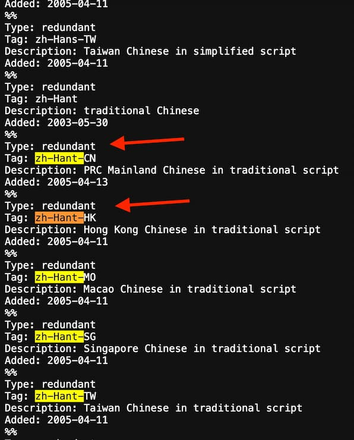

# 2024-02-16：筆記一些 i18n/L10n 相關東西


----------------

Refs:
- [Lessons From Linguistics: i18n Best Practices for Front-End Developers](https://shopify.engineering/internationalization-i18n-best-practices-front-end-developers)
  - Lucas Huang, Mar 16, 2023
- [JavaScript internationalization (i18n) and localization (L10n) — our website in your language](https://engineering.payoneer.com/javascript-i18n-and-localization-l10n-our-website-in-your-language-4a90c26fd42)
  - Yotam Madar, Sep 12, 2022
- [前端时间国际化入门](https://juejin.cn/post/7021465702171148296)
  - 奇舞精选, 2021-10-21
- [Based on thousands of APIs, what is the best approaches and format for handling timezone, timestamps, and datetime in APIs and Apps](https://www.moesif.com/blog/technical/timestamp/manage-datetime-timestamp-timezones-in-api/)
  - 
Xing Wang, November 19, 2018
- [HOW TO DEFINE LOCALIZATION](https://borntobeglobal.com/2023/02/12/web-application-localization-best-practices/)
  - Nataly Kelly, 12 February 2023 (這篇有蠻多建議我筆記沒紀錄的)


others:
- [Personal names around the world](https://www.w3.org/International/questions/qa-personal-names)
- [The Definitive Guide to DateTime Manipulation](https://www.toptal.com/software/definitive-guide-to-datetime-manipulation) 

----------------

## 先看一個簡單例子

看看圖的 subtitle
  

`“Added` 是靜態文字，後面 date 是動態的  

沒有 i18n 時，code 可能像這樣 

```jsx
<>{`Added: ${dateAdded}`}</>
```

有 i18n 時，可能是這樣

```jsx
<>{`${t('added')}: ${dateAdded}`}</>
```

這邊有 2 個問題
1. 冒號在這邊作為語法描述，但在其他許多語言上的使用方法不一樣(or 根本不同)
2. 單字的順序是 hardcode。這順序在其他語言上是錯的，如荷蘭語 (`1 januari toegevoegd`) or 韓文 (`1월 1일 추가`)

這例子的簡單處理方案是
- 字串需要作為一個整體進行翻譯
- 允許每個翻譯字串放置 `dateAdded` 在該語言的正確位置

```jsx
const { dateAdded } = props;
return <>
  {t('addedInfo', {
    dateAdded: dateAdded.toLocaleDateString(
      locale, // from app state, i18n library, ...
      {
        month: "long",
        day: "numeric",
      }
    )
  })}
</>;
```

```json
{
  "addedInfo": "Added: {dateAdded}"
}
```

```json
{
  "addedInfo": "{dateAdded} 추가"
}
```

```json
{
  "addedInfo": "{dateAdded} toegevoegd"
}
```


----------------

## 下一個例子

有個頁面，User 可以查看上傳的所有圖
- 頁面頂部有個狀態欄，可向 User 顯示有用的資訊，如：

  

此頁面現在支援圖片和影片
- page view 可以包含其中一種或同時包含兩種文件類型，此時它們被稱為 files
- 你會注意到除了 file type 的名詞之外，狀態列中的文字在所有三種情況下都是相同的，例如
- Select image
- Select video
- Select file

這代表我們可以建立一個 common component，如 `<StatusBar>` 來共用
- (而不是建立三個分別的 component `<ImageStatusBar>`, `<VideoStatusBar>`, `<FileStatusBar>` )
- 然後把 file type 傳進去

```json
{
  "fileTypes": {
    "image": "image",
    "video": "video",
    "file": "file"
  },
  "select": "Select {fileType}",
  "ready": "Your {fileType} is ready",
  "loading": "Loading {fileType}...",
  "found": "{count} {fileType} found"
}
```

```jsx
<StatusBar fileType="image" message="ready" />


const {fileType, message} = props;
return (
  <>
    {t(message, { fileType: t(`fileTypes.${fileType}`) })
  </>;
)
```

這是 i18n library 常見的使用方法
- 不幸的是，這導致了翻譯的一系列問題
- 這對主要說英語的人可能不直觀，因為這些問題只出現在英語中根本不存在的語法概念中

下面接著看其他問題


----------------

## 複數化 (Pluralization)

英語當然也有複數形式
- 大部分的系統，其中單字具有「單數」和「複數」形式，複數通常在單字末尾以 "s" 表示
- 有趣的是，複數形式也用於計數 0
- 因此更準確地說，英語單數和其他每個單字這種區別很快就會變得清晰

之前的 `<StatusBar>`，甚至在翻譯之前，就有一個錯誤  

   


我們沒有考慮到 **singular** 和 **plural** 版本！
- 該 component 兩者都需要

也許我們可以將單數和複數字串傳到要插值的 props 中？

```json
{
  "fileTypes": {
    "image": {
      "singular": "image",
      "plural": "images",
    },
    "video": {
      "singular": "video",
      "plural": "videos",
    },
    "file": {
      "singular": "file",
      "plural": "files",
    }
}
```

```jsx
const {fileType, message, count} = props;
const fileTypeText =
  count === 1
    ? t(`fileTypes.${fileType}.singular`)
    : t(`fileTypes.${fileType}.plural`);

return <>
  {t(message, { fileType: fileTypeText })
</>
```

根據 `count === 1` 來決定單數/複數，這段 code應該敲響警鐘
- 其他語言是否可能有不同的複數規則？
- 是否有一種語言使用單數詞形式為零計數，甚至完全不同的詞？

有！印地語(Hindi)和拉脫維亞語(Latvian)分別是這些情況的例子
- 而且還有更多多元化的類別
- [Unicode Common Locale Data Repository (CLDR)](https://cldr.unicode.org/index) 標識了六種複數形式：
- zero
- one (singular)
- two (dual)
- few (paucal)
- many
- other


### Case Study: Polish (波蘭語)

Polish 對 "one", "few(2-4")", "many(>4)" 和 "other" 有不同的詞尾
- 1 dog    -> 1 pies
- 2 dogs   -> 2 psy
- 5 dogs   -> 5 psów
- 1.5 dogs -> 1,5 psa

然而，它並不像超過 4 後就使用 "many" 那麼簡單:
- "few" 結尾用於以任何以 2-4 結尾的數字，無論數字本身有多大
- 20 dogs -> 20 psów
- 22 dogs -> 22 psy
- 94 dogs -> 94 psy
- 95 dogs -> 95 psów

更奇耙的是，除了 12-14 之外，這些屬於 "many"
- 12 dogs -> 12 psów
- 13 dogs -> 13 psów
- 14 dogs -> 14 psów


回到 `<StatusBar>`
- 很明顯 singular 和 plural 是不夠的
- 可以通過 zero, few, many, other 確保跨語言的多樣性嗎？ 
- 但這種通用插入字串仍然給整個句子留下了許多潛在的問題，而不僅僅是一個單字


## 性別 (Gender)


在許多語言中，名詞都有性別
- 有些語言有`陽性(masculine)`和`陰性(feminine)`
- 有些增加`中性(neuter)`
- 有些有`生命(animate)`/`無生命(inanimate)`
  - (代替陽性/陰性或與陽性/陰性結合)
- 少數語言有額外的選項，如 third(or more)或`雙重性別(dual)`、animal/vegetable,  and large objects and liquids.


在性別語言中，與名詞相關的冠詞和形容詞也反映了該名詞的性別
- 意味著插入字串將成為一個問題！

在 `<StatusBar>`，有這個字串:  
- `The {fileType} is ready`

在英語中非常簡單:
- The file is ready
- The image is ready
- The video is ready

但在法語中，這些是:
- Le fichier est prêt
- L'image est prête
- La vidéo est prête

三者各有不同！
- 「Fichier」是男性化的，而「image」和「vidéo」是女性化的
- 冠詞隨性別而變化(「le」為陽性，「la」為女性)
- 而「ready」->「prêt」一詞在指陰性名詞時，末尾會帶有「e」
- 還有一條附加規則，其中 "la image" 被縮寫為 "l'image"，因為"image" 以元音開頭


這意味著沒有可靠的方法來傳 `{fileType}` 進 `<StatusBar>` 法文文本


## 詞尾變化(Declensions)
再以一個例子來結束，說明人類語言的浩瀚
- 這個概念遠遠存在於英語之外，以至於許多人可能從未考慮過這樣的語法結構可能存在 -> 「詞尾變化(Declensions)」 

「詞尾變化(Declensions)」是根據單字在句子中的句法功能對單字結尾的修飾語
- 將會有一個基本單詞，並且它的結尾會根據例如它是句子中的主語還是賓語，或者它是在其他東西的內部還是之上，或者任何其他含義上的細微差別而改變
- 它們存在於各大洲的各種不相關的語系中，從克川語(Quechuan)到印歐語(Indo-European)再到班圖語(Bantu)
  - 有趣的是，古英語擁有它們，但現代英語卻失去了它


英語確實有些單字會根據其在句子中的角色而變化。例如
- 單數第一人稱代名詞可以是 "I", "me", "my", "mine" or "myself"
- 這取決於該人在句子中扮演的語法角色
- 也進行了語義變化，例如在名詞末尾添加 "s" 表複數，或在動詞末加 "ed" 表過去式


「詞尾變化(Declensions)」也是如此，但更廣泛的單字範圍
- 想像一下，如果在「狗」末尾添加不同的聲音，表示「我追狗」、「我正在追狗」、「狗追我」等等

當堆疊單字角色、性別、時態和複數時，你會得到絕對爆炸的排列組合！  


## Case Study: 再看一次波蘭語

來看些簡單的例子
- I like your dog. Your dog is cute.
- Lubię twojego psa. Twój pies jest słodki.


可以看到 `your` 和 `dog` 根據 `dog` 是句子的主詞還是受詞而有所不同
- I like your dogs. Your dogs are cute.
- Lubię twoje psy. Twoje psy są słodkie.


有趣的是，在複數情況下，`your dogs` 的詞尾變化為 `twoje psy`
- 但注意，表示 `cute` 的單字 `słodki` 由於其所指名詞的複數性而獲得了 `e`，就像之前的法語範例一樣


波蘭語有複數 `you`，類似法文 `vous` 或印地語 `आप`
- 因此，如果你說 `your dogs are cute`

但這次你是向多個人講話，那麼就會寫成:
- Wasze pieski są słodkie.
- 「狗」的另一個變格！  


這些例子清楚地表明我們不能真正擁有一組預先寫好的字串 `{noun}` 被 code 換出
- 在許多語言中，名詞本身會根據其在句子中的使用方式而發生很大變化
- 反過來，其他一些單字也會根據名詞而改變，完全重塑句子
- **因此，該句子需要整體翻譯以保證正確性**

------------------

## 三堂課和 Best Practices
We've looked at some fascinating and intricate grammatical constructs that you may have never encountered before. You may have not even thought it possible for a single word to mutate so much within a language! It would be overwhelming to have to keep track of all of these different rules; you shouldn't have to be a linguistics expert just to add a checkbox label.

上面研究了一些有趣且複雜的語法結構，同一種語言中的一個單字可能會發生如此大的變異
- 追蹤所有這些不同的規則將是不現實的
- 你不需要知道詞尾變化本身是如何運作的；只需要廣泛了解這樣一個概念
  - 在某些語言中，單字可以根據其所在句子的上下文而變化
- 遵循這項原則將指導你實現 best practices

下面提供了三個廣泛的原則


------------------

## 第 1 課: 謹慎的 interpolate (插入值)
看過 `<StatusBar>` case 後
- 你可能會覺得永遠不應該進行插入值
- 當然，這對翻譯後的文字來說是最安全的，但不太可能完全避免插值

考慮這段文字:  
  


"supported images" 是指向另一個頁面的 link，並且需要在 code 中提供該 link，因此別無選擇，只能插入此字:

```jsx
<div>
  {t('learnMore', {
    supportedImages: <a href="#link">{t('imagesText')}</a>
  })}
</div>
```

```json
{
  "learnMore": "Learn more about {supportedImages}.",
  "imagesText": "supported images"
}
```

儘管句子被分成兩個不同的字串
- **但只要將兩個字串翻譯在一起，理解為同一個句子，這種設定就可以**
- 譯者可以翻譯 "supported images" 文本，了解其在較大句子中的作用，並應用正確的複數形態和詞形變化


如果在這個特定的句子上下文之外重複使用這些字串中的任何一個，我們只會遇到麻煩。例如
- 如果我們再次嘗試製作一個通用的 `<LearnAboutFooter>`
- 當其他名詞傳到 `Learn more about {noun}` 句子中時，這將重複上面討論 `<StatusBar>` 的問題
- 同樣，如果提取 `supported images` 將其用作其他地方的標題，則會出現問題，因為此上下文可能需要這些單字的不同版本


------------------

## 第 2 課: 不要在 code 中手動建構句子

最前面的 `Added: January 1` 例子
- 錯誤來自於我們對詞序的假設和 hardcode
- 解決方案是將句子作為一個整體進行翻譯並插入日期


更一般地說，我們應該避免在 code 層級對文字進行任何類型的構造或操作
- 這可能意味著詞序、標點符號、換行符或強制大寫/小寫
- 這可能不像 "Added ..." 例子那麼容易避免

看看下面的設計:  
  


A sample of text with a lot of "designy" elements - different fonts and colours, letters in different sizes, multiple line breaks, etc.
The contrast between the different elements makes this an eye-catching design, so it's quite common to see promo text use flashy layouts like this. Unfortunately, this is near-guaranteed to break in translation. There are six distinctly styled elements:

不同元素之間的對比設計使其成為引人注目的
- 促銷活動使用這樣的佈局是很常見的
- 不幸的是，這幾乎肯定會在翻譯中被破壞

有六個風格獨特的 element:
- Get 10 images
- per month for only
- $
- 2
- .99
- /image

每個元素都需要是 code 中的單獨元素
- 在具有 6 個插入值元素的字串中處理空格、換行符、不同的詞序和多種貨幣實際上是站不住腳的
- 相反，對元素的順序進行 hardcode 以保留樣式會在多種語言中產生錯誤的句子
- 處理如此複雜的文字佈局的唯一可靠方法是將其作為圖片提供，並為每種語言創建不同的版本，或者簡化設計以減少換行和獨特風格的元素


------------------

## 第 3 課: 讓 i18n library 處理困難的事情
管理這些複雜且經常相互衝突的規則正是 i18n library 旨在解決的問題  

以流行的 `i18next` library 為例，你只需要傳入一個數量，就會回傳正確的複數形式

例如，如果英文翻譯是:
```json
{
  "dogCount": {
    "one": "{count} dog",
    "other": "{count} dogs"
  }
}
```

相同的波蘭語如下所示:
```json
{
  "dogCount": {
    "one": "{count} pies",
    "few": "{count} psy",
    "many": "{count} psów",
    "other": "{count} psa"
  }
}
```

然後 call function:
```js
t('dogCount', { count: 5 });
```

----------------

## Localization (L10n) 基本且最重要的經驗法則是不做任何假設


以下一些例子來說明假設可能出錯的地方:
- 在冰島，同一家庭的成員有不同的姓氏
- 在中國、日本、韓國、新加坡、台灣、越南和匈牙利，一個人的全名由姓氏加名字組成
- 一些國家/地區傾向於按名字而不是姓氏的字母順序列出姓名
- 講西班牙語的人通常有多個姓氏
- 世界各地的人們的名字中都有特殊字元(如連字號、點、撇號，甚至 數字)

我們依靠 borwser 和 OS 提供的研究和工具，以及我們收集的 User 詳細資訊
- 同時使用資源管理器、原生 JavaScript i10n function 和 custom layouts 


--------------------

## 核心
資源管理器是一個簡單的字典 `<ResourceKey, TranslatedValue>`
- 當偵測到 user 所需的區域設置，或當 user 更改區域設定時，呼叫 API，傳回字典。

網站是作為一組模組(一個或多個)構建的，其中每個模組服務於不同的 domain

   

--------------------

### 模組本地化流程

我們主要的 i18n manager 是個 singleton closure，用於處理每個 client localization
- 當 client 首次載入網站或更改網站語言時，每個模組都會呼叫其對應的 `assetsAPI`
- 收到 response 後，模組使用 `i18n.init(systemName, resources, locale)`
  - `systemName` 是 `module ID`
  - `resources` 是字典結果
  - `assetsAPI` 和 `locale` 是 user 選擇的區域設定
- i18n manager 將所有資源字典保存在一個字典中，其中 `systemName` 用作 key


  

i18n 為每個 `systemName` 建立一個翻譯 function，根據 request 並 cache 它
- 模組呼叫 `i18n.translateFrom(systemName)` 取得翻譯方法

這個翻譯方法看起來像這樣:
```js
translate(resourceKey, parameters, defaultText)
```


--------------------

### 使用參數

資源支援 parameter (如 `Hello {firstName}`)，但該資源並不像看起來那麼簡單  
- 一個人不一定希望別人直呼其名
- 在註冊過程中，我們可能會要求 displayName，這在這種情況下可能更合適
- 我們也不能假設一個人的顯示名稱位於字串的末尾

因此我們不能用:
```js
translate("HelloText") + user.displayName
```
(日文中，一個人的頭銜是在名字後面加上的)


我們公司內很幸運能擁有提供諮詢的翻譯團隊
- 向他們展示我們想要建立的佈局，以便他們了解上下文
- 並且當他們建立資源時，他們將參數放置在正確的位置


一種典型的資源可能如下:
-  `You currently have {amount} in your account`
- 該模組需要處理金額格式
- 在這裡，我們提前知道要使用哪種貨幣，因為 user 只會在事先定義好的貨幣之中來付款

另個 case，向  user 顯示包含資源的 message box
- `{amount} was transferred to your bank account`
- 並且我們必須能夠以客戶的首選貨幣格式設定金額


--------------------

### 初始 locale 識別
當 user 與網站互動時，我們會嘗試找出他們的**首選語言**
- 當 user 已登入時，只需使用 DB 中儲存的首選 locale 設定即可
- 也將 locale 存 cookie 以供日後使用

有一些網站不支援登錄
- 因此無法存取首選 locale 設定
- 改用 browser `navigator.language` 或 `accept-language` request header


透過 IP 來解析 user locale 很容易出錯
– 有人可能在出國旅行或使用 VPN


--------------------

## i10n (Intl)

`JavaScript` 原生 `Intl` 用於格式化數字、貨幣、日期甚至單數/複數單字的 API
- `Intl` 可以用各種 [unicode locales](https://www.iana.org/assignments/language-subtag-registry/language-subtag-registry) 進行初始化
- 也可以透過為建構 function 擴充來進行微調
  - 例如小時週期(一天中有多少小時)、腳本類型(字母表由哪些字元組成)、日曆使用等


初始化一個新的 locale 非常簡單:
```js
const klingon = new Intl.Locale('tlh');
```

如果還想設定 locale region，可以如下:
```js
const klingon = new Intl.Locale('tlh-KR');
```

這是 [BCP 47](https://www.techonthenet.com/js/language_tags.php) 的定義
- 將各個區域設定部分構造為連字分隔的字串
- 還可以新增腳本類型和語言變體

之後，我們可以查詢該語言環境可能具有的不同副檔名


### 日期和時間格式
`Intl.DateTimeFormat` 能取得每個區域設定的特定日期和時間格式:

```js
Intl.DateTimeFormat('sjn').format(new Date())
//output: 12/31/2022
```


可以提供格式選項進一步調整輸出:
```js
Intl.DateTimeFormat('en',{timeStyle: 'medium', dateStyle: 'short'})
//output: 12/31/2022, 01:31:55 PM
Intl.DateTimeFormat('de',{hour: 'numeric', hourCycle: 'h12', dayPeriod: 'short', timeZone: 'PST' })
//output: 5 morgens
Intl.DateTimeFormat('en',{timeZone: 'Africa/Niamey', timeZoneName: 'longOffset' })
//output: 12/31/2022 GMT+01:00
Intl.DateTimeFormat('ko',{year: 'numeric', month: 'short' })
//output: 2022년 12월

Intl.DateTimeFormat('zh-tw',{timeStyle: 'medium', dateStyle: 'short'}).format(new Date())
//output: 2024/2/16 下午5:04:36
```

我們通常保留這些選項，只公開一種專用格式供我們的 API 透過 i18n object  

還有 `Intl.RelativeTimeFormat` 能「美化」相對時間的格式輸出
- 某些情況很有用(例如通知時間戳顯示)


```js
const rtf = new Intl.RelativeTimeFormat('de',{numeric: 'auto'});
rtf.format(-2,'day');
//output: vorgestern

new Intl.RelativeTimeFormat('zh-tw',{numeric: 'auto'}).format(-2, 'day')
//output: 前天

new Intl.RelativeTimeFormat('zh-tw').format(-3.14, 'second')
// '3.14 秒前'

new Intl.RelativeTimeFormat('zh-tw').format(-15, 'minute')
// '15 分鐘前'

new Intl.RelativeTimeFormat('zh-tw').format(8, 'hour')
// '8 小時後'
```

這個 API 對我們的 case 來說並不是很有用
- 它缺少一些轉換，例如傳遞秒數和計算最接近單位的方法
- 如 `-78 seconds` 表示 `a minute and 18 seconds ago` 或產生 `Today at 12:15`

一種可能的輔助 function 是:

```js
/**
 * find and return the closest relative time params
 * @param {Date} time The date to compare to "now"
 * @returns {[Number, string]} The params needed by Intl.RelativeTimeFormat.format function
*/
function getRelativeTimeSegments(time) {
  const now = new Date();
  const diff = Math.abs(time - now);
  const mark = (time - now) >> -1 || 1;

  if (diff === 0) return [0,"second"];

  const times = [
    { type: 'second', seconds: 1000 },
    { type: 'minute', seconds: 60 * 1000 },
    { type: 'hour', seconds: 60 * 60 * 1000 },
    { type: 'day', seconds: 24 * 60 * 60 * 1000 },
    { type: 'week', seconds: 7 * 24 * 60 * 60 * 1000 },
    { type: 'month', seconds: 30 * 24 * 60 * 60 * 1000 },
    { type: 'year', seconds: 12 * 30 * 24 * 60 * 60 * 1000 },
  ];

  // .....
}
```

function 需要一個 `Date()` 對象
- 將其與當前日期時間進行比較併計算差異屬於哪個指定單位
- 它返回 `Intl.RelativeTimeFormat(locale).format(params)` 所需的參數功能


最初，我們用 `moment.calendar()`，它給了一個字串，如：`Yesterday at 2:30 AM`
- `Intl.RelativeTimeFormat` 無法產生這樣的字
  - (沒有翻譯的 at 或 last leek 或類似的)
- 因此我們想出另種表示時間戳記的方法
  - 一項建議是簡單地逐步顯示 `Intl.RelativeTimeFormat` 字串一直到一個小時(59 分鐘前)
  - 然後使用今天和昨天，並在之後顯示一個簡單的日期時間。


```js
/**
 * get a gradual (second - minute - today - yesterday - date) timestamp 
 * @param {Date} time The date to compare to "now"
 * @param {String} locale The locale to use
 * @returns {String} The timestamp in string
*/
function getTimestamp(time, locale) {
  const now = new Date();
  const midnight = new Date();
  midnight.setHours(0,0,0,0);
  const midnightDiff = now - midnight;
  const diff = Math.abs(now - time);
  const mark = (time - now) >> -1 || 1;
  const rtf = new Intl.RelativeTimeFormat(locale, { numeric: 'auto' });

  let segment = diff / 1000;
  if (segment >= 0 && segment < 60)
    return rtf.format((mark * segment) | 0, "second");

  segment = diff / (60 * 1000);
  if (segment >= 0 && segment < 60)
    return rtf.format((mark * segment) | 0, "minute");

  if(diff < midnightDiff)
    return rtf.format(0,"day");

  if (diff < midnightDiff + (24 * 60 * 60 * 1000))
    return rtf.format(mark * 1,"day");
    
  return Intl.DateTimeFormat(locale).format(time);
}
```

(Intl locale 翻譯可能因瀏覽器而異。如，Chrome 不會翻譯祖魯語(zulu (zu))，而 Firefox 會)  

----------------

### 數字
用 `Intl.NumberFormat` 格式化數字和貨幣


```js
new Intl.NumberFormat().format(1400);
//output (if your default locale is en): 1,400
new Intl.NumberFormat('en',{ numberingSystem:'arab' }).format(1400);
//output: ١٬٤٠٠
new Intl.NumberFormat('en-US', { style: 'percent'}).format(1400);
//output 140,000%
new Intl.NumberFormat('en',{ style: 'currency', currency: 'EUR' }).format(1400);
//output: €1,400.00
new Intl.NumberFormat('fr', { style: 'unit', unit: 'stone', unitDisplay: 'long'}).format(1400);
//output: 1 400 stones
```


----------------------

### 列表 (Lists)

不同的語言環境有不同的方式來表示項目列表，這一點並不明顯
- Intl也提供了方法

```js
new Intl.ListFormat('de', { style: 'long', type: 'conjunction' }).format(['a','b','c']);
//output: a, b und c
```

`Intl.ListFormat` supports the types “conjunction” (“a, b, and c”), “disjunction” (“a, b, or c”) and “unit” (“a, b, c”) and styles “long” (“a, b, and c”), “short” (“a, b, c”), and“narrow” (“a b c”).

Intl.ListFormat 支援類型
- `conjunction`: `a, b, and c`
- `disjunction`: `a, b, or c`
- `unit`: `a, b, c`
- `long`: `a, b, and c`
- `short`: `a, b, c`
- `narrow`: `a b c`


假有多種付款方式：信用卡、直接轉帳或 PayPal:
```json
{
  "MessageBox": "Choose either {PaymentMethods} to complete this payment",
  "PaymentMethod1": "Credit Card",
  "PaymentMethod2": "Direct Transfer",
  "PaymentMethod3": "PayPal",
  "PaymentMethod4": "eCheck"
}
```

simple code will be:
```js
//map payment methods ids to translated strings
const paymentMethods = customer.paymentMethods.map(method => translate(`PaymentMethod${method}`));

//use Intl to format the list
const joinedPaymentMethods = new Intl.ListFormat(locale, { style: 'long', type: 'disjunction' }).format(paymentMethods);

//translate the messageBox and use the formatted list as a parameter
const message = translate("MessageBox", {PaymentMethods: joinedPaymentMethods});
```


--------------------

## Layout
將 RWD 和 locale 結合是很棘手的，透過一些技巧來多少減輕一些負擔，並依靠瀏覽器和外部工具(如螢幕閱讀器)來提供幫助


### html lang
App 初始化後，設定 document language

```js
document.documentElement.lang = "de";
```


這有[很多優點](https://www.w3.org/International/questions/qa-lang-why)，舉例:
- 可以使用 `:lang` selector 來控制 document style
  - 如設定不同 `font families`
- Screen readers 可以使用此值來調整 不同口音的聲音
- 我們可以在分析工具中按它對資料進行分組

這也是我們在計算完該值後儲存該值的好地方。可以稍後獲取它並在需要時將其發送到 API  

我們無法為每種語言設定所有不同的字體。這需要我們取得、儲存和設定大量字體
- 相反，我們使用多 multi-lingual fonts，這些字體定義了多種語言字元的字形
- 我們還設定了多個字體系列，以允許 browser 回退到包含字形的字體，這在高階字體中不可用

```css
html {
  font-family: "Roboto" sans-serif;
}
```

[The engine checks each character](https://developer.mozilla.org/en-US/docs/Web/CSS/font-family) 並在需要時回退
- 這可能會導致效能問題，因此我們將其與多語言字體結合起來，以確保引擎很少出現回退
- 混合不同字體時，比較字形尺寸也很重要。 這種差異直接影響顯示文字所需的空間


--------------------

### direction
不同的文字可以沿著多個方向書寫
- 但設計適用於所有方向的佈局幾乎是不可能的
- 根據 `dir` attribute 和 `direction` CSS property 支援其他書寫方向
- 我們可以儲存或取得 text direction table，並明確設置 `writing-mode`


目前
- 只有 chromium-based browsers 有支援 API 來 get 目前的  writing mode
  - https://developer.mozilla.org/en-US/docs/Web/JavaScript/Reference/Global_Objects/Intl/Locale/getTextInfo


我們在 App 初始化時設置 dir:
```js
document.documentElement.dir = "rtl";
```


當更改 App 方向時，browser 會改變所有元素的流動方向
- 設定此屬性，可以輕鬆取得此值以做出進一步的佈局決策

另個需要注意的是
- 圖片不會受到 `dir` 影響，所以有時候選用圖片時，就可能特別挑選沒有文字的圖片(不受 direction 影響)
  - 嘗試將文字與圖分開，並將文字建立為單獨的組件
  - 如果文字可分離的，管理翻譯就會變得更加簡單
  - 理想情況下，圖根本不應該包含文本

---------------

## 從時區說起 
要處理時間，UTC 是一個繞不開的名字
- 協調世界時(Coordinated Universal Time)是目前通用的世界時間標準，計時是基於原子鐘，但不等於TAI(國際原子時)
- TAI 不會計算閏秒，但 UTC 會不定期插入閏秒，因此 UTC 與TAI 的差異不斷擴大
- UTC 也接近 GMT(格林威治標準時間)，但不完全等同
- 近幾年 GMT 已經越來越少出現，是因為 GMT 計時基於地球自轉，由於地球自轉的不規則性且正在逐漸變慢，目前已經基本被 UTC 所取代


JavaScript 的 Date 不處理閏秒
- 實際上，由於閏秒增加的不可預測性，`Unix/POSIX` 時間戳完全不考慮閏秒
- 在閏秒發生時，Unix 時間戳會重複一秒鐘
- 這也意味著，一個時間戳對應兩個時間點是有可能發生的

UTC 是標準的，我們用 `UTC+/-N` 來表達一個時區。這很容易理解，但並不準確
- 中國的 `Asia/Shanghai` 時區 大部分情況可以用 `UTC+8` 表示
- 但英國通行的 `Europe/London` 時區並不能用一個 `UTC+N` 的方式表示
- 由於夏令時制度，`Europe/London`在夏天等於 `UTC+1`，在冬天等於 `UTC/GMT` (UTC+0)

一個時區與 UTC 的偏移(`offset`)不一定是整小時
- 如 `Asia/Yangon`目前為 `UTC+6:30`
- 而 `Australia/Eucla` 的 `UTC+8:45` 偏移


但一個不容易意識到的點是，時區還包含了其歷史變更資訊
- 下面的例子證明，`UTC+8` 代表台灣可能不一定是對的

```js
new Date('1961-06-01 00:00:00') // 台灣這天有實施過夏令時，so GMT+0900
// Thu Jun 01 1961 01:00:00 GMT+0900 (Taipei Standard Time)

new Date()
// Sun Feb 18 2024 01:17:03 GMT+0800 (Taipei Standard Time)

```


夏令時實際上比你想像得更混亂
- ——部分穆斯林國家一年有四次夏令時切換(進入齋月時夏令時會暫時取消)
- 還有一些國家使用 15/30 分鐘夏令時而非通常的一小時
- 不要總是基於 00:00 來判斷一天的開始。部分國家使用 0:00-1:00 切換夏令時，這意味著 23:59 的下一分鐘有可能是 1:00 

目前正在使用的時區有超過 300 個
- 每一個時區都包含了其特定的歷史
- 由於政治、經濟或其他原因，一些時區會調整它們與 UTC 的偏差
  - (薩摩亞曾經從 UTC-10 切換到 UTC+14，導致該國 `2011.12.30` 一整天都消失了)
- 或啟用/取消夏令時，甚至有可能導致一個時區重新劃分為兩個

因此，為了正確處理各個時區，需要一個資料庫來存放時區變更資訊
- 目前大多數 *nix 系統和大量開源專案都在使用 `IANA` 維護的時區資料庫 (IANA TZ Database)
- 其中包含了自 Unix 時間戳 0 以來各時區的變更資訊
- IANA 時區資料庫會定期更新，以反映新的時區變更和新發現的歷史史實導致的時區歷史變更

微軟自己維護了一套時區資料庫，這有時會導致在一個系統上合法的時間在另一個系統上不合法
- https://learn.microsoft.com/zh-tw/troubleshoot/windows-client/system-management-components/daylight-saving-time-help-support

既然我們不能使用 UTC 偏移來表示一個時區，那就只能為每個時區定義一個標準名稱
- 通常用 `<大洲>/<城市>` 來命名時區
  - 這裡的城市一般為該時區中人口最多的城市
  - `Asia/Taipei`
  - https://jp.cybozu.help/general/en/admin/list_systemadmin/list_localization/timezone.html


---------------

## 處理時區困難重重


時區與 UTC 偏移的不同
- `Asia/Shanghai` 時區在 1940 年前後和 1986 年前後實行過**夏令時**
- 夏令時的切換會導致一小時的出現和消失
- 具體來說，啟用夏令時當天會有一個小時消失
  - 如 2021.3.28 英國啟用夏令時，1:00 直接跳到 3:00
  - 導致 `2021-03-28 01:30:00` 在 `Europe/London` 時區中是不合法的
- 取消夏令時當天又會有一個小時重複
  - 如 2021.10.31 英國取消夏令時，2:00 會重新跳回 1:00 一次
  - 導致 `2021-10-31 01:30:00` 在 `Europe/London` 時區中對應了兩個時間點

(**夏令時**英文可稱為:)
- Summer Time
- Daylight Time
- Daylight Saving Time, DST

```js
new Date('2021-03-28 08:30:00')
  .toLocaleString("en-GB", { timeZone:'Europe/London' })
// '28/03/2021, 00:30:00'

new Date('2021-03-28 09:00:00')
  .toLocaleString("en-GB", { timeZone:'Europe/London' })
// '28/03/2021, 02:00:00'
```
  

再來考慮另一種情況
- 某位巴西 user 在 2018 年存了一個未來時間 `2022-01-15 12:00`(按當時的規律那應該是個夏令時時間)
- 不巧那時候你的 App 是以格式化的時間字串形式保存的時間
- 之後巴西在 2019 年宣布徹底取消夏令時制度，那麼 `2022-01-15 12:00` 這個時間對應的 Unix 時間戳發生了變化，變得不再準確
- 要正確處理這字串就需要參考字串產生的時間(或生成時計算的 UTC 偏移)來做不同的處理
- 因此，從一開始就應該避免使用字串來傳輸、儲存時間，而是使用 Unix 時間戳記

如果不得不使用字串儲存時間，請盡可能:
- 使用 UTC 描述時間，你永遠不會知道本地時區在未來會發生什麼 
- 如果需要以當地時間描述時間，一定會帶上目前 UTC 偏移 

時區歷史帶來的問題往往意想不到而且遠比想像得多
- 實際上時區歷史資料非常詳細且跨裝置不一致，並沒有簡單而統一的處理方法


---------------

## 時區轉換
JavaScript 中的 Date 是含時區資訊的，實際上，Date 表示的是當前時區

```js
new Date('1970-01-01T00:00:00Z')
// Thu Jan 01 1970 08:00:00 GMT+0800 (Taipei Standard Time)
```

看上面就知道，JavaScript 執行階段其實知道目前「時區」
- 那要如何將「本地時區」轉換為「其他時區」的時間呢？
- `Date.prototype.toLocaleString()` 可以接受時區參數並按指定時區格式化時間


如果在網路上找如何用 JavaScript 轉換時區，大概會找到類似下面這樣的答案: 
```js
const convertTimeZone = (date, timeZone) => {
  return new Date(date.toLocaleString('en-US', { timeZone }))
}

const now = new Date() // Sat Feb 17 2024 16:21:46 GMT+0800 (Taipei Standard Time)
convertTimeZone(now, 'Europe/London') // Sat Feb 17 2024 08:21:46 GMT+0800 (Taipei Standard Time)
```

使用 en-US 的區域設定要求執行時以指定的時區格式化時間
- 然後再將時間字串重新解析為時間物件
- 這裡的 `timeZone` 就如 `Asia/Shanghai` 等 IANA TZDB 時區名稱
- 這個字串需要自己提供，是唯一需要自己準備的資料
  - 只要提供了時區名稱，browser 就會自動計算正確的時間
  - 時區名稱，可以考慮使用 https://github.com/vvo/tzdb/
    - 這是聲稱為自動更新的 IANA TZDB 的 JSON


這個方法看起來還不錯，但實際上有個問題:
- `toLocaleString()` 用 `en-US` 區域設定格式化的預設時間格式類似於 `10/13/2021, 1:00:00 AM`
- 這可以被大部分 browser 正確解析，但這是不是規範的，不同 browser 有可能產生不同結果
  - (這篇文章是 2021 年的，蠻新的，但不知道遇到這問題的機率大不大)


因此，更佳的方案是
- 手動建構出符合規範的時間字串，並將其重新解析為 Date Object

```js
const timeZoneConverter = (timeZone) => {
// 新建 DateTimeFormat 以供對相同目標時區重複使用
// 由於時區屬性必須在建立 DateTimeFormat 時指定，我們只能為相同時區重複使用 formatter
  const formatter = new Intl.DateTimeFormat('zh-TW', {
    year: 'numeric',
    month: '2-digit',
    day: '2-digit',
    hour: '2-digit',
    minute: '2-digit',
    second: '2-digit',
    hour12: false,
    timeZone
  })
  return {
  // convert 將提供的 Date 轉換為指定時區
    convert (date) {
      // zh-TW 的區域設定會回傳類似 1970/01/01 00:00:00 的字串
      // 替換字元即產生出類似 "1970-01-01T00:00:00" 的 "ISO 8601" 標準格式並被正確解析
      return new Date(formatter.format(date).replace(/\//g, '-').replace(' ', 'T').trim())
    }
  }
}

const toLondonTime = timeZoneConverter('Europe/London') // 對於相同時區，就能重複使用

const now = new Date() // Sat Feb 17 2024 23:37:35 GMT+0800 (Taipei St
toLondonTime.convert(now) // Sat Feb 17 2024 15:37:35 GMT+0800 (Taipei Standard Time) 
```

目前 `zh-TW` 的區域設定會產生類似 `1970/01/01 00:00:00` 的格式
- 這格式目前跨端一致，但由於規範沒有指定時間格式，這個格式在未來有可能變更
- 更好的方案是使用 `formatToParts()` (下面有例子)取得時間字串的各部分並手動拼出標準格式
  - 這例子中 replace 有更好的性能。


但這個方案仍然不完美。 主要有以下兩個問題:
- 由於 `Intl.DateTimeFormat` 不支援格式化毫秒，在格式化字串的過程中毫秒會遺失
- 導致最終結果可能會與期望結果產生最高 999ms 的誤差，需要額外處理

例如需要計算時差時，我們可能需要這麼寫:
```js
const calcTimeDiff = (date, converter) => {
  const secDate = date - date.getMilliseconds() // 去掉毫秒，避免轉換前後精度差異
  return converter.convert(new Date(secDate), tzName) - secDate
}

calcTimeDiff(new Date(), timeZoneConverter('Europe/London')) // -25200000

```
 
時區正確轉換了。在準備格式化時間字串前，得先來聊聊語言(Language)、文字(Script)、區域(Locale)

---------------

## 語言(Language)、文字(Script)、區域(Locale)

i18n 包含的是一整套對於各 locale 的 L10n 方案
- 準確的 i18n，我們需要確定三個屬性: 語言(Language)、文字(Script)、區域(Locale)
  - 語言: 聲音語言、語言都有自己的發音規則，很難互通。如中文和英文
  - 文字: 語言書寫方式，**同樣的語言可能會有多種書寫方案**。如繁體中文和簡體中文
  - 區域: 相同的語言和文字，在不同地區可能會有不同的使用習慣
- 只有確定了這三個屬性，才能正確定義 i18n 方案


[BCP 47](https://www.techonthenet.com/js/language_tags.php)
- BCP 47 是一些國際化相關的 ISO 和備忘錄的集合
- 也是目前由 HTML 和 ECMAScript 所使用的表達區域設定的標準
- 要表達一個區域設置，會使用`語言[-文字][-區域]`的格式，而「文字」和「區域」都是可選的


```
cmn-Hans-CN = 國語-簡體-中國大陸
cmn-Hans-SG = 國語-簡體-新加坡
cmn-Hant-TW = 國語-繁體-台灣
yue-Hant-HK = 中文粵語-繁體-香港


- cmn 普通話(官話、國語)
- zh 是中文，代表的是宏語言(Macrolanguage)
  - zh 單獨用表示中文整體，可以是方言、文言文、簡繁體等混合內容，畢竟大陸地區大部分人都能認識不少繁體字，台灣地區大部分人也能認識很多簡體字
  - 理論上 zh-CN 表示的是中國大陸中文，包含方言和簡繁體，但默認指簡體普通話，局限性就體現出來了，沒法表達繁體普通話
  - 這時為了精準性，應該用獨立語種替換，包括但不僅限於普通話和七大方言
```


而對於每個部分的具體 code，BCP 47 也有做具體定義。其中:
- 語言: 用 `ISO 639-1` 定義 2 位字母或 `ISO 639-2/3` 3 位字母(如國語 cmn，英文 eng)，通常小寫 
- 文字: 用 `ISO 15924` 定義 4 位字母代碼，通常首字母大寫(如簡中 Hans，繁中 Hant)
- 區域: 用 `ISO 3166-1` 定義 2 位字母，通常大寫(中國 CN，英國 GB)

`ISO 639-1/2/3` 實際上是:
- `ISO 639-1` 是最早制定，用 2 位字母表示，但語言數量太多
- 因此修訂 `ISO 639-2` 和 `3`，用 3 字母表示更多語言
- 通常 `639-1` code 和 `ISO-2/3` code 是**一對多**的關係
  - 如中文 zh 其實是中文普通話 cmn 的宏語言(macrolanguage)
  - 同樣用 zh 為宏語言的語言還有 wuu(中文吳語)、hak(中文客家話)、yue(中文粵語)等數十種
- 從規範上應該用 `ISO 639-2/3` 來替代 `ISO 639-1`
  - 但由於歷史和真實需求中分類無需如此細緻等原因，`ISO 639-1` 仍非常常見而且完全可以接受
- 此外，在 `ISO 639-3` 中定義未指明的語言為 `und`


事實上，類似 `zh-Hans-` 和 `zh-Hant-` 開頭的區域設定名稱已經被標記為 `redundant`
- 因此盡可能只用 `zh-CN` 或 `cmn-Hans-CN` 的區域設定名稱。所有區域設定名稱的清單可以在 IANA 找到
- https://www.iana.org/assignments/language-subtag-registry/language-subtag-registry

  


現在可以準確定義一個區域設定了
- 不過還有一些需求。比如想在 `cmn-Hans-CN` 的區域設定中使用農曆來表示日期
- 顯然上面定義不能表達這項需求
- 好在，Unicode 為 BCP 47 提供了 `Unicode Extensions`
- 在區域設定名稱後面加上 `-u-[選項]` 就可以表達出更細緻的變體了

所以我們有:
```
cmn-Hans-CN-u-ca-chinese = 國語-簡體-中國大陸-u-日曆-中國農曆
jpn-Jpan-JP-u-ca-japanese = 日文-日文漢字/平假名/片假名-日本-u-日曆-日本日曆
cmn-Hans-CN-u-nu-hansfin = 國語-簡體-中國大陸-u-數字-簡體大寫數字

```

`Unicode Extensions` 選項在 Unicode 網站
- 而多個 `Unicode Extensions` 還可以連接
- 所以甚至可以寫出 `cmn-Hans-CN-u-ca-chinese-nu-hansfin` 這種的區域設定名稱
- https://www.unicode.org/reports/tr35/tr35-21.html#Unicode_locale_identifier 
- 不同地區可能會有不同的日曆使用習慣，如中國農曆，泰國佛曆
  - `Unicode Extensions` 指定不同的日曆
  - 不過，大部分情況下會用標準的 `ISO 8601` 行事曆(gregory)，JavaScript 的 Date 也只支援這種日曆


BCP47 language subtag lookup 可以速檢查你寫的 BCP 47 區域是否合格
- https://r12a.github.io/app-subtags/


終於可以正確地表達完美的區域設定了。接下來開始格式化時間


---------------

## 格式化時間

儘管日期格式國際通用
- 但並非所有區域都習慣於這樣的表示方法
- `Intl.DateTimeFormat` 來格式化日期並用日期國際化


```js
const options = {
  year: 'numeric',
  month: 'short',
  day: 'numeric',
  weekday: 'long'
}
const now = new Date()

const enUSFormatter = new Intl.DateTimeFormat('en-US', options)

const zhTWFormatter = new Intl.DateTimeFormat('zh-TW', options)
const zhTWAltFormatter = new Intl.DateTimeFormat('zh-TW-u-ca-chinese', options)
const zhTWAlt2Formatter = new Intl.DateTimeFormat('zh-TW-u-ca-roc-nu-hansfin', options)

const jaFormatter = new Intl.DateTimeFormat('ja', options)
const jaAltFormatter = new Intl.DateTimeFormat('ja-JP-u-ca-japanese', options)

const arEGFormatter = new Intl.DateTimeFormat('ar-EG', options)

enUSFormatter.format(now) // Saturday, Feb 17, 2024

zhTWFormatter.format(now) // 2024年2月17日 星期六
zhTWAltFormatter.format(now) // 2024甲辰年正月8星期六
zhTWAlt2Formatter.format(now) // 民國113年2月17日星期六

jaFormatter.format(now) // 2024年2月17日土曜日
jaAltFormatter.format(now) // 令和6年2月17日土曜日

arEGFormatter.format(now) // السبت، ١٧ فبراير ٢٠٢٤
```

上面用 `ISO 639-1` 來表示語言
- 是由於事實上 `ISO 639-1` 更常見與通用
- 在大部分支持 `Intl.DateTimeFormat` 的 JavaScript 執行時間中也可以使用 `ISO 639-2/3` 來表示語言
  - 但實際上會 fallback 至對應的 `ISO 639-1` 程式碼


也可以透過在 options 中設定 calendar 屬性和 numberingSystem 屬性來取代 locale 設定名稱中對 `u` 擴充功能的使用
- 這也是推薦方式，選項非常靈活
- 這樣就可以指定 locale 設定和格式化選項來建立 formmatter，並在之後格式化 Date


如前文所述， `Intl.DateTimeFormat` 無法格式化毫秒
- 要注意的是， JavaScript runtime 不一定支援所有區域設置，也不一定支援所有格式化選項
- 不支援時，會 fallback 到最匹配的
  - 不常見的區域設定或選項時，需要再額外檢查
  - `Intl.DateTimeFormat.supportedLocalesOf()` 判斷是否支援
    - 也可以在 `resolvedOptions()` 檢查結果是否與預期一致


```js
new Intl.DateTimeFormat('yue-Hant-TW').resolvedOptions()
// {locale: 'en-US', calendar: 'gregory', numberingSystem: ...
// fallback 至 zh-TW 語 yue-TW 的預期不一樣

```


各種日期翻譯也都能靠 `Intl` 取得了: 
```js
const getWeekdayNames = (locale) => {
  const base = new Date(1970, 0, 1).getTime()
  const formatter = new Intl.DateTimeFormat(locale, { weekday: 'short' })
  return Array.from({ length: 7 }, (_, day) => (
    // 1970.1.1 是禮拜四
    formatter.format(new Date(base + 3600000 * 24 * (-4 + day))) 
  ))
}

getWeekdayNames('en-US') // ['Sun', 'Mon', 'Tue', 'Wed', 'Thu', 'Fri', 'Sat']
getWeekdayNames('zh-TW') // ['週日', '週一', '週二', '週三', '週四', '週五', '週六']
getWeekdayNames('ja') // ['日', '月', '火', '水', '木', '金', '土']
getWeekdayNames('ar-EG') // ['الأحد', 'الاثنين', 'الثلاثاء', 'الأربعاء', 'الخميس', 'الجمعة', 'السبت']
```

如果不喜歡格式，可以用 `formatToParts()`:
```js
new Intl.DateTimeFormat('zh-TW', {
  year: 'numeric',
  month: 'short',
  day: 'numeric',
  weekday: 'long',
  hour: 'numeric',
  minute: 'numeric',
  second: 'numeric',
}).formatToParts(new Date())
// [
//   { "type": "year", "value": "2024" },
//   { "type": "literal", "value": "年" },
//   { "type": "month", "value": "2" },
//   { "type": "literal", "value": "月" },
//   { "type": "day", "value": "17" },
//   { "type": "literal", "value": "日 " },
//   { "type": "weekday", "value": "星期六" },
//   { "type": "literal", "value": " " },
//   { "type": "dayPeriod", "value": "下午" },
//   { "type": "hour", "value": "4" },
//   { "type": "literal", "value": ":" },
//   { "type": "minute", "value": "46" },
//   { "type": "literal", "value": ":" },
//   { "type": "second", "value": "21" }
// ]
```

最後可以用 `Intl.RelativeTimeFormat` 來格式化相對日期


---------------

## Temporal
- https://tc39.es/proposal-temporal/docs/
- (2024/02) 目前在 Stage 3 
- Temporal 定義了完整的時區、時段、行事曆規則的處理，簡單明了的 API
- 未來 JavaScript 的時區處理就不會再這麼痛苦了
  - (不過，時區問題不會消失，各地區的習慣也很難融合在一起)

```js
const zonedDateTime = Temporal.ZonedDateTime.from({
  timeZone: 'America/Los_Angeles',
  year: 1995,
  month: 12,
  day: 7,
  hour: 3,
  minute: 24,
  second: 30,
  millisecond: 0,
  microsecond: 3,
  nanosecond: 500,
  calendar: 'iso8601'
}) // 1995-12-07T03:24:30.0000035-08:00[America/Los_Angeles]
```


---------------

## timezone identifier

大多情況，DB 把 date 存成 UTC 格式就好了
- 但有時 backend 做類似 email notification 時，存 `America/Los_Angeles` 更好，避免遇到 UTC offset 的變化
  - List of tz database time zones: https://en.wikipedia.org/wiki/List_of_tz_database_time_zones


---------------

## 排序
`sort` function 只會依照 browser 的 current locale
- 如果 browser 是英文，但你需要排序日文，這樣就不對了
- 在 server 排好來處理


---------------

## timestamp 
取 timestamp 用 `Date.now()` 就好

---------------

## PostgreSQL
PostgreSQL 裡面有 `timestamp` 跟 `timestamptz` (timestamp with timezone) 兩個格式
- `timestamp`: `2024-02-19 12:44:04.237039`
- `timestamptz` `2024-02-19 12:44:04.237039+00`

`toISOString` 的格式是可以直接用在 PostgreSQL `INSERT` 的
- 但是 `toISOString` 的輸出是 UTC (`UTC+0`)，而不是當下 client 的 UTC
- 如果要加上現在 client 的 UTC，那可能要這樣
- 這是我自己玩玩的，沒有在 production 上正式玩過一陣子，還不清楚會不會有問題
```js
//  如果要加上現在 client 的 UTC，那可能要這樣
const date = new Date()
let ISODate = date.toISOString() // 2024-02-19T13:35:42.115Z
const offset = date.getTimezoneOffset()
const absOffset = Math.abs(offset)
const isNegative = offset < 0;
const UTC = `${parseInt(absOffset / 60).toString().padStart(2, 0)}${String(absOffset % 60).padStart(2, 0)}`

const formatted = `${ISODate.slice(0, -1)}${isNegative ? "-" : "+"}${UTC}`
console.log(formatted) // 2024-02-19T14:08:58.887-0800

```


---------------

## 

---------------

## 

---------------

## 

---------------

## 

