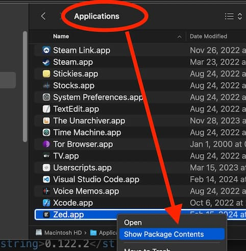
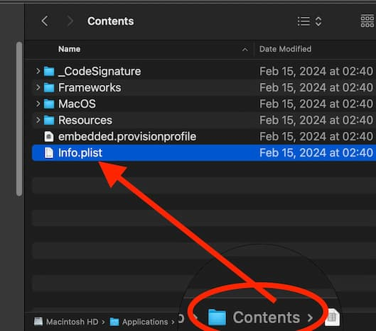
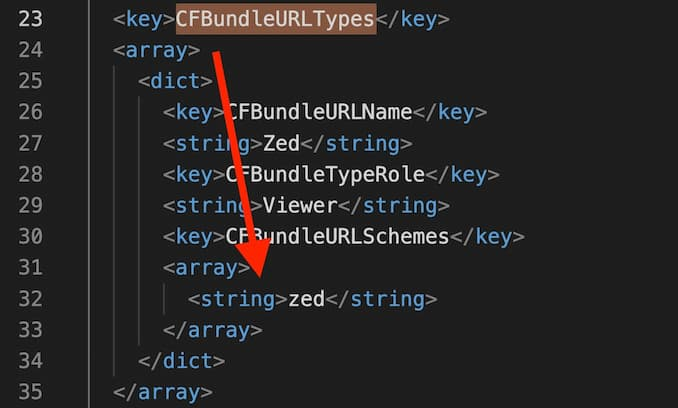

# 2024-02-20：怎麼查 Mac 上的 Universal Link.md


----------------

## 什麼是 Universal Link
Universal Link 可以讓 User 點 web `<a />` link 時，直接開啟 app

----------------

## 開發 Mac native app
- https://developer.apple.com/documentation/xcode/defining-a-custom-url-scheme-for-your-app


----------------

## 查看某 App 有沒有支援 Universal Link
這實在沒有完美的方法，如果該 App 文件沒有寫的話，只能自己去挖看看  

1. 去 `Applications` 找到該 App，然後右鍵點選 `Show Package Contents`
2. 進去 `Contents` folder，打開 `Info.plist` 檔案
3. 搜尋 `CFBundleURLTypes`，有找到的話，就代表這個 App 有支援 Universal Link

但是！問題是這樣看不出來該 App 會採用怎麼樣的 link format  
- 下面第三張圖可以看到，`CFBundleURLSchemes` 是 `zed`
- 那麼你只要在 browser 輸入 `zed://URL` 就能啟動該 App 了
- 可是我們不知道 `zed ..` 後面的格式是什麼？這個我目前還找不到方法了解，只能去試著找該 App 的文件 or source code 來看  

例如 Mac 的 `IINA` players，我就是去 Github 查才知道支援這兩種格式


  
  
  

但是！問題是這樣看不出來該 App 會採用怎麼樣的 link format  
- 下面第三張圖可以看到，`CFBundleURLSchemes` 是 `zed`
- 那麼你只要在 browser 輸入 `zed://URL` 就能啟動該 App 了
- 可是我們不知道 `zed ..` 後面的格式是什麼？這個我目前還找不到方法了解，只能去試著找該 App 的文件 or source code 來看  

例如 Mac 的 `IINA` players，我就是去 Github 查才知道支援這兩種格式
- `iina://weblink?url=URL`
- `iina://open?url=URL`


Windows 的查詢這邊有提到
- https://xuxin123.com/electron/url-scheme/

------------------

## 目前 Mac 上有哪些 URL

這可以查詢目前有哪些 binding
```
/System/Library/Frameworks/CoreServices.framework/Versions/A/Frameworks/LaunchServices.framework/Versions/A/Support/lsregister -dump | grep -i "bindings:.*:" | sort -u
```

-------------

## 自己手動加入 URL scheme
有找到一篇怎麼教人手動加入 URL scheme
- [Chris Liu: mac-custom-url-scheme-to-script](https://github.com/chrisliuqq/mac-custom-url-scheme-to-script/blob/master/README.zh_TW.md)

-----------

## 啟動 Mac 的 System Preferences
https://www.linkedin.com/pulse/creating-web-links-launch-mac-apps-preferences-script-nick-tong/

這些可以直接打開 Mac 的一些 System Preferences  
- (可能會因爲 MacOS 版本改動而有調整) 

```html
<a href="x-apple.systempreferences:com.apple.preferences.password">TouchID (com.apple.preferences.password)</a>
<a href="x-apple.systempreferences:com.apple.preference.battery">Battery (com.apple.preference.battery)</a>
<a href="x-apple.systempreferences:com.apple.preference.security">Security (com.apple.preference.security)</a>
<a href="x-apple.systempreferences:com.apple.preferences.FamilySharingPrefPane">FamilySharingPrefPane (com.apple.preferences.FamilySharingPrefPane)</a>
<a href="x-apple.systempreferences:com.apple.preference.notifications">Notifications (com.apple.preference.notifications)</a>
<a href="x-apple.systempreferences:com.apple.preference.speech">Speech (com.apple.preference.speech)</a>
<a href="x-apple.systempreferences:com.apple.preference.sidecar">Sidecar (com.apple.preference.sidecar)</a>
<a href="x-apple.systempreferences:com.apple.preferences.ClassKitPreferencePane">ClassKitPreferencePane (com.apple.preferences.ClassKitPreferencePane)</a>
<a href="x-apple.systempreferences:com.apple.preferences.AppleIDPrefPane">AppleIDPrefPane (com.apple.preferences.AppleIDPrefPane)</a>
<a href="x-apple.systempreferences:com.apple.preferences.wallet">Wallet (com.apple.preferences.wallet)</a>
<a href="x-apple.systempreferences:com.apple.preferences.sharing">SharingPref (com.apple.preferences.sharing)</a>
<a href="x-apple.systempreferences:com.apple.preferences.configurationprofiles">Profiles (com.apple.preferences.configurationprofiles)</a>
<a href="x-apple.systempreferences:com.apple.preference.universalaccess">UniversalAccessPref (com.apple.preference.universalaccess)</a>
<a href="x-apple.systempreferences:com.apple.preferences.softwareupdate">SoftwareUpdate (com.apple.preferences.softwareupdate)</a>
<a href="x-apple.systempreferences:com.apple.preference.screentime">ScreenTime (com.apple.preference.screentime)</a>
```