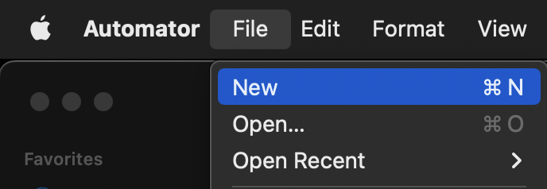
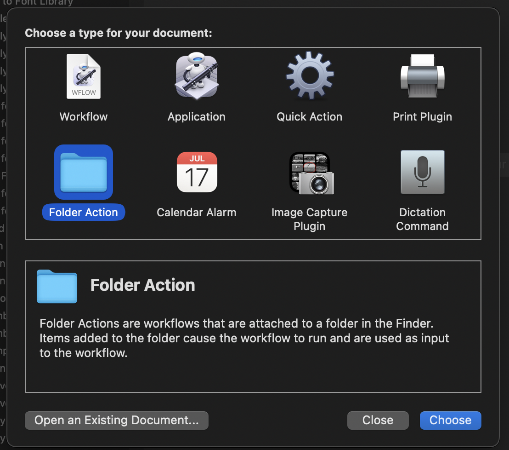
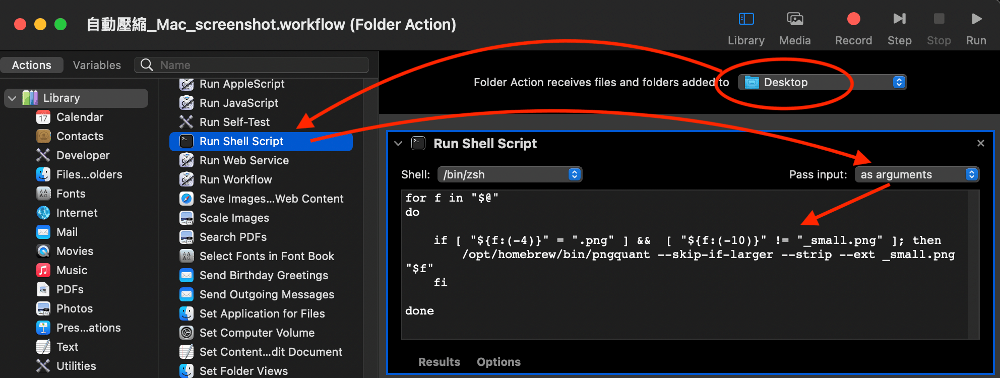
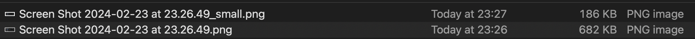

# 2024-02-23：自動壓縮 Mac 的 screenshot 圖片.md

Refs
- https://about.gitlab.com/blog/2020/01/30/simple-trick-for-smaller-screenshots/
- https://medium.com/macoclock/how-to-make-a-workflow-to-auto-compress-the-screenshot-from-mac-and-copy-it-to-clipboard-79c1c28598db

----------------

用 Mac 應該都很常會使用 `Shift, Command, and 3` or ` Shift, Command, and 4` 來截圖  

但是輸出的 PNG 檔有點太大了，有時候不方便傳輸  

---------------

## 1. 安裝 pngquant
壓縮圖片工具我選用 `pngquant`，你可以換成任何 cli tool，但後面的 script 就要自己研究

用 brew 安裝
```
brew install pngquant
```

---------------

## 2. 新增 Automator `Folder Action`

新增 Automator
  

類型選擇 `Folder Action`
  

步驟
1. 右上選擇目標 folder
    - 預設 screenshot 的位置在 `Desktop`，如果你想改，可以參考這篇
    - https://about.gitlab.com/blog/2020/01/30/simple-trick-for-smaller-screenshots/
2. 左邊選擇 `Run Shell Scrips`
3. 調整 `Pass input`
4. 貼上下面附的 script，然後存檔就完成了
  

```sh
for f in "$@"
do

  fileName=$(echo "$f" | awk -F '/' '{print $5}' ) # get file name

	if [ "${f:(-4)}" = ".png" ] && [ "${f:(-10)}" != "_small.png" ] && [[ -n $(find ~/Desktop/ -name "$fileName" -newermt "10 sec ago") ]]; then
		/opt/homebrew/bin/pngquant --skip-if-larger --strip --ext _small.png "$f"
	fi

done
```

解釋上面的 script
- 後面需要 file name，而 script 收到的參數(轉換後)是 `path/name.png`，故用 `awk` 取值
- `[ "${f:(-4)}" = ".png" ]`，screenshot 是 `png` 檔，所以只針對 `.png` 檔案
- 壓縮後的檔案名稱，我有加 postfix，`[ "${f:(-10)}" != "_small.png" ]` 是避免去處理壓縮過的圖片
- `[[ -n $(find ~/Desktop/ -name "$fileName" -newermt "10 sec ago") ]]` 利用 `find` 指令去判斷 script 收到的檔案的最後修改時間是不是在 10 秒之內
  - 在 Desktop folder 中去 rename or past 檔案時，都會觸發 `Folder Action`
  - `Folder Action` 不夠強大，不能區別行為 or 針對 screenshot，所以加判斷來避免觸發 script
- `/opt/homebrew/bin/pngquant` 執行 `pngquant`
  - (如果不是用 brew 安裝的話，記得確認一下路徑 `where pngquant`)
  - `--skip-if-larger` 如果壓縮完圖片沒有比原本檔案小的話，就不會產生檔案
  - `--strip` 刪除圖片的 metadata
  - `--ext _small.png` 壓縮圖片檔案的 postfix


截圖後大概 3 秒，就自動產生壓縮版本了  
- (會有好幾秒的其中一個原因是 Mac 截圖(聽到聲音)後，要等幾秒才會真正存到 `Desktop` folder，這時候才會觸發  script)

最後就是這樣了
  

