# 2024-02-24：筆記 Rafael Gonzaga 談 NodeJS performance: It's not fast enough
## Rafael Gonzaga,  2022/06/25
### https://www.youtube.com/watch?v=V2jGnNmbdk8&t=125s

----------------

本來還有其他事情要做的，但偷懶看完這影片後，就忍不住做筆記了。  
- 其實他提到的工具我都知道，但他解釋一些結果的細節就比較有料

[Rafael Gonzaga](https://blog.rafaelgss.com.br/) 是:
- `nodejs` core contributor
- `fastify` core member
- `clinicjs` core member
- 在 [Nearform](https://www.nearform.com/) 擔任 Performance Engineer
  - [Matteo Collina](https://twitter.com/matteocollina) 之前也在這間公司

Rafael Gonzaga blog 文章不多，但也有幾篇感覺值得看看  

Refs:
- https://blog.rafaelgss.com.br/network-performance  
- https://www.digitalocean.com/community/tutorials/js-v8-engine
- https://blog.rafaelgss.com.br/preparing-and-evaluating-benchmarks

講者的測試是用 `expressjs`，但我自己用 **fastify** 測試
- 有可能因為這樣，所以我跑不出類似講者的那些圖

----------------

## 1. 人類的平均反應時間 200ms
- `0~100ms`: 之內，人們會覺得是立即反應
- `100~300ms`: 有非常小的 deplay
- `300~1000ms`: 稍微遲疑是否有正常運作
- `1000ms+`: 可以先切去看看 Youtube，待會回來

這圖片表示了我們的優化目標  
  


----------------

## 2. Bad ISP or Bad server region

很意外 Rafael Gonzaga 談的第一點竟然是關於 ISP and server region  
- 他說很常看到大家分析 NodeJS 時，忽略的重點
- Bad ISP 導致你要經過好幾次 route 才到目的地，` HTTP 1.1three way handshaking` 會拖慢速度
- server region 這不用太多解釋，總之就是應該離 user 越近越好


| Bad ISP | Bad server region |
| :------: | :------: |
|  |  |

  

測量 RTT 的方法(roundtrip of latency)

```sh
ping -c 10 SERVER
```

```
ping -c 5 www.github.com
PING github.com (20.27.177.113): 56 data bytes
64 bytes from 20.27.177.113: icmp_seq=0 ttl=112 time=84.028 ms
64 bytes from 20.27.177.113: icmp_seq=1 ttl=112 time=83.704 ms
64 bytes from 20.27.177.113: icmp_seq=2 ttl=112 time=85.758 ms
64 bytes from 20.27.177.113: icmp_seq=3 ttl=112 time=89.451 ms
64 bytes from 20.27.177.113: icmp_seq=4 ttl=112 time=91.019 ms

--- github.com ping statistics ---
5 packets transmitted, 5 packets received, 0.0% packet loss
round-trip min/avg/max/stddev = 83.704/86.792/91.019/2.939 ms
```

(`traceroute` 應該也能挖點東西)  


Cloudflare 或其他 proxy 隱藏真實的 RTT，即 ping 僅適用 Cloudflare server
- 在這情況，建議直接 ping website 的 server IP

如果還是採用 `HTTP/1.0` 的話，記得要 `Connection: Keep-Alive`
- 這可以大幅改善 perf
- `1.1` 就是預設開啟了


----------------

## 3. Bad platform useage
這邊講 server 的 CPU or memory useage 不好的問題，跟要怎麼 debug 

測試工具
- [Autocannon](https://www.npmjs.com/package/autocannon): HTTP benchmarking tool
- [Clinic.js](https://www.npmjs.com/package/clinic): 
  - (其實 `Clinic.js` 有整合 `Autocannon` 了，但下面有其他範例需要分別用到) 


看個例子
```js
import Fastify from 'fastify'
const fastify = Fastify()

const currentClients = Array(4).fill(0).map((_, index) => {
  return {name: `Peerson ${index}`}
})

async function updateAllClientStore() {
  for (const client of currentClients) {
    await new Promise(r => setTimeout(r, 2000));
  }
}

fastify.get('/', async function (request, reply) {
  await updateAllClientStore();
  reply.send({ hello: 'world' })
})

// Run the server!
fastify.listen({ port: 3000 }, function (err, address) {
  if (err) {
    process.exit(1)
  }
  // Server is now listening on ${address}
})
```


用 `autocannon`: `-d` 20 秒，`-c` 100 concurrent connections 
```sh
autocannon -d 20 -c 100 http://localhost:3000

# 不是 -g  安裝的話，可以這樣 run
./node_modules/.bin/autocannon  -d 20 -c 100 http://localhost:3000
```

結果
```
Running 20s test @ http://localhost:3000
100 connections

┌─────────┬─────────┬─────────┬─────────┬─────────┬────────────┬─────────┬─────────┐
│ Stat    │ 2.5%    │ 50%     │ 97.5%   │ 99%     │ Avg        │ Stdev   │ Max     │
├─────────┼─────────┼─────────┼─────────┼─────────┼────────────┼─────────┼─────────┤
│ Latency │ 8017 ms │ 8030 ms │ 8043 ms │ 8043 ms │ 8031.42 ms │ 8.14 ms │ 8043 ms │
└─────────┴─────────┴─────────┴─────────┴─────────┴────────────┴─────────┴─────────┘
┌───────────┬─────┬──────┬─────┬─────────┬─────────┬─────────┬─────────┐
│ Stat      │ 1%  │ 2.5% │ 50% │ 97.5%   │ Avg     │ Stdev   │ Min     │
├───────────┼─────┼──────┼─────┼─────────┼─────────┼─────────┼─────────┤
│ Req/Sec   │ 0   │ 0    │ 0   │ 100     │ 10      │ 30      │ 100     │
├───────────┼─────┼──────┼─────┼─────────┼─────────┼─────────┼─────────┤
│ Bytes/Sec │ 0 B │ 0 B  │ 0 B │ 18.8 kB │ 1.88 kB │ 5.64 kB │ 18.8 kB │
└───────────┴─────┴──────┴─────┴─────────┴─────────┴─────────┴─────────┘

Req/Bytes counts sampled once per second.
# of samples: 20

300 requests in 20.05s, 37.6 kB read
```

接著用 `Clinic.js` 來 debug  

```sh
# 上面 NodeJS 檔案命名為 1.mjs
clinic doctor --autocannon [ -d 20 -c 100 / ] -- node ./1.mjs

# 一樣，如果不是 global 安裝的話，可以這樣執行
./node_modules/.bin/clinic doctor --autocannon [ -d 20 -c 100 / ] -- node ./1.mjs
```

可以看到 CPU useage 會是這樣多個峰值  
- 這是不好的圖案，我們 CPU 有很多閒置時間，然後有一波波巔峰被大量使用
- 別忘了 NodeJS 改善 performance 的最重要原則 -> **DONT block Event Loop**

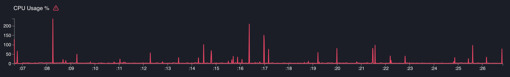  


第一個改進方向 `Promise.all`
- 這個 user case，update 動作不需要一個個做，而是可以一起執行

```js
async function updateAllClientStore() {
  // for (const client of currentClients) {
  //   await new Promise(r => setTimeout(r, 2000));
  // }
  await Promise.all(currentClients.map(() => new Promise(r => setTimeout(r, 2000))))
}
```

autocannon 的結果
- Avg Latency: `8031.42 ms` -> `2005.41 ms`
- Num of requests in 20 secs: `300` -> `1k`
```
┌─────────┬─────────┬─────────┬─────────┬─────────┬────────────┬─────────┬─────────┐
│ Stat    │ 2.5%    │ 50%     │ 97.5%   │ 99%     │ Avg        │ Stdev   │ Max     │
├─────────┼─────────┼─────────┼─────────┼─────────┼────────────┼─────────┼─────────┤
│ Latency │ 2000 ms │ 2004 ms │ 2018 ms │ 2019 ms │ 2005.41 ms │ 4.73 ms │ 2020 ms │
└─────────┴─────────┴─────────┴─────────┴─────────┴────────────┴─────────┴─────────┘

1k requests in 20.05s, 169 kB read
```


不過，我自己測試起來 CPU useage 的圖型沒有變好多少。影片中的圖已經幾乎沒有一條條的峰值了，不知道講者怎麼測試的
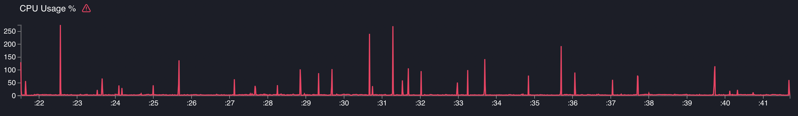  


但是！！！！，`Promise.all` 也是有陷阱的。如果今天是這樣
- promise 太多，一次全下會有問題
- 所以 promise length 是 unlimit or 太多就不能直接用 `Promise.all` 
  - (多少算多，這依據 task 重不重)
```js

//                         4 -> 1000
const currentClients = Array(1000).fill(0).map((_, index) => {
  return {name: `Peerson ${index}`}
})

async function updateAllClientStore() {
  await Promise.all(currentClients.map(() => new Promise(r => setTimeout(r, 2000))))
}
```

如果單看 request 數量的話 `Array(1000)` 的 case 也是很好，但 memory useage 卻很差

| `Array(4)` |
| :------: |
| 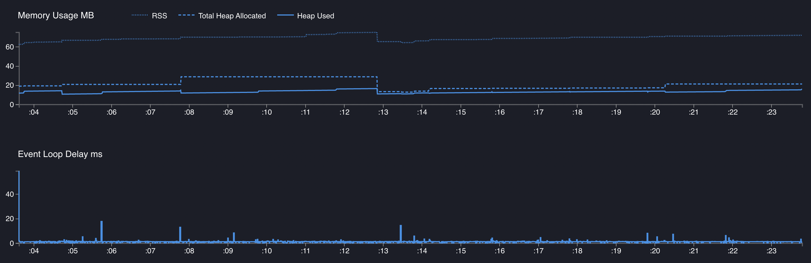 |
| `Array(1000)` |
| 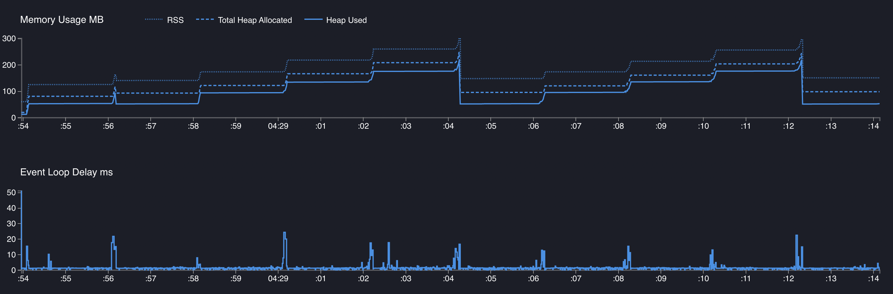 |

這是因為 NodeJS 在做 Garbadge Collection
- 而 GC 是 synchronous 行為
- GC 會 block **Event Loop** (可以看到 `Event Loog Delay` 都比較高)

改善方法 -> 限制一次最多能跑多少 Promise
- [p-limit](https://www.npmjs.com/package/p-limit) (類似的 lib 都可以，這套是講者給的範例)


```js
import pLimit from 'p-limit';

const limit = pLimit(300);

const currentClients = Array(1000).fill(0).map((_, index) => {
  return { name: `Peerson ${index}` }
})

async function updateAllClientStore() {
  await Promise.all(
    currentClients.map(() => limit(() => new Promise(r => setTimeout(r, 2000))))
  )
}
```

可以看到 `Event Loog Delay` 的峰值變少了
- (但最大值變大了，不知道這樣算不算好)

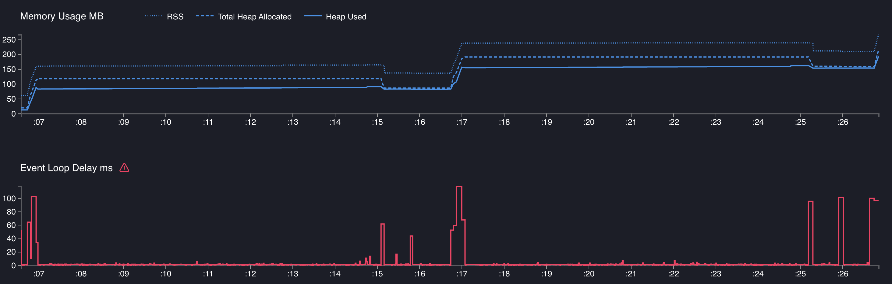  


----------------

## 4. Profiling

第 2 個 case

```js
import Fastify from 'fastify'
const fastify = Fastify({ logger: false })

let obj = { a: 1 }
for (let index = 0; index < 15; index++) {
  obj = { obj1: obj, obj2: obj }
}

function sumValues() {
  let sum = 0;
  for (let index = 0; index < 9999990; index++) {
    sum += index
  }
  return sum;
}

fastify.get('/', function (_, reply) {
  const sum = sumValues()
  const rawData = JSON.stringify(obj)
  reply.send(rawData + sum)
})

// Run the server!
fastify.listen({ port: 3000 }, function (err, address) {
  if (err) {
    process.exit(1)
  }
})
```


用 `clinic` 跑火焰圖

```sh
# 上面 NodeJS 檔案命名為 2.mjs
clinic flame --autocannon [ -d 20 -c 100 / ] -- node ./2.mjs

# for local install
./node_modules/.bin/clinic flame --autocannon [ -d 20 -c 100 / ] -- node ./2.mjs
```

這是結果
- 但是，從中間橘色(矮一階)那邊開始，有些東西 missing 了
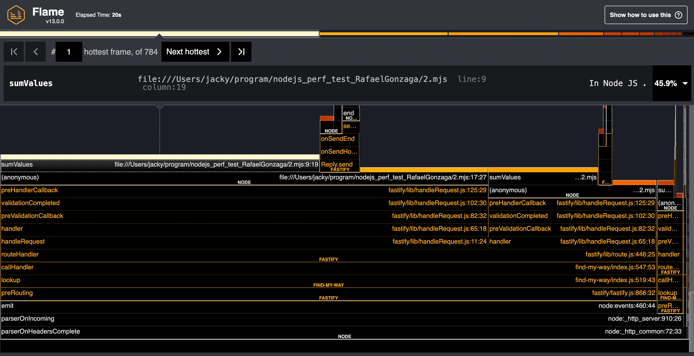  

這時候需要做 Kernel Tracing (**這只支援 Linux**，Win and Mac 都不能用 ...)
- 需要兩個 terminal

1. 
```sh
# 上面 NodeJS 檔案命名為 2.mjs
clinic flame --kernel-tracing -- node ./2.mjs

# for local install
./node_modules/.bin/clinic flame --kernel-tracing -- node ./2.mjs
```

2. 第二個
```sh
autocannon -c 100 http://localhost:3000

# or
./node_modules/.bin/autocannon -c 100 http://localhost:3000
```

kernel-tracing 後，會像這樣
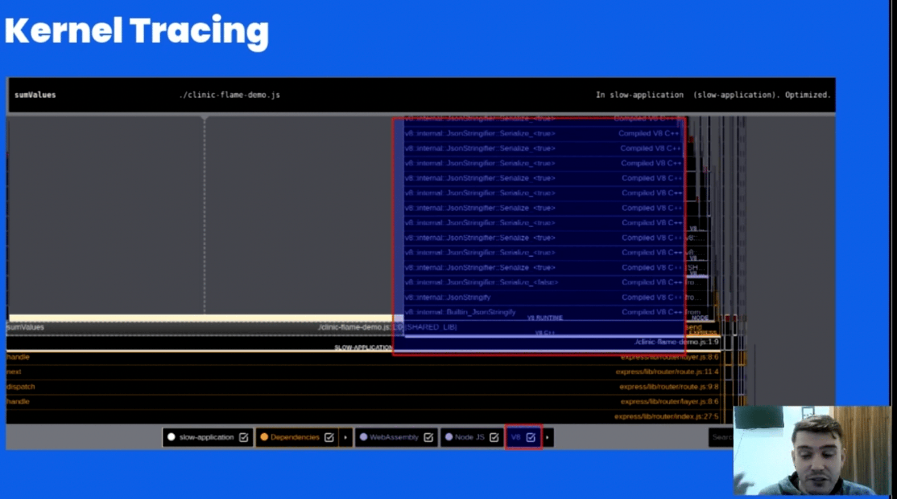  


BTW
- `JSON.stringify` and `JSON.parse` 都是 synchronous
- 所以在處理大的 `object` 時，要注意效能  
 

----------------

## 5. V8 Tricks: inlining

V8 在解析程式碼時，有時候，會 inline code

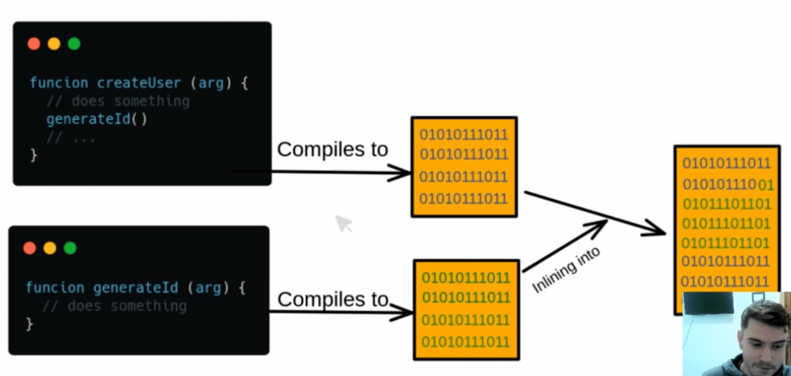  

用程式碼解釋的話。假設程式碼是這樣:
```js
const square = (x) => { return x * x }

const callFunction100Times = (func) => {
  for(let i = 0; i < 100; i++) {
    // the func param will be called 100 times
    func(2)
  }
}

callFunction100Times(square)
```

被 V8 inline 後會變這樣
```js
const square = (x) => { return x * x }

const callFunction100Times = (func) => {
  for(let i = 100; i < 100; i++) {
    // the function is inlined so we don't have 
    // to keep calling func
    return x * x
  }
}

callFunction100Times(square)
```

Note:
- 能有 5 ~ 10% 的 performance 優化
- V8 不會全部都做 inline，是有數量限制的，`because the risks of deopts are too high`
  - (後面那句話是作者 PPT 寫的，他沒有解釋細節。`deops` 是指 `de-optimization`)


要測試的話，`node` 有 `--no-turbo-inlining` flag 可以下
```js
node --no-turbo-inlining index.js
```

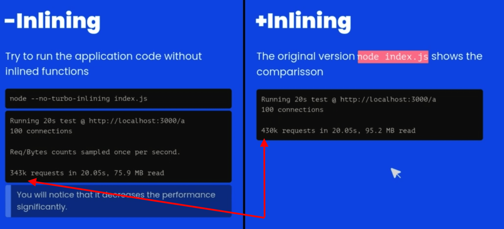  

----------------

## V8 Tricks: `Hidden Classes`

存取 objact property 是最頻繁的操作
- 所以改善這個行為對 perf 很重要
- 為了改善這行為，所有的 JavaScript engine 都有引入一個機制 `the concept of shapes`
  - (也被稱為 `Hidden Classes`)


當 JavaScript 建立新 object 時，它會根據 object 的屬性來建立一個 `Hidden Classes`
- 這 `Hidden Classes` 會記錄 object 的屬性名稱和它們的位置，以便訪問時可以更快找到它們
- 當建立另個新 object 時，如果屬性與現有的 `Hidden Classes` 相同，它就會直接使用這個現有的 `Hidden Classes`
- 這樣可以節省時間，因為 JavaScript 不需要重新建立一個新的 `Hidden Classes`
- 如果新的屬性與現有的不同，就需要建立一個新的 `Hidden Classes`。會花費更多的時間，因為要重新計算屬性位置

所以 `Hidden Classes` 能非常有效改善 memory management

```js
// 這兩個 obj 是 same shapes
const a = { x: 1, y: 2 }
const b = { x: 3, y: 4 }

// 這兩個 obj 不是 same shapes
const a = { x: 1, y: 2 }
const b = { y: 1, x: 2 }

// 這兩個 obj 不是 same shapes

const a = { x: 1, y: 2, z: 3 }
const b = { x: 1, y: 2}
b.z = 3 // 新增屬性會有所謂的 Transitions
```

| `Same Shapes` | `Not Same Shapes` |
| :------: | :------: |
| 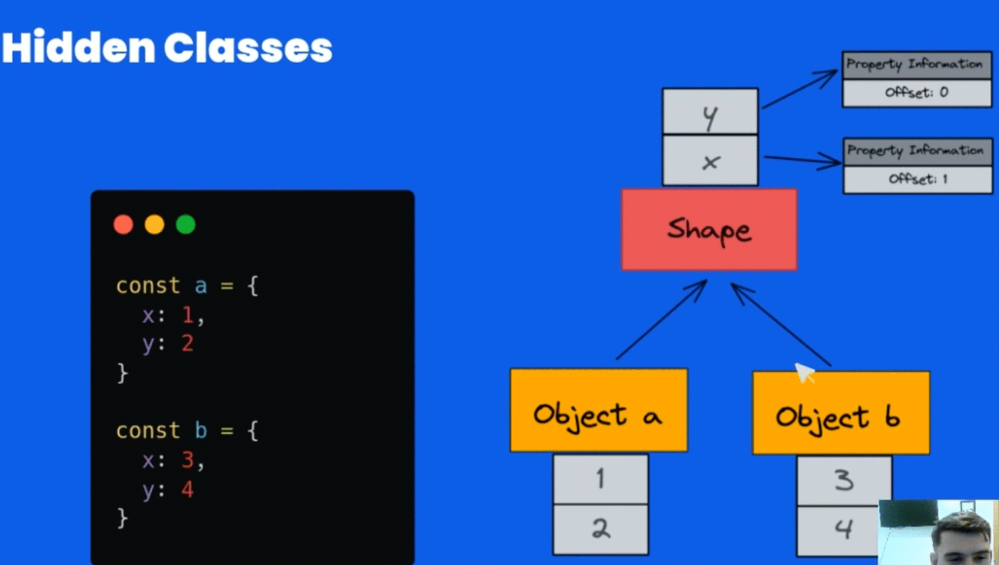 | 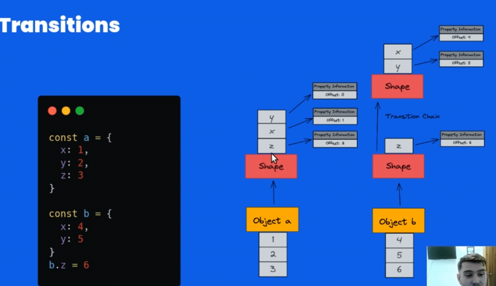 |


----------------

## V8 Tricks: Dont use `delete`
有經驗一點的 developer 應該都知道，盡量避免用 `delete` 處理 object，因為慢
- 為什麼會慢？就是因為要處理 `shape`  

```js
delete Employee.firstname;
```


所以一律使用 assign `undefined`

```js
Employee.firstname = undefined;
```

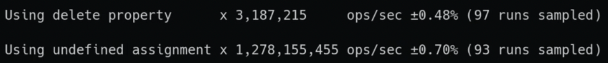  


----------------

## 6. Framework

別再用 `expressjs` 了，已經不是 active maintain 專案了  
盡量 fastify 吧  


----------------

## 7. 不要使用 private properties (NodeJS v16 以前有 perf 問題，v18 就沒關係)

v16 以前，改用
1. 用 `_Name` convention, or 
2. 用 `Symbol` 處理

```js
class A {
  constructor() { this._privateProp = 0 }
}

// or
const kPrivateProp = Symbol('private-prop')

class A {
  constructor() { this[kPrivateProp] = 0 }
}
```

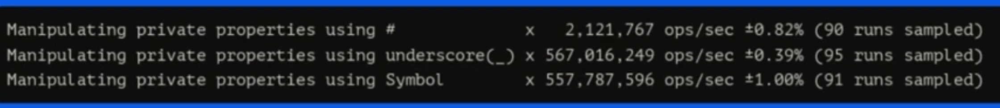  


----------------

## 8. 如何避免 regressions 造成的 perf 問題
靠 CI 跑類似 [autobench](https://github.com/RafaelGSS/autobench) 來檢測


----------------

## 測試 benchmark 時，應該要跑多少次？

The answer depends on the variance interval. The Rigorous Benchmarking in Reasonable Time¹ is an excellent resource on this topic, this paper shows how to establish the repetition count necessary for any evaluation to be reliable.

Student’s test (t-test) is a statistical method used in the testing of the null hypothesis(H0) for the comparison of means between groups. Running a t-test helps you to understand whether the differences are statistically significant — However, if performance improvements are large, 2x more, for example, there is no need for statistical machinery to prove they are real. A practical example of this method in an application is the Node.js core benchmarking suite and autocannon-compare.


答案取決於變異數區間
- [Rigorous Benchmarking in Reasonable Time](https://kar.kent.ac.uk/33611/45/p63-kaliber.pdf) 深入研究這議題，如何評估可靠所需的次數

`t 檢定`(又稱 `Student's t-test`)
- 用於檢定原假設 (H0) 組間平均值的比較
- 可以幫助了解差異是否存在**統計上顯著**
- 如果效能改進很大，例如 2 倍以上，就沒有必要證明統計上的顯著了

NodeJS 的 benchmark 就是實際範例
- https://github.com/nodejs/node/tree/main/benchmark

在計算信賴區間時，樣本數 n (基準執行)被分成兩組:
- n is large (usually ≥ 30).
- n is small (usually < 30).


以下是更改之前 (A) 和更改之後 (B) 的 benchmark 結果的集合:
```js
const ttest = require('ttest')
const A = [
  46.37, 45.43, 45.1, 43.25, 45.51,
  46.8,  45.3, 43.58, 43.3, 45.42,
  46.02, 44.5, 43.94, 43.67, 43.55,
  43.71, 46.62, 46.56, 43.5, 43.84,
  45.75, 43.86, 46.76, 43.32, 44.08,
  45.92, 46.2, 46.24, 43.97, 43.03
]
const B = [
  45.69,  43.3, 45.16, 44.66,
  42.27, 42.83, 43.28, 43.01,
  43.37, 44.64, 44.85, 44.61,
  42.05, 44.01,  43.9, 42.39,
  42.24, 45.22, 45.66, 45.31,
  45.33, 45.02, 43.26, 44.43,
  45.53, 42.19, 42.44, 43.66,
  44.66, 45.55
]
```

`t 檢定`
- 依賴於每組的平均值
- 在處理 HTTP Benchmarks 時，會有異常值可(outliers)發生，這種情況，使得均值變得毫無用處，所以要小心均值
- 始終將資料繪製成圖表，以便了解其行為

`ttest` 能計算顯著性:
```js
const ttest = require('ttest')

const res = ttest(A, B, { varEqual: true, alpha: 0.05 })
if (res.pValue() <= 0.05) {
  console.log(`It's a significant difference`)
} else {
  console.log(`It's NOT a significant difference`)
}
console.log('Confidence', res.confidence())
// It's a significant difference -  0.013473423154103548
// Confidence [ 0.17589819701261267, 1.4627684696539962 ]
```

分析能夠確定測量中觀察到的差異是否是由於隨機波動造成的，測量結果或由於替代方案相互比較的實際差異
- 通常，5% threshold 是用於識別實際差異
- 作為機率測試，目前結果可以讓你說：「95% 確定我的優化是有效果的」


-----------

## 0x
[0x](https://github.com/davidmarkclements/0x)
- single-command flamegraph profiling