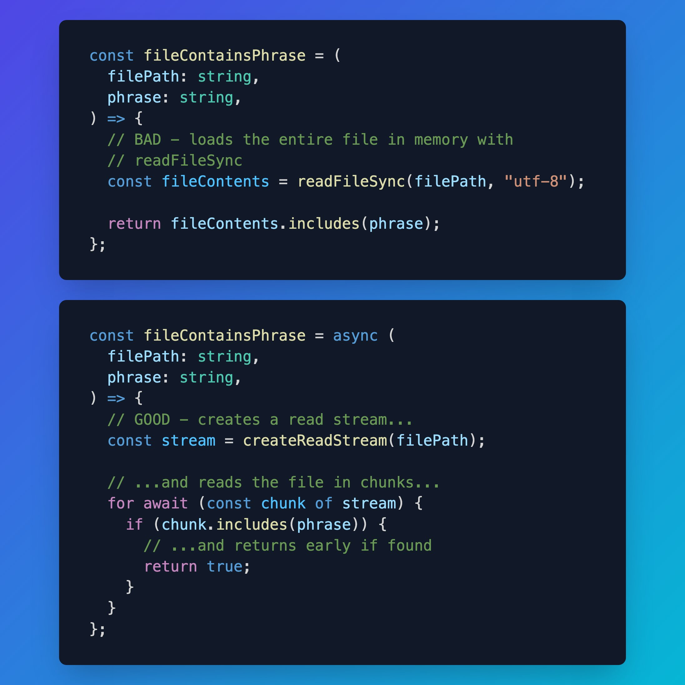
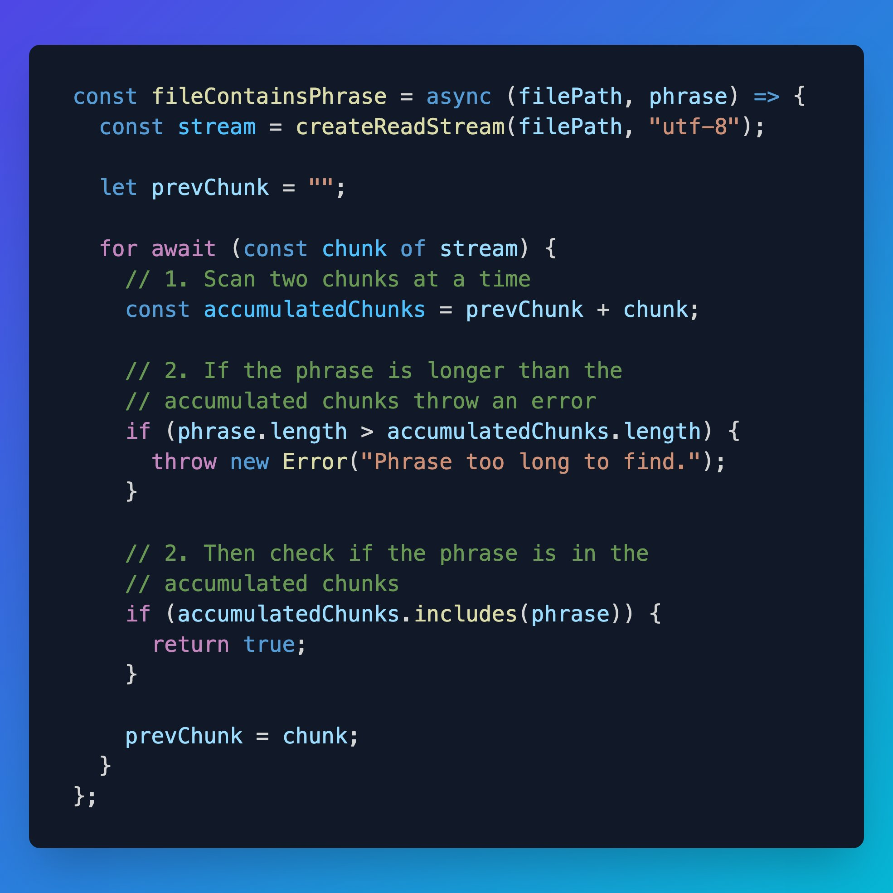
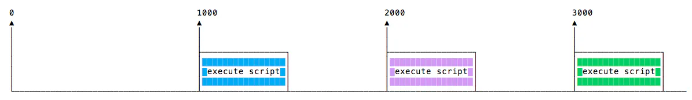
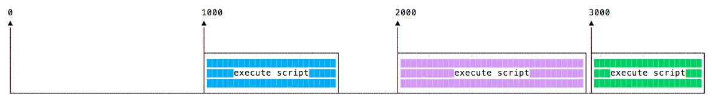
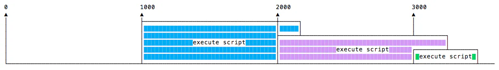

# 2024-07-24：筆記 NodeJS 的 Asyn documentation.md

## ref: https://nodejs.org/en/learn/asynchronous-work/asynchronous-flow-control

## https://blog.platformatic.dev/the-nodejs-event-loop

---

NodeJS 的官方文件好像這幾年有全面重寫，一直想要重新讀看看

- 先從 async 的開始 (太過基礎的內容我會忽略)
- 以前應該看過 event loop 文件，但都忘光了

另外又看到一篇 Matteo Collina 寫的

- The Node.js Event Loop

預計看完後再去聽 Masterclass

- https://www.youtube.com/playlist?list=PL_x4nRdxj60K2j9l_SflmqmaTA2XVBuqc

---

## Asynchronous 的 flow control

從本質上講，JavaScript 設計在 main thread 為 non-blocking 式

- 這是渲染 view 的地方
- 可以想像這在 browser 中的重要性。 當 main thread 被阻塞時，會導致 freezing，並且無法調度其他事件

這造成了一些限制，這就是 callbacks 發揮作用的地方

- 然而，在更複雜的過程中，會導致 callbacks hell
- 使 code 更難以閱讀、debug

```js
async1(function (input, result1) {
  async2(function (result2) {
    async3(function (result3) {
      async4(function (result4) {
        async5(function (output) {
          // do something with output
        });
      });
    });
  });
});
```

當然，在實務中很可能有額外的 code 處理 result1, result2 等等

- 因此，正常的 code 通常會上面的範例更混亂。

這就是 function 大有用處的地方。更複雜的操作由許多 function 組成:

1. initiator style / input (發起者類型/輸入)
2. middleware (中間層)
3. terminator (終結者)

`initiator style / input` 是序列中的第一個功能

- 此 function 將接受操作的輸入(如果有)
- 此操作是一系列可執行的 function

原始輸入主要是:

1. global 中的變數
2. 帶或不帶參數的直接呼叫
3. 透過檔案系統或網路請求所取得的值
   - 網路請求可以是由外部網路、同一網路上的另一個 application 或同一或外部網路上的 application 本身發起的傳入請求

`middleware` function 將傳回另一個 function  
`terminator` function 將呼叫 callback 回調

下面說明了網路或檔案系統請求的流程。 這裡的延遲為 0，因為所有這些值都在記憶體中可用。

```js
function final(someInput, callback) {
  callback(`${someInput} and terminated by executing callback `);
}

function middleware(someInput, callback) {
  return final(`${someInput} touched by middleware `, callback);
}

function initiate() {
  const someInput = "hello this is a function ";
  middleware(someInput, function (result) {
    console.log(result);
    // requires callback to `return` result
  });
}

initiate();
```

---

## State management (狀態管理)

function 可能依賴狀態，也可能不依賴狀態

- 當 function 的 input 或其他變數依賴外部 function 時，就會出現狀態依賴性

主要有兩種的狀態管理策略:

1. 將變數直接傳給 function，以及
2. 從 cache, session, file, DB、網路或其他外部來源取得變數值

這裏沒有提到 global variable

- 使用 global variable 管理狀態通常是一種草率的 anti-pattern
- 這使得保證狀態變得困難或不可能
- 應盡可能避免複雜程式中的 global variable

---

## Control flow (控制流)

如果記憶體中存在可用 object，則可以進行迭代，並且控制流不會發生變化:

```js
function getSong() {
  let _song = "";
  let i = 100;
  for (i; i > 0; i -= 1) {
    _song += `${i} beers on the wall, you take one down and pass it around, ${
      i - 1
    } bottles of beer on the wall\n`;
    if (i === 1) {
      _song += "Hey let's get some more beer";
    }
  }

  return _song;
}

function singSong(_song) {
  if (!_song) throw new Error("song is '' empty, FEED ME A SONG!");
  console.log(_song);
}

const song = getSong();
// this will work
singSong(song);
```

但是，如果資料存在於記憶體之外，則迭代將不再起作用:
(for 迴圈裡面套用了 `setTimeout` 中另一個 function)

```js
function getSong() {
  let _song = "";
  let i = 100;
  for (i; i > 0; i -= 1) {
    /* eslint-disable no-loop-func */
    setTimeout(function () {
      _song += `${i} beers on the wall, you take one down and pass it around, ${
        i - 1
      } bottles of beer on the wall\n`;
      if (i === 1) {
        _song += "Hey let's get some more beer";
      }
    }, 0);
    /* eslint-enable no-loop-func */
  }

  return _song;
}

function singSong(_song) {
  if (!_song) throw new Error("song is '' empty, FEED ME A SONG!");
  console.log(_song);
}

const song = getSong("beer");
// this will not work
singSong(song);
// Uncaught Error: song is '' empty, FEED ME A SONG!
```

為什麼會發生這種情況？

- `setTimeout`指示 CPU 將指令存在其他位置，並指示安排稍後拾取資料
- 在 function 再次到達 `0ms` 之前，數千個 CPU 週期過去了
- CPU 從 bus 取得指令並執行
- 唯一的問題是歌曲 (`''`) 已在數千個週期之前返回

在處理檔案系統和網路請求時也會出現同樣的情況

- main thread 根本不能被阻塞一段不確定的時間
- 因此，我們用 callback 以受控的方式及時安排 code 的執行

你能用以下 3 種模式執行幾乎所有操作:

### 1. 序列: function 將按照嚴格的順序執行，類似 for loop

```js
// operations defined elsewhere and ready to execute
const operations = [
  { func: function1, args: args1 },
  { func: function2, args: args2 },
  { func: function3, args: args3 },
];

function executeFunctionWithArgs(operation, callback) {
  // executes function
  const { args, func } = operation;
  func(args, callback);
}

function serialProcedure(operation) {
  if (!operation) process.exit(0); // finished
  executeFunctionWithArgs(operation, function (result) {
    // continue AFTER callback
    serialProcedure(operations.shift());
  });
}

serialProcedure(operations.shift());
```

### 2. 完全並行: 當順序不是問題時，例如透過 mail 發送包含 1,000,000 個收件人的清單

```js
let count = 0;
let success = 0;
const failed = [];
const recipients = [
  { name: "Bart", email: "bart@tld" },
  { name: "Marge", email: "marge@tld" },
  { name: "Homer", email: "homer@tld" },
  { name: "Lisa", email: "lisa@tld" },
  { name: "Maggie", email: "maggie@tld" },
];

function dispatch(recipient, callback) {
  // `sendEmail` is a hypothetical SMTP client
  sendMail(
    {
      subject: "Dinner tonight",
      message: "We have lots of cabbage on the plate. You coming?",
      smtp: recipient.email,
    },
    callback
  );
}

function final(result) {
  console.log(`Result: ${result.count} attempts \
      & ${result.success} succeeded emails`);
  if (result.failed.length)
    console.log(`Failed to send to: \
        \n${result.failed.join("\n")}\n`);
}

recipients.forEach(function (recipient) {
  dispatch(recipient, function (err) {
    if (!err) {
      success += 1;
    } else {
      failed.push(recipient.name);
    }
    count += 1;

    if (count === recipients.length) {
      final({
        count,
        success,
        failed,
      });
    }
  });
});
```

### 3. 有限並行: 例如向 10E7 使用者清單中的 1,000,000 位發送 mail

```js
let successCount = 0;

function final() {
  console.log(`dispatched ${successCount} emails`);
  console.log("finished");
}

function dispatch(recipient, callback) {
  // `sendEmail` is a hypothetical SMTP client
  sendMail(
    {
      subject: "Dinner tonight",
      message: "We have lots of cabbage on the plate. You coming?",
      smtp: recipient.email,
    },
    callback
  );
}

function sendOneMillionEmailsOnly() {
  getListOfTenMillionGreatEmails(function (err, bigList) {
    if (err) throw err;

    function serial(recipient) {
      if (!recipient || successCount >= 1000000) return final();
      dispatch(recipient, function (_err) {
        if (!_err) successCount += 1;
        serial(bigList.pop());
      });
    }

    serial(bigList.pop());
  });
}

sendOneMillionEmailsOnly();
```

每個都有自己的用例、優點和問題

- 最重要的是，記住 modularize 你的操作並使用 callback
- 如果有任何疑問，將所有內容視為 middleware

---

## 接著來看看 Blocking vs Non-Blocking

- 後續提到 `I/O` 主要指 `libuv` 與系統磁碟的交互和支援的網路的部分

---

## Blocking

- Blocking 是指在 Node.js 中執行額外的 JavaScript 時 process 必須等到 non-JavaScript operation 完成
- 因為 blocking operation 正在發生，所以 event loop 無法繼續運行 JavaScript

在 Node.js 中，JavaScript 由於 CPU 密集的較差效率，通常不會等待 non-JavaScript operation (例如 `I/O`)

- Node.js 標準函式庫中的同步方法，使用 `libuv` 的操作是最常用的 blocking operations
- Native modules 也可能有 **blocking** 的 methods
- Node.js 標準函式庫中的所有 I/O 方法都有提供 asynchronous 版本，並接受 callback function

---

## 比較一下 Blocking 跟 non-blocking code

以 `fs` 為例，這是個 synchronous file read:

- 第二行阻止任何其他 JavaScript 的執行，直到整個文件被讀取
- 在 synchronous 版本中，如果發生錯誤，拋出它需要被 catch，否則 process 會 crash

```js
const fs = require("node:fs");
const data = fs.readFileSync("/file.md"); // blocks here until file is read
```

asynchronous 範例:

- 在 asynchronous 版本，由 developer 決定是否要 throw error

```js
const fs = require("node:fs");

fs.readFile("/file.md", (err, data) => {
  if (err) throw err;
});
```

稍微擴展一下例子:

```js
const fs = require("node:fs");

const data = fs.readFileSync("/file.md"); // blocks here until file is read
console.log(data);
moreWork(); // will run after console.log
```

asynchronous 範例:

- `fs.readFile()`是 asynchronous，所以 JavaScript 可以繼續執行
- 並且 `moreWork()` 將先被呼叫
- 執行 `moreWork()`，且不等待檔案讀取完成是個允許更高吞吐量的關鍵設計

```js
const fs = require("node:fs");

fs.readFile("/file.md", (err, data) => {
  if (err) throw err;
  console.log(data);
});
moreWork(); // will run before console.log
```

(題外話，既然這邊用 read file 舉例，我順便放上最近看到的一個小例子，這例子在 master class 上好像也有提到)

第一張圖: Beware loading entire files into memory. If you can, use `createReadStream` and `for await...of`. This performs 1.75 faster finding a phrase in a 50MB file:



上面那張圖的下面解法有 bug，也就是當目標大於 chunk 時，所以有改進版的，就是下面這張圖  


---

## Concurrency and Throughput (並行和吞吐量)

Node.js 中的 JavaScript 執行是 single threaded 的

- 因此 concurrency 指的是 event loop 完成其他工作後，執行 JavaScript callback function 的能力
- 任何預計以 concurrent 方式運行的 code 都必須允許 event loop 繼續執行 non-JavaScript operations (如 `I/O`)

來考慮這情況:

- 對 Web server 的每個 request 都需要 50ms 完成
- 其中 50ms 的 45ms 是可以 asynchronously 完成的資料庫 I/O 異步地
- 選擇 non-blocking asynchronous 操作可以釋放 45ms，來處理其他 request
- 這是顯著的差異，只需選擇使用 non-blocking methods 而不是 blocking

event loop 與許多其他語言中的模型不同

- 其中可以建立額外的 threads 來處理 concurrent 工作

---

## 混合 Blocking 和 Non-Blocking code 的危險

處理 `I/O` 時應避免一些模式:

```js
const fs = require("node:fs");

fs.readFile("/file.md", (err, data) => {
  if (err) throw err;
  console.log(data);
});
fs.unlinkSync("/file.md");
```

在上面的例子中

- `fs.unlinkSync()` 可能在 `fs.readFile()` 執行前就執行了
- 這會在 `file.md` 實際讀取之前，就把它 unlink

更好的寫法是:

```js
const fs = require("node:fs");

fs.readFile("/file.md", (readFileErr, data) => {
  if (readFileErr) throw readFileErr;
  console.log(data);
  fs.unlink("/file.md", (unlinkErr) => {
    if (unlinkErr) throw unlinkErr;
  });
});
```

放 `fs.unlink()` 在 callback 內 `fs.readFile()`，這保證操作順序的正確

Additional Resources

- [libuv](https://libuv.org/)

---

## `setTimeout` Zero delay

如果指定 `0`，callback function 會盡快執行

- 但是在目前 function 執行之後

```js
setTimeout(() => {
  console.log("after ");
}, 0);

console.log(" before ");

// Reuslt: 代碼將會列印
// before
// after
```

這對於

- 避免在 function 執行繁重、密集型計算時任務上阻塞 CPU
- 讓其他 function 進來排隊執行

有些 browser (`Edge`)實作了 `setImmediate()` 方法執行相同的功能

- 但它不是標準、在其他 browser 上不可用
- 但 Node.js 中是標準 function

`setInterval()` and `clearInterval`

- 在 `setInterval` 的 callback 中呼叫 `clearInterval` 是很常見的
- 讓它自動決定是否應該再次運作或停止

例如

```js
const interval = setInterval(() => {
  if (App.somethingIWait === "arrived") {
    clearInterval(interval);
  }
  // otherwise do things
}, 100);
```

---

## Recursive setTimeout

`setInterval` 每 `n` 毫秒啟動一個 function，而不考慮 function 何時完成執行

如果 function 總是花費相同的時間，那就沒問題:


也許 function 需要不同的執行時間，取決於網路條件，例如:


也許一個某次執行會與下次執行重疊:


為了避免這種情況

- 可以安排在 callback function 完成時呼叫 recursive setTimeout:

```js
const myFunction = () => {
  // do something
  setTimeout(myFunction, 1000);
};

setTimeout(myFunction, 1000);
```

上面的 code，就會是這個情境:


---

## Node.js 的 event loop

Event loop 允許 Node.js 執行 non-blocking I/O operations

- 儘管預設使用 single JavaScript thread
- 透過盡可能對 kernek 做 offloading operations

由於大多數現代 kernel 都是 multi-threaded

- 因此它們可以處理多個 operations
- 當這些 operations 之一完成後，kernel 告訴 Node.js 以便進行適當的 callback 可能會被加到 poll queue 中以最終被執行

---

## Event loop 解釋

當 Node.js 啟動時

- 它會初始化 event loop
- 處理輸入的 scropt (或丟到放入 [REPL](https://nodejs.org/api/repl.html#repl_repl) 中)
- 可能會進行異步 API call, schedule timers, or `call process.nextTick()`，然後開始處理 event loop

下圖為 event loop 的簡化概述、操作順序:

```
   ┌───────────────────────────┐
┌─>│           timers          │
│  └─────────────┬─────────────┘
│  ┌─────────────┴─────────────┐
│  │     pending callbacks     │
│  └─────────────┬─────────────┘
│  ┌─────────────┴─────────────┐
│  │       idle, prepare       │
│  └─────────────┬─────────────┘      ┌───────────────┐
│  ┌─────────────┴─────────────┐      │   incoming:   │
│  │           poll            │<─────┤  connections, │
│  └─────────────┬─────────────┘      │   data, etc.  │
│  ┌─────────────┴─────────────┐      └───────────────┘
│  │           check           │
│  └─────────────┬─────────────┘
│  ┌─────────────┴─────────────┐
└──┤      close callbacks      │
   └───────────────────────────┘
```

每個框被稱為 event loop 的一個 `phase`

- 每個 `phase` 都有一個要執行的 callback 的 FIFO queue
- 雖然每個 `phase` 都有各自特殊的處理方法，但通常，當 event loop 進入給定的時間時，它將執行特定於該 `phase` 的任何操作
- 然後，在該 `phase` 的 queen 中執行 callback，直到 queen 已完成、已耗盡或已執行最大數量的 callbakc
- 當 queen 已耗盡或達到 callback 限制，該 loop 將進入下一個階段，依此類推

當這些操作中的任何一個可能排程更多 operations 時，並且在 `poll phase` 處理的新事件會被 kernel 安排排隊

- 因此在處理 poll event 時，poll envet 可以被排隊
- 因此 `poll phase` 中，callback 的執行時間，被允許超過計時器的閾值
- (Windows 和 Unix/Linux 實作有些差異)

Phases 概述

- `timers` (計時器): 此階段執行由 `setTimeout()` 和 `setInterval()` 安排的 callback
- `pending 的 callbacks`: 執行被推延到下一個 loop 的 `I/O` callbacke
- `idle, prepare`: 僅在內部使用
- `poll`: 檢索新的 `I/O` event、執行 `I/O` 相關的 callback (幾乎除了由 timer 安排的 close callback 和 `setImmediate()` 之外)； node 會在適當的時候阻塞在這裡
- `check`: `setImmediate()` callbacks 在這邊呼叫
- `close callbacks`: 一些 close 的 callback，例如 `socket.on('close', ...)`

在每輪 event loop 之間

- Node.js 都會檢查是否正在等待 任何 asynchronous `I/O` 或 timer，和有沒有任何沒有完整清除關閉的東西

---

### `timers` (計時器) 階段

`timer` 是指具體一段時間後，會執行 callback function

- Timers 會儘可能的早點去執行已經超過時間的 callback
- 然而，OS scheduling 或者其他正在執行的 callback 可能回 deply (後續的) callback
- 技術上講，`poll(輪詢)` 階段控制 timers 何時執行

例如，假設安排一個 function 在超過 `100ms` 後執行

- 然後你的 script 開始異步讀取檔案需要 `95ms`

```js
const fs = require("node:fs");

function someAsyncOperation(callback) {
  // Assume this takes 95ms to complete
  fs.readFile("/path/to/file", callback);
}

const timeoutScheduled = Date.now();

setTimeout(() => {
  const delay = Date.now() - timeoutScheduled;

  console.log(`${delay}ms have passed since I was scheduled`);
}, 100);

// do someAsyncOperation which takes 95 ms to complete
someAsyncOperation(() => {
  const startCallback = Date.now();

  // do something that will take 10ms...
  while (Date.now() - startCallback < 10) {
    // do nothing
  }
});
```

當 event loop 進入 `poll` 階段時

- 它有一個空的 queue (`fs.readFile()`還沒有完成)
- 所以會等待剩餘的時間直到達到最快計時器的 threshold
- 雖然它是等待 `95ms` 過去，但 `fs.readFile()` 完成讀文件及需要 `10ms` 才能完成的 callback 被加到 poll queue 中，並且被執行。callback 完成後，queue 中就沒有其他 callback 了
- 因此 event loop 將看到最快的閾值 已到達計時器，然後返回 計時器 階段執行 計時器的回調

這個範例的總延遲，從 callback 被排進去，直到執行，會是 `105ms`

(為了防止 `poll` phase 使 event loop 挨餓，libuv 在停止 polling 更多 event 之前還有一個硬性最大值(取決於系統))

### pending callbacks 階段

這階段執行一些系統操作的 callback，例如

- TCP 錯誤類型
- TCP socket 嘗試連接時，接收到 `ECONNREFUSED` 什麼時候
- 某些 `*nix` 系統想要等待錯誤報告

這些都會在 pending callback 的 queue 中等待處理

### poll (輪詢) 階段

poll 有兩個主要功能:

- 計算應該阻塞和輪詢 的 `I/O` 的時間，然後
- 處理 poll queue 中的 evnet

當 event loop 進入 poll 階段，並且沒有定時器的 Scheduled 時，將會發生以下兩種情況之一:

1. 如果 poll queue 不是空的，則 event loop 將一個個執行(synchronously) queue 裡面的 callback，直到 queue 沒有任何 callback 了，又或者，或者 OS 限制的 hard limit time 到達了
2. 如果 poll queue 是空的，則另外兩件事之一將發生:
   1. 如果 `setImmediate()` 有安排了某些 script，event loop 將結束 `poll` 階段，然後到 `chech` 階段去執行這些 script
   2. 如果 `setImmediate()` 沒有安排，event loop 將等著其他 callback 加進 queue 中，然後立即執行這些 callback

一旦 poll queue 為空

- event loop 將檢查 timers
- 如果 timer 時間到了， event loop 將回到 `timers` phase，執行那些 timer 的 callback

### check 階段

- 此階段允許人在 `poll` 階段一完成就立刻執行 callback
- 如果 `poll` 變成 idle，而且有 `setImmediate()` 安排了 script，event loop 可能會繼續 `check` 階段，而不是 waiting

`setImmediate()`

- 實際上是在 event loop 之外的一個單獨運行的特殊 timer
- 它是用 libuv API 來安排 callback 在 `poll` 階段結束後執行

隨著程式執行，event loop 一般來說，最終都會到 `poll` 階段

- 它將等待傳入的 connection, request 等等
- 但是，如果 `setImmediate()` 已經安排 callback 並且 `poll` 階段變得 idle，它將結束並繼續到 `check` 階段而不是等待 `poll` event

### `close` callbacks

如果 socket 或 handle 突然關閉(如 `socket.destroy()`)

- `'close'` event 將在此階段 emit
- 否則就會是 `process.nextTick()` 來 emit `'close'` event

#### `setImmediate()` 跟 `setTimeout()` 的差別

兩者相似，但表現不同，差別在於它們被呼叫的時間

- `setImmediate()`: `poll` 截斷結束，立刻執行 script
- `setTimeout()` 在 threshold 過了之後，盡可能立刻執行

timers 的執行順序將根據不同的呼叫情況而變化

- 如果兩者都是從 main module 內部被呼叫，那麼計時會受到 process 的 performance 影響(這可能會受到機器上其他正在執行的軟體影響)

例如，如果不在 `I/O` cycle 之中執行下面的 script (i.e. the main module)

- 兩個 timer 的執行順序是不確定的，因為受到 process 的 performance 限制

```js
// timeout_vs_immediate.js
setTimeout(() => {
  console.log("timeout");
}, 0);

setImmediate(() => {
  console.log("immediate");
});
```

但是，如果是在 `I/O` cycle 中呼叫，則 `immediate` 的 call 一定會先執行

```js
// timeout_vs_immediate.js
const fs = require("node:fs");

fs.readFile(__filename, () => {
  setTimeout(() => {
    console.log("timeout");
  }, 0);
  setImmediate(() => {
    console.log("immediate");
  });
});
```

用 `setImmediate()` 的主要優點是

- `setImmediate()` 如果在一個 `I/O` cycle 內已經安排了 script，就一定會在任何 timer 之前執行
  - 無論存在多少個 timer 都無關

---

## 理解 `process.nextTick()`

process.nextTick()
理解 process.nextTick()

- 你可能註意到 p`rocess.nextTick()` 沒有 event loop 階段圖上
- 儘管它是 async API 的一部分
- 因為從技術上講，`process.nextTick()` 不是 event loop 的一部分
- 反而，無論 event loop 的當前階段，`nextTickQueue` 都將在當前操作完成後執行

回顧上面的圖，每次在某個階段呼叫 `process.nextTick()` 時

- 在 event loop 繼續之前，nextTick 的 callback 都會先被處理
- 這可能會造成不好的影響，例如 recursive 的 `process.nextTick()` calls 會讓你的 `I/O` 挨餓，event loop 就一直到達不了 `poll` phase

---

### 為什麼會允許這樣做？

為什麼 Node.js 中會包含這樣的東西？

- 部分原因是 API 設計理念 => API 應該始終是 async 的，即使它不需要

下面舉個例子:

```js
function apiCall(arg, callback) {
  if (typeof arg !== "string")
    return process.nextTick(
      callback,
      new TypeError("argument should be string")
    );
}
```

這段 code 會進行參數檢查

- 如果參數不正確，會將錯誤傳給 callback function

我們所做的是在允許 User 的其餘 code 執行後才將錯誤返回給 User

- 通過使用 `process.nextTick()`，保證 `apiCall()` 總是在 user 的其餘 code 之後執行它的 callback，並且在 event loop 允許繼續之前執行
- 為了實現這一點，JS call stack 被允許展開，然後立即執行提供的 callback，這允許人們對 `process.nextTick()` 做 recursive 的呼叫，而不會達到 v8 的 `RangeError: Maximum call stack size exceeded` 錯誤

這種哲學也可能會導致一些潛在問題。例如:

```js
let bar;

// this has an asynchronous signature, but calls callback synchronously
function someAsyncApiCall(callback) {
  callback();
}

// the callback is called before `someAsyncApiCall` completes.
someAsyncApiCall(() => {
  // since someAsyncApiCall hasn't completed, bar hasn't been assigned any value
  console.log("bar", bar); // undefined
});

bar = 1;
```

定義 `someAsyncApiCall()`，雖然叫做 async，但實際上是 sync 的

- 當被呼叫時，它會在 event loop 中的同一個 phase 被呼叫
- 因為它沒有任何 async 行為
- 結果，callback 嘗試引用 `bar`，儘管它的 scope 內可能還沒有這個變數，因為 script 根本還沒執行

如果將 callback 放到 `process.nextTick()`

- script 就能順利執行，也拿到的變數
- 在呼叫 callback 之前進行初始化。 它也有優點，那就是不允許 event loop 繼續
- 可以在 event loop 之前就來提醒 User 有問題

```js
let bar;

function someAsyncApiCall(callback) {
  process.nextTick(callback);
}

someAsyncApiCall(() => {
  console.log("bar", bar); // 1
});

bar = 1;
```

另個 real world example:

```js
const server = net.createServer(() => {}).listen(8080);

server.on("listening", () => {});
```

當傳 port 時，port 會立即綁定

- 因此，`'listening'` callback 可能會立即被呼叫
- 問題是，這時候 `.on('listening')` 的 callback 還沒被設定

為了解決這個問題

- `'listening'` event 就會 queue 在 `nextTick()` 裡面
- 允許 script 去完成成行
- 這樣就能讓 User 可以設定任何 event handler

### `process.nextTick()` vs `setImmediate()`

就 User 而言，我們有兩個類似的東西，他們的名字很混亂:

- `process.nextTick()` 會在同一個 phase 中，立即執行
- `setImmediate()` 會在 event loop 的下一個 iteration or `'tick'` 執行

從本質上講

- 名稱應該交換
- `process.nextTick()` 比 `setImmediate()` 更 immediately 執行
- 但這是過去的東西，不太可能改變

官方建議 developer 一律用 `setImmediate()`，因為它更容易推理

---

## 為什麼使用 process.nextTick()?

主要原因有兩個:

1. 允許 user 處理錯誤、清理任何不需要的資源，或者也許在 event loop 繼續之前再次嘗試該 request
2. 有時需要允許 callback 在 call stack 之後執行，但又是在 event loop 繼續之前

簡單的例子:

```js
const server = net.createServer();
server.on("connection", (conn) => {});

server.listen(8080);
server.on("listening", () => {});
```

比如說 `listen()` 在 event loop 開始時執行

- 但是 listening 的 callback 被放在 `setImmediate()`
- 除非一個 hostname 傳進來立刻綁定 port
- 為了 event loop 的流程，它必須進入 `poll` phase
- 這意味著 listening event 被啟動之前，它都不可能被建立 connection

另個例子: `EventEmitter`

```js
const EventEmitter = require("node:events");

class MyEmitter extends EventEmitter {
  constructor() {
    super();
    this.emit("event");
  }
}

const myEmitter = new MyEmitter();
myEmitter.on("event", () => {
  console.log("an event occurred!");
});
```

你無法立刻從 constructor function 發出 event

- 因為 script 還沒有可以讓 User assign callback 的地方
- 因此，在 constructor 中， 你可以用 `process.nextTick()` 來設定 callback 發出 event。
  constructor 完成後，就會立刻發出

```js
const EventEmitter = require("node:events");

class MyEmitter extends EventEmitter {
  constructor() {
    super();

    // use nextTick to emit the event once a handler is assigned
    process.nextTick(() => {
      this.emit("event");
    });
  }
}

const myEmitter = new MyEmitter();
myEmitter.on("event", () => {
  console.log("an event occurred!");
});
```

---

## 理解 `process.nextTick()`

當你嘗試了解 Node.js event loop 時

- 其中一個重要部分是 `process.nextTick()`
- 每當 event loop 完成一次完整行程時，我們稱之為`tick`

當一個 function 傳給 `process.nextTick()`，代表

- 我們指示 engine 在當前操作結束時、下一個 event loop 開始之前呼叫此 function

```js
process.nextTick(() => {
  // do something
});
```

event loop 正忙於處理目前的 code

- 當操作結束時，JS engine 就會傳出所有在這段期間，傳給 `nextTick` 的 callback function
- 透過這種方式，我們可以告訴 JS 非同步處理的處理 function (在當前 function 之後)，但要盡快處理，而不是將其排隊

呼喚 `setTimeout(() => {}, 0)` 將在 next tick 的最後面去執行它

- 比用 `nextTick()` 晚得多
  - `nextTick()` 會在執行 next tick 之前就去執行

所以，當你想要確保在下一個 event loop 迭代中，某段 code 已經執行的話

- 用 `nextTick()`

Example of the order of events:

```js
console.log("Hello => number 1");

setImmediate(() => {
  console.log("Running before the timeout => number 3");
});

setTimeout(() => {
  console.log("The timeout running last => number 4");
}, 0);

process.nextTick(() => {
  console.log("Running at next tick => number 2");
});
```

```sh
Hello => number 1
Running at next tick => number 2
Running before the timeout => number 3
The timeout running last => number 4
```

確切的結果可能因執行的狀況與時機而不同

---

## 了解 `setImmediate()`

當你想要 async 執行某段 code 但想要盡快執行時: 用 `setImmediate()`

- 作為 `setImmediate()` 參數 function，都是在 event loop 的下一次迭代中執行的 callback

```js
setImmediate(() => {
  // run something
});
```

`setImmediate()` vs `setTimeout(() => {}, 0)` (還有 `process.nextTick()` vs `Promise.then()`)

- function 傳給 `process.nextTick()` 將在當下操作結束後在 event loop 的當下這次迭代中執行
  - 這意味著它一定會比 `setTimeout` 和 `setImmediate` 先執行
- `setTimeout(,0ms)` 跟 `setImmediate()` 非常像
  - 其執行的順序受外部因素影響
  - 兩者都會在 event loop 下次迭代中執行

Queue

- `process.nextTick` callback 被加到 `process.nextTick` 的 queue 中
- `Promise.then()` callback 會被加到 `microtask` queue 中
- `setTimeout`, `setImmediate` callback 被加到 `macrotask` queue 中

event loop

1. 首先執行 `process.nextTick` queue 中的任務
2. 然後執行 promises `microtask` queue
3. 然後執行 `macrotask` queue.

`setImmediate()`, `process.nextTick()` 和 `Promise.then()` 之間順序的範例:

```js
const baz = () => console.log("baz");
const foo = () => console.log("foo");
const zoo = () => console.log("zoo");

const start = () => {
  console.log("start");
  setImmediate(baz);
  new Promise((resolve, reject) => {
    resolve("bar");
  }).then((resolve) => {
    console.log(resolve);
    process.nextTick(zoo);
  });
  process.nextTick(foo);
};

start();

// start foo bar zoo baz
```

這段 code

1. 首先會呼叫 `start()`
2. 然後呼叫 `foo()`
3. 在 `process.nextTick` queue 之後，它將處理 promises `microtask` queue
   - print `bar` 並在 `process.nextTick` queue 加入 `zoo()`
4. 然後它會呼叫 `zoo()`
5. 最後，在 `macrotask` queue 叫 `baz()`

上述原則在 CommonJS 情況下適用

- 但在 ES module 中，例如 `mjs`，執行順序會有所不同

```js
// start bar foo zoo baz
```

這是因為正在載入的 ES module 被包裝為 async operation

- 因此整個 script 實際上已經在 promises `microtask` queue
- 因此，當 Promise 立即 resolve 時，其 callback 會加到 `microtask`
- Node.js 將嘗試清除 queue，直到你移動到任何其他 queu
- 因此它第一個輸出是 `bar`

---

## Don't Block Event Loop (和 Worker Pool)

這部分的文件是針對開發 Node.js servers 而寫的(也包括複雜的 Node.js)

Node.js

- 在 `event loop` (初始化和 callbacks )中執行 JavaScript code
- 並提供 Worker Pool 來處理昂貴的任務，例如 `file I/O` 等

Node.js

- 的擴展性很好，有時比 Apache 等更重量級的方法更好
- 可擴展性的秘訣在於它使用少量 threads 來處理許多 client
- 如果 Node.js 可以用更少的 threads，那它可以將更多的系統時間和記憶體花在 client 上，而不是為 threads 支付空間和時間開銷 (memory, context-switching)
- 但由於 Node.js 只有幾個 threads，因此你必須好好的使用它們

當每個 client 在任何給定時間的工作量很小時，Node.js 的速度很快
保持 Node.js server 快速的經驗法則:

- 當每一個 client 的工作都只花少少時間時，Node.js 速度就很快
- 這原則適用於 event loop 的 callback 和 Worker 上的 task

---

## 為什麼應該避免阻塞 event loop 和 Worker Pool ？

Node.js 使用少量 threads 來處理許多 client

- Node.js 中有兩種類型的 threads
  1. 一是 event loop (又稱 main loop, main thread, event thread 等)
  2. 另種是 Worker Pool 裡面的 `k Workers` 池(也稱為 threadpool)

如果 thread 花費很長時間來執行 callback (event loop) 或 task (Worker)

- 我們稱之為「blocked(阻塞)」
  - 當代表一個 client 的 thread 被阻塞時，它無法處理來自任何其他 client 的請求

所以，不要阻塞有兩個優點:

1. 效率: 如果定期在任一種 thread 執行耗時的工作，server 的 throughput (requests/second) 肯定受影響
2. 安全性: 如果對於某些輸入會造成 thead 可能會阻塞，則就有機會被 DDOS 攻擊

---

## Event loop 上執行哪些工作 code ？

當 Node.js 開始時

- 首先完成
  - initialization phase (初始化階段)
  - 載入 modules
  - 註冊 event callback
- 然後，Node.js application 進入 event loop
- 透過執行適當的 callback 來回應傳入的 client request
  - 此 callback 為 synchronously
- 並且可以註冊 asynchronous request 以在完成後繼續處理
- 這些 asynchronous request 的 callback 也將在 event loop 上執行

Event loop 也會滿足 callback 發出的 non-blocking asynchronous requests

- 如 network I/O

總之

- event loop 執行 events 註冊的 callback
- 並且還負責完成 network I/O 等 non-blocking asynchronous requests

---

## Worker Pool 上執行哪些工作 ?

Node.js 的 Worker Pool 是 [libuv (docs)](https://docs.libuv.org/en/v1.x/threadpool.html) 實做的

- Node.js 用 Worker Pool 來處理「昂貴」的任務
- 這包括 OS 不提供的 non-blocking 版本的 I/O，以及 CPU 密集型任務

下面這些 Node.js module APIs 使用 Worker Pool:

1. I/O 密集:
   - [DNS](https://nodejs.org/api/dns.html): `dns.lookup()`, `dns.lookupService()`.
   - [File System](https://nodejs.org/api/fs.html#fs_threadpool_usage): 所有的 FS API，除了 `fs.FSWatcher()` 還有些明確用 synchronous 方式使用 libuv's threadpool 的
2. CPU 密集:
   - [Crypto](https://nodejs.org/api/crypto.html): `crypto.pbkdf2()`, `crypto.scrypt()`, `crypto.randomBytes()`, `crypto.randomFill()`, `crypto.generateKeyPair()`.
   - [Zlib](https://nodejs.org/api/zlib.html#zlib_threadpool_usage): 所有 `zlib` APIs，除了有些明確用 synchronous 方式使用 libuv's threadpool 的

在許多 Node.js 應用程式中，這些 API 是 Worker Pool 的 task 的唯一來源

- Applications 和 modules 使用 [C++ add-on](https://nodejs.org/api/addons.html) 來 submit task 到 Worker Pool

當你從 event loop 的 callback 呼叫這些 API 之一時

- event loop 會在進入該 API 的 Node.js `C++ bindings` 並向該 API submit task 時支付一些較小的設定成本
- 與 task 的總成本相比，這些成本可以忽略不計，這就是 event loop offloading 它的原因
- 將這些 task 之一 submit 到 Worker Pool 時，Node.js 會提供一個，在 Node.js `C++ bindings` 中對應 `C++ function` 的 pointer

---

## Node.js 如何決定接下來要運行什麼 code ？

抽像地說

- event loop 和 Worker Pool 分別維護待處理事件和待處理任務的 queue

事實上，event loop 並不維護 queue

- 相反，它有個檔案描述符集合(file descriptors collection)，要求 OS 使用 [epoll (Linux)](https://man7.org/linux/man-pages/man7/epoll.7.html), [kqueue (OSX)](https://developer.apple.com/library/archive/documentation/Darwin/Conceptual/FSEvents_ProgGuide/KernelQueues/KernelQueues.html), event ports (Solaris), 或 [IOCP (Windows)](https://learn.microsoft.com/zh-tw/windows/win32/fileio/i-o-completion-ports?redirectedfrom=MSDN) 等機制來監控這些 file descriptors
- 這些 file descriptors 對應於 network sockets、它正在監視的任何檔案等等
- 當 OS 表示這些 file descriptors 之一已準備就緒時，event loop 會將其轉換為適當的 event 並呼叫與該關聯的 callback

上面這段流程，這裡有更詳細的內容

- https://www.youtube.com/watch?v=P9csgxBgaZ8

相較之下，Worker Pool 使用真實的 queue

- Worker 從 queue 中 pop 一個 task 並對其處理，完成後，Worker 會為 event loop 引發「至少一項任務已完成」event

---

## 這對於 application design 意味著什麼？

像 Apache 這種的「每個 client 就一個 thead」的系統中

- 每個待處理的 client side 都被分配了自己的 thread
- 如果處理一個 client 的 thead 阻塞，OS 將中斷它並給另一個 client
- 因此，OS 確保「需要少量工作的 client」不會受到「需要更多工作的 client」的影響

由於 Node.js 使用很少的 thead 處理許多 client

- 因此如果一個 thread 阻塞處理一個 client 客戶的 requet
- 則待處理的 client request 可能無法處理，直到該 thread 完成其任務
- 因此，公平對待 client 是你的責任
- 意味著不應該在任何單一 callback 或 Task 中為任何 client 做太多工作

這是 Node.js 能夠很好 scale 的部分原因，意味著你有責任確保公平調度

你應該確保永遠不會阻塞 event loop。換句話說

- 每個 callback 都應該快速完成
- 這當然也適用於 `await`, `Promise.then` 等等

確保這一點的一個好方法是推理 callback 的 time complexity

- 如果無論其 input 是什麼，都需要 contant 數量的步驟，那將始終為每個待處理的 client 提供公平的機會
- 如果根據 input 採取不同數量的步驟，那應該考慮 inpunt 可能有多長

Example 1: constant-time 的 callback:

```js
app.get("/constant-time", (req, res) => {
  res.sendStatus(200);
});
```

Example 2: `O(n)` 的 callback

- 這個 callback 會根據 input 影響到執行所需的時間

```js
app.get("/countToN", (req, res) => {
  let n = req.query.n;

  // n iterations before giving someone else a turn
  for (let i = 0; i < n; i++) {
    console.log(`Iter ${i}`);
  }

  res.sendStatus(200);
});
```

Example 3: `O(n^2)`

```js
app.get("/countToN2", (req, res) => {
  let n = req.query.n;

  // n^2 iterations before giving someone else a turn
  for (let i = 0; i < n; i++) {
    for (let j = 0; j < n; j++) {
      console.log(`Iter ${i}.${j}`);
    }
  }

  res.sendStatus(200);
});
```

---

## 我們要多小心

Node.js 採用 V8，基本操作都非常快了，除了兩個類型

1. regex
2. JSON 的操作

下面會特別討論這兩點

但是，對於複雜的 Task

- **你應該考慮限制 input 並拒絕太長的 input**
- 這樣即使 callback 很複雜，透過限制 input，也可以確保花費的時間
- 然後，你可以評估此 callback 回呼的最壞情況 cost，並確定其運行時間在你的 context 中是否可以接受

---

## Regular expression 也可能 Blocking Event Loop

避免易受攻擊的正規表示式
regexp 對 string 與 pattern 進行比對

- 我們通常認為 regex match 需要單次傳遞 string `O(n)` 時間
- 在許多情況下，確實只需要一次傳遞即可

在某些情況下，regex 可能需要對 input 進行指數次數的存取 `O(2^n)` 時間

- 由於次數與所需時間線性相關，很容就就 block event loop

你的 regex pattern 是否容易受到攻擊是個很難回答的問題

- 並且根據用 Perl, Python, Ruby, Java, JavaScript 等而有所不同
  1. 避免 nested quantifiers，如 `(a+)*`。 V8 的 regexp engine 可以快速處理其中一些問題，但其他問題則很容易受到攻擊。
  2. 避免在 overlapping clauses 中使用 `OR`，如 `(a|a)*`。這些有時很快。
  3. 避免用 backreferences (反向引用)，如 `(a.*) \1`。沒有 regexp 引擎可以保證在線性時間內執行這些
  4. 如果進行簡單的 string match，用 `indexOf` 之類的。它會更快，而且永遠不會超過 `O(n)`

如果不好判斷有沒有危險

- 思考看看 input 的長度會不會造成 regex 處理時間成指數成長

下面是 REDOS 範例:

```js
app.get("/redos-me", (req, res) => {
  let filePath = req.query.filePath;

  // REDOS
  if (filePath.match(/(\/.+)+$/)) {
    console.log("valid path");
  } else {
    console.log("invalid path");
  }

  res.sendStatus(200);
});
```

這次個確認是否為 Linux 有效路徑的 bad example

- 這 match 由 `/` 分隔的 name 序列組成的字串，像是 `/a/b/c`
- 這很違憲，違反上面提到的 rule 1: doubly-nested quantifier

如果 input 是 `///.../\n` (假設 `\n` 前面有 100 個 `/`)

- regex 就不會 match `.`
- Event loop 就會一直在執行，從而 blocking
- 這就形成 REDOS 了

所以，使用複雜 regex 前，要警慎思考一下

---

## 檢查 regex

有一些工具可以檢查 regex 的安全性

- safe-regex: https://github.com/davisjam/safe-regex
- rxxr2: https://github.com/superhuman/rxxr2

但，這些工具也沒辦法保證抓到所有的攻擊

- 另種方法是使用不同的 regex 引擎。你可以用 [node-re2](https://github.com/uhop/node-re2)
- 它用 Google 的超快 [RE2](https://github.com/google/re2) regex 引擎
  - 但注意，RE2 與 V8 的 regex 並非 100% 相容
  - 因此，如果換 `node-re2` 處理 regex，需要 regressions 檢查情況
  - node-re2 不支援特別複雜的 regex

如果是要針對一些常見的 case，可以找找

- [regexp library](https://www.regexlib.com/?AspxAutoDetectCookieSupport=1)
- 或找找 library, e.x.: [ip-regex](https://www.npmjs.com/package/ip-regex)

---

## Node.js core modules 中，哪些要注意會 Blocking Event Loop

有幾個 Node.js core modules 中，有 synchronous 的 expensive APIs:

- [Encryption](https://nodejs.org/api/crypto.html)
- [Compression](https://nodejs.org/api/zlib.html)
- [File system](https://nodejs.org/api/fs.html)
- [Child process](https://nodejs.org/api/child_process.html)

這些 API 很貴

- 因為它們涉及大量計算(加密、壓縮)，需要 `I/O`(file I/O)，或者可能兩者都需要(child process)
- 這些 API 目的在於讓我們方便寫 script，但不適用於 server context
- 如果你在 event loop 上執行它們，它們將比典型的 JavaScript 指令花費更長的時間才能完成，從而阻塞 event loop 。

在 server 中，你不該用這些 modules 中的下列 synchronous API:

- Encryption:
  - `crypto.randomBytes` (synchronous version)
  - `crypto.randomFillSync`
  - `crypto.pbkdf2Sync`
  - 你還應該小心一直丟大量的 input 去加密和解密
- Compression:
  - `zlib.inflateSync`
  - `zlib.deflateSync`
- File system:
  - 不要使用 synchronous file system APIs.
  - 例如，假如要存取的檔案分散在 [NFS (Network File System)](https://en.wikipedia.org/wiki/Network_File_System) 上，會非常花時間
- Child process:
- `child_process.spawnSync`
- `child_process.execSync`
- `child_process.execFileSync`

---

## Blocking Event Loop: `JSON DOS`

`JSON.parse` 和 `JSON.stringify` 也可能是有害的操作

- 他們是 `O(n)`，`n` 很大時，就會非常耗時
- 如果 Server 要處理 JSON object，尤其時從 client 來的，要特別小心傳來的大小

舉例:

- 一個 `obj` 大小為 `2^21` 且 `JSON.stringify` 它
- 運行 `indexOf` 字串，然後 `JSON.parse` 它
- 這 `JSON.stringify` 的 string 是 `50MB`。轉為 obj 需要 `0.7` 秒
- `50MB` string 的 `indexOf` 需要 `0.03` 秒，parse 需要 `1.3` 秒。

```js
let obj = { a: 1 };
let before, str, pos, res, took;

for (let index = 0; index < 20; index++) {
  obj = { obj1: obj, obj2: obj }; // Doubles in size each iter
}

before = process.hrtime();
str = JSON.stringify(obj);
took = process.hrtime(before);
console.log("JSON.stringify took " + took);

before = process.hrtime();
pos = str.indexOf("nomatch");
took = process.hrtime(before);
console.log("Pure indexof took " + took);

before = process.hrtime();
res = JSON.parse(str);
took = process.hrtime(before);
console.log("JSON.parse took " + took);
```

有些 library 有 async JSON API

- [JSONStream](https://www.npmjs.com/package/JSONStream): 有 stream API
- [Big-Friendly JSON](https://www.npmjs.com/package/bfj): 有 stream API，還有跟標準 JSPN API 一樣的 async 版本

---

## 複雜計算，但不阻塞 event loop

- 進行複雜的計算而不阻塞 event loop 有兩個選擇: `partitioning` or `offloading`

---

## Partitioning (分割)

分割你的計算，讓每一個都在 event loop 上執行

- 但定期的執行 yields 其他 pending event (讓其他工作也能進行)
- 在 JavaScript 中，用 closure 能輕鬆把 ongoing task 的狀態存起來

下面假設計算數字 `1 ~ n` 的平均值

範例 1: 沒有 Partitioning、成本 `O(n)`

```js
for (let i = 0; i < n; i++) sum += i;
let avg = sum / n;
console.log("avg: " + avg);
```

範例 2: 平均分區，每個 n 非同步步驟成本 `O(1)`

```js
function asyncAvg(n, avgCB) {
  // Save ongoing sum in JS closure.
  let sum = 0;
  function help(i, cb) {
    sum += i;
    if (i == n) {
      cb(sum);
      return;
    }

    // "Asynchronous recursion".
    // Schedule next operation asynchronously.
    setImmediate(help.bind(null, i + 1, cb));
  }

  // Start the helper, with CB to call avgCB.
  help(1, function (sum) {
    let avg = sum / n;
    avgCB(avg);
  });
}

asyncAvg(n, function (avg) {
  console.log("avg of 1-n: " + avg);
});
```

可以將此原則應用於 array loop 等

---

## Offloading

如果需要做一些更複雜的事情，partitioning 不是好的選擇

- 因為 partitioning 僅使用 `event loop`，而且你幾乎不會從電腦上可用的多個核心中受益
- 記住，event loop 應該來處理 client side 的 request，而不是自行滿足它們

複雜的任務，就把工作移至 Worker Pool

如何 offload？要將工作 offload 到的目標 Worker Pool 有兩個選項

1. 用內建的 Node.js Worker Pool，用 [C++ addon](https://nodejs.org/api/addons.html) 開發的
   - 舊版的是 [NAN](https://github.com/nodejs/nan)
   - 新版用的是 [N-API](https://nodejs.org/api/n-api.html)
   - [node-webworker-threads](https://www.npmjs.com/package/webworker-threads) 提供一種只使用 JavaScript 方式來存取 Node.js Worker Pool
2. 你可以建立和管理自己的專用於計算的 Worker Pool，而不是 Node.js I/O 的 Worker Pool
   - 最直接的方法是用 [Child Process](https://nodejs.org/api/child_process.html) 或 [Cluster](https://nodejs.org/api/cluster.html)

你不應該隨意的為每個 client 都建立一個 `Child Process`

- 如果接收 client request 比 create/manage children 還快，server 會 [fork bomb](https://en.wikipedia.org/wiki/Fork_bomb)

---

## offloading 的缺點

溝通成本

- Worker 沒有辦法存取到 Event loop 的 namespace JavaSacript object
- 所以必須 serialize 和 deserialize 資料，才能傳遞
  - Worker 可以對自己那份 object 做修改，然後傳回去修改後的版本回 Event Loop

---

## 關於 offloading 的一些建議

你可能想要區分 CPU 密集和 I/O 密集的 task，因為它們具有明顯不同的特性

CPU 密集型任務

- 只有在其 Worker 被 scheduled 時才會取得進展
- 而且 Worker 必須被 scheduled 到機器上的某個 [logical cores](https://nodejs.org/api/os.html#os_os_cpus)
- 如果你有 4 個 logical cores 和 5 個 Worker，那其中一個 Worker 無法取得進展
- 所以，你即使為此 Worker 付出了開銷(記憶體和 scheduling 成本)，也沒有得到任何回報

I/O 密集型任務

- 涉及查詢外部服務提供者(external service provider)(DNS, FS 等)並等待其回應
- 當具有 I/O 密集型任務的 Worker 正在等待其回應時，它沒有其他事情可做，並且可以由 OS 取消調度(de-scheduled)，從而使另一個 Worker 有機會提交其請求
- 因此，即使相關 thread 沒有在執行，I/O 密集型任務也會取得進展
- DB 和 FS 等外部服務提供者已經過高度最佳化，可以同時處理許多待處理的請求
  - 例如，FS 將檢查大量待處理的寫入和讀取請求，以合併衝突的更新並以最佳順序檢索檔案

如果你僅依賴一個 Worker Pool(例如 Node.js Worker Pool)，那麼 CPU 密集和 I/O 密集 task 的不同特徵可能會損害 application 的效率

- 因此，你可能想要維護一個單獨的 Computation Worker Pool

---

## Offloading (轉移負擔): 結論

對於簡單的任務，如 loop 任意長度的 array，partitioning 是不錯的選擇

- 如果計算更複雜，offloading 是更好的方法

通訊成本

- event loop 和 Worker Pool 間傳遞 serialized objects 的開銷，可以透過使用多核心的好處來抵消

但如果你的 server 嚴重依賴複雜的計算

- 你應該考慮 Node.js 是否真的很適合
- Node.js 擅長 I/O 密集型工作，但對於昂貴的計算，它可能不是最佳選擇

如果你採用 offloading 方法

- see the section on not blocking the Worker Pool.

---

## 不要阻塞 Worker Pool

Node.js 有個由 `k Workers` 組成的 Worker Pool

- 如果用上面討論的 Offloading 範例，你可能有一個單獨的計算工作池，同樣的原則也適用於該 pool
- 無論哪種情況，讓我們假設 `k` 遠小於你可能同時處理的 client side 數量
- 這符合 Node.js 的「一個 thead 為多個 client」的理念，這是其 scalability 的秘密

如上所述

- 每個 Worker 完成目前 task ，然後再繼續執行 Worker Pool queue 中的下個 task

實際上

- 處理 client request 所需的 task cost 有所不同
- 有些可以快速完成(例如讀取小檔案 or cache)
- 而其他則需要長的時間

你的目標應該是

- 最大限度地減少 task 時間的變化 ，並且用 Task partitioning 來實現此目的

---

## 最大限度地減少 Task 時間的變化

如果 Worker 目前的任務比其他任務都花時間，那麼它將無法處理其他待處理的任務

- 換句話說，每個相對較長的 Task 都會卡死一個 Worker Pool 的 worker，直到完成
- 這是不可取的，因為，Worker 越多，Worker Pool 吞吐量(任務/秒)就越大
- 因此 server 吞吐量(client request/秒)就越大
- 具有相對昂貴任務的 client side 將降低 Worker Pool 的吞吐量，進而降低 Server 的吞吐量

為了避免這種情況

- 你應該盡量減少 submit 給 Worker Pool 各種長度不同的 task
- 雖然將 I/O request 存取的外部系統(DB、FS 等)視為黑盒子是適當的
- 但你應該了解這些 I/O request 的相對成本，並且應該避免 submit 預期會特別長的 task

下面看兩個例子

---

## Variation example: 長時間執行的 FS 來讀取

假設 server 必須讀取檔案才能處理某些 client request

- 簡單起見你用 `fs.readFile()`
- 然而，`fs.readFile()` 是 not partitioned 的
- 如果你為某些 user 讀小檔案，而為其他 user 讀大檔案，`fs.readFile()` 會因為 task 長度從而損害 Worker Pool 的吞吐量

對於最壞的情況

- 假設攻擊者可以造成你的 server 讀取任意檔案( directory traversal vulnerability)
- 如果你的 server 是 Linux，攻擊者可以命名一個速度極慢的檔案： `/dev/random`
- 出於目的，`/dev/random` 無限慢，並且每個 Worker 都要求讀取 `/dev/random` 永遠不會完成
- 然後攻擊者發出 k 個 request，每個 Worker 一個，所有 Woker 就卡住了

---

## Variation example2: 長時間運行的 crypto 操作

假設 server 用 `crypto.randomBytes()` 產生加密安全的隨機位元組

- `crypto.randomBytes()` 是 not partitioned 的
- 它會建立 `randomBytes()` task 產生 request 的位元組數
- 如果你為某些 user 建立較少的 bytes 而為其他 user 建立更多的 bytes，`crypto.randomBytes()` 就會是你 Task 長度變化的另個來源

---

## Task partitioning

具有可變時間成本的 Task 會損害 Worker Pool 吞吐量

- 為了盡量減少 Task 時間的變化，應該盡可能 partition Task，讓它們成為差不多的 cost
  的 sub Task
- 當每個 sub Task 完成時，它應該 submit 下個 sub Task
- 當最後一個子 sub Task 完成時，它通知 submitter

`fs.readFile()` 的例子

- 你應該用 `fs.read()` (手動分區)或 `ReadStream` (自動分區)

同樣的原則也適用於 CPU 密集型 Task

- `asyncAvg` 的範例可能不適合 event loop，但它非常適合 Worker Pool

將 Task 分成 sub Task 時

- 較短的 task 會擴展為少量的 sub Task，較長的任務會擴展為大量的 sub Task
- 在較長任務的每個 sub Task 間，分配給它的 Worker 可以處理另個較短任務的 sub Task，從而提高 Worker Pool 整體吞吐量

注意

- 已完成的 sub Task 數量對於 Worker Pool 的吞吐量來說並不是個有用的指標
- 完成 Task 的數量才是該關心的指標

---

## 避免 Task partitioning

回想一下，Task partitioning 的目的是盡量減少 Task 時間的變化

- 如果你能夠區分較短任務和長任務(例如 array 求和與 array 排序)，你可以為每一類 Task 建立一個 Worker Pool。將短任務和長任務排到到不同的 Worker Pool 也是是最小化任務時間變化的另一種方法

為了支援這種方法，對 Task 進行 partitioning 會產生開銷(建立 Worker Pool 和操作 Worker Pool 順序佇列的成本)

- 而避免 partitioning 可以節省額外存取 Worker Pool 的成本
  - 還可以防止你在劃分 Task 時犯錯

這種方法的缺點是所有這些 Worker Pool 中的 Worker 都會產生空間和時間開銷，並且會相互競爭 CPU 時間

- 記住，每個 CPU 密集 Task 只有在 scheduled 了才會取得進展
- 因此，你應該在仔細分析後才考慮這種方法

---

## Worker Pool: 結論

無論你只使用 Node.js Worker Pool 還是維護其他的的 Worker Pool，你都應該優化 Pool 的 task 吞吐量

- 為此，使用 Task partitioning 來最小化任務時間的變化。

---

## 結論

Node.js 有兩種類型的 threads: one `Event Loop` and `k Workers`

- Event Loop 負責 JavaScript `callbacks` 和非阻塞 I/O
- Worker 執行與完成 asynchronous request 的 C++ code 相對應的任務，其中會包括 blocking I/O 和 CPU 密集型的 task
- 兩種 thread 都是一次處理一個 task，如果 callback or task 花很長時間，就會阻塞
- blocking callbacks or tasks 會 kill your performance

要寫一個高吞吐量、更能抵禦 DoS 攻擊的 Web server

- 你必須確保無論是正常的 input 還是惡意 input，你的 event loop 和 Workers 都不會阻塞

---

接著下面是 Matteo Collina 的 The Node.js Event Loop 筆記

- 有一些數字的計算，讓一些解釋更具體

---

## Event Loop

處理器可以在一個 CPU 上處理多個 request，無需等待其他 request

- 說到 event loop model，它比 thread-based model 的效率更高
- 因為 threads 在執行時會為 kernel 耗費大量記憶體


Event loop 在 Node.js 中之所以重要，有幾個原因

- 首先，它是 Node async 架構的支柱
  - 讓 Node 無需 multi-threading 即可高效地處理 multiple concurrent 作業
- 其次，有助於 Node.js 的效率與資源效率
  - Event loop 的 non-blocking 特性可讓 developer 撰寫可在可用系統資源上執行的程式碼，協助其提供快速的回應

相較於以 thread-based model 基礎的模式

- event loop model 顯著優勢: 它能讓 CPU 同時處理更多的 request
- 此外，它的效率也比 thread-based 高，可為 kernel 使用更少的記憶體來執行

---

## 實際 Event Loop

Event loop 包含以下階段：

- Timers
- Pending callbacks
- Idle/prepare
- Poll
- Check
- Close callbacks,
- Incoming connections and data


最重要的是第一階段 `timers`

- `Timers` 是 `setTimeout()` 或 `setInterval()` 註冊的 callback
- 它們也允許我們監控 Event Loop，並可選擇排程資料
- 最終提供一個檢查 event 是否閒置的好方法
- 然後 Event Loop 會執行過期的 Timer，並再次檢查待處理的 callback

在 `poll` 階段會先檢查 `I/O` callback

- 然後再檢查 `setImmediate()` callback
- Node.js 也有個特殊的 callback `process.nextTick()`，會在每個循環階段之後執行
  - 這 callback 具有最高的優先順序

在 `poll` 階段

- Event Loop 會尋找已完成的 async task
- 然後進入 `check` 階段，在此階段中，Event Loop 會執行所有以 `setImmediate()` 註冊的 callback

`Close callbacks` 與關閉 network connections 或在 I/O 事件中 handling errors 有關

接著，Event Loop 會尋找排程的 timers

之後 loop 會繼續，保持 application 的回應性和 non-blocking

---

## Node 中 HTTP Request 的正常流程

當一個 Request 進入 Node.js 時

- 它會被 synchronously 處理，然後 response 也會經過類似的流程
- 但是，當 request 需要呼叫 DB 時，它會以 asyn 方式執行

所以說，有個 requset 為 2 個 sync task，和 1 個 async task，它的 Response time，我們可以這樣計算

- `Response time = 2SP + 1AP`
  - (SP, Synchronous Processing.)
  - (AP, Asynchronous Processing.)

如果 sync task 需要 10ms、async 需要 10 ms，則總回應時間為

`2(10) + 10 = 30ms`.

若要計算一個 CPU 可處理的全部 request 次數，可以用以下方式計 ​​ 算：

- `1000ms/(10ms*2)=50`

因為 Event Loop 是同步執行的，所以不考慮 `I/O` wait


---

## 如果所有 request 都同時到達，會發生什麼情況？

如果 server 同時收到三個 request，那處理最後一個 request 需要多少時間？

The first request is processed while the second and third requests are queued. The second and third requests are then processed in the order they arrived, waiting for the preceding request to finish processing.

The processing time for each of the requests using the standard formula will be 30ms, 50ms and 70ms respectively, with the event loop running synchronously.
To calculate the response time for the last request, irrespective of the number of requests, you can apply the formula:

- 在處理第一個 request 的同時，二和三 request 請求正在排隊
- 然後，二和三 request 按照它們到達的順序進行處理，等待前一個 request 完成處理

在 Event Loop sync 執行的情況下，使用標準公式計算的每個 request 的處理時間將分別為 `30ms`, `50ms` 和 `70ms`

- 若要計算最後一個 request 的 Response time，無論有多少個 request，都可以套用公式:
- `Response time = SPx\2 + ASx + (SPx-1*2)*`
  - (`x` 是有多少 request)

(上面的公式，不知道是不是不同國家的表示寫法不同的關係，實在有點看不懂。正確的意思應該是這樣 `(SP * x) / 2 + (AS * x) + (SP * (x - 1) * 2)`)

當收到 100 個 request 時，可以計算出收到任何一個 Response 所需的時間

**根據 CPU 使用量來 auto scaling server**可能可以加快速度，然而

- 啟動 server 還是需要時間，而且通常會造成資源利用率不足
- 因為儘管使用率達到 100%，系統中仍有可用容量

原因很簡單:

- Node.js 在多 multiple threads 上執行，GC 和 CPU optimizer 都是分別執行
- 這表示在 Node.js 中，在任何事情開始顯著變慢之前，可能會有大量的可用 CPU。

---

## Event Loop 延遲

Event Loop 延遲是可測量的

- 這表示 develop 可以追蹤 event 何時應該啟動，以及何時實際啟動

若要理解其運作方式，看看這 repo

- - https://github.com/mcollina/loopbench/tree/master
- 在 `loopbench.js` 中含以下 code

```js
"use strict";

const EE = require("events").EventEmitter;

const defaults = {
  limit: 42,
  sampleInterval: 5,
};

function loopbench(opts) {
  opts = Object.assign({}, defaults, opts);

  const timer = setInterval(checkLoopDelay, opts.sampleInterval);
  timer.unref();

  const result = new EE();

  result.delay = 0;
  result.sampleInterval = opts.sampleInterval;
  result.limit = opts.limit;
  result.stop = clearInterval.bind(null, timer);

  let last = now();

  return result;

  function checkLoopDelay() {
    const toCheck = now();
    const overLimit = result.overLimit;
    result.delay = Number(toCheck - last - BigInt(result.sampleInterval));
    last = toCheck;

    result.overLimit = result.delay > result.limit;

    if (overLimit && !result.overLimit) {
      result.emit("unload");
    } else if (!overLimit && result.overLimit) {
      result.emit("load");
    }
  }

  function now() {
    return process.hrtime.bigint() / 1000000n;
  }
}

module.exports = loopbench;
```

`example.js` 包含下面的 code:

```js
"use strict";

const http = require("http");
const server = http.createServer(serve);
const loopbench = require("./")();

loopbench.on("load", function () {
  console.log("max delay reached", loopbench.delay);
});

function sleep(msec) {
  let i = 0;
  const start = Date.now();
  while (Date.now() - start < msec) {
    i++;
  }
  return i;
}

function serve(req, res) {
  console.log("current delay", loopbench.delay);
  console.log("overLimit", loopbench.overLimit);

  if (loopbench.overLimit) {
    res.statusCode = 503; // Service Unavailable
    res.setHeader("Retry-After", 10);
  }

  res.end();
}

server.listen(0, function () {
  const req = http.get(server.address());

  req
    .on("response", function (res) {
      console.log("got status code", res.statusCode);
      console.log("retry after", res.headers["retry-after"]);

      setTimeout(function () {
        console.log("overLimit after load", loopbench.overLimit);
        const req = http.get(server.address());

        req
          .on("response", function (res) {
            console.log("got status code", res.statusCode);

            loopbench.stop();
            server.close();
          })
          .end();
      }, parseInt(res.headers["retry-after"], 10));
    })
    .end();

  setImmediate(function () {
    console.log("delay after active sleeping", loopbench.delay);
  });

  sleep(500);
});
```

當執行 `example.js` 時，會得到以下輸出:


---

## Event Loop 使用率

[Event loop utilization (ELU)](https://nodesource.com/blog/event-loop-utilization-nodejs/)

- 是指 event loop idle 和 active 的累積時間，以 high-resolution milliseconds timer 表示
- 可以利用它來了解 Event Loop 是否有 “spare” 容量
- 是監控 Event Loop 中使用 CPU 的時間長度的指標
- 可以直接從 `libuv` 讀取
  - libuv 是 Node.js 用來實現 Event Loop 的 C library
- 可以用 `perf_hooks` library 計算 ELU
  - 會回傳介於 0 和 1 之間的小數值，告訴你 Event Loop 使用了多少時間

在 Fastify 中，有個 `@fastify/under-pressure` 模組

- 可以用它來指定
  - 最大 Event Loop delay
  - memory 和 Event Loop 使用率

這個 library 如何運作的？

- 當 library 在某個時間之後收到多個 request 時
- `event utilization` (事件利用率) 會在 `0.98s` 的時候超出限制
- 在這個點之後，任何進來的 request 都會得到 503 的 response status code

想像一下

- 如果有多個 request，Event Loop 可能已經累積了超過 2 秒的延遲
- User 可能不願意等這麼久
- 在這種情況下，你可以回傳一個 response，讓 user 知道 server 不會回傳 request

### 所以，用起來會像什麼樣子？

- 先 clone https://github.com/platformatic/node-masterclass
- 到 `thrashing` folder，找到 `server.js` 啟動它

```sh
node server.js
```

然後，開另個 cli，執行命令

- 模擬 50 個連線，持續 10 秒到 server

```sh
npm run demo
```

你會在 cli 中得到這個結果:


從上面來看

- latency 時 ​ 間略高於 1 秒
- 每秒平均有 3 個 request

現在來看看 `@fastify/under-pressure` 有什麼不同的做法

- 在 `server-protected.js` 中
  - maximum event loop delay 設為 `200ms` 毫秒
  - Event Loop utilization 設為 `0.80`

用以下指令啟動 server:

```sh
node server-protected.js
```

然後在另個 cli，執行模擬在 10 秒內有 50 個 connect 到 server

- 這次，會得到如下不同結果


可以看到得到了更多的 request - 19k

- 上個例子中只有 527
- 96 個成功的 request
  - 上個例子只有 31 個
- 從 503 response statuse 的數量可以看出延遲時間也很優異，只有 338 ms

`server-load-aware.js` 檔案稍微升級

- 因為它甚至可以判斷 server 是否有壓力，提供你更多的控制
- 讓你知道 server 在有壓力和沒有壓力時要做什麼

當我們啟動 server load 並再執行一次示範，這次將獲得更好的數字


與前兩個例子相比

- 這裡的 server 每秒可以處理更多的 request
- 在這種情況下，與其他兩個例相比，200 response 是最高的。延遲時間也相當低
- 這裡最大的取捨是 server 傳送 cached 資料，而不是回傳 503 status。如此一來，它就可以處理更多的流量和 request

---

## Event Loop 的最佳做法

為了確保不間斷的回應能力、改善效率、可維護性和可擴充性

- 不要阻塞 Event Loop
  - 將所有 synchronous processing 移至 Event Loop 之外
  - 考慮將它們移至 worker threads，worker threads 經過優化，可執行繁重的工作
  - 即從 Node.js Event Loop 的 main thread 中分擔同步、運算需求高的任務
  - 這可讓你的 application 在執行計算密集的作業時，仍能維持其反應速度和可擴充性

可以在此處查看 Piscina

- https://github.com/piscinajs/piscina
- 。它創建一個 pool of worker threads，可以並行處理許多任務
- 還可以讓你知道有多少工作正在排隊等待處理，讓 user 更清楚地理解 server 內正在發生的事情。

---

## 減少重複的 Asynchronous Calls

可以透過減少重疊 asynchronous task 數量來加快 applcation 的速度

- 這就是重複資料刪除的用意
- 重複資料刪除是指使用單一唯一的資料副本，並移除多餘的資料副本
- 這些副本仍會指向使用過的資料副本

如果 application 同時收到三個對相同資料的 request

- 它們會被重複，只有一個 request 會進入 DB 進行處理
- 我們可以透過先前產生的 data 來 response 所有的 request

這樣一來，application 就不需要在每個 request 來臨時處理資料

- 可以用 `async-cache-dedupe`: https://github.com/mcollina/async-cache-dedupe
- 它是個用於 asynchronous fetching resource 的 cache
- 也就是說，相同的資源在任何時候只會被提供一次

API 提供了一些選項

- 例如 `ttl` 指定了 item 可以存活的最長時間
- `stale` 指定值過期後從快取記憶體送出的時間
- 也提供 memory option，預設為 storage，並與 Redis 相容
- 這個 memory size 也可以設定

`Platformatic` 預設已將所有這些套件整合在其中，確保 Event Loop 能有效利用

---

(文章的最後面是推薦使用 `Platformatic` 的內容，就不筆記了)

```sh
npm create platformatic@latest
```

```sh
Need to install the following packages:
  create-platformatic@1.10.0
Ok to proceed? (y)
 Hello John Fáwọlé, welcome to Platformatic 1.10.0!
 Platformatic is not supported on Node.js v16.17.0.
 Please use one of the following Node.js versions >= 18.8.0 or >=
20.6.0.
 Let's start by creating a new project.
? Which kind of project do you want to create? Service
? Where would you like to create your project?
platformatic-service
? Do you want to run npm install? yes
? Do you want to use TypeScript? no
? What port do you want to use? 3042
? Do you want to create the github action to deploy this
application to Platformatic Cloud? no
? Do you want to enable PR Previews in your application? no
? Do you want to init the git repository? yes
[17:38:19] INFO: Configuration file platformatic.service.json successfully created.
[17:38:19] INFO: Environment file .env found, appending new environment variables to existing .env file.
[17:38:19] INFO: Plugins folder "plugins" successfully created.
[17:38:19] INFO: Routes folder "routes" successfully created.
[17:38:19] INFO: Test folder "tests" successfully created.
[17:38:23] INFO: Git repository initialized.

```
