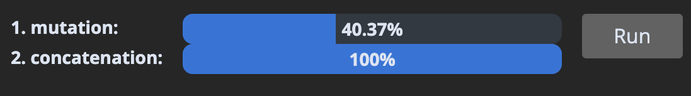
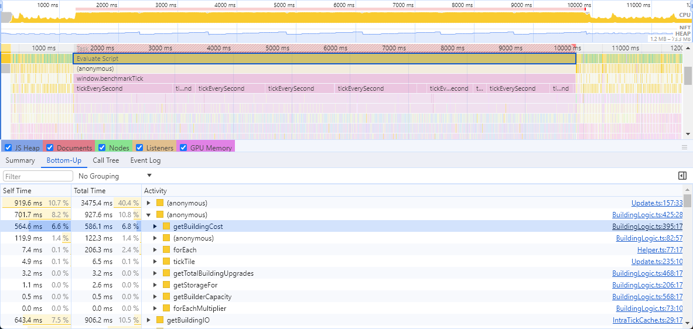

# 2024-10-10: 筆記 JavaScript, NodeJS, Web 的 micro performance.md

---

之前一直對一些 micro performance 的技巧有興趣，但這些知識非常細微，網路上也都是很散落的文章  
這邊開一篇筆記，以後都整理到這邊來

Ref:

1. [Optimizing Javascript for fun and for profit](https://romgrk.com/posts/optimizing-javascript)
   - romgrk, 21 March 2024
   - 作者是 `Material UI` 的開發者
   - 這篇是 JavaScript 的 micro performance
   - 文章很用心，每個技巧都附帶線上的測試可以自己玩看看
2. [The fastest JS color library](https://romgrk.com/posts/color-bits/)
   - romgrk, 3 September 2024
   - 作者開發 library 時，對 perf 做調整的技巧
   - 跟 1 一樣，很多 micro perfornace 技巧
   - 第一段就很底層，加減看看
3. [Game Performance Optimization - A Practical Example From Industry Idle](https://ruoyusun.com/2022/01/28/game-pref.html)
    - Ruoyu Sun, 28 Jan 2022
    - 作者開發 Web game、有上架
      - [Industry Idle](https://industryidle.com/)
    - 針對 Web 的 perf 內容
      - (看過大概內容後，其實更偏向 Web game engine 的 perf)
    - 他其他篇關於 web game 的主題我也有興趣看
4. [Squeezing Last Bit Of JavaScript Performance For My Automation Game](https://ruoyusun.com/2024/01/23/cividle-optimization.html)
     - 跟 3 一起的系列文
     - 這篇比較多 JavaScript micro performance 的樣字
5. [Daniel Lemire’s blog](https://lemire.me/blog/2019/04/17/parsing-short-hexadecimal-strings-efficiently/)
    - 第 1, 2 篇的作者 `romgrk` 提到，每當他有很難的優化問題時，常常會逛到 Daniel 的 blog，這樣的話肯定有料可以挖挖
6. [https://marvinh.dev/](https://marvinh.dev/)  
    - Preact 作者有好幾篇文章可以看看
 
------------  
------------  
------------  

## Optimizing Javascript for fun and for profit

下面是這篇文章介紹的技巧

---

### 0. Avoid work
這可能聽起來顯而易見，但優化的第一步不能是別的:
- 如果想要進行優化，應該首先考慮如何避免工作
  - 包括像是 memoization, laziness/incremental computation
- 根據不同的情境有不同的應用。例如 `React` `memo()`, `useMemo()`


---

### 1. 避免 string comparisons
1. 避免字串比較
JavaScript 字串比較是有成本的
- 如果在 `C` 中比較字串，你會用 `strcmp(a, b)`
- 在 JavaScript 中用 `===`，你看不到 `strcmp`，但它其實還是在的
- 而且字串比較通常(但不總是)需要將字串中的每個字元與另一個字串中的字元進行比較

字串比較是 `O(n)` 的
- 常見的 JavaScript 模式是避免將字串用作枚舉(to avoid is strings-as-enums)
- 隨著 TypeScript 的出現，這應該很容易避免，因為 enums 預設為整數(integers)

```ts
// No
enum Position {
  TOP = "TOP",
  BOTTOM = "BOTTOM",
}
```

```ts
// Yeppers
enum Position {
  TOP, // = 0
  BOTTOM, // = 1
}
```


benchmarks(數字越高越好): 
```ts
// 1. string compare
const Position = {
  TOP: "TOP",
  BOTTOM: "BOTTOM",
};

let _ = 0;
for (let i = 0; i < 1000000; i++) {
  let current = i % 2 === 0 ? Position.TOP : Position.BOTTOM;
  if (current === Position.TOP) _ += 1;
}
```

```ts
// 2. int compare
const Position = {
  TOP: 0,
  BOTTOM: 1,
};

let _ = 0;
for (let i = 0; i < 1000000; i++) {
  let current = i % 2 === 0 ? Position.TOP : Position.BOTTOM;
  if (current === Position.TOP) _ += 1;
}
```


如你所見，差異可能會很大
- 這並不一定是因為 `strcmp` 的成本，因為引擎有時會用 string pool 並通過 reference 進行比較
- 但也因為整數在 JS 引擎中通常是通過值 value 遞，而 string 則總是通過 point 傳遞
  - 並且 memory 訪問是貴的
  
在以字串為主的 code 中，這可能會有巨大的影響
- 舉個例子，我能夠使這個 `JSON5 javascript parser` 的速度提高 2 倍，只需要將 string constants 替換為 number
- [make this JSON5 javascript parser run 2x faster](https://github.com/json5/json5/pull/278)
- 遺憾的是，這並未被合併，但這就是開源的現實

---

### 2. 避免不同的 shapes


JavaScript 引擎會對 objects 具有特定形狀來優化
- 接收相同 shapes 的 objects，使它能夠將該形狀的 key 存一次，並將 value 存在一個單獨的 flat array 中

用 JavaScript 表示如下: 
```js
const objects = [
  { name: "Anthony", age: 36 },
  { name: "Eckhart", age: 42 },
];
```

```js
const shape = [
  { name: "name", type: "string" },
  { name: "age", type: "integer" },
];

const objects = [
  ["Anthony", 36],
  ["Eckhart", 42],
];
```

這裡用 `shape` 一詞來描述，但你也可能會看到 `hidden class` 或 `map` 用來描述
- 這取決於所用的引擎


例如，在執行時，如果以下 function 接收到兩個 `shape` 為 `{ x: number, y: number }` 的 object
- 引擎會推測未來的 object 將具有相同的形狀，並產生針對該 `shape` 進行優化的 machine code


```js
function add(a, b) {
  return {
    x: a.x + b.x,
    y: a.y + b.y,
  };
}
```


如果傳遞的 `shape` 不是 `{ x, y }` 而是 `{ y, x }`
- 引擎將需要撤銷其推測，**並且 function 的執行速度會突然變得顯著變慢**

如果你想了解更多細節
- 閱讀 mraleph 的優秀文章
- [the excellent post from mraleph](https://mrale.ph/blog/2015/01/11/whats-up-with-monomorphism.html)

但要特別強調的是 V8，V8 有三種模式，分別是:
1. 單一形狀 (monomorphic)(1 種形狀)
2. 多形狀 (polymorphic) (2-4 種形狀)
3. 超多形狀 (megamorphic) (5 種以上的形狀)


```js
// setup
let _ = 0;
```

```js
// 1. monomorphic: 所有 shapes 都一樣
const o1 = { a: 1, b: _, c: _, d: _, e: _ };
const o2 = { a: 1, b: _, c: _, d: _, e: _ };
const o3 = { a: 1, b: _, c: _, d: _, e: _ };
const o4 = { a: 1, b: _, c: _, d: _, e: _ };
const o5 = { a: 1, b: _, c: _, d: _, e: _ };
```

```js
// 2. polymorphic
const o1 = { a: 1, b: _, c: _, d: _, e: _ };
const o2 = { a: 1, b: _, c: _, d: _, e: _ };
const o3 = { a: 1, b: _, c: _, d: _, e: _ };
const o4 = { a: 1, b: _, c: _, d: _, e: _ };
const o5 = { b: _, a: 1, c: _, d: _, e: _ }; // this shape is different
```

```js
// 3. megamorphic
const o1 = { a: 1, b: _, c: _, d: _, e: _ };
const o2 = { b: _, a: 1, c: _, d: _, e: _ };
const o3 = { b: _, c: _, a: 1, d: _, e: _ };
const o4 = { b: _, c: _, d: _, a: 1, e: _ };
const o5 = { b: _, c: _, d: _, e: _, a: 1 }; // all shapes are different
```

```js
// test case
function add(a1, b1) {
  return a1.a + a1.b + a1.c + a1.d + a1.e + b1.a + b1.b + b1.c + b1.d + b1.e;
}

let result = 0;
for (let i = 0; i < 1000000; i++) {
  result += add(o1, o2);
  result += add(o3, o4);
  result += add(o4, o5);
}
```


**那麼應該怎麼做？說起來容易做起來難，但**:
- 建立所有具有相同 shape 的 object
- 即使是以不同順序寫 React Component 的 props 這樣的小事，也可能會觸發這種情況
  - [react/pull/28569](https://github.com/facebook/react/pull/28569)
  React 幾年前有過一次影響更大的案例，因為他們初始化 object 時用的是 integer，後來又存了 float
  - 改變 type 也會改變 shape
  
數字背後隱藏著 integer 和 float 類型
- 引擎通常可以將 integer encode 為 value
- 例如，V8 將 value 表示為 32 bits，integers 作為緊湊的 [Smi (Small Integer)](https://medium.com/fhinkel/v8-internals-how-small-is-a-small-integer-e0badc18b6da) 值表示
- 但 floats 和 large integers  則作為 pointers 傳遞，與 string 和 object 一樣
- JSC 用 64 bit encoding, [double tagging](https://ktln2.org/2020/08/25/javascriptcore/)，來將所有數字按值傳遞，與 SpiderMonkey 一樣，其餘的則按 pointer 傳遞

---

### 3. 避免用 array/object 的 method


除非是 Haskell/OCaml/Rust 這些將 functional code 編譯成 machine code 來工作
- 否則 functional 總是會比 imperative 慢

```js
const result = [1.5, 3.5, 5.0]
  .map((n) => Math.round(n))
  .filter((n) => n % 2 === 0)
  .reduce((a, n) => a + n, 0);
```

上面這些方法的問題在於: 
1. 它們需要對 Array 進行完整複製，而這些 copy 之後需要由 GC 釋放 
    - (後面會討論 memory  `I/O` 問題)
2. 它們為 N 個操作循環 N 次，而 for loop 只循環一次

```js
// setup:
const numbers = Array.from({ length: 10_000 }).map(() => Math.random());
```

```js
// 1. functional
const result = numbers
  .map((n) => Math.round(n * 10))
  .filter((n) => n % 2 === 0)
  .reduce((a, n) => a + n, 0);
```

```js
// 2. imperative
let result = 0;
for (let i = 0; i < numbers.length; i++) {
  let n = Math.round(numbers[i] * 10);
  if (n % 2 !== 0) continue;
  result = result + n;
}
```


像 `Object.values()`, `Object.keys()`, `Object.entries()` 這類方法也有類似的問題
- 因為它們也會 allocate 更多的資料，**而 memory 訪問是所有性能問題的根源**

---

### 4.  避免 indirection

另個可以優化的地方是任何 source of indirection 的情境

有三個主要的來源:
1. `Proxy`
2. 通常會忽略，但透過 `.` or `[]` 也是種 indirection
3. function calls 
```js
const point = { x: 10, y: 20 };

// 1.
// Proxy objects are harder to optimize because their get/set function might
// be running custom logic, so engines can't make their usual assumptions.
const proxy = new Proxy(point, {
  get: (t, k) => {
    return t[k];
  },
});
// Some engines can make proxy costs disappear, but those optimizations are
// expensive to make and can break easily.
const x = proxy.x;

// 2.
// Usually ignored, but accessing an object via `.` or `[]` is also an
// indirection. In easy cases, the engine may very well be able to optimize the
// cost away:
const x = point.x;
// But each additional access multiplies the cost, and makes it harder for the
// engine to make assumptions about the state of `point`:
const x = this.state.circle.center.point.x;

// 3.
// And finally, function calls can also have a cost. Engine are generally good
// at inlining these:
function getX(p) {
  return p.x;
}
const x = getX(p);
// But it's not guaranteed that they can. In particular if the function call
// isn't from a static function but comes from e.g. an argument:
function Component({ point, getX }) {
  return getX(point);
}
```


目前 proxy benchmark 在 V8 上特別苛刻
- 上次我檢查時，proxy objects 是從 JIT 回退到 interpreter
- 從這些結果看來，可能情況依然如此

```js
// 1. proxy access
const point = new Proxy({ x: 10, y: 20 }, { get: (t, k) => t[k] });

for (let _ = 0, i = 0; i < 100_000; i++) {
  _ += point.x;
}
```

```js
// 2. direct access
const point = { x: 10, y: 20 };
const x = point.x;

for (let _ = 0, i = 0; i < 100_000; i++) {
  _ += x;
}
```


我還想展示訪問深層嵌套 object 與直接訪問的對比
- 但引擎非常擅長 [optimizing away object accesses via escape analysis](https://www.youtube.com/watch?v=KiWEWLwQ3oI&t=1055s)
- 我插入了一些間接尋址來防止這種情況。

```js
// 1. nested access
const a = { state: { center: { point: { x: 10, y: 20 } } } };
const b = { state: { center: { point: { x: 10, y: 20 } } } };
const get = (i) => (i % 2 ? a : b);

let result = 0;
for (let i = 0; i < 100_000; i++) {
  result = result + get(i).state.center.point.x;
}
```

```js
// 2. direct access
const a = { x: 10, y: 20 }.x;
const b = { x: 10, y: 20 }.x;
const get = (i) => (i % 2 ? a : b);

let result = 0;
for (let i = 0; i < 100_000; i++) {
  result = result + get(i);
}
```


---

### 5. 避免 cache misses

這需要些底層知識，但即使在 JavaScript 中也有影響
- 從 CPU 的角度來看，從 RAM 中檢索 memory 是很慢的
- 為了加快速度，它主要用兩種優化方法


#### 5.1 Prefetching
它提前獲取更多的 memory
- 希望這些是你會感興趣的 memory
- 它總是猜如果你請求一個 memory address，你會對緊接在那之後的區域感興趣
- **所以順序訪問資料是關鍵**

下面例子可以觀察到隨機順序訪問記憶體的影響
```js
// setup:
const K = 1024;
const length = 1 * K * K;

// Theses points are created one after the other, so they are allocated
// sequentially in memory.
const points = new Array(length);
for (let i = 0; i < points.length; i++) {
  points[i] = { x: 42, y: 0 };
}

// This array contains the *same data* as above, but shuffled randomly.
const shuffledPoints = shuffle(points.slice());
```

```js
// 1. sequential
let _ = 0;
for (let i = 0; i < points.length; i++) {
  _ += points[i].x;
}
```

```js
// 2. random
let _ = 0;
for (let i = 0; i < shuffledPoints.length; i++) {
  _ += shuffledPoints[i].x;
}
```


**那該怎麼做呢？ 這點可能是最難實踐的**:
- 因為 JavaScript 沒有辦法將 object 放在記憶體中的特定位置
- 但你可以像上面提到的例子那樣利用這些知識
- 例如，在重新排序或排列資料之前操作資料
- 你不能假設按順序建立的 object 在一段時間後會保留在相同的位置，因為 GC 可能會移動它們
- 有一個例外，那就是 arrays of numbers，最好是 `TypedArray` instances

```js
// from this
const points = [
  { x: 0, y: 5 },
  { x: 0, y: 10 },
];

// to this
const points = new Int64Array([0, 5, 0, 10]);
```

For a more detailed example
- https://mrale.ph/blog/2018/02/03/maybe-you-dont-need-rust-to-speed-up-your-js.html#optimizing-parsing---reducing-gc-pressure
- 其中包含的一些優化已過時，但整體上仍然準確
  
#### 5.2 在 L1/2/3 的 Caching
CPU 用的第二個優化是 `L1/L2/L3` caches:
- 這些就像更快的 RAM，但它們也更昂貴，因此它們更小
- 它們包含 RAM 資料，但作為一個 LRU cache 執行
- 資料在它 `熱(being worked on)` 時進入，並在新的工作資料需要空間時寫回主 RAM
- **所以關鍵是用盡可能少的資料來保持你的 dataset 在 fast caches 中**

下面例子中，可以觀察到破壞每一個連續快取的影響
```js
// setup:
const KB = 1024;
const MB = 1024 * KB;

// These are approximate sizes to fit in those caches. If you don't get the
// same results on your machine, it might be because your sizes differ.
const L1 = 256 * KB;
const L2 = 5 * MB;
const L3 = 18 * MB;
const RAM = 32 * MB;

// We'll be accessing the same buffer for all test cases, but we'll
// only be accessing the first 0 to `L1` entries in the first case,
// 0 to `L2` in the second, etc.
const buffer = new Int8Array(RAM);
buffer.fill(42);

const random = (max) => Math.floor(Math.random() * max);
```

```js
// 1. L1
let r = 0;
for (let i = 0; i < 100000; i++) {
  r += buffer[random(L1)];
}
```

```js
// 2. L2
let r = 0;
for (let i = 0; i < 100000; i++) {
  r += buffer[random(L2)];
}
```

```js
// 3. L3
let r = 0;
for (let i = 0; i < 100000; i++) {
  r += buffer[random(L3)];
}
```

```js
// 4. RAM
let r = 0;
for (let i = 0; i < 100000; i++) {
  r += buffer[random(RAM)];
}
```


**那該怎麼做呢？**:  
- **無情地消除每個可以消除的 single data 或 memory allocation**
- dataset 越小，程序執行越快
  - 軟體程式的效能問題，有 95% 是 Memory I/O
- 另個好的策略是將工作分成塊，並確保一次處理一個小 dataset

關於 CPU 和 memory 的更多詳細:
- https://people.freebsd.org/~lstewart/articles/cpumemory.pdf
For more details on CPU and memory, [see this link]().


關於 immutable data structures:
- Immutability 對於清晰性和正確性非常重要
- 但在性能方面，更新 immutable data structures 意味著製作 copy
- 這需要更多的 memory I/O，會清空你的 caches
- 應該在可能的情況下避免 immutable data structures
- `{ ...spread }` 操作非常方便，但每次它都會在 memory 中建立新 object
- 更多的 memory I/O，slower caches

---

### 6. 避免 large objects
如 No2 所述，引擎用 `shape` 來 optimize objects。然而
- 當 `shape`  變得過大時，引擎別無選擇，只能用常規 hashmap (如 `Map` object)
- 如 No5 中所見，cache 未命中會顯著降低性能，hashmap 容易發生這種情況
- 因為它們的資料通常在其佔用的記憶體區域中隨機且均勻地分佈


來看看這些 User 的 map，以他們的 ID 為 index 時的表現:

```js
// setup:
const USERS_LENGTH = 1_000;
```

```js
// setup:
const byId = {};
Array.from({ length: USERS_LENGTH }).forEach((_, id) => {
  byId[id] = { id, name: "John" };
});
let _ = 0;
```

```js
// 1. [] access
Object.keys(byId).forEach((id) => {
  _ += byId[id].id;
});
```

```js
// 2. direct access
Object.values(byId).forEach((user) => {
  _ += user.id;
});
```


而且可以觀察到，隨著 object 大小的增長，性能持續下降:  

```js
// setup:
const USERS_LENGTH = 100_000;
```


**那該怎麼做呢？**:  
- 避免頻繁的 index large objects
- 優先將 object 事先轉換成 Array
- 將資料組織為模型中的 ID 可以有所幫助，因為可以用 `Object.values()`，而無需引用 key map 來取 ID

---

### 7. 使用 eval
某些 JavaScript 模式對於引擎來說很難優化
- 用 `eval()` 或其衍生方法，你可以讓這些模式消失

在這例子中，可以用 `eval()` 避免建立具有 dynamic object key 的成本: 
```js
// setup:
const key = "requestId";
const values = Array.from({ length: 100_000 }).fill(42);
```

```js
// 1. without eval
function createMessages(key, values) {
  const messages = [];
  for (let i = 0; i < values.length; i++) {
    messages.push({ [key]: values[i] });
  }
  return messages;
}

createMessages(key, values);
```

```js
// 2. with eval
function createMessages(key, values) {
  const messages = [];
  const createMessage = new Function(
    "value",
    `return { ${JSON.stringify(key)}: value }`
  );
  for (let i = 0; i < values.length; i++) {
    messages.push(createMessage(values[i]));
  }
  return messages;
}

createMessages(key, values);
```


另個 `eval` 好案例可能是編譯一個過濾謂詞函數(filter predicate function)
- 在其中丟棄你知道永遠不會被選中的分支
- 一般來說，任何會在非常熱的循環中執行的 function 都是這種優化的良好候選者

當然，常見用 `eval()` 警告也還是要特別注意:
- 不要信任任何 input 傳入 `eval()`，傳入以前一定要清洗
- 不要建立任何 XSS 的可能性
- 另外注意，一些環境不允許訪問 `eval()`，如具有內容安全策略 (CSP) 的頁面


---

### 8. 小心的使用 string
我們已經看到 string 比它們看起來更昂貴
- 有一個好消息/壞消息的情況
- string 比它們看起來更複雜
- 但如果用得當，它們也可以非常高效

由於 JavaScript 的環境，string 操作是其中的核心部分
- 為了優化 string 密集型 code，引擎必須具有創造性
- 它們必須根據用情況，在 C++ 中用多種 `String object`

你應該關心兩種常見情況，因為它們適用於 V8(目前最常見的引擎)，並且通常也適用於其他引擎
- 首先，用 `+` 連接 string 不會建立兩個輸入 string 的 copy
- 這個操作會為每個 substring 建立 point

在 TypeScript 中，它會是這樣: 
```js
class String {
  abstract value(): char[] {}
}

class BytesString {
  constructor(bytes: char[]) {
    this.bytes = bytes
  }
  value() {
    return this.bytes
  }
}

class ConcatenatedString {
  constructor(left: String, right: String) {
    this.left = left
    this.right = right
  }
  value() {
    return [...this.left.value(), ...this.right.value()]
  }
}

function concat(left, right) {
  return new ConcatenatedString(left, right)
}

const first = new BytesString(['H', 'e', 'l', 'l', 'o', ' '])
const second = new BytesString(['w', 'o', 'r', 'l', 'd'])

// See ma, no array copies!
const message = concat(first, second)

```

其次，string slices 也不需要建立 copy:
- 它們可以簡單地指向另一個字串中的一個範圍


繼續上面的例子:
```js
class SlicedString {
  constructor(source: String, start: number, end: number) {
    this.source = source;
    this.start = start;
    this.end = end;
  }
  value() {
    return this.source.value().slice(this.start, this.end);
  }
}

function substring(source, start, end) {
  return new SlicedString(source, start, end);
}

// This represents "He", but it still contains no array copies.
// It's a SlicedString to a ConcatenatedString to two BytesString
const firstTwoLetters = substring(message, 0, 2);
```


但問題來了:
- 一旦你需要開始修改這些位 bytes，就是你開始付出複製成本的時候

假設我們回到 String class 並嘗試加 `.trimEnd` 方法: 
```js
class String {
  abstract value(): char[] {}

  trimEnd() {
    // `.value()` here might be calling
    // our Sliced->Concatenated->2*Bytes string!
    const bytes = this.value()

    const result = bytes.slice()
    while (result[result.length - 1] === ' ')
      result.pop()
    return new BytesString(result)
  }
}
```

讓我們跳到一個比較例子，用變更操作與僅用連接的比較: 
```js
// setup:
const classNames = ["primary", "selected", "active", "medium"];
```

```js
// 1. mutation
const result = classNames
  .map((c) => `button--${c}`)
  .join(" ");
```

```js
// 2. concatenation
const result = classNames
  .map((c) => "button--" + c)
  .reduce((acc, c) => acc + " " + c, "");
```



**那麼應該怎麼做？**:
- 一般來說，儘量避免 mutation，這包括像 `.trim()`, `.replace()` 等方法。考慮如何避免這些方法
- 在某些引擎中，string templates 可能比 `+` 慢
  - 當前在 V8 中是這樣，但未來可能不是
  - 因此始終進行 benchmark
 
 
關於上面的 `SlicedString`:
- 應注意如果 small substring 在記憶體中對一個非常大的字串保持活躍，可能會阻止 GC 回收大字串！
- 如果你正在處理 large text 從中提取 small string ，可能會有很大的 memory leak


```js
const large = Array.from({ length: 10_000 })
  .map(() => "string")
  .join("");
const small = large.slice(0, 50);
//    ^ will keep `large` alive
```

這裡的解決方案是利用 mutation 方法
- 如果我們在 `small` 上用其中一個，它會強制進行複製，並且舊的指向 `large` 的 pointer 會丟失


```js
// replace a token that doesn't exist
const small = small.replace("#".repeat(small.length + 1), "");
```


更多細節
- V8 中的 `string.h`
  - https://github.com/v8/v8/blob/main/src/objects/string.h
- JavaScriptCore 中的 `JavaScriptCore`
  - https://github.com/WebKit/WebKit/blob/main/Source/JavaScriptCore/runtime/JSString.h


關於 string 的複雜性，已經非常快速地略過了這些內容
- 但有許多實現細節增加了 string 的複雜性
- 對於每種字串表示形式，通常都有最小長度要求
- 例如，非常小的字串可能不會用連接字串
- 有時候也會有一些限制，例如避免指向子字串的子字串

閱讀上面 C++ code 可以很好地概覽這些實現細節，即使只是閱讀註釋

---

### 9. 專門化 (specialization)
performance optimization 的一個重要概念是 specialization:
- 使你的邏輯適應特定用情況的限制
- 這通常意味著找出在你的情況下可能會是真的條件，並為這些條件進行 coding

假設我們是一個有時需要為產品列表加 tag 的商人
- 我們知道從經驗中我們的 tag 通常是空的

知道這些資訊後，可以針對這種情況對我們的 function 進行 specialization: 


```js
// setup:
const descriptions = ["apples", "oranges", "bananas", "seven"];
const someTags = {
  apples: "::promotion::",
};
const noTags = {};

// Turn the products into a string, with their tags if applicable
function productsToString(description, tags) {
  let result = "";
  description.forEach((product) => {
    result += product;
    if (tags[product]) result += tags[product];
    result += ", ";
  });
  return result;
}

// Specialize it now
function productsToStringSpecialized(description, tags) {
  // We know that `tags` is likely to be empty, so we check
  // once ahead of time, and then we can remove the `if` check
  // from the inner loop
  if (isEmpty(tags)) {
    let result = "";
    description.forEach((product) => {
      result += product + ", ";
    });
    return result;
  } else {
    let result = "";
    description.forEach((product) => {
      result += product;
      if (tags[product]) result += tags[product];
      result += ", ";
    });
    return result;
  }
}
function isEmpty(o) {
  for (let _ in o) {
    return false;
  }
  return true;
}
```

```js
// 1. not specialized
for (let i = 0; i < 100; i++) {
  productsToString(descriptions, someTags);
  productsToString(descriptions, noTags);
  productsToString(descriptions, noTags);
  productsToString(descriptions, noTags);
  productsToString(descriptions, noTags);
}
```

```js
// 2. specialized
for (let i = 0; i < 100; i++) {
  productsToStringSpecialized(descriptions, someTags);
  productsToStringSpecialized(descriptions, noTags);
  productsToStringSpecialized(descriptions, noTags);
  productsToStringSpecialized(descriptions, noTags);
  productsToStringSpecialized(descriptions, noTags);
}
```


這種 optimization 可以帶來不多的改進，但累積起來。它們是對 shape 和 memory I/O 等更重要優化的有益補充
- 但注意，如果你的條件發生變化，specialization 可能會不利，在應用這種方法時要小心


分支預測和無分支程式碼
- 從 code 中移除分支對 perf 有極大的提高
- 想了解更多關於 branch predictor
  - 閱讀 `Why is processing a sorted array faster`
  - https://stackoverflow.com/questions/11227809/why-is-processing-a-sorted-array-faster-than-processing-an-unsorted-array

---

### 10. 資料結構
我不會詳細討論資料結構，因為它需要專門的文章。但
- 為你的 case 選不正確的資料結構會比上述任何優化有更大的影響
- 建議你熟悉像 Map 和 Set 這樣的 native 結構
- 並學習 linked lists, priority queues, tree(RB 和 B+)和 tries

舉個簡單例子，來比較一下 `Array.includes` 和 `Set.has` 在 small list 中的表現

```js
// setup:
const userIds = Array.from({ length: 1_000 }).map((_, i) => i);
const adminIdsArray = userIds.slice(0, 10);
const adminIdsSet = new Set(adminIdsArray);
```

```js
// 1. Array
let _ = 0;
for (let i = 0; i < userIds.length; i++) {
  if (adminIdsArray.includes(userIds[i])) {
    _ += 1;
  }
}
```

```js
// 2. Set
let _ = 0;
for (let i = 0; i < userIds.length; i++) {
  if (adminIdsSet.has(userIds[i])) {
    _ += 1;
  }
}
```


如你所見，資料結構會產生非常顯著的影響
- 一個 real case，我曾經有個案例，我們通過將 array 換成 linked list，function 執行時間從 5s 縮短到 22ms
- (https://github.com/mui/mui-x/pull/9200

---

### 11. Benchmarking
我將這部分留到最後說，是因為我需要通過上面有趣的部分來建立我的可信度。現在希望我已經做到了，讓我告訴你
- benchmarking 是 optimization 中最重要的部分
- 不僅最重要的，而且也是最難的
- 即使有 20 年的經驗，我仍然會建立有缺陷的 benchmarking，或者錯誤地用分析工具
- **所以無論你做什麼，請最大限度地投入到正確的 benchmarking 中**

#### 11.0 從 top 開始
首要任務應該是 optimize 佔用最大執行時間的 function/code 部分
- 花時間優化其他部分，就是在浪費時間。


#### 11.1 避免 micro-benchmarks
在 production 模式下執行你的 code，並根據這些觀察來進行 optimizations
- JS 引擎非常複雜，在 micro-benchmarks 中往往會與真實世界的場景表現不同

例如這個 micro-benchmarks
```js
const a = { type: "div", count: 5 };
const b = { type: "span", count: 10 };

function typeEquals(a, b) {
  return a.type === b.type;
}

for (let i = 0; i < 100_000; i++) {
  typeEquals(a, b);
}
```


如果你更早注意到，你會意識到引擎會針對 shape `{ type: string, count: number }` 專門化 function
- 但這在你的實際用例中是否成立？
- a 和 b 總是這種形狀嗎，還是會接收到任何形狀？
- 如果你在 production 中接收到許多 shape，這個 function 會有不同的表現

#### 11.2 Doubt your results
11.2 懷疑你的結果
如果你剛剛優化了一個 function，現在執行速度快了 100 倍
- 要懷疑它。試著推翻結果
- 在 production 模式下 debug，隨機檢測它
- 同樣也要懷疑工具。觀察 benchmark 時用 devtool 本身可能會改變其行為

#### 11.3 選擇你的目標


不同的引擎會對某些模式優化得更好或更差
- 應該針對對你有用的引擎進行 benchmark，並確定哪一個更重要

這有個 Babel 中的真實案例，提高 V8 性能意味著降低 JSC 的性能
- https://github.com/babel/babel/pull/16357

---

### 12. 分析與工具
關於分析和開發工具的各種備註


#### 12.1 Browser gotchas

12.1 瀏覽器注意事項
如果在瀏覽器中進行分析，確保用乾淨且空的瀏覽器配置檔
- 我甚至用一個單獨的瀏覽器
- 如果在分析時啟用了 extensions 功能，它們可能會弄亂測量結果
  - 特別是 React devtool 會大幅影響結果


#### 12.2 Sample vs structural profiling


瀏覽器分析工具是基於取樣的 profilers
- 它會在規定的時間間隔內取樣你的 stack。這有個很大的缺點
- 非常小但頻繁的 function 可能會在這些 samples 之間被 呼叫，而在你得到的 stack 圖表中可能被嚴重低估

用具有自訂取樣間隔的 Firefox 開發工具或具有 CPU throttling 的 Chrome 開發工具來緩解這個問題


#### 12.3 工具
除了常規的 browser devtools，你還應該了解這些選項: 
- Chrome devtools 有許多 experimental flags，可以幫助找出為什麼某些操作慢
  - style invalidation tracker 在需要 debug style/layout 重新計算時非常有價值
  - https://github.com/iamakulov/devtools-perf-features
- `deoptexplorer-vscode` extension 允許載入 V8/chromium log
  - 了解你 code 何時觸發了 de-optimizations
  - 例如當你向 function 傳遞不同的 shape 時。你不需要 extension 來讀 log，但它能讓體驗更愉快
  - https://github.com/microsoft/deoptexplorer-vscode

你可以隨時為每個 JS 引擎編譯 debug shell，以更詳細地了解它是如何工作的
- 這允許你執行 perf 和其他 low-level 工具，還可以檢查每個引擎產生的 bytecode 和 machine code 
- V8 範例: https://mrale.ph/blog/2018/02/03/maybe-you-dont-need-rust-to-speed-up-your-js.html#getting-the-code

JSC 範例: https://zon8.re/posts/jsc-internals-part1-tracing-js-source-to-bytecode/


------------  
------------  
------------  

## [The fastest JS color library](https://romgrk.com/posts/color-bits/)

下面是這篇文章介紹的技巧  
最近作者 optimizing performance 一些東西，對結果非常滿意。作者想更深入地探討一下它為什麼這麼快，這與上篇文章有很好的聯繫  


---

### 1. 呈現方式(Representation)

在 JavaScript 中，存 RGBA colors的通常方式為: 

```js
const color = {
  red: 0,
  green: 0,
  blue: 0,
  alpha: 1.0
};
```


這方式既符合語法又易於閱讀
- 但這也意味著為每個顏色分配一個新的 `heap object`
- RGBA 顏色範圍從 `#00000000` 到 `#ffffffff`
  - 或換句話說，數字從 `0x0000000` 到 `0xffffffff`
  - 以及這是 32 bits 資料
- 我們實際上只需要一個數值來編碼這些 bits

幸運的是，這正好是通過 JavaScript 位元運算 `bitwise` operators 可以得到的數量: 

```js
const color = (red << 24) | (green << 16) | (blue << 8) | (alpha << 0);
```


來 benchmark 比較這兩種方法的效果。下面例子中
- 我們用些藍色陰影填充了一個長度為 `100` 的 array
- 為什麼是長度為 100 的 array，而不是包含所有顏色的一個 big array ?

因為這反映了在  production context 中發生的情況
- 你的系統中有顏色經過，然後這些顏色被丟棄
- 那些被丟棄的值必須由 GC 處理


```js
// 1. object
const newColor = (blue) => ({
  red: 0,
  green: 0,
  blue: blue,
  alpha: 1.0,
});

const colors = new Array(100);
for (let i = 0; i < 100_000; i++) {
  const index = i % 100;
  colors[index] = newColor(index);
}
```

```js
// 2. number
const newColor = (blue) => (0 << 24) | (0 << 16) | (blue << 8) | (255 << 0);

const colors = new Array(100);
for (let i = 0; i < 100_000; i++) {
  const index = i % 100;
  colors[index] = newColor(index);
}
```


下圖左邊是 object 的情況，右邊是 number
- `object` case 不斷地對 GC 施加壓力，每個標記都是一個 `Minor GC` entry
- **建立 objects 是很耗時的**！


所以只需用 `number`，一切都很好，對吧？
- 當我快樂地測試時，我失望地意識到 JavaScript bitwise operators 操作的是 `signed` `32 bits`

```js
const red = 0xff;
expect(red << 24).toEqual(0xff000000);
// > ERROR: Expected 4278190080 but got -16777216
```

因此
- `0xff << 24` 不等於 `0xff000000`，而是 `-0x1000000`
- 當我尋找解決方案時，我的第一個想法顯然是將結果從 `int32` 強制轉換回 `uint32`

畢竟，這並不比這更複雜: 
```js
function cast(int32Value) {
  return int32Value >>> 0;
}
```
 
提醒一下，所有的 bitwise operators 都將它們的 value 轉換為 `int32` 數字
- 除了 `>>>`，這是 **unsigned right shift** operation
- 也是唯一操作 uint32 value 的 operates  
 
我對加更多指令感到不太高興，但至少它們仍然是數值上的位元運算，這相當便宜。對嗎？


當進行更多 benchmarked 測試時
- 我發現這個解決方案並不滿意。不僅僅是額外的操作，還在於某些特定引擎應用了一種特定的性能優化
- 這種優化使得數值速度加快到 32-bits signed 內
- 也就是說，V8，在 70% 的 browser 上執行，並且驅動 NodeJS
- 因此，一旦顏色超過 `int32` 範圍，整個程式將顯著變慢
  - (任何大於或等於 `0x80000000` 的顏色)
  
所以，讓我們深入探討發生了什麼


##### Number 在 V8 上的呈現方式

這裡將假設 64-bits CPU 架構，這是現在大多執行 JS 引擎的設備
- 有需要的話，在這有更完整的資訊: https://v8.dev/blog/pointer-compression


在常見的設備中，傳遞 64-bits 的值是很快的
- 因為你可以直接通過 CPU registers 傳遞值
  - 它們的長度是 64-bits
- 大於這個大小的值或 object 必須存在 memory 中，並作為指向該位置的(64-bits) pointer 傳遞
- pointer 通常會佔據所有的 JS values，因為 GC 還需要掃描 heap 來查找 pointer，以確定哪些 object 不再被引用，可以被釋放
- 如果有數字與 pointer 混合在一起，GC 將無法知道該值是 pointer 還是數字


但 64 bits pointer 的位置
- 這是很多 bytes，也許我們不需要所有那些地址
- 因此，V8 將用其中一位來標記該值是 pointer 還是 number
- 如果它是 number，我們將在其中存儲 32-bits 資料，並稱之為 `Smi`

```
                                             tag -->|
            |----- 32 bits -----|----- 32 bits -----|
Pointer:    |________________address_______________1|
Smi:        |____int32_value____|0000000000000000000|
```


這就是為什麼你不想在 V8 中超過 `int32` range
- 如果你的數字超過 `int32` range，它就會變成 pointer，然後指向 heap 裡面的 value

我們可以進行 benchmark 以確保情況屬實
- 我們多次相加相同的值，但它要麼在 `Smi` 範圍內，要麼在 `Smi` 範圍外
- 我會包括數字而不是一個實時的數字，因為我想展示跨引擎的性能

如果你想自己執行它，code: 
- https://github.com/romgrk/js-benchmark/blob/0a3245640a0a76d5700a54dc41ee8d3dab34da4b/benchmarks/integers.js

```
> node ./index.js ./benchmarks/integers.js

### node: v22.7.0 ###
adding 2^31 - 1: ##############################  100.00% (1,685,399 ops)
adding 2^31 + 1: #####################.........   72.36% (1,219,483 ops)


### bun: 1.1.26 ###
adding 2^31 - 1: ##############################  100.00% (2,184,201 ops)
adding 2^31 + 1: #####.........................   18.77%   (409,935 ops)


### gjs: 1.80.2 ###
adding 2^31 - 1: ##############################  100.00% (1,169,879 ops)
adding 2^31 + 1: ##################............   62.74%   (733,938 ops)
```


這應該用點 salt 來測試才對，因為它是個 microbenchmark 測試
- 但它仍然清楚表現出，即使超過 `int32` range 一個微小的 `+1`，在所有引擎中的數學操作都會有顯著不同


##### JSC/SpiderMonkey 的 Number 表示方式

這兩個引擎用稱為 `NaN-boxing` 的技術
- `Double values`，也稱為 `float64` 或 `f64`
- 在技術上稱為 `IEEE-754`，是 EcmaScript spec 定義為 `number` 的

並且它們被 encoded 為 64-bits: 
```
 1 bit sign
|-|-- 11 bits ---|------------ 52 bits ---------------|
|±|___exponent___|_____________mantissa_______________|
```

`IEEE-754`: 這些位轉換為數字的公式如下

```js
Math.pow(-1, sign) * Math.pow(2, 1023 - exponent) * (1 + mantissa)
```

這是 1 在 `f64` encoding 中的表示範例:

```
      0_____01111111111______________000000000000...00000000000000
 (-1)^0  *  2^(1023 - 1023)  *  (1 + 0)
     1   *  1                *   1
   = 1
```

上面這個範例的互動版連結
- https://bartaz.github.io/ieee754-visualization/

Wikipedia
- https://en.wikipedia.org/wiki/Double-precision_floating-point_format


這個巧妙的技術是
- `float64` encoding 將 `NaN` 定義為指數位(exponent bits)全為` 1` 且尾數(mantissa)不為零的任何 64-bits pattern
- 例如，`0b0_11111111111_1000...` 和 `0b0_11111111111_0100...` 都表示 `NaN`

以此類推
- 引擎可以選擇一種方式來表示 `NaN`，並用其餘的位來放置 pointers, integers 等

附帶說明
- 這也是為什麼 `Number.MAX_SAFE_INTEGER` 等於 `2^53 - 1`
- 這是 `float64` 允許的最大精度
- 指數(exponent)用了另外 11 bits，總共為 64 位


##### 那麼我們如何用 `int32` 呢？
什麼都不做
- 來回顧一下 negative numbers 和二進制補碼是如何工作的
- 以 single byte (一個 `uint8` 值)為簡單例子

這裡是 each bit 與其 value 的關係: 
```
Index: |   8  |  7  |  6  |  5  |  4  |  3  |  2  |  1  | 
       |------|-----|-----|-----|-----|-----|-----|-----|
Value: | -2^7 | 2^6 | 2^5 | 2^4 | 2^3 | 2^2 | 2^1 | 2^0 |
```


因此，對於 bit patterns，相應的值是: 

  


至於負數值，如果我們設高位數的 bit 看看: 

  


還有最後一個 `-1` 的值:  

   


那麼為什麼選擇像二補數(two’s complement)這樣的方案，而不是更簡單的方案呢？
- 畢竟，float64 encoding 用第一位來表示 `+/-`，這不是更簡單嗎？
- 這裡的最後一個 bit pattern 可能給了個提示

二補數背後的想法是，比如加法，我們不需要單獨的機器指令來處理 signed 和 unsigned 值
- 位元保持不變，但它們的解釋會改變
- 例如，如果從 `0b00000000` 中減去 `1`，無論是在有符號模式(值為 `255`)還是無符號模式(值為 `-1`)，位元都會是 `0b11111111`
- 這約定簡化了 CPU，從而使它們更加精簡和快速

這意味著，當你在本地語言中編譯一個資料類型，比如 `u32` 或 `i32`
- 類型在編譯後消失，CPU 只看到無類型的位元
- 某些操作仍然需要對有符號/無符號數字進行特殊處理
- 但在這些情況下，指令本身將會有類型，而不是資料
- 例如，`x86` 有 `MUL` 指令用於無符號乘法，而 `IMUL` 用於有符號乘法


希望這一切解釋了「不做任何事情」
- bitwise operator 從未扭曲我們的 bits
- bits 一直在應該在的位置
- `0xff << 24`，無論數字是作為 signed 還是 unsigned 解釋，底層的 bit pattern 仍是 `0b111111110000....0000`。


我尋找 `uint32` 是一件很正常的事情，它是 4 個打包的 bytes
- 但在 JavaScript 的有限 context 中，可用的選項反而是更好的選擇
- 其他庫 library 犯了同樣的錯誤，例如 [react-spring’s color handling code](https://github.com/pmndrs/react-spring/blob/fd65b605b85c3a24143c4ce9dd322fdfca9c66be/packages/shared/src/normalizeColor.ts#L48-L49)
  - 他們也選擇了 `>>> 0` 的轉換，將值變為更邏輯的 `uint32` 格式
  - 但在 code 中引入所有這些 `int32` 值會帶來性能損失


---------

### 2. 解析 (Parsing)
對 color 表示方式感到滿意後，我繼續研究第二個最 expensive 的操作
- 我不會深入研究 `#rrggbbaa` 以外的格式
- 用 regex 去解析其他格式(如 `rgba()`, `hsl()`,`color(display-p3`)都是次佳的選擇
  - 我嘗試了一個標準的 recursive descent top-down parser
  - 不幸的是，這是 JavaScript，這種工作還是交給引擎來處理比較好
  
然而，十六進制(hexadecimal)解析有機會可以改進。看看一個簡單的 regex 方法:  

```js
const pattern = /#(..)(..)(..)(..)/

// '#rrggbbaa'.match(pattern)
//  ['#rrggbbaa', 'rr', 'gg', 'bb', 'aa', index: 0, input: '#rrggbbaa', groups: undefined]
 
function parseHex_regex(color) {
  const m = color.match(pattern)
  return (
    (parseInt(m[1], 16) << 24) |
    (parseInt(m[2], 16) << 16) |
    (parseInt(m[3], 16) <<  8) |
    (parseInt(m[4], 16) <<  0)
  )
}
```


這種方法的問題在於會建立大量的 allocations
- `RegExp.prototype.match` 的 return value 非常重
- 它是個包含自定義 fields 的 string array
- 避免 object allocations 對於好 performance 至關重要


所以一個好的迭代來避免胖 result array 的方法會是這樣的: 

```js
function parseHex_slice(color) {
  return (
    (parseInt(color.slice(1, 3), 16) << 24) |
    (parseInt(color.slice(3, 5), 16) << 16) |
    (parseInt(color.slice(5, 7), 16) <<  8) |
    (parseInt(color.slice(7, 9), 16) <<  0)
  )
}

// '#rrggbbaa'.slice(1, 3)
// 'rr'
// '#rrggbbaa'.slice(3, 5)
// 'gg'
```

但問題是
- 即使我們擺脫了 fat result array
- 呼叫 `.slice()` 仍然 allocating 了 4 個 strings
  - 這些 strings 會創造更多的 `GC pauses`


唯一方案是 `.charCodeAt()`
- 我探索了兩種將這些 string 轉換為十六進制(hexadecimal)值的技術
- 這兩種技術我都在 [Daniel Lemire’s blog](https://lemire.me/blog/2019/04/17/parsing-short-hexadecimal-strings-efficiently/) 中找到了
  - (當我研究很難的的優化問題時，總會偶然進到他的 blog)
- 第一種是用數學 function
- 第二種是用 lookup array

下面是這兩種方法的 JavaScript 實作: 
```js
// Transform char code to its hexadecimal value
function x(c) { return (c & 0xf) + 9 * (c >> 6) }
 
function parseHex_function(color) {
  const r = x(color.charCodeAt(1)) << 4 | x(color.charCodeAt(2))
  const g = x(color.charCodeAt(3)) << 4 | x(color.charCodeAt(4))
  const b = x(color.charCodeAt(5)) << 4 | x(color.charCodeAt(6))
  const a = x(color.charCodeAt(7)) << 4 | x(color.charCodeAt(8))
  return (
    (r << 24) |
    (g << 16) |
    (b <<  8) |
    (a <<  0)
  )
}
```

```js
// Transform char code to its hexadecimal value,
// but as a lookup array.
const _ = 0
const X = [
  _,  _,  _,  _,  _,  _,  _,  _,  _,  _,  _,  _,  _,  _,  _,  _,  _,  _,  _,
  _,  _,  _,  _,  _,  _,  _,  _,  _,  _,  _,  _,  _,  _,  _,  _,  _,  _,  _,
  _,  _,  _,  _,  _,  _,  _,  _,  _,  _,  0,   1, 2,  3,  4,  5,  6,  7,  8,
  9,  _,  _,  _,  _,  _,  _,  _, 10, 11, 12, 13, 14, 15,  _,  _,  _,  _,  _,
  _,  _,  _,  _,  _,  _,  _,  _,  _,  _,  _,  _,  _,  _,  _,  _,  _,  _,  _,
  _,  _, 10, 11, 12, 13, 14, 15,  _,  _,  _,  _,  _,  _,  _,  _,  _,  _,  _,
  _,  _,  _,  _,  _,  _,  _,  _,  _,  _,  _,  _,  _,  _,  _,  _,  _,  _,  _,
  _,  _,  _,  _,  _,  _,  _,  _,  _,  _,  _,  _,  _,  _,  _,  _,  _,  _,  _,
  _,  _,  _,  _,  _,  _,  _,  _,  _,  _,  _,  _,  _,  _,  _,  _,  _,  _,  _,
  _,  _,  _,  _,  _,  _,  _,  _,  _,  _,  _,  _,  _,  _,  _,  _,  _,  _,  _,
  _,  _,  _,  _,  _,  _,  _,  _,  _,  _,  _,  _,  _,  _,  _,  _,  _,  _,  _,
  _,  _,  _,  _,  _,  _,  _,  _,  _,  _,  _,  _,  _,  _,  _,  _,  _,  _,  _,
  _,  _,  _,  _,  _,  _,  _,  _,  _,  _,  _,  _,  _,  _,  _,  _,  _,  _,  _,
  _,  _,  _,  _,  _,  _,  _,  _,  _
]
 
function parseHex_table(color) {
  const r = X[color.charCodeAt(1)] << 4 | X[color.charCodeAt(2)]
  const g = X[color.charCodeAt(3)] << 4 | X[color.charCodeAt(4)]
  const b = X[color.charCodeAt(5)] << 4 | X[color.charCodeAt(6)]
  const a = X[color.charCodeAt(7)] << 4 | X[color.charCodeAt(8)]
  return (
    (r << 24) |
    (g << 16) |
    (b <<  8) |
    (a <<  0)
  )
}
```


來 benchmark 看看結果:  
```js
// setup
const N = 100_000
const colors = new Array(100)
```
```js
// 1. regex
for (let i = 0; i < N; i++) {
  colors[i % 100] = parseHex_regex('#599eff80')
}

```
```js
// 2. slice
for (let i = 0; i < N; i++) {
  colors[i % 100] = parseHex_slice('#599eff80')
}
```
```js
// 3. char + function
for (let i = 0; i < N; i++) {
  colors[i % 100] = parseHex_function('#599eff80')
}

```
```js
// 4. char + table
for (let i = 0; i < N; i++) {
  colors[i % 100] = parseHex_table('#599eff80')
}
```

  


下面兩個沒有 allocation 的執行速度都比原始版本快得多
- Daniel 在 C 語言中，table 版本比 function 版執行得更快
- 但由於我們是在 JavaScript，array lookups 操作相當貴(由於邊界檢查(bound checks)等原因)
- 所以贏家是 parseHex_function。


---------

### 3. 格式化
在理想情況下，color value 不需要轉換回 string
- 但這是不可避免的，因為大多 JavaScript API 都是基於 sting 的

我最初採用的簡單實現如下:  
```js
function format_simple(color) {
  return `#${color.toString(16).padStart(8, '0')}`
}
```


但我對結果不滿意。我想避免的是臨時 string allocations
- 就是 `toString` 和 `padStart` return 的那些
- 我還希望盡可能避免呼叫 JavaScript string function，因為它們通常比純粹 JavaScript 慢
  - 這可能是由於多種原因(例如規範要求的檢查/轉換)，我不了解具體原因
  
從之前介紹的 Daniel blog 中獲得靈感，用一個 lookup array 將十六進制(hexadecimal)值轉換為 string: 

```js
// ['00', '01', ..., 'fe', 'ff']
const X =
  Array.from({ length: 256 })
    .map((_, i) => i.toString(16).padStart(2, '0'))
 
function format_table(color) {
  return (
    '#' +
    X[color >> 24 & 0xff] +
    X[color >> 16 & 0xff] +
    X[color >>  8 & 0xff] +
    X[color >>  0 & 0xff]
  )
}
```


benchmark 結果:   

```js
// setup
const N = 100_000
const colors = new Array(100)
```
```js
// 1. simple
for (let i = 0; i < N; i++) {
  colors[i % 100] = format_simple(0x0f0f0f)
}
```
```js
// 2. table
for (let i = 0; i < N; i++) {
  colors[i % 100] = format_table(0x0f0f0f)
}
```


--------

### 4. Benchmarks
完成所有這些後，看看它與其他 library 比較
- [benchmark code](https://github.com/romgrk/color-bits/tree/master/benchmarks)

| Library | Operations/sec | Relative speed |
| :---- |  ----:| ----:|
| **color-bits** | **22,966,299** | fastest |
| colord | 4,308,547 | 81.24% slower |
| tinycolor2 | 1,475,762 | 93.57% slower |
| chroma-js | 846,924 | 96.31% slower |
| color | 799,262 | 96.52% slower |

--------

#### 5. 結語

我認為
- 避免記憶體分配(memory allocations)是加快程式速度最簡單且最有影響力的方法之一
- JavaScript 是一種非常方便的語言
  - 分配一個新對象可以打 `{}`, `[]` or `{ ...newObject }` 一樣簡單
  - 我喜歡它帶來的表達能力。但這是一把雙刃劍
- 因為它使那些 memory allocations 不那麼明顯
- 很難注意到這些 allocations 如何影響程式


因為 allocations 記憶體相對快速
- 但管理和釋放分配才是真正昂貴的操作
- 這會在你的 stack traces 中顯示為一個 `Minor GC` 或 `Major GC` blob
- 大多時候，當我 profile 程式時，`Minor GC` 是前 5 個條目之一
- 但很容易把它看作是 引擎需要做的事情
- 其實不然。任何需要回收的垃圾都是你創造的垃圾

- 如果你想構建快速、響應靈敏、令人愉快的軟體
- 你需要設計它以避免像某些框架那樣不斷地建立和重新建立對象(我說的就是你，React)
- 選擇那些具有良好基礎的框架和解決方案(為什麼世界還不採用 `SolidJS` 呢？)


------------  
------------  
------------  

## [Game Performance Optimization - A Practical Example From Industry Idle](https://ruoyusun.com/2022/01/28/game-pref.html)  

下面是這篇的內容  


遊戲 performance 優化很難
- 這不是程式語言和工具所能夠立即提供的
- 在不斷新增 code 的同時進行優化是很難的
- 好的 performance optimization 時間點是在遊戲功能大致完成之後

常聽到的 `first you make it work, then you make it fast` 原則就適用這情境


--------

### 背景和現狀
[Industry Idle](https://industryidle.com/)
- 如果你還沒玩過的話，本質上是個經濟模擬器
- 當經濟規模擴大時，模擬執行的時間會更長
- 更糟的是，遊戲還會在螢幕上渲染所有細節

  


在上面的圖中，微小的 `dots` 代表 real-time 資源移動
- 例如，在鐵礦開採鐵礦石並將其送到鋼廠生產鋼鐵後， `dots` 將從鐵礦移動到鋼廠
- 當經濟和供應鏈變得越來越複雜時，螢幕上將會出現大量的 `dots`，像是一群蜜蜂
- 看起來很酷，但會使 FPS 降低

在之前的版本中
 - 允許玩家關閉這些 `dots` 的渲染。顯著提高性能，儘管遊戲看起來不那麼酷
 - 我想優化 code，這樣具有巨大經濟刺激的人們仍然可以開啟這些 `dots` 並保持合理的性能

----------

### Performance Optimization 最重要的事情: Profile


顯然，需要獲得可以重現性能問題的遊戲版本及其相應的遊戲狀態，以便進行分析:


  

從 Profiler 結果中，我們現在知道了基準(baseline)
- 每 frmae 大約需要 `163ms`，這大約是 `10FPS`。難怪玩家關閉了那些 `dots`
- 該基地大約有 800 棟建築和 `30,000` 個資源(`dots`)

----------

### 更激進的螢幕外裁剪( Offscreen Culling)
即使有 `30,000` 個 `dots`
- 但並不是所有的都在 current viewport 中可見
- 因此，跳過那些不在螢幕上的 `dots` 是個顯而易見的改進
  - 這已經由渲染引擎(`cocos2d`)完成
- 然而，game objects(在 `cocos2d` 中稱為 `Node`)仍然在我們需要追踪其位置之前被建立並更新
- 當 viewport 改變時，例如玩家縮小或移動畫面時，這些 object 將再次被渲染


還不夠
- 更新 `30,000` 個 game objects 仍然太多
- 因此，在之前的優化中，當玩家關閉 `dots` 時，場景中根本不會新增任何  game objects
- 畢竟，從模擬的角度來看，它只需要知道「鐵礦石將在 2.5 秒內從鐵礦移動到鋼廠」，完全不需要更新其位置


```js
deductResourceFrom(ironMine, "iron", amount);
scheduleOnce(() => addResourceTo(steelFactory, "iron", amount), 2.5);
```


因此，模擬基本上只需要執行這個操作
- 這比建立 game objects 的開銷小得多！這就是為什麼當點關閉時，性能會大幅提高
- 一個選擇是將這種優化應用於螢幕外的 `dots`
- 然而，這有個折衷，當 viewport 改變時，那些被裁剪的 `dots` 不容易恢復
- 但我認為這是一個合理的折衷，應該給玩家這樣的選擇


  


在引入此優化後
- 1 frme 時間從 `163ms` 減到 `59ms`
- 這些 `dots` 的 game objects 總數從 `30,000` 減到 `7,000`


-------------

### 更快的 Game Object Pool  

  


上圖簡要標記了每大塊程式碼的作用
- 每 frame 從 `logic tick` 開始，這是之前的優化
- `logic tick`不是 60FPS，它要低得多

然而，`logic tick` 相當繁重，會導致 frame 不穩定
- 解決方案是將工作分散到多個 frame 中，而不是在 1 frame 中完成
- 這在很大程度上有助於隨機 FPS 下降，但實際上並不減少總處理時間


從火焰圖中顯而易見的是 `process scene tree` 部分
- 因為我沒想到它會花那麼長的時間！深入研究一下
- 似乎有些東西一直在弄髒 scene tree，導致它需要計算渲染順序
- 我應該提到這些 `dots` 已經用了 `cocos2d` 的 [object pool](https://en.wikipedia.org/wiki/Object_pool_pattern) 來實作

在檢查程式後，我意識到當 object 返回 pool 時
- 它會從當前的 parent 中移除，這對於一般的 `object pool` 設計來說是合理的


然而，在我們的情況下，這完全沒有必要！
- 我們可以實現自己的 `object pool`，這樣會更有效率
- 因為我們可以做出一般遊戲引擎無法做出的假設
- 實現我們自己的 `object pool` 後，我們設法在大多數 frame 中完全消除了 `process scene tree` 部分
- frame 時間進一步減少到 47ms

  


-------------

### 更快的調度器 (Scheduler)
資源移動是用 `cocos2d’s Scheduler` 模擬的
- 這允許遊戲 schedule 一些 code 在未來執行
- 有點像 `setTimeout`。性能通常很好
- 然而，由於大量的點，它的開銷開始顯現出來
- scheduler’s usage 也使得分析變得有些困難，因為 code 徑更難追踪
- 如果我們關閉 `dots`，可能會更容易看出來

  
(很難拍到兩個比例相同的火焰圖截圖，所以不得不手動縮小第二個圖)


為了優化這一點
- 我們不是 scheduling 一個 function call
- 而是簡單地將 information 加到 `Map` 中
  - 到達時間、資源、數量和目標建築物
- 然後在 `tickDots` 方法中，我們遍歷 `Map`
- 如果資源到達，將其從 `Map` 中移除，並將資源加到目標建築物
- frame 從略低於 `16.7ms` 減到 `11ms`

------------

### Tween Faster
現在來解決房間裡的大問題: 計算位置和渲染
- 這是由 `cocos2d` 提供的一個小 [Tween](https://docs.cocos.com/creator/2.4/api/en/classes/Tween.html) 助手完成的
- 再次強調，我們可以寫自己的程式碼來替換它。事實上，既然我已經有 `tickDots` 了，我們可以在那裡完成這項工作
- 我們需要加 `from` 和 `to` 位置

這裡可以進行的另一個優化是檢查位置是否在 viewport 中
- 如果不在，我們根本不需要設置位置
- 這樣我們可以避免弄髒 game object’s transform

結果如下

  


frame 時間從 `47ms` 減到 `24ms`
- 還沒到 60FPS，但至少達到了舒適的 30FPS
- 這個減少是由於 Scheduler 和 Tween 的變更共同實現的
- 主要原因是我們自己的 code 可以進行優化假設，並且相比於引擎程式碼有更少的開銷

有人可能會認為新程式碼對 CPU 快取更友好
- 因為我們是在遍歷一個 `continuous chunk of data`
- 然而，我無法確認這一點
- 我對 V8 的內部工作原理了解不多，無法確定這在機器程式碼層面上的執行方式

此外，JavaScript 是一種設計用來抽象低層次細節(如記憶體佈局)的高級語言
- 所以優化通常不應考慮這一點，應該留給編譯器處理
- 這也是我沒有為這個遊戲採用 ECS 的原因之一
- ECS 倡導者聲稱的兩個顯著優點是程式碼組織的簡便性和性能
  - 第一個是可辯論的，並且在很大程度上取決於遊戲玩法
  - 第二個在 JavaScript 世界中是值得懷疑的

此外，渲染時間略有減少，主要是因為我們避免了弄髒 viewport 外的 dots


------------

### 背景模式
許多玩家在做其他事情時會讓遊戲在後台執行，可以完全跳過渲染
- 這將顯著降低 CPU/GPU
- 我希望能自動實現這點，但 `document.visibilityState` API 非常不穩定
- 在 Electron 中執行不一致
- 另個問題是 `cocos2d` 沒有內建渲染器關閉功能。不能完全關閉引擎，因為遊戲的模擬需要一些 API(例如 Scheduler)

幸運的是，在 JavaScript 中，我們可以進行 monkey patch
- 在深入研究 source code 後，我發現只需將 `cc.renderer.render` method patch 為 `no-op`，即可跳過渲染，同時保持引擎的其餘部分執行
- 正如預期那樣，大幅減少了 CPU/GPU

  


---------  
---------  
---------  

## [Squeezing Last Bit Of JavaScript Performance For My Automation Game](https://ruoyusun.com/2024/01/23/cividle-optimization.html)  
下面是這篇的內容  


在發布 Industry Idle 後不久，我進行大規模的 optimization
- 我遇到的主要性能問題實際上是在 rendering 方面，這令人驚訝，因為它的圖形非常簡約 minimalist


  

--------

### Why TypeScrip /JavsScript Again ?

當我決定開發其精神繼任者 CivIdle 時，我決定從頭開始重寫
- CivIdle 採用了 Industry Idle 的核心理念並採用了歷史主題
- 遊戲新增了幾個新機制，如科技樹、世界奇觀和偉人，這些都為遊戲的模擬增加了更多的複雜性

既然我正在重寫一切，我也在探索 TypeScript 以外的語言
- 畢竟，如果需要寫 high-performance  程式碼，TypeScript/JavaScript 不是我通常的首選

然而，查看 Industry Idle 的 code 後，我得出結論
- 遊戲的 90% code 是 UI
- 而 web platform 在這方面表現非常出色
- 如果你覺得 web frameworks 難用，你應該嘗試一下用 game UI library/middleware
- 由於 CivIdle 的大多數 code 可能是 UI code，我希望在 UI 方面保持在 web platform 內

這讓我有幾個選擇: 
1. 用 web platform: 用 HTML 作為 UI，用 WebGL 進行遊戲渲染，並用 TypeScript 寫
2. 同上，但用 WebAssembly 進行遊戲邏輯和渲染，UI 將保持在 HTML/TypeScript 中
3. 用 C++ 寫遊戲邏輯和渲染，使用 middleware  ([1](https://ultralig.ht/), [2](https://coherent-labs.com/products/coherent-gameface/))，這可以支援在 HTML 上 rendering 3D context

我嘗試選項 3
- 但很快放棄了，因為所需的 bridging code 量非常巨大
- 所有這些 middlewares 相比於 browser 提供的開發工具都差強人意，使開發，特別是 debugging 相當痛苦
- 而且，在 C++ 和 JavaScript 之間安全高效地共享大量資料(如遊戲狀態)也不是件簡單的事
- 選項 2 也有類似的問題，除了在 UI 工作時改進的工具
- 這基本上讓我選擇了選項 1。

------------

### Taking All the Lessons Learned
Industry Idle 的渲染性能問題主要來自於遊戲引擎(`Cocos Creator`)
- 該引擎被設計為類似 `Unity` 的全能遊戲引擎
  - 具有可視化編輯器和自己的場景圖/預製系統
- 即使我只用其渲染功能，也不容易為 renderer 做些 customize 來改善 performance
  - 因為這可能不是它所設計的 use case

對於 `CivIdle`，我選擇 [Pixi.JS](https://pixijs.com/)
- 這是最快的 WebGL 渲染器之一
- 它只做一件事並且做得很好，這正是我所需要的
- 我短暫地考慮過自己寫的 WebGL 渲染器，但最終決定自己可能無法做得比 Pixi.JS 更好


從 Industry Idle 中學到的經驗教訓出發，我設定了更高的標準:
- 盡可能的 objects are pooled 
- 採用 optimized 後的 textures，並且包到 atlases
- 並仔細檢查繪製 call
- 我唯一的問題是 [MSDF](https://github.com/Chlumsky/msdfgen) 字體渲染有問題(因為需要自己的著色器)，所以我用 bitmap font 代替，儘管犧牲了一些品質。

--------------

### 性能瓶頸
`Industry Idle` 最大的架構缺陷是「遊戲邏輯」和「渲染」緊密耦合
- 這意味著我無法在不渲染的情況下執行遊戲邏輯

`Industry Idle` 的離線收益(offline earning)是通過近似計算完成的。
- 對於像我這樣的超級模擬遊戲粉絲來說，這感覺像是作弊
- 我認為模擬遊戲應該忠實地模擬一切
- 因此，理想情況下，離線收益(offline earning)應該通過計算離線時間並在那段時間內執行實際模擬來實現


CivIdle
- 「模擬」和「渲染」是完全解耦的，這樣來實現 `simulate everything` 的設計

在我實作 offline earning，第一次在大地圖上執行時，我的心沉了下去:
- 執行一小時的模擬大約需要 43 秒
- 相當於每遊戲秒需要約 `12ms` 的時間
- 如果玩家離線一天，模擬需要大約 17 分鐘才能趕上

當我第一次向 play testers release offline production feature 時
- 我收到了幾個錯誤報告，說遊戲在載入時卡住了
- 事實上它並沒有卡住，只是痛苦地慢慢趕上。

`12ms` 仍在 `16.67ms` 的時間預算內，可以 60 FPS。然而
- 這遠遠不夠
- 遊戲邏輯在 single thread 上執行，且不能輕易 parallelized
- 為 JavaScript 加多 thread 需要 Web Worker，這不是件簡單的事
- 此外，Web Worker 可以幫助釋放 main thread ，但可能不會減少總時間
- 因此，需要盡可能擠出 single thread 的性能

------------

### 一切都歸結於 Allocation (分配)
在開始優化之前，我們需要弄清楚 CPU 時間花在了哪裡
- Browser 有非常好的分析工具
- 執行 profile session 顯示了以下結果

  


profiler 顯示了個 hot function，這是個好兆頭
- 通常表示有顯而易見的改進機會
- 問題中的函數是這個(圖下面表中，中間那個): 

```ts
public distance(x1: number, y1: number, x2: number, y2: number): number {
  const oc1 = new OffsetCoord(x1, y1);
  const hex1 = OffsetCoord.roffsetToCube(OffsetCoord.ODD, oc1);
  const oc2 = new OffsetCoord(x2, y2);
  const hex2 = OffsetCoord.roffsetToCube(OffsetCoord.ODD, oc2);
  const distance = hex1.distance(hex2);
  return distance;
}
```

它正在計算六邊形網格上兩個 tiles 之間的距離
- 被頻繁呼叫
- 這段程式從 [the brilliant Red Blob Games’ reference hex grid implementation](https://www.redblobgames.com/grids/hexagons/codegen/output/lib.ts) 中複製的
- 實際計算並沒有顯示在 profiler 中，顯示的是所有 small objects 的 allocation

在一個有 value type 的語言中，通常不是大問題。這些可以分配在 stack 上，通常非常快
- 在 JavaScript VM (V8) 中，幾乎所有東西都分配在 heap 上(除了 `small integers`，稍後會談到)
- constructing 這些 objects(設置 prototype chain)是非常繁重的

解決方案是用這些 objects 的 static cached copy，而不是每次都分配它們
- 此外，我們需要加一個不分配(non-allocating)的 API 版本
  - 它們會將結果設置為一個傳入的 object (這是個 cached static)
  - 又或者改變其中一個 object (這也是一個 cached static)
  
新程式碼看起來像這樣: 

```ts
private static _oc1 = new OffsetCoord(0, 0);
private static _oc2 = new OffsetCoord(0, 0);
private static _hex1 = new Hex(0, 0, 0);
private static _hex2 = new Hex(0, 0, 0);

public distance(x1: number, y1: number, x2: number, y2: number): number {
  Grid._oc1.col = x1;
  Grid._oc1.row = y1;
  OffsetCoord.roffsetToCubeNonAlloc(OffsetCoord.ODD, Grid._oc1, Grid._hex1);
  Grid._oc2.col = x2;
  Grid._oc2.row = y2;
  OffsetCoord.roffsetToCubeNonAlloc(OffsetCoord.ODD, Grid._oc2, Grid._hex2);
  const distance = Grid._hex1.distanceNonAlloc(Grid._hex2);
  return distance;
}
```

新程式碼看起來明顯更糟，並且不是 thread-safe 的
- 但我們無論如何都是 single-threaded 的
- 進行分析執行後: 總時間從 21 秒減少到 9 秒！這真是顯而易見的改進！

  

-------------

### Memorizing And Caching
再次查看分析結果時，幾個 function 引起我注意。它們佔用了相當多的 CPU 時間
- 但 function 只包含一些純粹的計算
- 它們不依賴於外部狀態，且沒有副作用

以下是一個範例(我簡化了函數簽名: 在實際 code 中，字串有個 type，但在這裡不重要): 
```ts
function getBuildingCost(type: string, level: number): Record<string, number>
```

這些是 memoization 的絕佳候選者
- cache 計算結果而不是每次都計算它
- 一個通用的 memoize function 可以看起來像這樣:  

```js
function memoize(func) {
   const results = {};
   return (...args) => {
      const argsKey = JSON.stringify(args);
      if (!results[argsKey]) {
         results[argsKey] = func(...args);
      }
      return results[argsKey];
   };
}
```

用 `JSON.stringify(args)` 來產生 args 的唯一 hash
- 在 getBuildingCost 的情況下，我們可能只是連接參數

幾個 function 確實依賴於外部狀態進行計算
- 但狀態在一個 frame 內不會改變，我們可以 cahce 結果並在新 frne 開始時清除

memoization 將總時間再減少約 2 秒，不錯！


-------------

### 擺脫 String
好處理的都解了，接下來，code 中的熱點都涉及 string:


在之前的 memoization 範例中，用了一個 string key
- 遊戲用 `{x, y}` 來表示一個 tile
- 並且每當需要 key 時，它用 string form `"x,y"`
- 幾個熱點涉及在這兩種形式之間的轉換

String 使 code 易於閱讀。不幸的是，它們也使程式碼執行速度變慢
- 擺脫它們並不簡單
- 在表示一個 tile 的情況下，我們可以將 x 和 y 打包成一個整數


```js
const tile = (x << 16) | y;
```
 

幾乎 JavaScript (V8) 中的所有東西都分配在 `heap` 上
- 除了 small integers，基本上是可以裝入 pointer 的 integers

然而，有一個陷阱:
- 在 32-bit 平台上，我們的整數必須適合 31 位
- 因為 V8 用 1 位來區分 pointer 和實際數字
- 而在 32-bit 平台上，整數仍然必須適合 32 位

因為 [pointer compression](https://v8.dev/blog/pointer-compression)。這對我們來說不是問題:
- 15 位仍然比我們需要的多
- 我計劃中的最大地圖大約是 `200x200`

需要注意的一點是，在 JS 中，沒有「整數(integer)」
- 所有數字都是雙精度浮點數( double-precision floats)
- 所以這本質上是一個 vendor-specific optimization
- 然而，V8 被廣泛用
- 遊戲是用 Electron 做的，這使得這種優化是合理的


 
在產生  31-bit integer key 進行 cache/memoization 時，情況更棘手
- 遊戲的主要資料是字符形式
- 這種方式更可取。畢竟，我們經常調整資料，而字符更容易閱讀
- 相反，當遊戲開始時，我們遍歷所有資料，為每個項目產生一個 auto-incremental numeric key
- 我們還在 TypeScript 中用 enum flags，而不是 boolean flags。

例子是: 
```ts
// Before
function calculate(
  building: string,
  options: { flag1: boolean; flag2: boolean; flag3: boolean }
) {}

// After
export enum Options {
  None = 0,
  Flag1 = 1 << 0,
  Flag2 = 1 << 1,
  Flag3 = 1 << 2,
  TotalBits = 3,
}

function calculate(building: string, options: Options) {
  const hash = (BuildingHash[building] << Options.TotalBits) | options;
}
```

-------------

### 採用 Map/Set(帶 Numeric Keys)
我模糊地知道 JavaScript 中存在 `Map/Set`，但我一直用的是普通的 `object`
- 所以我快速進行了  micro-benchmark 

```js
new Bench
.add("access obj (number key)", () => {
   let sum = 0;
   for (let i = 0; i < 1000; i++) {
      sum += numObj[(i << 16) | i];
   }
})
.add("access map (number key)", () => {
   let sum = 0;
   for (let i = 0; i < 1000; i++) {
      sum += numMap.get((i << 16) | i);
   }
})
.add("access obj (string key)", () => {
   let sum = 0;
   for (let i = 0; i < 1000; i++) {
      sum += strObj[`${i},${i}`];
   }
})
.add("access map (string key)", () => {
   let sum = 0;
   for (let i = 0; i < 1000; i++) {
      sum += strMap.get(`${i},${i}`);
   }
});
```

結果並不令人驚訝，但差異卻是！我知道 numeric (small integer) keys 會更快
- 但沒想到會快那麼多
- 而且 Map 配合 numeric (small integer) keys 獲勝
- 這意味著用 small integer 替換 string 給我們帶來了些額外的回報

```
┌───────────────────────────┬───────────┬────────────────────┬──────────┬─────────┐
│         Task Name         │  ops/sec  │ Average Time (ns)  │  Margin  │ Samples │
├───────────────────────────┼───────────┼────────────────────┼──────────┼─────────┤
│ 'access obj (number key)' │ '60,121'  │ 16632.928519960293 │ '±0.59%' │  6013   │
│ 'access map (number key)' │ '245,327' │ 4076.1832382745756 │ '±0.65%' │  24533  │
│ 'access obj (string key)' │ '10,316'  │ 96930.13813144476  │ '±4.19%' │  1032   │
│ 'access map (string key)' │ '17,543'  │ 57001.994138429654 │ '±1.53%' │  1755   │
└───────────────────────────┴───────────┴────────────────────┴──────────┴─────────┘
```
 
我還進行了 iterating `map` vs `object` 的 benchmark: 


```js
new Bench
.add("iterate obj (number key)", () => {
   let sum = 0;
   for (const key in numObj) {
      sum += numObj[key];
   }
})
.add("iterate map (number key)", () => {
   let sum = 0;
   for (const [_, value] of numMap) {
      sum += value;
   }
})
.add("forEach map (number key)", () => {
   let sum = 0;
   numMap.forEach((val) => {
      sum += val;
   });
})
.add("iterate obj (string key)", () => {
   let sum = 0;
   for (const key in strObj) {
      sum += strObj[key];
   }
})
.add("iterate map (string key)", () => {
   let sum = 0;
   for (const [_, value] of strMap) {
      sum += value;
   }
})
```
 
結果:

```
┌────────────────────────────┬───────────┬────────────────────┬──────────┬─────────┐
│         Task Name          │  ops/sec  │ Average Time (ns)  │  Margin  │ Samples │
├────────────────────────────┼───────────┼────────────────────┼──────────┼─────────┤
│ 'iterate obj (number key)' │  '5,769'  │ 173319.23769086445 │ '±1.42%' │   577   │
│ 'iterate map (number key)' │ '178,355' │ 5606.781289537164  │ '±1.94%' │  17858  │
│ 'forEach map (number key)' │ '185,631' │ 5387.017655490776  │ '±0.55%' │  18564  │
│ 'iterate obj (string key)' │ '25,965'  │ 38512.431584109334 │ '±1.42%' │  2598   │
│ 'iterate map (string key)' │ '179,725' │ 5564.040455324439  │ '±2.05%' │  17973  │
└────────────────────────────┴───────────┴────────────────────┴──────────┴─────────┘
```

`Map with numeric keys` 再次是贏家
 - (雖然用 numeric keys 去 iterating object 那麼慢有點令人困惑)

-----------

### 一句警告
擺脫 String 並用 `Map/Set` 替換 object，將總時間再減少約 3 秒
- 目前，已將總時間從 21 秒減少到 4 秒
- 然而，這兩個優化需要大量工作——這花費了幾天時間
- 而且我不得不處理幾個棘手的錯誤

此外，我發現，與 `C/C++` 等語言相比，在 JavaScript 中進行  micro-optimization 要困難得多
1. Micro-benchmarking 可能不可靠: JIT 需要預熱。GC 不能關閉。
2. Optimization 是針對 V8 的特定 implementation 進行的，這可能會改變。弄清楚 V8 的內部工作原理並不容易
    - 閱讀 source code 並不簡單
    - 幾層優化的 JIT 只會使其更加困難
    - 大多數有用的 micro-optimizations 通常與資料局部性有關
      - (例如，使資料更小以便更多可以適合一個 cache line ，或者確保一起訪問的資料位於一起)
      - 這在 JavaScript 中很難實現
 
 
除了這些成功案例外，我還嘗試了一些沒有改進效果的 micro-optimizations
- 從 numeric array 為 typed array (`Uint32Array`) 並沒有幫助: 

```js
new Bench()
.add("access array", () => {
   let sum = 0;
   for (let i = 0; i < 1000; i++) {
      sum += numArray[i];
   }
})
.add("access uint32array", () => {
   let sum = 0;
   for (let i = 0; i < 1000; i++) {
      sum += uint32Array[i];
   }
});
```

```
┌──────────────────────┬─────────────┬───────────────────┬──────────┬─────────┐
│      Task Name       │   ops/sec   │ Average Time (ns) │  Margin  │ Samples │
├──────────────────────┼─────────────┼───────────────────┼──────────┼─────────┤
│    'access array'    │ '1,824,996' │ 547.9462917536906 │ '±0.35%' │ 182500  │
│ 'access uint32array' │ '1,828,721' │ 546.8302087845923 │ '±0.17%' │ 182873  │
└──────────────────────┴─────────────┴───────────────────┴──────────┴─────────┘
```


用 branchless code 替換 branch 並沒有幫助那麼大: 


```js
// With branch
const result = x > y ? (x << 16) | y : (y << 16) | x;
// Without branch
const result = (Math.max(x, y) << 16) | Math.min(x, y);
```

```
┌──────────────┬──────────┬────────────────────┬──────────┬─────────┐
│  Task Name   │ ops/sec  │ Average Time (ns)  │  Margin  │ Samples │
├──────────────┼──────────┼────────────────────┼──────────┼─────────┤
│ 'branchless' │ '53,060' │ 18846.260416366207 │ '±1.45%' │  5307   │
│   'branch'   │ '40,458' │ 24716.880848309927 │ '±1.20%' │  4046   │
└──────────────┴──────────┴────────────────────┴──────────┴─────────┘
```


------------  
------------  
------------  

## Part 1: PostCSS, SVGO and many more: Speeding up the JavaScript ecosystem - one library at a time

下面是這篇文章介紹的技巧  

```js
function isBlockIgnored(ruleOrDeclaration) {
	const rule = ruleOrDeclaration.selector
		? ruleOrDeclaration
		: ruleOrDeclaration.parent;

	return /(!\s*)?postcss-custom-properties:\s*off\b/i.test(rule.toString());
}
```

`rrule.toString()` 這個很快就吸引了我的注意
- 在追求效能時，將某種類型轉換(cast)成另一種的地方通常值得再檢視

在這個情境裡，變數 `rule` 總是帶有自訂 `toString` 方法的 object，它從來就不是字串
- 因此，為了能對它執行 regex，必須額外付出序列化成本
- 根據經驗，用 regex去「**比對許多短字串**」，要比「**對少數長字串**」**慢得多**
- 這正是一個等待被改善的絕佳候選

這段程式碼令人擔憂的地方在於
- 無論檔案是否真的有 postcss 註解，每一個輸入檔都得承擔這項成本
- 考慮到在「長字串」上執行一次正規表達式，比在「短字串上重複多次加上序列化」成本來得便宜

我們可以在 function 外層做保護
- 若事先知道檔案中不含任何 postcss 註解，就根本不用呼叫

PR: https://github.com/csstools/postcss-plugins/pull/730#issuecomment-1328120939

----------

下一段  

```js
function strongRound(data: number[]) {
	for (var i = data.length; i-- > 0; ) {
		if (data[i].toFixed(precision) != data[i]) {
			var rounded = +data[i].toFixed(precision - 1);
			data[i] =
				+Math.abs(rounded - data[i]).toFixed(precision + 1) >= error
					? +data[i].toFixed(precision)
					: rounded;
		}
	}
	return data;
}
```

它是個用來壓縮數字的 function
- 在 SVG 中都會有大量的數字
- 這 function 會接收一個數字陣列，並預期直接修改陣列裡的項目
- 仔細看，發現裡面有許多在**字串**和**數字**之間來回轉換的動作  

註解
```js
function strongRound(data: number[]) {
	for (var i = data.length; i-- > 0; ) {
		// Comparison between string and number -> string is cast to number
		if (data[i].toFixed(precision) != data[i]) {
			// Creating a string from a number that's casted immediately
			// back to a number
			var rounded = +data[i].toFixed(precision - 1);
			data[i] =
				// Another number that is casted to a string and directly back
				// to a number again
				+Math.abs(rounded - data[i]).toFixed(precision + 1) >= error
					? // This is the same value as in the if-condition before,
					  // just casted to a number again
					  +data[i].toFixed(precision)
					: rounded;
		}
	}
	return data;
}
```


四捨五入只要一點點數學運算就能搞定，完全不用把數字轉成字串
- 一般來說，大部分的優化都是要盡量以數字方式表達
- 原因很簡單，CPU 處理數字超級快
- 只要做些微調，就能確保始終留在數字，徹底避免任何字串轉換

```js
// Does the same as `Number.prototype.toFixed` but without casting
// the return value to a string.
function toFixed(num, precision) {
	const pow = 10 ** precision;
	return Math.round(num * pow) / pow;
}

// Rewritten to get rid of all the string casting and call our own
// toFixed() function instead.
function strongRound(data: number[]) {
	for (let i = data.length; i-- > 0; ) {
		const fixed = toFixed(data[i], precision);
		// Look ma, we can now use a strict equality comparison!
		if (fixed !== data[i]) {
			const rounded = toFixed(data[i], precision - 1);
			data[i] =
				toFixed(Math.abs(rounded - data[i]), precision + 1) >= error
					? fixed // We can now reuse the earlier value here
					: rounded;
		}
	}
	return data;
}
```

------  

下一段  

```js
const stringifyNumber = (number: number, precision: number) => {
	// ...snip

	// remove zero whole from decimal number
	return number.toString().replace(/^0\./, ".").replace(/^-0\./, "-.");
};
```

上面
- 先把數字轉成字串，然後對它套用正規表達式
- 我們知道，數字不可能同時滿足 `n > 0 && n < 1 (0 和 1 之間)` 和 `n > -1 && n < 0(-1 和 0 之間)`的條件
- 由此可推斷，絕對不會同時命中兩個 regex
- 至少有一次 `.replace` 呼叫是白費

可以手動區分這些情況來優化
- 只有當確定數字有前導 0 時，才執行替換邏輯
- 這些數字檢查比執行 regex 搜尋更快

```js
const stringifyNumber = (number: number, precision: number) => {
	// ...snip

	// remove zero whole from decimal number
	const strNum = number.toString();
	// Use simple number checks
	if (0 < number && number < 1) {
		return strNum.replace(/^0\./, ".");
	} else if (-1 < number && number < 0) {
		return strNum.replace(/^-0\./, "-.");
	}
	return strNum;
};
```

更進一步，完全移除 regex 搜尋
- 因為我們已經百分之百確定字串中 prefix 0 的位置，因此可以直接操作字串  

```js
const stringifyNumber = (number: number, precision: number) => {
	// ...snip

	// remove zero whole from decimal number
	const strNum = number.toString();
	if (0 < num && num < 1) {
		// Plain string processing is all we need
		return strNum.slice(1);
	} else if (-1 < num && num < 0) {
		// Plain string processing is all we need
		return "-" + strNum.slice(2);
	}
	return strNum;
};
```

-----

下一段  

有一個叫 monkeys 的 function
- 光是名稱就讓我感到好奇
- 在追蹤過程中，看到它在自己內部被多次呼叫，這強烈暗示了某種遞迴正在進行。它通常用來遍歷樹狀結構的資料
- 每當某種遍歷被使用，就有可能落在程式碼的 hot path 中，以我的經驗，這是一個相當可靠的經驗法則

```js
function perItem(data, info, plugin, params, reverse) {
	function monkeys(items) {
		items.children = items.children.filter(function (item) {
			// reverse pass
			if (reverse && item.children) {
				monkeys(item);
			}
			// main filter
			let kept = true;
			if (plugin.active) {
				kept = plugin.fn(item, params, info) !== false;
			}
			// direct pass
			if (!reverse && item.children) {
				monkeys(item);
			}
			return kept;
		});
		return items;
	}
	return monkeys(data);
}
```  

在這裡，有個 function 在其 function 內定義並建立了另一個 function
- 然後再度呼叫這個內部 function 。如果要猜，大概是想省掉重複傳遞所有參數的麻煩
- 事實上，這種在 function 內部產生的 function 就很難被優化

```js
function perItem(items, info, plugin, params, reverse) {
	items.children = items.children.filter(function (item) {
		// reverse pass
		if (reverse && item.children) {
			perItem(item, info, plugin, params, reverse);
		}
		// main filter
		let kept = true;
		if (plugin.active) {
			kept = plugin.fn(item, params, info) !== false;
		}
		// direct pass
		if (!reverse && item.children) {
			perItem(item, info, plugin, params, reverse);
		}
		return kept;
	});
	return items;
}
```

可以透過明確地傳遞所有參數來去除內部 function
- 這項變動的效益雖然不大，但總共又節省了約 0.8 秒(大量呼叫的結果)


------  

要小心 `for ... of` 轉譯  
- `for ... of` 很多時候都是比較慢的那種 loop  


------------  
------------  
------------  

## Part 2: Speeding up the JavaScript ecosystem - module resolution

下面是這篇文章的內容

作者持續追蹤某個經常被呼叫的部分，發現
- 最耗時的部分竟然花在 `captureLargerStackTrace`，這是 Node.js 內部用來將 stack trace 附加到 Error object的 function 
- 既然兩個任務都已成功執行，且沒有任何 throw Error 的跡象，這就顯得有些異常

最後追查到一段
```js
function isFile(file) {
	try {
		const stat = fs.statSync(file);
		return stat.isFile() || stat.isFIFO();
	} catch (err) {
		if (err.code === "ENOENT" || err.code === "ENOTDIR") {
			return false;
		}
		throw err;
	}
}
```

乍看之下，function 看似無害，卻仍出現在追蹤記錄中
- 明顯地，function 忽略了某些錯誤情況，直接回傳 false 而非 throw Error
- `ENOENT` 與 `ENOTDIR` 這都代表 path file 不存在
- 也許這正是觀察到的 perf cost？畢竟我們在此會立即忽略那些錯誤

`fs.statSync` 支援 `throwIfNoEntry` option
- 當 no file system entry 時，可以避免拋出錯誤，改為回傳 `undefined`

```js
function isFile(file) {
	const stat = fs.statSync(file, { throwIfNoEntry: false });
	return stat !== undefined && (stat.isFile() || stat.isFIFO());
}
```

這篇的其他內容偏向觀念，沒有給出非常具體的範例  


------------  
------------  
------------  

## Part 3: Speeding up the JavaScript ecosystem - eslint

作者開始探索 eslint
- 用 nodejs 的 `--cpu-prof` 產生 cpuprofile  檔案
- 用 [speedscope](https://www.speedscope.app/) 看結果  

我自己測試產生的
- [CPU.20250729.232809.54830.0.001.cpuprofile](<./assets/files/CPU.20250729.232809.54830.0.001.cpuprofile>)  
- vscode 能開這個檔案，看來是個常見的檔案格式  

有個特別的 `BackwardTokenCommentCursor`
- 它是所有中最大的區塊
- 第一步，新增了一個簡單的計數器，每當該 class 被實例化時遞增
- 總計來說，這 class 被 construc 超過兩千萬次
- 這數量相當驚人。任何實例化的 object 或 class 都會佔用記憶體
  - 這些記憶體之後需要被清理。GC 總共花了 2.43 秒。這並不理想

當建立該 class 的新實例時，它會呼叫兩個 function 
- 兩者看起來都會觸發搜尋。不過，若不了解它們的具體做法，可以先排除第一個，因為它不包含任何形式的迴圈
- 根據經驗，**迴圈通常是性能問題的首要嫌疑**，因此通常從這裡開始調查

第二個 function `utils.search()` 則包含一個迴圈

```js
exports.search = function search(tokens, location) {
	const index = tokens.findIndex(el => location <= getStartLocation(el));
	return index === -1 ? tokens.length : index;
};
```

關於 `findIndex()`
- findIndex() 是一個迭代方法。它會依照索引從小到大順序，對陣列中的每個元素呼叫所提供的 callbackFn，直到 callbackFn 回傳真值為止

考慮到 token array 會隨著檔案中程式碼增加而增長，這情況看起來並不理想。
- 我們可以使用比逐一檢查陣列中每個元素更有效率的搜尋演算法。如，二分搜尋，將時間減半
- 雖然減少 50% 看起來不錯，但這段程式仍被呼叫了兩千萬次。才是問題的核心。


不過，要實作此變更需要更大規模且侵入性的重構
- 既然這不是個簡單的修正，接著檢視了效能剖析報告中其他值得關注的地方


-----

下一個追到的問題

```js
function getPath(obj, key) {
	const keys = key.split(".");
	for (const key of keys) {
		if (obj == null) {
			return obj;
		}
		obj = obj[key];
	}
	return obj;
}
```

又是一個 `for ... of`  
改寫，這樣就能省 `400ms`  

```js
function getPath(obj, key) {
	const keys = key.split(".");
	for (let i = 0; i < keys.length; i++) {
		const key = keys[i];
		if (obj == null) {
			return obj;
		}
		obj = obj[key];
	}
	return obj;
}
```

另外，許多 string 處理相關的功能上，perf 上要注意 `String.prototype.split()` 這個方法
- 它會先 loop 所有字元、分配新的 array
- 然後通常會再 loop 一遍這個陣列

其實這整個流程都能在一次 loop 裡完成。
```js
function getPath(obj, key) {
	let last = 0;
	// Fine because all keys are ASCII and not unicode
	for (let i = 0; i < key.length; i++) {
		if (obj == null) {
			return obj;
		}

		if (key[i] === ".") {
			obj = obj[key.slice(last, i)];
			last = i + 1;
		} else if (i === key.length - 1) {
			obj = obj[key.slice(last)];
		}
	}

	return obj;
}
```

兩次改善後，整體當 getPath 需要 `2.7s`，降至 `486ms`

------------  
------------  
------------  

## Part 4: Speeding up the JavaScript ecosystem - npm scripts

接著作者研究 npm

`node --cpu-prof $(which npm) run myscript` 這樣就能看到 npm 本身的 profile 了  

  

發現一大段都在 load 檔案  
改成需要的時後才 import  

```diff
  // in exit-handler.js
  const log = require('./log-shim.js')
- const errorMessage = require('./error-message.js')
- const replaceInfo = require('./replace-info.js')

  const exitHandler = err => {
    //...
    if (err) {
+     const replaceInfo = require('./replace-info.js');
+     const errorMessage = require('./error-message.js')
      //...
    }
  };

```

-----   

接著關注到另一隻檔案 `collatorCompare`

```js
// Simplified example of the code in @isaacs/string-locale-compare

const collatorCompare = (locale, opts) => {
	const collator = new Intl.Collator(locale, opts);
	// Always returns a new function that needs to be optimized from scratch
	return (a, b) => collator.compare(a, b);
};

const cache = new Map();
module.exports = (locale, options = {}) => {
	const key = `${locale}\n${JSON.stringify(options)}`;

	if (cache.has(key)) return cache.get(key);

	const compare = collatorCompare(locale, opts);
	cache.set(key, compare);
	return compare;
};
```

結果掃完 code base 過後，發現所有地方根本都只使用 `en` 來比較  

```js
// Every require call immediately calls the "default" export with "en"
const localeCompare = require("@isaacs/string-locale-compare")("en");
```

那我們根本不需要每次呼叫都去建立 `new Intl.Collator()`  
只需要這樣就可以了    

```js
// We only ever need to construct the Collator class instance once
const collator = new Intl.Collator("en");
const localeCompare = (a, b) => collator.compare(a, b);
```

-----

接著注意到一個 sort 的行為竟然花了 `10ms`  

```js
// Sorting this array somehow takes 10ms
[
	"/Users/marvinhagemeister/.npm/_logs/2023-03-18T20_06_53_324Z-debug-0.log",
	"/Users/marvinhagemeister/.npm/_logs/2023-03-18T20_07_35_219Z-debug-0.log",
	"/Users/marvinhagemeister/.npm/_logs/2023-03-18T20_07_36_674Z-debug-0.log",
	"/Users/marvinhagemeister/.npm/_logs/2023-03-18T20_08_11_985Z-debug-0.log",
	"/Users/marvinhagemeister/.npm/_logs/2023-03-18T20_09_23_766Z-debug-0.log",
	"/Users/marvinhagemeister/.npm/_logs/2023-03-18T20_11_30_959Z-debug-0.log",
	"/Users/marvinhagemeister/.npm/_logs/2023-03-18T20_11_42_726Z-debug-0.log",
	"/Users/marvinhagemeister/.npm/_logs/2023-03-18T20_12_53_575Z-debug-0.log",
	"/Users/marvinhagemeister/.npm/_logs/2023-03-18T20_17_08_421Z-debug-0.log",
	"/Users/marvinhagemeister/.npm/_logs/2023-03-18T20_21_52_813Z-debug-0.log",
	"/Users/marvinhagemeister/.npm/_logs/2023-03-18T20_24_02_611Z-debug-0.log",
];


function alphasort(a, b) {
	return a.localeCompare(b, "en");
}
```

function 看起來也正常  
轉用 `Intl.Collator` 有更好 perf  

```js
const collator = Intl.Collator("en");
function alphasort(a, b) {
	return collator.compare(a, b);
}
```

剩下的部分沒有講解太具體  
不做筆記了  

------  


------------  
------------  
------------  

## Part 5: Speeding up the JavaScript ecosystem - draft-js emoji plugin

後續研究另一個 library  

其中看到一個 function
- 當看到一個懷疑對象時，作者會用 `console.count()` 來順便查看 real case 中，它被呼叫多少次  

最後了解到那個 function 是在檢查 message 中有沒有 emoji  
最後想辦法做一些 cache，成功改善 perf  

另外，
- 以前的作法是會用 40 多 kb 的 regex  
- 但現在已經有 `Emoji_Presentation` 可以用了  

```js
const sentence = "A ticket to 大阪 costs ¥2000 👌.";

const regexpEmojiPresentation = /\p{Emoji_Presentation}/gu;
console.log(sentence.match(regexpEmojiPresentation));
// Expected output: Array ["👌"]

const regexpNonLatin = /\P{Script_Extensions=Latin}+/gu;
console.log(sentence.match(regexpNonLatin));
// Expected output: Array [" ", " ", " 大阪 ", " ¥2000 👌."]

const regexpCurrencyOrPunctuation = /\p{Sc}|\p{P}/gu;
console.log(sentence.match(regexpCurrencyOrPunctuation));
// Expected output: Array ["¥", "."]
```