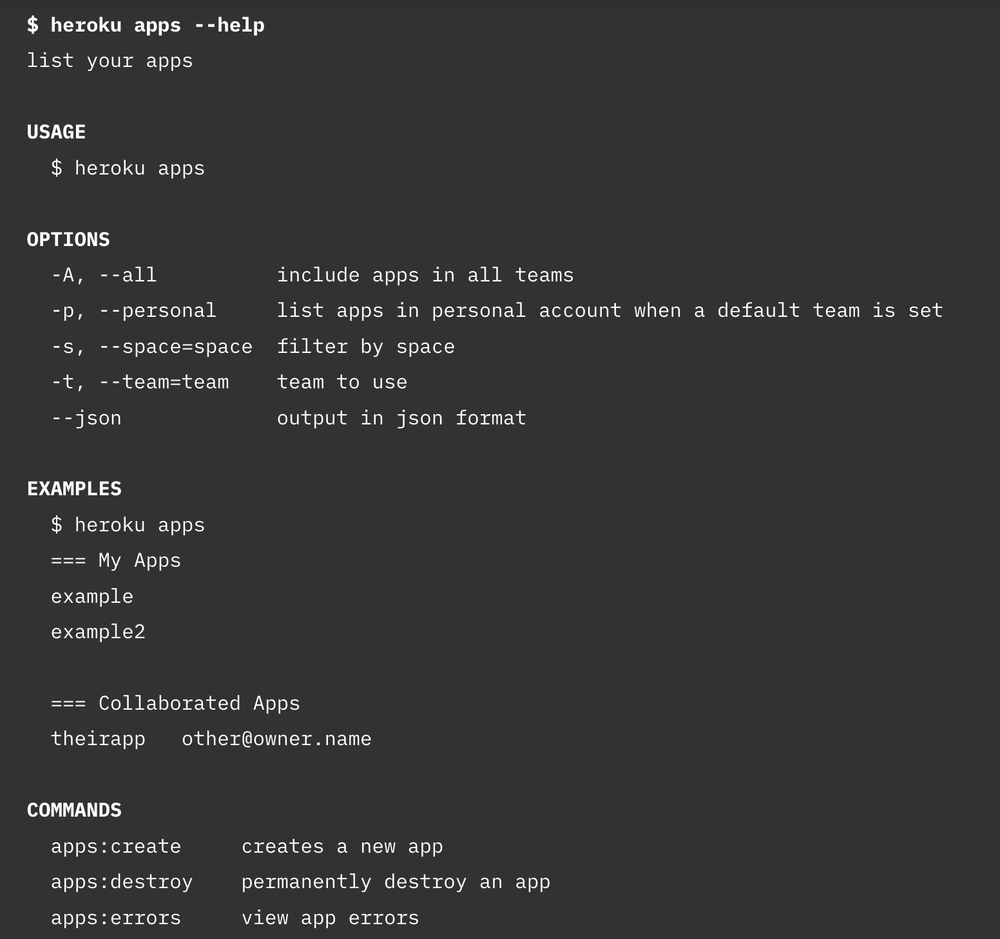

# 2024-12-08：筆記 Command Line Interface Guidelines.md
## Aanand Prasad, Ben Firshman, Carl Tashian, Eva Parish
### https://clig.dev


---

對如何建立好的 CLI 工具有點興趣，從 Liran Tal 的文章看到這篇，感覺非常有料，快點來看看   

作者群:
- Aanand Prasad: Squarespace 工程師，Docker Compose 共同創作者
- Ben Firshman Replicate 共同創作者，Docker Compose 共同創作者
- Carl Tashian: Smallstep Offroad 工程師，Zipcar 首位工程師，Trove 共同創辦人
- Eva Parish: Squarespace 技術作家，O'Reilly 撰稿人

都感覺是很有硬實力的人，所以這篇我很期待  


---

## Foreword
In the 1980s, if you wanted a personal computer to do something for you, you needed to know what to type when confronted with `C:\>` or `~$`. Help came in the form of thick, spiral-bound manuals. Error messages were opaque. There was no Stack Overflow to save you. But if you were lucky enough to have internet access, you could get help from Usenet—an early internet community filled with other people who were just as frustrated as you were. They could either help you solve your problem, or at least provide some moral support and camaraderie.

Forty years later, computers have become so much more accessible to everyone, often at the expense of low-level end user control. On many devices, there is no command-line access at all, in part because it goes against the corporate interests of walled gardens and app stores.

Most people today don’t know what the command line is, much less why they would want to bother with it. As computing pioneer Alan Kay said in a 2017 interview, “Because people don’t understand what computing is about, they think they have it in the iPhone, and that illusion is as bad as the illusion that ‘Guitar Hero’ is the same as a real guitar.”

Kay’s “real guitar” isn’t the CLI—not exactly. He was talking about ways of programming computers that offer the power of the CLI and that transcend writing software in text files. There is a belief among Kay’s disciples that we need to break out of a text-based local maximum that we’ve been living in for decades.

It’s exciting to imagine a future where we program computers very differently. Even today, spreadsheets are by far the most popular programming language, and the no-code movement is taking off quickly as it attempts to replace some of the intense demand for talented programmers.

Yet with its creaky, decades-old constraints and inexplicable quirks, the command line is still the most versatile corner of the computer. It lets you pull back the curtain, see what’s really going on, and creatively interact with the machine at a level of sophistication and depth that GUIs cannot afford. It’s available on almost any laptop, for anyone who wants to learn it. It can be used interactively, or it can be automated. And, it doesn’t change as fast as other parts of the system. There is creative value in its stability.

So, while we still have it, we should try to maximize its utility and accessibility.

A lot has changed about how we program computers since those early days. The command line of the past was machine-first: little more than a REPL on top of a scripting platform. But as general-purpose interpreted languages have flourished, the role of the shell script has shrunk. Today’s command line is human-first: a text-based UI that affords access to all kinds of tools, systems and platforms. In the past, the editor was inside the terminal—today, the terminal is just as often a feature of the editor. And there’s been a proliferation of git-like multi-tool commands. Commands within commands, and high-level commands that perform entire workflows rather than atomic functions.

Inspired by traditional UNIX philosophy, driven by an interest in encouraging a more delightful and accessible CLI environment, and guided by our experiences as programmers, we decided it was time to revisit the best practices and design principles for building command-line programs.

Long live the command line!

在1980年代，如果你想要一台個人電腦為你做些什麼，你需要知道面對 C:\> 或 ~$ 該輸入什麼。幫助來自於厚重的螺旋裝訂手冊。錯誤訊息模糊不清，沒有 Stack Overflow 來拯救你。但如果你夠幸運擁有網際網路存取權，你可以從 Usenet 獲得幫助——一個早期的網際網路社群，充滿了和你一樣沮喪的人。他們可以幫助你解決問題，或者至少提供一些道德支持和夥伴情誼。

四十年後，電腦變得對每個人都更加易於使用，往往是以犧牲低層次終端使用者的控制權為代價。在許多設備上，根本沒有指令列存取，部分原因是它違背了封閉園區和應用商店的企業利益。

今天，大多數人不知道指令列是什麼，更不用說為什麼他們會想要去麻煩它。計算機先驅 Alan Kay 在2017年的一次採訪中說：“因為人們不理解計算是什麼，所以他們認為在 iPhone 中有了它，這種錯覺就像認為『Guitar Hero』和真正的吉他是一樣的。”

Kay 所說的“真正的吉他”不是指 CLI——不完全是。他談論的是能提供 CLI 力量的計算機程式設計方法，並且超越了在文本檔案中編寫軟體的方式。Kay 的信徒們相信我們需要打破我們已經生活了幾十年的基於文本的局部最大值。

想像一個我們以非常不同的方式編程計算機的未來是令人興奮的。即使在今天，試算表仍然是最受歡迎的編程語言，而無代碼運動正在迅速興起，它試圖取代對才華橫溢的程式設計師的強烈需求。

然而，雖然有著數十年來的限制和無法解釋的怪癖，指令列仍然是電腦中最通用的角落。它讓你可以揭開幕後，看清楚實際發生了什麼，並且以 GUI 無法承擔的複雜和深度與機器進行創造性的互動。它幾乎在任何筆記型電腦上都可以使用，對任何想要學習的人都開放。它可以互動使用，也可以自動化。而且，它的變化速度不像系統的其他部分那樣快。它的穩定性有創造價值。

因此，既然我們還擁有它，我們應該努力最大限度地利用它的效用和可訪問性。

自從那些早期的日子以來，我們編程計算機的方式已經發生了很大變化。過去的指令列是以機器為中心的：只是 REPL 之上的一個腳本平台。但隨著通用解釋性語言的繁榮，shell 腳本的角色縮小了。今天的指令列是以人為中心的：一種基於文本的 UI，提供了對各種工具、系統和平台的訪問。在過去，編輯器是在終端內部——今天，終端經常只是編輯器的一個功能。而且出現了如 git 這樣的多工具命令的激增。命令中的命令，以及執行整個工作流程而不是原子功能的高級命令。

受到傳統 UNIX 哲學的啟發，出於對更愉快和可訪問的 CLI 環境的興趣，以及我們作為程式設計師的經驗指導，我們決定是時候重新審視構建指令列程序的最佳實踐和設計原則了。

指令列萬歲！

---

## Introduction
This document covers both high-level design philosophy, and concrete guidelines. It’s heavier on the guidelines because our philosophy as practitioners is not to philosophize too much. We believe in learning by example, so we’ve provided plenty of those.

This guide doesn’t cover full-screen terminal programs like emacs and vim. Full-screen programs are niche projects—very few of us will ever be in the position to design one.

This guide is also agnostic about programming languages and tooling in general.

Who is this guide for?
- If you are creating a CLI program and you are looking for principles and concrete best practices for its UI design, this guide is for you.
- If you are a professional “CLI UI designer,” that’s amazing—we’d love to learn from you.
- If you’d like to avoid obvious missteps of the variety that go against 40 years of CLI design conventions, this guide is for you.
- If you want to delight people with your program’s good design and helpful help, this guide is definitely for you.
- If you are creating a GUI program, this guide is not for you—though you may learn some GUI anti-patterns if you decide to read it anyway.
- If you are designing an immersive, full-screen CLI port of Minecraft, this guide isn’t for you. (But we can’t wait to see it!)


這份文件涵蓋了高層次的設計哲學和具體的指南。指南的部分更多，因為我們作為實踐者的哲學是不要過多哲學化。我們相信通過例子來學習，因此我們提供了很多例子。

這個指南不包括像 emacs 和 vim 這樣的全螢幕終端程序。全螢幕程序是小眾項目，很少有人會有設計它們的機會。

這個指南對編程語言和工具的選擇持中立態度。

這個指南適合誰？

如果你正在創建一個 CLI 程序，並且尋找它的 UI 設計原則和具體的最佳實踐，這個指南適合你。

如果你是專業的“CLI UI 設計師”，那真是太棒了——我們希望向你學習。

如果你想避免一些明顯的錯誤，那些違背了 40 年 CLI 設計約定的錯誤，這個指南適合你。

如果你希望通過你程序的良好設計和有用的幫助來使人們感到愉快，這個指南絕對適合你。

如果你正在創建一個 GUI 程序，這個指南不適合你——儘管如果你決定讀它，可能會學到一些 GUI 的反模式。

如果你正在設計一個沉浸式的全螢幕 CLI 版本的 Minecraft，這個指南不適合你。（但我們迫不及待想要看到它！）


---

## Philosophy
These are what we consider to be the fundamental principles of good CLI design.


哲學
以下是我們認為良好 CLI 設計的基本原則。


---

## Human-first design
Traditionally, UNIX commands were written under the assumption they were going to be used primarily by other programs. They had more in common with functions in a programming language than with graphical applications.

Today, even though many CLI programs are used primarily (or even exclusively) by humans, a lot of their interaction design still carries the baggage of the past. It’s time to shed some of this baggage: if a command is going to be used primarily by humans, it should be designed for humans first.


以人為本的設計
傳統上，UNIX 命令是基於它們主要被其他程序使用的假設編寫的。它們與編程語言中的函數有更多共同之處，而不是圖形應用程序。

今天，即使許多 CLI 程序主要（甚至專門）由人類使用，它們的很多交互設計仍然承載著過去的包袱。是時候拋棄這些包袱了：如果一個命令主要由人類使用，它應該首先為人類設計。


---

## Simple parts that work together
A core tenet of [the original UNIX philosophy](https://en.wikipedia.org/wiki/Unix_philosophy) is the idea that small, simple programs with clean interfaces can be combined to build larger systems. Rather than stuff more and more features into those programs, you make programs that are modular enough to be recombined as needed.

In the old days, pipes and shell scripts played a crucial role in the process of composing programs together. Their role might have diminished with the rise of general-purpose interpreted languages, but they certainly haven’t gone away. What’s more, large-scale automation—in the form of CI/CD, orchestration and configuration management—has flourished. Making programs composable is just as important as ever.

Fortunately, the long-established conventions of the UNIX environment, designed for this exact purpose, still help us today. Standard in/out/err, signals, exit codes and other mechanisms ensure that different programs click together nicely. Plain, line-based text is easy to pipe between commands. JSON, a much more recent invention, affords us more structure when we need it, and lets us more easily integrate command-line tools with the web.

Whatever software you’re building, you can be absolutely certain that people will use it in ways you didn’t anticipate. Your software will become a part in a larger system—your only choice is over whether it will be a well-behaved part.

Most importantly, designing for composability does not need to be at odds with designing for humans first. Much of the advice in this document is about how to achieve both.


簡單的組件一起工作
原始 UNIX 哲學的核心信條是，小而簡單且具有乾淨界面的程序可以組合起來構建更大的系統。與其向這些程序中添加越來越多的功能，不如使程序足夠模塊化，以便根據需要重新組合。

在過去，管道和 shell 腳本在組合程序的過程中起著關鍵作用。隨著通用解釋性語言的興起，它們的角色可能已經減少，但它們確實沒有消失。而且，大規模自動化——以 CI/CD、協同和配置管理的形式——蓬勃發展。使程序可組合比以往任何時候都重要。

幸運的是，為此目的設計的 UNIX 環境的長期約定今天仍然幫助我們。標準輸入/輸出/錯誤，信號，退出碼和其他機制確保了不同程序可以很好地配合在一起。簡單的基於行的文本易於在命令之間傳輸。JSON，是一個最近的發明，當我們需要更多結構時為我們提供更多結構，並讓我們更容易地將命令行工具與網絡集成。

無論你正在構建什麼軟件，你可以完全確信人們會以你未預料到的方式使用它。你的軟件將成為更大系統的一部分——你唯一的選擇是它是否會是一個行為良好的部分。

最重要的是，為可組合性設計不需要與為人類優先設計相抵觸。這篇文檔中的很多建議都是關於如何同時實現這兩者的。


---

## Consistency across programs
The terminal’s conventions are hardwired into our fingers. We had to pay an upfront cost by learning about command line syntax, flags, environment variables and so on, but it pays off in long-term efficiency… as long as programs are consistent.

Where possible, a CLI should follow patterns that already exist. That’s what makes CLIs intuitive and guessable; that’s what makes users efficient.

That being said, sometimes consistency conflicts with ease of use. For example, many long-established UNIX commands don’t output much information by default, which can cause confusion or worry for people less familiar with the command line.

When following convention would compromise a program’s usability, it might be time to break with it—but such a decision should be made with care.


一致性貫穿於程式
終端的慣例已經深植於我們的指尖。我們必須支付前期成本，通過學習命令列語法、標誌、環境變數等來換取長期的效率……前提是程式一致。

在可能的情況下，CLI 應該遵循已存在的模式。這就是使 CLI 直觀且可猜測的原因；這也是使使用者高效的原因。

話雖如此，有時一致性與易用性相衝突。例如，許多長期存在的 UNIX 命令預設不輸出大量資訊，這可能會讓不太熟悉命令列的人感到困惑或擔憂。

當遵循慣例會損害程式的可用性時，可能是時候打破它了——但這樣的決定應謹慎做出。


---

## Saying (just) enough
The terminal is a world of pure information. You could make an argument that information is the interface—and that, just like with any interface, there’s often too much or too little of it.

A command is saying too little when it hangs for several minutes and the user starts to wonder if it’s broken. A command is saying too much when it dumps pages and pages of debugging output, drowning what’s truly important in an ocean of loose detritus. The end result is the same: a lack of clarity, leaving the user confused and irritated.

It can be very difficult to get this balance right, but it’s absolutely crucial if software is to empower and serve its users.


說（剛好）足夠
終端是一個純資訊的世界。你可以認為資訊即是介面，並且，就像任何介面一樣，它往往資訊過多或過少。

當一個命令掛起數分鐘時，使用者開始懷疑它是否崩潰了，此時這個命令說的太少了。當一個命令輸出大量的調試資訊，把真正重要的內容淹沒在一片鬆散的碎片海洋中時，這個命令說的太多了。最終結果是一樣的：缺乏清晰度，讓使用者感到困惑和惱火。

要找到這個平衡點可能非常困難，但如果軟體要賦能並服務其使用者，這是絕對至關重要的。


---

## Ease of discovery
When it comes to making functionality discoverable, GUIs have the upper hand. Everything you can do is laid out in front of you on the screen, so you can find what you need without having to learn anything, and perhaps even discover things you didn’t know were possible.

It is assumed that command-line interfaces are the opposite of this—that you have to remember how to do everything. The original Macintosh Human Interface Guidelines, published in 1987, recommend “See-and-point (instead of remember-and-type),” as if you could only choose one or the other.

These things needn’t be mutually exclusive. The efficiency of using the command-line comes from remembering commands, but there’s no reason the commands can’t help you learn and remember.

Discoverable CLIs have comprehensive help texts, provide lots of examples, suggest what command to run next, suggest what to do when there is an error. There are lots of ideas that can be stolen from GUIs to make CLIs easier to learn and use, even for power users.

Citation: The Design of Everyday Things (Don Norman), Macintosh Human Interface Guidelines


易於發現
在使功能可發現性方面，GUI 具有優勢。你可以做的所有事情都列在螢幕前，所以你可以在不需要學習任何東西的情況下找到你需要的東西，甚至可能發現你不知道的功能。

人們認為命令列介面與此相反——你必須記住如何做所有事情。1987 年出版的原始 Macintosh 人機介面指南建議「查看和指點（而不是記住和輸入）」，就好像你只能選擇其中之一。

這些事情不必互相排斥。使用命令列的效率來自於記住命令，但沒有理由命令不能幫助你學習和記住。

可發現的 CLI 擁有全面的幫助文本，提供大量示例，建議下一步要運行的命令，建議出錯時該怎麼做。有很多可以從 GUI 借鑑的想法，使 CLI 更易於學習和使用，即使是對於進階使用者而言。

引用：The Design of Everyday Things (Don Norman), Macintosh Human Interface Guidelines


---

## Conversation as the norm
GUI design, particularly in its early days, made heavy use of metaphor: desktops, files, folders, recycle bins. It made a lot of sense, because computers were still trying to bootstrap themselves into legitimacy. The ease of implementation of metaphors was one of the huge advantages GUIs wielded over CLIs. Ironically, though, the CLI has embodied an accidental metaphor all along: it’s a conversation.

對話作為常態
GUI 設計，尤其在早期，廣泛使用隱喻：桌面、檔案、文件夾、回收桶。這非常有意義，因為電腦仍在努力使自己正當化。隱喻的實施容易性是 GUI 相較於 CLI 的一大優勢。然而，諷刺的是，CLI 一直體現著一個意外的隱喻：它是一場對話。


Beyond the most utterly simple commands, running a program usually involves more than one invocation. Usually, this is because it’s hard to get it right the first time: the user types a command, gets an error, changes the command, gets a different error, and so on, until it works. This mode of learning through repeated failure is like a conversation the user is having with the program.

Trial-and-error isn’t the only type of conversational interaction, though. There are others:
- Running one command to set up a tool and then learning what commands to run to actually start using it.
- Running several commands to set up an operation, and then a final command to run it (e.g. multiple `git add` s, followed by a `git commit`).
- Exploring a system—for example, doing a lot of `cd` and `ls` to get a sense of a directory structure, or `git log` and `git show` to explore the history of a file.
- Doing a dry-run of a complex operation before running it for real.


除了最簡單的命令之外，運行一個程式通常涉及不只一次調用。通常，這是因為很難一次就做對：使用者輸入命令，出錯，改變命令，再次出錯，如此反覆，直到成功。這種通過反覆失敗學習的模式就像是使用者與程式的對話。

然而，反覆試驗並不是唯一的對話互動類型。還有其他的：

運行一個命令來設置工具，然後學習實際開始使用它的命令。

運行多個命令來設置操作，然後運行最終命令（例如多次 git add，接著是 git commit）。

探索系統——例如，做大量的 cd 和 ls 以了解目錄結構，或 git log 和 git show 以探索文件的歷史。

在實際運行之前進行複雜操作的試運行。


Acknowledging the conversational nature of command-line interaction means you can bring relevant techniques to bear on its design. You can suggest possible corrections when user input is invalid, you can make the intermediate state clear when the user is going through a multi-step process, you can confirm for them that everything looks good before they do something scary.

The user is conversing with your software, whether you intended it or not. At worst, it’s a hostile conversation which makes them feel stupid and resentful. At best, it’s a pleasant exchange that speeds them on their way with newfound knowledge and a feeling of achievement.

Further reading: The Anti-Mac User Interface (Don Gentner and Jakob Nielsen)
- https://www.nngroup.com/articles/anti-mac-interface/

承認命令列互動的對話性質意味著你可以在其設計中引入相關技術。當使用者輸入無效時，你可以建議可能的更正，當使用者進行多步驟過程時，你可以清楚地顯示中間狀態，你可以在他們做出可怕的操作之前向他們確認一切看起來都很好。

無論你是否有意，使用者都在與你的軟體對話。最糟糕的情況是，它是一場使他們感到愚蠢和憤怒的敵對對話。最好的情況是，它是一場愉快的交流，使他們帶著新知識和成就感快速前行。

進一步閱讀：The Anti-Mac User Interface (Don Gentner and Jakob Nielsen)

https://www.nngroup.com/articles/anti-mac-interface/


---

## Robustness
Robustness is both an objective and a subjective property. Software should be robust, of course: unexpected input should be handled gracefully, operations should be idempotent where possible, and so on. But it should also feel robust.

You want your software to feel like it isn’t going to fall apart. You want it to feel immediate and responsive, as if it were a big mechanical machine, not a flimsy plastic “soft switch.”

Subjective robustness requires attention to detail and thinking hard about what can go wrong. It’s lots of little things: keeping the user informed about what’s happening, explaining what common errors mean, not printing scary-looking stack traces.

As a general rule, robustness can also come from keeping it simple. Lots of special cases and complex code tend to make a program fragile.


穩健性
穩健性既是一個客觀又是一個主觀的屬性。軟體應該是穩健的，當然：應該能夠優雅地處理意外輸入，操作應該在可能的情況下保持冪等，等等。但它也應該感覺是穩健的。

你希望你的軟體感覺不會崩潰。你希望它感覺即時且有反應，仿佛它是一個大型機械機器，而不是一個脆弱的塑料“軟開關”。

主觀的穩健性需要注意細節，並認真考慮可能出錯的地方。這包含許多小事：讓使用者了解正在發生的事情，解釋常見錯誤的含義，不打印看起來令人害怕的堆疊追蹤。

一般來說，保持簡單也可以帶來穩健性。許多特殊情況和複雜的代碼往往使程式脆弱。


---

## Empathy
Command-line tools are a programmer’s creative toolkit, so they should be enjoyable to use. This doesn’t mean turning them into a video game, or using lots of emoji (though there’s nothing inherently wrong with emoji 😉). It means giving the user the feeling that you are on their side, that you want them to succeed, that you have thought carefully about their problems and how to solve them.

There’s no list of actions you can take that will ensure they feel this way, although we hope that following our advice will take you some of the way there. Delighting the user means exceeding their expectations at every turn, and that starts with empathy.


同理心
命令行工具是程式設計師的創意工具包，因此它們應該是令人愉快的使用工具。這並不意味著將它們變成視頻遊戲，或使用大量表情符號（雖然表情符號本身沒有什麼錯 😉）。它意味著給使用者一種感覺，讓他們感覺你在他們一邊，你希望他們成功，你已經仔細考慮了他們的問題以及如何解決它們。

沒有一個行動清單可以確保他們有這種感覺，儘管我們希望遵循我們的建議能幫助你部分地達到這一目標。使使用者感到愉快意味著在每一步都超出他們的預期，而這始於同理心。


---

## Chaos
The world of the terminal is a mess. Inconsistencies are everywhere, slowing us down and making us second-guess ourselves.

Yet it’s undeniable that this chaos has been a source of power. The terminal, like the UNIX-descended computing environment in general, places very few constraints on what you can build. In that space, all manner of invention has bloomed.

It’s ironic that this document implores you to follow existing patterns, right alongside advice that contradicts decades of command-line tradition. We’re just as guilty of breaking the rules as anyone.

The time might come when you, too, have to break the rules. Do so with intention and clarity of purpose.

“Abandon a standard when it is demonstrably harmful to productivity or user satisfaction.” — Jef Raskin, The Humane Interface
- https://en.wikipedia.org/wiki/The_Humane_Interface


混亂
終端的世界一片混亂。不一致性隨處可見，拖慢了我們的速度，使我們自我懷疑。

然而，不可否認的是，這種混亂一直是力量的源泉。像 UNIX 衍生的計算環境一樣，終端對你能構建什麼設置了非常少的限制。在這個空間中，各種發明蓬勃發展。

這個文件呼籲你遵循現有的模式，同時給出了與幾十年的命令行傳統相矛盾的建議，這是很諷刺的。我們打破規則的罪名與其他人一樣。

可能有一天，你也需要打破規則。請有意圖地和目標明確地這樣做。

“當某個標準顯然對生產力或使用者滿意度有害時，應當放棄該標準。” — Jef Raskin，《人性化介面》

https://en.wikipedia.org/wiki/The_Humane_Interface


---

## Guidelines
This is a collection of specific things you can do to make your command-line program better.


指南
這是一些可以讓你的命令行程序變得更好的具體建議集合。


The first section contains the essential things you need to follow. Get these wrong, and your program will be either hard to use or a bad CLI citizen.

The rest are nice-to-haves. If you have the time and energy to add these things, your program will be a lot better than the average program.

The idea is that, if you don’t want to think too hard about the design of your program, you don’t have to: just follow these rules and your program will probably be good. On the other hand, if you’ve thought about it and determined that a rule is wrong for your program, that’s fine. (There’s no central authority that will reject your program for not following arbitrary rules.)

Also—these rules aren’t written in stone. If you disagree with a general rule for good reason, we hope you’ll propose a change.
- https://github.com/cli-guidelines/cli-guidelines

第一部分包含你需要遵循的基本事項。如果這些做錯了，你的程序要麼難以使用，要麼是一個糟糕的 CLI 公民。

其餘的是可選的。如果你有時間和精力添加這些功能，你的程序將比一般的程序好得多。

我們的想法是，如果你不想過多地考慮你的程序的設計，你不需要：只需遵循這些規則，你的程序可能會很好。另一方面，如果你經過思考並認為某個規則不適合你的程序，那也沒關係。（沒有人會因為不遵守任意規則而拒絕你的程序。）

此外——這些規則不是一成不變的。如果你有充分的理由不同意一條普遍規則，我們希望你能提出改變建議。

https://github.com/cli-guidelines/cli-guidelines


---

## The Basics
There are a few basic rules you need to follow. Get these wrong, and your program will be either very hard to use, or flat-out broken.

**Use a command-line argument parsing library where you can.** Either your language’s built-in one, or a good third-party one. They will normally handle arguments, flag parsing, help text, and even spelling suggestions in a sensible way.

Here are some that we like:


基本原則
有一些基本規則你需要遵循。如果這些做錯了，你的程序要麼非常難用，要麼完全壞掉。

使用命令行參數解析庫，能用時就用。 使用你的語言內建的，或者一個好的第三方庫。它們通常會以合理的方式處理參數、標誌解析、幫助文本，甚至拼寫建議。

這裡有一些我們喜歡的：
 

- Multi-platform: docopt
- Bash: [argbash](https://argbash.dev/)
- Go: [Cobra](https://github.com/spf13/cobra), [cli](https://github.com/urfave/cli)
- Haskell: [optparse-applicative](https://hackage.haskell.org/package/optparse-applicative)
- Java: [picocli](https://picocli.info/)
- Julia: [ArgParse.jl](https://github.com/carlobaldassi/ArgParse.jl), [Comonicon.jl](https://github.com/comonicon/Comonicon.jl)
- Kotlin: [clikt](https://ajalt.github.io/clikt/)
- Node: [oclif](https://oclif.io/)
- Deno: [flags](https://deno.land/std@0.224.0/flags/mod.ts)
- Perl: [Getopt::Long](https://metacpan.org/pod/Getopt::Long)
- PHP: [console](https://github.com/symfony/console), [CLImate](https://climate.thephpleague.com/)
- Python: [Argparse](https://docs.python.org/3/library/argparse.html), [Click](https://click.palletsprojects.com/en/stable/), [Typer](https://github.com/fastapi/typer)
- Ruby: [TTY](https://ttytoolkit.org/)
- Rust: clap
- Swift: [swift-argument-parser](https://github.com/apple/swift-argument-parser)


**Return zero exit code on success, non-zero on failure.** Exit codes are how scripts determine whether a program succeeded or failed, so you should report this correctly. Map the non-zero exit codes to the most important failure modes.

Send output to `stdout`. The primary output for your command should go to `stdout`. Anything that is machine readable should also go to `stdout`—this is where piping sends things by default.

Send messaging to `stderr`. Log messages, errors, and so on should all be sent to `stderr`. This means that when commands are piped together, these messages are displayed to the user and not fed into the next command.


成功時返回零退出碼，失敗時返回非零退出碼。 退出碼是腳本判斷程序是否成功的方式，所以你應該正確報告這一點。將非零退出碼映射到最重要的失敗模式。

將輸出發送到 stdout。你的命令的主要輸出應該發送到 stdout。任何可機器讀取的內容也應該發送到 stdout——這是管道默認發送內容的地方。

將消息發送到 stderr。日誌消息、錯誤等都應該發送到 stderr。這意味著當命令被管道連接在一起時，這些消息會顯示給使用者，而不是傳輸到下一個命令。


---

## Help
Display help text when passed no options, the `-h` flag, or the `--help` flag.

Display a concise help text by default. When `myapp` or `myapp subcommand` is run with no arguments, display help text.

You can ignore this guideline if your program or subcommand is very simple and requires no arguments (e.g. `ls`, `git pull`), or if it’s interactive by default (e.g. `npm init`).


幫助
當沒有選項、-h 標誌或 --help 標誌時顯示幫助文本。

預設顯示簡潔的幫助文本。當運行 myapp 或 myapp subcommand 並沒有參數時，顯示幫助文本。

如果你的程序或子命令非常簡單且不需要參數（例如 ls，git pull），或者它默認是互動的（例如 npm init），你可以忽略這個指導。


The concise help text should only include:

- A description of what your program does.
- One or two example invocations.
- Descriptions of flags, unless there are lots of them.
- An instruction to pass the `--help` flag for more information.

`jq` does this well. When you type `jq`, it displays an introductory description and an example, then prompts you to pass `jq --help` for the full listing of flags:


簡潔的幫助文本應僅包含：

描述你的程序的作用。

一兩個示例調用。

標誌的描述，除非有很多標誌。

一條指示，要求傳遞 --help 標誌以獲取更多信息。

jq 做得很好。當你輸入 jq 時，它顯示一個簡介說明和一個示例，然後提示你傳遞 jq --help 以獲取完整的標誌清單：


```
$ jq
jq - commandline JSON processor [version 1.6]

Usage:    jq [options] <jq filter> [file...]
    jq [options] --args <jq filter> [strings...]
    jq [options] --jsonargs <jq filter> [JSON_TEXTS...]

jq is a tool for processing JSON inputs, applying the given filter to
its JSON text inputs and producing the filter's results as JSON on
standard output.

The simplest filter is ., which copies jq's input to its output
unmodified (except for formatting, but note that IEEE754 is used
for number representation internally, with all that that implies).

For more advanced filters see the jq(1) manpage ("man jq")
and/or https://stedolan.github.io/jq

Example:

    $ echo '{"foo": 0}' | jq .
    {
        "foo": 0
    }

For a listing of options, use jq --help.
```

Show full help when `-h` and `--help` is passed. All of these should show help:


當傳遞 -h 和 --help 時顯示完整的幫助。所有這些都應該顯示幫助：


```
$ myapp
$ myapp --help
$ myapp -h
```

Ignore any other flags and arguments that are passed—you should be able to add `-h` to the end of anything and it should show help. Don’t overload `-h`.

If your program is `git`-like, the following should also offer help:

忽略傳遞的任何其他標誌和參數——你應該能夠在任何命令結尾添加 -h 並顯示幫助。不要過度使用 -h。

如果你的程序類似 git，則以下也應該提供幫助：


```
$ myapp help
$ myapp help subcommand
$ myapp subcommand --help
$ myapp subcommand -h
```

**Provide a support path for feedback and issues.** A website or GitHub link in the top-level help text is common.


提供反饋和問題的支持路徑。 常見的是在頂級幫助文本中提供一個網站或 GitHub 連結。


**In help text, link to the web version of the documentation.** If you have a specific page or anchor for a subcommand, link directly to that. This is particularly useful if there is more detailed documentation on the web, or further reading that might explain the behavior of something.

**Lead with examples**. Users tend to use examples over other forms of documentation, so show them first in the help page, particularly the common complex uses. If it helps explain what it’s doing and it isn’t too long, show the actual output too.

You can tell a story with a series of examples, building your way toward complex uses.


在幫助文本中連結到網絡版的文檔。 如果你有子命令的特定頁面或錨點，請直接連結到那裡。如果網上有更詳細的文檔或可能解釋某些行為的進一步閱讀，這是特別有用的。

以示例為主。 使用者往往使用示例而不是其他形式的文檔，所以首先在幫助頁面中展示它們，特別是常見的複


**If you’ve got loads of examples, put them somewhere else**, in a cheat sheet command or a web page. It’s useful to have exhaustive, advanced examples, but you don’t want to make your help text really long.

For more complex use cases, e.g. when integrating with another tool, it might be appropriate to write a fully-fledged tutorial.

**Display the most common flags and commands at the start of the help text.** It’s fine to have lots of flags, but if you’ve got some really common ones, display them first. For example, the Git command displays the commands for getting started and the most commonly used subcommands first:

如果你有很多示例，請將它們放在其他地方，例如備忘指令或網頁中。擁有詳盡的、高級示例是很有用的，但你不想讓你的幫助文本變得非常長。

對於更複雜的使用情況，例如與其他工具集成時，可能適合寫一個完整的教程。

在幫助文本的開頭顯示最常見的標誌和命令。 有很多標誌是可以的，但如果你有一些非常常見的，請首先顯示它們。例如，Git 命令首先顯示入門命令和最常用的子命令：

```
$ git
usage: git [--version] [--help] [-C <path>] [-c <name>=<value>]
           [--exec-path[=<path>]] [--html-path] [--man-path] [--info-path]
           [-p | --paginate | -P | --no-pager] [--no-replace-objects] [--bare]
           [--git-dir=<path>] [--work-tree=<path>] [--namespace=<name>]
           <command> [<args>]

These are common Git commands used in various situations:

start a working area (see also: git help tutorial)
   clone      Clone a repository into a new directory
   init       Create an empty Git repository or reinitialize an existing one

work on the current change (see also: git help everyday)
   add        Add file contents to the index
   mv         Move or rename a file, a directory, or a symlink
   reset      Reset current HEAD to the specified state
   rm         Remove files from the working tree and from the index

examine the history and state (see also: git help revisions)
   bisect     Use binary search to find the commit that introduced a bug
   grep       Print lines matching a pattern
   log        Show commit logs
   show       Show various types of objects
   status     Show the working tree status
…
```

**Use formatting in your help text.** Bold headings make it much easier to scan. But, try to do it in a terminal-independent way so that your users aren’t staring down a wall of escape characters.

在幫助文本中使用格式化。 粗體標題使其更容易掃描。但要嘗試以與終端無關的方式進行，這樣你的使用者就不會看到一堆跳脫字符。


  

Note: When `heroku apps --help` is piped through a pager, the command emits no escape characters.

**If the user did something wrong and you can guess what they meant, suggest it.** For example, `brew update jq` tells you that you should run `brew upgrade jq`.

You can ask if they want to run the suggested command, but don’t force it on them. For example:


註：當 heroku apps --help 通過分頁器傳輸時，該命令不會輸出跳脫字符。

如果使用者做錯了什麼而你可以猜出他們的意思，建議他們。 例如，brew update jq 告訴你應該運行 brew upgrade jq。

你可以詢問他們是否想運行建議的命令，但不要強制他們。例如：
 

```
$ heroku pss
 ›   Warning: pss is not a heroku command.
Did you mean ps? [y/n]:
```

Rather than suggesting the corrected syntax, you might be tempted to just run it for them, as if they’d typed it right in the first place. Sometimes this is the right thing to do, but not always.

Firstly, invalid input doesn’t necessarily imply a simple typo—it can often mean the user has made a logical mistake, or misused a shell variable. Assuming what they meant can be dangerous, especially if the resulting action modifies state.

Secondly, be aware that if you change what the user typed, they won’t learn the correct syntax. In effect, you’re ruling that the way they typed it is valid and correct, and you’re committing to supporting that indefinitely. Be intentional in making that decision, and document both syntaxes.

與其建議正確的語法，你可能會忍不住直接為他們運行它，就像他們一開始就輸入正確一樣。有時這是正確的做法，但並不總是如此。

首先，無效輸入不一定意味著簡單的拼寫錯誤——它通常意味著使用者犯了一個邏輯錯誤，或錯誤地使用了 shell 變數。假設他們的意思可能是危險的，尤其是如果結果操作修改了狀態。

其次，請注意，如果你更改了使用者輸入的內容，他們不會學到正確的語法。實際上，你是在認定他們輸入的方式是有效且正確的，並承諾無限期支持該方式。要有意識地做出這一決定，並記錄兩種語法。


Further reading: `Do What I Mean`
- http://www.catb.org/~esr/jargon/html/D/DWIM.html

**If your command is expecting to have something piped to it and `stdin` is an interactive terminal, display help immediately and quit.** This means it doesn’t just hang, like `cat`. Alternatively, you could print a log message to `stderr`.

進一步閱讀：Do What I Mean

http://www.catb.org/~esr/jargon/html/D/DWIM.html

如果你的命令預期會接收管道傳輸的內容，而 stdin 是一個互動終端，立即顯示幫助並退出。 這意味著它不會像 cat 一樣掛起。或者，你可以向 stderr 打印一條日誌消息。


---

## Documentation
The purpose of `help text` is to give a brief, immediate sense of what your tool is, what options are available, and how to perform the most common tasks. Documentation, on the other hand, is where you go into full detail. It’s where people go to understand what your tool is for, what it isn’t for, how it works and how to do everything they might need to do.

**Provide web-based documentation.** People need to be able to search online for your tool’s documentation, and to link other people to specific parts. The web is the most inclusive documentation format available.


文件
幫助文本 的目的是給予你工具的一個簡短、即時的感覺，了解有哪些選項以及如何執行最常見的任務。而文檔則是你進行詳細說明的地方。它是人們了解你的工具的用途、非用途、工作原理以及如何完成他們可能需要的所有操作的地方。

提供基於網絡的文檔。 人們需要能夠在線搜索你工具的文檔，並將其連結到特定部分。網絡是目前最具包容性的文檔格式。


**Provide terminal-based documentation.** Documentation in the terminal has several nice properties: it’s fast to access, it stays in sync with the specific installed version of the tool, and it works without an internet connection.

Consider providing [man pages](https://en.wikipedia.org/wiki/Man_page). man pages, Unix’s original system of documentation, are still in use today, and many users will reflexively check `man mycmd` as a first step when trying to learn about your tool. To make them easier to generate, you can use a tool like [ronn](https://rtomayko.github.io/ronn/ronn.1.html) (which can also generate your web docs).

However, not everyone knows about `man`, and it doesn’t run on all platforms, so you should also make sure your terminal docs are accessible via your tool itself. For example, `git` and `npm` make their man pages accessible via the `help` subcommand, so `npm help ls` is equivalent to `man npm-ls`.


提供基於終端的文檔。 終端中的文檔有幾個不錯的特性：快速訪問，與特定安裝版本的工具保持同步，而且不需要互聯網連接。

考慮提供 man 手冊頁。man 手冊頁，UNIX 的原始文檔系統，今天仍在使用，許多使用者會自然而然地檢查 man mycmd 作為了解你工具的第一步。為了使它們更易於生成，你可以使用類似 ronn 的工具（它也可以生成你的網絡文檔）。

然而，並非每個人都知道 man，而且它並不適用於所有平台，所以你也應確保你的終端文檔可以通過你的工具本身訪問。例如，git 和 npm 通過 help 子命令使他們的 man 手冊頁可以訪問，因此 npm help ls 等同於 man npm-ls。


```
NPM-LS(1)                                                            NPM-LS(1)

NAME
       npm-ls - List installed packages

SYNOPSIS
         npm ls [[<@scope>/]<pkg> ...]

         aliases: list, la, ll

DESCRIPTION
       This command will print to stdout all the versions of packages that are
       installed, as well as their dependencies, in a tree-structure.

       ...
```


---

## Output
**Human-readable output is paramount.** Humans come first, machines second. The most simple and straightforward heuristic for whether a particular output stream (`stdout` or `stderr`) is being read by a human is whether or not it’s a TTY. Whatever language you’re using, it will have a utility or library for doing this (e.g. Python, Node, Go).


輸出
人類可讀輸出至關重要。 人類第一，機器第二。判斷某個特定輸出流（stdout 或 stderr）是否由人類閱讀的最簡單直接的準

Further reading on `what a TTY is`.
- https://unix.stackexchange.com/questions/4126/what-is-the-exact-difference-between-a-terminal-a-shell-a-tty-and-a-con/4132#4132


則是它是否為 TTY。無論你使用什麼語言，它都會有一個實用程序或庫來執行此操作（例如 Python, Node, Go）。

進一步閱讀 什麼是 TTY。


**Have machine-readable output where it does not impact usability.** Streams of text is the universal interface in UNIX. Programs typically output lines of text, and programs typically expect lines of text as input, therefore you can compose multiple programs together. This is normally done to make it possible to write scripts, but it can also help the usability for humans using programs. For example, a user should be able to pipe output to `grep` and it should do what they expect.

“Expect the output of every program to become the input to another, as yet unknown, program.” — Doug McIlroy

**If human-readable output breaks machine-readable output, use `--plain` to display output in plain, tabular text format for integration with tools like `grep` or `awk`.** In some cases, you might need to output information in a different way to make it human-readable.

For example, if you are displaying a line-based table, you might choose to split a cell into multiple lines, fitting in more information while keeping it within the width of the screen. This breaks the expected behavior of there being one piece of data per line, so you should provide a `--plain` flag for scripts, which disables all such manipulation and outputs one record per line.

在不影響可用性的情況下提供機器可讀輸出。 文本流是 UNIX 的通用介面。程序通常輸出文本行，程序通常也期望文本行作為輸入，因此你可以將多個程序組合在一起。這通常是為了編寫腳本，但也可以幫助使用程序的人類使用者。例如，使用者應該能夠將輸出通過管道傳送到 grep，並且它應該做他們期望的事情。

“期望每個程序的輸出成為另一個尚未知道的程序的輸入。” — Doug McIlroy

如果人類可讀輸出破壞了機器可讀輸出，請使用 --plain 以純文本格式顯示輸出，便於與 grep 或 awk 等工具集成。 在某些情況下，你可能需要以不同的方式輸出信息以使其對人類可讀。

例如，如果你顯示的是基於行的表格，你可能選擇將一個單元格分成多行，從而在保持在螢幕寬度內的同時容納更多信息。這打破了每行只有一條數據的預期行為，因此你應該為腳本提供一個 --plain 標誌，禁止所有這種操作並每行輸出一條記錄。


**Display output as formatted JSON if `--json` is passed.** JSON allows for more structure than plain text, so it makes it much easier to output and handle complex data structures. `jq` is a common tool for working with JSON on the command-line, and there is now a [whole ecosystem of tools](https://ilya-sher.org/2018/04/10/list-of-json-tools-for-command-line/) that output and manipulate JSON.

It is also widely used on the web, so by using JSON as the input and output of programs, you can pipe directly to and from web services using `curl`.

**Display output on success, but keep it brief.** Traditionally, when nothing is wrong, UNIX commands display no output to the user. This makes sense when they’re being used in scripts, but can make commands appear to be hanging or broken when used by humans. For example, `cp` will not print anything, even if it takes a long time.


如果傳遞了 --json，以格式化的 JSON 顯示輸出。 JSON 比純文本提供更多結構，因此它使輸出和處理複雜數據結構變得更加容易。jq 是一個常用於命令行處理 JSON 的工具，現在還有一個完整的工具生態系統來輸出和操作 JSON。

它也在網絡上廣泛使用，因此通過使用 JSON 作為程序的輸入和輸出，你可以使用 curl 直接與網絡服務進行管道傳輸。

在成功時顯示輸出，但保持簡短。 傳統上，當沒有問題時，UNIX 命令不向使用者顯示任何輸出。這在腳本中使用時是有意義的，但當人類使用時可能會讓命令顯得掛起或損壞。例如，cp 不會打印任何東西，即使它需要很長時間。


It’s rare that printing nothing at all is the best default behavior, but it’s usually best to err on the side of less.

For instances where you do want no output (for example, when used in shell scripts), to avoid clumsy redirection of `stderr` to `/dev/null`, you can provide a `-q` option to suppress all non-essential output.

**If you change state, tell the user.** When a command changes the state of a system, it’s especially valuable to explain what has just happened, so the user can model the state of the system in their head—particularly if the result doesn’t directly map to what the user requested.

For example, `git push` tells you exactly what it is doing, and what the new state of the remote branch is:

完全不打印任何內容作為默認行為是很少見的，但通常最好趨向於少的方向。

在你確實想要無輸出的情況下（例如，在 shell 腳本中使用時），為了避免將 stderr 笨拙地重定向到 /dev/null，你可以提供一個 -q 選項以抑制所有非必要輸出。

如果你改變了狀態，告訴使用者。 當命令改變系統的狀態時，解釋剛剛發生的事情特別有價值，這樣使用者可以在腦海中模擬系統的狀態——特別是如果結果不直接對應於使用者的請求。

例如，git push 會精確告訴你它在做什麼，以及遠端分支的新狀態是什麼：


```
$ git push
Enumerating objects: 18, done.
Counting objects: 100% (18/18), done.
Delta compression using up to 8 threads
Compressing objects: 100% (10/10), done.
Writing objects: 100% (10/10), 2.09 KiB | 2.09 MiB/s, done.
Total 10 (delta 8), reused 0 (delta 0), pack-reused 0
remote: Resolving deltas: 100% (8/8), completed with 8 local objects.
To github.com:replicate/replicate.git
 + 6c22c90...a2a5217 bfirsh/fix-delete -> bfirsh/fix-delete
```

**Make it easy to see the current state of the system.** If your program does a lot of complex state changes and it is not immediately visible in the filesystem, make sure you make this easy to view.

For example, `git status` tells you as much information as possible about the current state of your Git repository, and some hints at how to modify the state:

使查看系統當前狀態變得容易。 如果你的程序進行了很多複雜的狀態變更，並且這些變更在文件系統中不能立即可見，請確保你使這些變更容易查看。

例如，git status 會告訴你有關 Git 存儲庫當前狀態的盡可能多的信息，並提供一些修改狀態的提示：

```
$ git status
On branch bfirsh/fix-delete
Your branch is up to date with 'origin/bfirsh/fix-delete'.

Changes not staged for commit:
  (use "git add <file>..." to update what will be committed)
  (use "git restore <file>..." to discard changes in working directory)
	modified:   cli/pkg/cli/rm.go

no changes added to commit (use "git add" and/or "git commit -a")
```


**Suggest commands the user should run.** When several commands form a workflow, suggesting to the user commands they can run next helps them learn how to use your program and discover new functionality. For example, in the `git status` output above, it suggests commands you can run to modify the state you are viewing.


建議使用者應該運行的命令。 當多個命令構成一個工作流程時，向使用者建議他們可以運行的下一個命令有助於他們學習如何使用你的程式並發現新的功能。例如，在上述的 git status 輸出中，它建議了你可以運行的命令來修改你正在查看的狀態。


**Actions crossing the boundary of the program’s internal world should usually be explicit.** This includes things like:

- Reading or writing files that the user didn’t explicitly pass as arguments (unless those files are storing internal program state, such as a cache).
- Talking to a remote server, e.g. to download a file.


超出程式內部世界邊界的操作通常應該是明確的。 這包括以下內容：

讀取或寫入使用者未明確傳遞為參數的檔案（除非這些檔案存儲的是內部程式狀態，例如緩存）。

與遠端伺服器通信，例如下載檔案。


**Increase information density—with ASCII art!** For example, `ls` shows permissions in a scannable way. When you first see it, you can ignore most of the information. Then, as you learn how it works, you pick out more patterns over time.

通過 ASCII 藝術增加信息密度！ 例如，ls 以可掃描的方式顯示許可權。當你第一次看到它時，你可以忽略大多數信息。然後，隨著你學習它的工作原理，你會隨著時間的推移識別出更多模式。


**Use color with intention.** For example, you might want to highlight some text so the user notices it, or use red to indicate an error. Don’t overuse it—if everything is a different color, then the color means nothing and only makes it harder to read.


有意義地使用顏色。 例如，你可能想要突出一些文本，使使用者注意到它，或使用紅色來指示錯誤。不要過度使用它——如果每個東西都是不同的顏色，那麼顏色就失去了意義，並且只會使閱讀變得更加困難。

如果你的程式不在終端中運行或使用者要求禁用顏色，請禁用顏色。 以下情況應該禁用顏色：


**Disable color if your program is not in a terminal or the user requested it.** These things should disable colors:
- `stdout` or `stderr` is not an interactive terminal (a TTY). It’s best to individually check—if you’re piping `stdout` to another program, it’s still useful to get colors on `stderr`.
- The `NO_COLOR` environment variable is set.
- The `TERM` environment variable has the value `dumb`.
- The user passes the option `--no-color`.
- You may also want to add a `MYAPP_NO_COLOR` environment variable in case users want to disable color specifically for your program.


stdout 或 stderr 不是交互式終端（TTY）。最好單獨檢查——如果你正在將 stdout 通過管道傳送到另一個程式，仍然希望在 stderr 上獲得顏色。

設置了 NO_COLOR 環境變數。

TERM 環境變數的值為 dumb。

使用者傳遞了 --no-color 選項。

你可能還希望添加一個 MYAPP_NO_COLOR 環境變數，以防使用者希望專門為你的程式禁用顏色。


Further reading:
- `no-color.org`: https://no-color.org/
- `12 Factor CLI Apps`: https://medium.com/@jdxcode/12-factor-cli-apps-dd3c227a0e46


進一步閱讀：

no-color.org: https://no-color.org/

12 Factor CLI Apps: https://medium.com/@jdxcode/12-factor-cli-apps-dd3c227a0e46


**If `stdout` is not an interactive terminal, don’t display any animations.** This will stop progress bars turning into Christmas trees in CI log output.

**Use symbols and emoji where it makes things clearer.** Pictures can be better than words if you need to make several things distinct, catch the user’s attention, or just add a bit of character. Be careful, though—it can be easy to overdo it and make your program look cluttered or feel like a toy.

For example, [yubikey-agent](https://github.com/FiloSottile/yubikey-agent) uses emoji to add structure to the output so it isn’t just a wall of text, and a ❌ to draw your attention to an important piece of information:


如果 stdout 不是交互式終端，不要顯示任何動畫。 這將阻止進度條在 CI 日誌輸出中變成聖誕樹。

在有助於澄清時使用符號和表情符號。 圖片如果需要使多個事物區分開來、引起使用者注意或僅僅增加一點特色，則比文字更好。但是要小心——很容易過度使用，讓你的程式看起來雜亂無章或像玩具。

例如，yubikey-agent 使用表情符號為輸出增加結構，使其不僅僅是一堵文本牆，並使用 ❌ 吸引你的注意力到重要的信息：


```
$ yubikey-agent -setup
🔐 The PIN is up to 8 numbers, letters, or symbols. Not just numbers!
❌ The key will be lost if the PIN and PUK are locked after 3 incorrect tries.

Choose a new PIN/PUK: 
Repeat the PIN/PUK: 

🧪 Retriculating splines …

✅ Done! This YubiKey is secured and ready to go.
🤏 When the YubiKey blinks, touch it to authorize the login.

🔑 Here's your new shiny SSH public key:
ecdsa-sha2-nistp256 AAAAE2VjZHNhLXNoYTItbmlzdHAyNTYAAAAIbmlzdHAyNTYAAABBBCEJ/
UwlHnUFXgENO3ifPZd8zoSKMxESxxot4tMgvfXjmRp5G3BGrAnonncE7Aj11pn3SSYgEcrrn2sMyLGpVS0=

💭 Remember: everything breaks, have a backup plan for when this YubiKey does.
```

**By default, don’t output information that’s only understandable by the creators of the software.** If a piece of output serves only to help you (the developer) understand what your software is doing, it almost certainly shouldn’t be displayed to normal users by default—only in verbose mode.

Invite usability feedback from outsiders and people who are new to your project. They’ll help you see important issues that you are too close to the code to notice.

**Don’t treat `stderr` like a log file, at least not by default.** Don’t print log level labels (`ERR`, `WARN`, etc.) or extraneous contextual information, unless in verbose mode.

默認情況下，不要輸出僅軟體創建者才能理解的信息。 如果某個輸出僅用於幫助你（開發者）理解你的軟體在做什麼，則幾乎肯定不應該默認顯示給普通使用者——僅在詳細模式下顯示。

邀請外部人士和新項目成員的可用性反饋。他們會幫助你看到你因離代碼太近而忽視的重要問題。

不要將 stderr 視為日誌文件，至少在默認情況下不要這樣做。 除非在詳細模式下，否則不要打印日誌級別標籤（ERR，WARN 等）或額外的上下文信息。


**Use a pager (e.g. `less`) if you are outputting a lot of text.** For example, `git diff` does this by default. Using a pager can be error-prone, so be careful with your implementation such that you don’t make the experience worse for the user. You shouldn’t use a pager if `stdin` or `stdout` is not an interactive terminal.

A good sensible set of options to use for `less` is `less -FIRX`. This does not page if the content fills one screen, ignores case when you search, enables color and formatting, and leaves the contents on the screen when `less` quits.

There might be libraries in your language that are more robust than piping to `less`. For example, [pypager](https://github.com/prompt-toolkit/pypager) in Python.


如果你輸出大量文本，使用分頁器（例如 less）。 例如，git diff 默認執行此操作。使用分頁器可能容易出錯，因此在實施時要小心，避免使使用者體驗變差。如果 stdin 或 stdout 不是交互式終端，則不應使用分頁器。

對 less 使用一組良好合理的選項是 less -FIRX。這樣當內容佔滿一個螢幕時不會分頁，搜索時忽略大小寫，啟用顏色和格式化，並在 less 退出時保留內容在螢幕上。

在你的語言中可能有比通過管道傳輸到 less 更健壯的庫。例如，Python 中的 pypager。


---

## Errors
One of the most common reasons to consult documentation is to fix errors. If you can make errors into documentation, then this will save the user loads of time.

**Catch errors and rewrite them for humans.** If you’re expecting an error to happen, catch it and rewrite the error message to be useful. Think of it like a conversation, where the user has done something wrong and the program is guiding them in the right direction. Example: “Can’t write to file.txt. You might need to make it writable by running ‘chmod +w file.txt’.”


錯誤
諮詢文檔最常見的原因之一是修復錯誤。如果你能將錯誤變成文檔，這將節省使用者大量時間。

捕捉錯誤並重新編寫它們以適合人類。 如果你預期某個錯誤會發生，請捕捉它並重新編寫錯誤消息，使其有用。將其視為一場對話，使用者做錯了某事，程式在引導他們朝正確方向前進。例如：“無法寫入 file.txt。你可能需要運行 ‘chmod +w file.txt’ 來使其可寫。”


**Signal-to-noise ratio is crucial.** The more irrelevant output you produce, the longer it’s going to take the user to figure out what they did wrong. If your program produces multiple errors of the same type, consider grouping them under a single explanatory header instead of printing many similar-looking lines.

**Consider where the user will look first.** Put the most important information at the end of the output. The eye will be drawn to red text, so use it intentionally and sparingly.

**If there is an unexpected or unexplainable error, provide debug and traceback information, and instructions on how to submit a bug.** That said, don’t forget about the signal-to-noise ratio: you don’t want to overwhelm the user with information they don’t understand. Consider writing the debug log to a file instead of printing it to the terminal.

**Make it effortless to submit bug reports.** One nice thing you can do is provide a URL and have it pre-populate as much information as possible.

Further reading:
- Google: Writing Helpful Error Messages
  - https://developers.google.com/tech-writing/error-messages
- Nielsen Norman Group: Error-Message Guidelines
  - https://www.nngroup.com/articles/error-message-guidelines/


信噪比至關重要。 你產生的無關輸出越多，使用者需要多長時間才能弄清楚他們做錯了什麼。如果你的程式產生多個相同類型的錯誤，請考慮將它們組成單個解釋標題，而不是打印許多相似的行。

考慮使用者首先會看的地方。 將最重要的信息放在輸出的末尾。眼睛會被紅色文字吸引，所以有意識地且謹慎地使用它。

如果有意外或無法解釋的錯誤，提供調試和跟踪信息，以及如何提交錯誤報告的說明。 但不要忘記信噪比：你不希望用戶被他們不理解的信息淹沒。考慮將調試日誌寫入文件，而不是打印到終端。

使提交錯誤報告變得輕而易舉。 一個不錯的方法是提供一個 URL，並預填盡可能多的信息。

進一步閱讀：

Google: 編寫有用的錯誤消息

https://developers.google.com/tech-writing/error-messages

Nielsen Norman Group: 錯誤消息指南

https://www.nngroup.com/articles/error-message-guidelines/


 


---

## Arguments and flags
A note on terminology:

- Arguments, or args, are positional parameters to a command. For example, the file paths you provide to `cp` are args. The order of args is often important: `cp foo bar` means something different from `cp bar foo`.
- Flags are named parameters, denoted with either a hyphen and a single-letter name (`-r`) or a double hyphen and a multiple-letter name (`--recursive`). They may or may not also include a user-specified value (`--file foo.txt`, or `--file=foo.txt`). The order of flags, generally speaking, does not affect program semantics.


參數和標誌
關於術語的說明：

參數（或 args）是命令的定位參數。例如，你提供給 cp 的文件路徑是參數。參數的順序通常很重要：cp foo bar 的意思與 cp bar foo 不同。

標誌是命名參數，用連字符和單字母名稱（-r）或雙連字符和多字母名稱（--recursive）表示。它們可能包括或不包括使用者指定的值（--file foo.txt 或 --file=foo.txt）。標誌的順序，一般來說，不影響程式語義。


**Prefer flags to args.** It’s a bit more typing, but it makes it much clearer what is going on. It also makes it easier to make changes to how you accept input in the future. Sometimes when using args, it’s impossible to add new input without breaking existing behavior or creating ambiguity.

Citation: 12 Factor CLI Apps.
- https://medium.com/@jdxcode/12-factor-cli-apps-dd3c227a0e46


偏好使用標誌而不是參數。 雖然這需要多輸入一些內容，但它使正在發生的事情更加清晰。它還使將來更改接受輸入的方式變得更容易。有時使用參數時，無法添加新的輸入而不破壞現有行為或造成歧義。

引用：12 Factor CLI Apps.

https://medium.com/@jdxcode/12-factor-cli-apps-dd3c227a0e46


**Have full-length versions of all flags.** For example, have both `-h` and `--help`. Having the full version is useful in scripts where you want to be verbose and descriptive, and you don’t have to look up the meaning of flags everywhere.

Citation: GNU Coding Standards.
- https://www.gnu.org/prep/standards/html_node/Command_002dLine-Interfaces.html


所有標誌都應該有全長版本。 例如，應該同時具有 -h 和 --help。在腳本中使用全長版本是有用的，因為你希望它們詳細且具描述性，你不必到處查找標誌的含義。

引用：GNU 編碼標準。

https://www.gnu.org/prep/standards/html_node/Command_002dLine-Interfaces.html


**Only use one-letter flags for commonly used flags**, particularly at the top-level when using subcommands. That way you don’t “pollute” your namespace of short flags, forcing you to use convoluted letters and cases for flags you add in the future.

**Multiple arguments are fine for simple actions against multiple files.** For example, `rm file1.txt file2.txt file3.txt`. This also makes it work with globbing: `rm *.txt`.

**If you’ve got two or more arguments for different things, you’re probably doing something wrong.** The exception is a common, primary action, where the brevity is worth memorizing. For example, `cp <source> <destination>`.

僅對常用標誌使用單字母標誌，特別是在使用子命令時的頂級。這樣，你不會“污染”短標誌的名稱空間，迫使你在未來添加標誌時使用復雜的字母和大小寫。

對於針對多個文件的簡單操作，多個參數是可以接受的。 例如，rm file1.txt file2.txt file3.txt。這也使得它可以與 globbing 一起使用：rm *.txt。

如果你有兩個或更多參數用於不同的事情，你可能做錯了什麼。 例外情況是常見的主要操作，這種簡潔是值得記住的。例如，cp <source> <destination>。


Citation: 12 Factor CLI Apps.
- https://medium.com/@jdxcode/12-factor-cli-apps-dd3c227a0e46

**Use standard names for flags, if there is a standard.** If another commonly used command uses a flag name, it’s best to follow that existing pattern. That way, a user doesn’t have to remember two different options (and which command it applies to), and users can even guess an option without having to look at the help text.


引用：12 Factor CLI Apps.

https://medium.com/@jdxcode/12-factor-cli-apps-dd3c227a0e46

如果有標準，請使用標準名稱來命名標誌。 如果另一個常用命令使用了一個標誌名稱，最好遵循現有模式。這樣，使用者不必記住兩個不同的選項（及其適用的命令），而且使用者甚至可以猜測選項而不必查看幫助文本。


Here’s a list of commonly used options:

- `-a, --all`: All. For example, `ps`, `fetchmail`.
- `-d, --debug`: Show debugging output.
- `-f, --force`: Force. For example, `rm -f` will force the removal of files, even if it thinks it does not have permission to do it. This is also useful for commands which are doing something destructive that usually require user confirmation, but you want to force it to do that destructive action in a script.
- `--json`: Display JSON output. See the output section.
- `-h, --help`: Help. This should only mean help. See the help section.
- `--no-input`: See the interactivity section.
- `-o, --output`: Output file. For example, `sort`, `gcc`.
- `-p, --port`: Port. For example, `psql`, `ssh`.
- `-q, --quiet`: Quiet. Display less output. This is particularly useful when displaying output for humans that you might want to hide when running in a script.
- `-u`, `--user`: User. For example, `ps`, `ssh`.
- `--version`: Version.
- `-v`: This can often mean either verbose or version. You might want to use `-d` for verbose and this for version, or for nothing to avoid confusion.


這裡有一些常用選項的清單：

-a, --all：所有。例如，ps，fetchmail。
-d, --debug：顯示調試輸出。
-f, --force：強制。例如，rm -f 將強制刪除文件，即使它認為自己沒有權限這樣做。這對於那些通常需要使用者確認的破壞性操作也很有用，但你希望在腳本中強制執行該破壞性操作。
--json：顯示 JSON 輸出。參見輸出部分。
-h, --help：幫助。這應該只意味著幫助。參見幫助部分。
--no-input：參見交互性部分。
-o, --output：輸出文件。例如，sort，gcc。
-p, --port：端口。例如，psql，ssh。
-q, --quiet：安靜。顯示較少的輸出。這在顯示給人類的輸出中特別有用，你可能希望在腳本中運行時隱藏它們。
-u, --user：使用者。例如，ps，ssh。
--version：版本。
-v：這通常可以意味著詳細或版本。你可能希望使用 -d 表示詳細，並使用這個表示版本，或不使用任何表示以避免混淆。


**Make the default the right thing for most users.** Making things configurable is good, but most users are not going to find the right flag and remember to use it all the time (or alias it). If it’s not the default, you’re making the experience worse for most of your users.

For example, `ls` has terse default output to optimize for scripts and other historical reasons, but if it were designed today, it would probably default to `ls -lhF`.

**Prompt for user input.** If a user doesn’t pass an argument or flag, prompt for it. (See also: Interactivity)

**Never require a prompt.** Always provide a way of passing input with flags or arguments. If `stdin` is not an interactive terminal, skip prompting and just require those flags/args.

**Confirm before doing anything dangerous.** A common convention is to prompt for the user to type `y` or `yes` if running interactively, or requiring them to pass `-f` or `--force` otherwise.


讓預設設置成大多數使用者的最佳選擇。 使事物可配置是好的，但大多數使用者不會找到正確的標誌並記住一直使用它（或為它創建別名）。如果這不是預設選擇，你會使大多數使用者的體驗變差。

例如，ls 具有簡潔的默認輸出以優化腳本和其他歷史原因，但如果今天設計，可能會預設為 ls -lhF。

提示使用者輸入。 如果使用者沒有傳遞參數或標誌，提示輸入。（參見交互性）

永遠不要要求提示。 始終提供一種通過標誌或參數傳遞輸入的方式。如果 stdin 不是交互式終端，請跳過提示並只要求這些標誌/參數。

在執行任何危險操作之前確認。 一個常見的慣例是在交互模式下提示使用者輸入 y 或 yes，否則要求他們傳遞 -f 或 --force。


“Dangerous” is a subjective term, and there are differing levels of danger:

- **Mild**: A small, local change such as deleting a file. You might want to prompt for confirmation, you might not. For example, if the user is explicitly running a command called something like “delete,” you probably don’t need to ask.
- **Moderate**: A bigger local change like deleting a directory, a remote change like deleting a resource of some kind, or a complex bulk modification that can’t be easily undone. You usually want to prompt for confirmation here. Consider giving the user a way to “dry run” the operation so they can see what’ll happen before they commit to it.
- **Severe**: Deleting something complex, like an entire remote application or server. You don’t just want to prompt for confirmation here—you want to make it hard to confirm by accident. Consider asking them to type something non-trivial such as the name of the thing they’re deleting. Let them alternatively pass a flag such as `--confirm="name-of-thing"`, so it’s still scriptable.


“危險”是一個主觀術語，存在不同程度的危險：

輕微：例如刪除文件這樣的小型本地更改。你可能想提示確認，可能不需要。例如，如果使用者明確運行一個叫做“刪除”的命令，你可能不需要詢問。

中等：例如刪除目錄這樣的大型本地更改，刪除某種資源這樣的遠程更改，或者不能輕易撤消的複雜批量修改。這種情況下，你通常希望提示確認。考慮給使用者提供一種“試運行”操作的方法，讓他們可以在提交之前看到會發生什麼。

嚴重：刪除複雜的東西，例如整個遠程應用程式或伺服器。在這種情況下，你不僅希望提示確認，你還希望使其難以意外確認。考慮要求他們輸入一些非平凡的內容，例如他們要刪除的東西的名稱。作為替代，可以讓他們傳遞一個標誌，如 --confirm="name-of-thing"，這樣它仍然可以被腳本化。


Consider whether there are non-obvious ways to accidentally destroy things. For example, imagine a situation where changing a number in a configuration file from 10 to 1 means that 9 things will be implicitly deleted—this should be considered a severe risk, and should be difficult to do by accident.

**If input or output is a file, support - to read from `stdin` or write to `stdout`.** This lets the output of another command be the input of your command and vice versa, without using a temporary file. For example, `tar` can extract files from `stdin`:


考慮是否存在不明顯的方式來意外破壞東西。例如，設想一種情況，將配置文件中的數字從 10 改為 1 意味著 9 個東西將被隱式刪除——這應被視為嚴重風險，並且應難以意外完成。

如果輸入或輸出是文件，支持 - 從 stdin 讀取或寫入 stdout。 這讓另一個命令的輸出成為你命令的輸入，反之亦然，而無需使用臨時文件。例如，tar 可以從 stdin 解壓文件：


```
$ curl https://example.com/something.tar.gz | tar xvf -
```

**If a flag can accept an optional value, allow a special word like “none.”** For example, `ssh -F` takes an optional filename of an alternative `ssh_config` file, and `ssh -F none` runs SSH with no config file. Don’t just use a blank value—this can make it ambiguous whether arguments are flag values or arguments.


如果標誌可以接受可選值，允許一個特殊詞如“none”。 例如，ssh -F 接受替代 ssh_config 文件的可選文件名，而 ssh -F none 在沒有配置文件的情況下運行 SSH。不要只使用空值——這會使參數是否為標誌值或參數變得模糊。


**If possible, make arguments, flags and subcommands order-independent.** A lot of CLIs, especially those with subcommands, have unspoken rules on where you can put various arguments. For example a command might have a `--foo` flag that only works if you put it before the subcommand:

如果可能，讓參數、標誌和子命令無序。 許多 CLI，特別是那些有子命令的，對你可以放置各種參數的位置有未說明的規則。例如，一個命令可能有一個 --foo 標誌，只在你將它放在子命令之前時才有效：


```
mycmd --foo=1 subcmd
works

$ mycmd subcmd --foo=1
unknown flag: --foo
```

This can be very confusing for the user—especially given that one of the most common things users do when trying to get a command to work is to hit the up arrow to get the last invocation, stick another option on the end, and run it again. If possible, try to make both forms equivalent, although you might run up against the limitations of your argument parser.

這對使用者來說非常困惑——特別是考慮到使用者嘗試使命令正常工作時最常做的一件事就是按向上箭頭調出最後的調用，然後在末尾添加另一個選項並再次運行。如果可能，嘗試使兩種形式等效，儘管你可能會遇到參數解析器的限制。


**Do not read secrets directly from flags.** When a command accepts a secret, e.g. via a `--password` flag, the flag value will leak the secret into `ps` output and potentially shell history. And, this sort of flag encourages the use of insecure environment variables for secrets.


不要直接從旗標讀取機密。 當一個命令接受機密信息，例如通過 --password 旗標，旗標值會將機密信息洩露到 ps 輸出中，並且可能洩露到 shell 歷史記錄中。而且，這種旗標鼓勵使用不安全的環境變數來存儲機密信息。


Consider accepting sensitive data only via files, e.g. with a `--password-file` flag, or via `stdin`. A `--password-file` flag allows a secret to be passed in discreetly, in a wide variety of contexts.

(It’s possible to pass a file’s contents into a flag in Bash by using `--password $(< password.txt)`. This approach has the same security issue of leaking the file’s contents into the output of `ps`. It’s best avoided.)

考慮僅通過文件接受敏感數據，例如使用 --password-file 旗標，或通過 stdin。--password-file 旗標允許在多種情況下以不顯眼的方式傳遞機密信息。

（在 Bash 中可以通過使用 --password $(< password.txt) 將文件內容傳遞給旗標。但這種方法有同樣的安全問題，會將文件內容洩露到 ps 輸出中。最好避免這樣做。）


---

## Interactivity
**Only use prompts or interactive elements if `stdin` is an interactive terminal (a TTY)**. This is a pretty reliable way to tell whether you’re piping data into a command or whether it’s being run in a script, in which case a prompt won’t work and you should throw an error telling the user what flag to pass.

**If `--no-input` is passed, don’t prompt or do anything interactive**. This allows users an explicit way to disable all prompts in commands. If the command requires input, fail and tell the user how to pass the information as a flag.


互動性
只有當 stdin 是交互式終端（TTY）時才使用提示或互動元素。 這是一種相當可靠的方法來判斷你是將數據通過管道傳輸到命令，還是它正在腳本中運行，在這種情況下，提示將不起作用，你應該拋出錯誤並告訴使用者應該傳遞什麼旗標。

如果傳遞了 --no-input，不要提示或執行任何互動操作。 這為使用者提供了一種顯式禁用命令中的所有提示的方法。如果命令需要輸入，失敗並告訴使用者如何以旗標形式傳遞信息。


**If you’re prompting for a password, don’t print it as the user types.** This is done by turning off echo in the terminal. Your language should have helpers for this.

**Let the user escape.** Make it clear how to get out. (Don’t do what vim does.) If your program hangs on network I/O etc, always make `Ctrl-C` still work. If it’s a wrapper around program execution where `Ctrl-C` can’t quit (SSH, tmux, telnet, etc), make it clear how to do that. For example, SSH allows escape sequences with the `~` escape character.


如果你提示輸入密碼，請不要在使用者輸入時顯示密碼。 這是通過關閉終端中的回顯功能來實現的。你的編程語言應該有相應的輔助工具。

讓使用者能夠退出。 明確說明如何退出。（不要做像 vim 那樣的事情。）如果你的程序在網絡 I/O 等操作上掛起，確保 Ctrl-C 仍然可用。如果它是程式執行的包裝程序（如 SSH、tmux、telnet 等）且 Ctrl-C 不能退出，請明確說明如何退出。例如，SSH 允許使用 ~ 逃逸字符進行逃逸序列。


---

## Subcommands
If you’ve got a tool that’s sufficiently complex, you can reduce its complexity by making a set of subcommands. If you have several tools that are very closely related, you can make them easier to use and discover by combining them into a single command (for example, RCS vs. Git).

They’re useful for sharing stuff—global flags, help text, configuration, storage mechanisms.


子命令
如果你的工具足夠複雜，你可以通過設置一組子命令來降低其複雜性。如果你有幾個非常密切相關的工具，通過將它們組合成一個命令可以使它們更易於使用和發現（例如，RCS 和 Git）。

它們對於共享東西很有用——全局標誌、幫助文本、配置、存儲機制。


**Be consistent across subcommands.** Use the same flag names for the same things, have similar output formatting, etc.

**Use consistent names for multiple levels of subcommand.** If a complex piece of software has lots of objects and operations that can be performed on those objects, it is a common pattern to use two levels of subcommand for this, where one is a noun and one is a verb. For example, `docker container create`. Be consistent with the verbs you use across different types of objects.


在子命令之間保持一致性。 對相同的事物使用相同的標誌名稱，具有類似的輸出格式等。

對多級子命令使用一致的名稱。 如果一個複雜的軟體有很多對象和可以對這些對象執行的操作，通常模式是對此使用兩級子命令，其中一個是名詞，一個是動詞。例如，docker container create。對於不同類型的對象，使用一致的動詞。


Either `noun verb` or `verb noun` ordering works, but `noun verb` seems to be more common.

Further reading: `User experience, CLIs, and breaking the world, by John Starich.`
- https://uxdesign.cc/user-experience-clis-and-breaking-the-world-baed8709244f

**Don’t have ambiguous or similarly-named commands.** For example, having two subcommands called “update” and “upgrade” is quite confusing. You might want to use different words, or disambiguate with extra words.

無論是 名詞 動詞 還是 動詞 名詞 順序都可以，但 名詞 動詞 似乎更常見。

進一步閱讀：User experience, CLIs, and breaking the world, by John Starich.

https://uxdesign.cc/user-experience-clis-and-breaking-the-world-baed8709244f

不要使用模棱兩可或名稱相似的命令。 例如，擁有兩個名為 “update” 和 “upgrade” 的子命令是相當令人困惑的。你可能需要使用不同的詞，或通過額外的詞來消除歧義。


---

## Robustness
**Validate user input.** Everywhere your program accepts data from the user, it will eventually be given bad data. Check early and bail out before anything bad happens, and make the errors understandable.

**Responsive is more important than fast.** Print something to the user in <100ms. If you’re making a network request, print something before you do it so it doesn’t hang and look broken.


穩健性
驗證使用者輸入。 無論你的程式在何處接受來自使用者的數據，它最終都會收到錯誤的數據。及早檢查並在發生任何錯誤之前退出，並使錯誤易於理解。

響應比速度更重要。 在 <100ms 內向使用者打印一些信息。如果你正在發出網絡請求，請在執行之前打印一些內容，這樣它不會掛起並顯得損壞。


**Show progress if something takes a long time.** If your program displays no output for a while, it will look broken. A good spinner or progress indicator can make a program appear to be faster than it is.

Ubuntu 20.04 has a nice progress bar that sticks to the bottom of the terminal.

If the progress bar gets stuck in one place for a long time, the user won’t know if stuff is still happening or if the program’s crashed. It’s good to show estimated time remaining, or even just have an animated component, to reassure them that you’re still working on it.

There are many good libraries for generating progress bars. For example, [tqdm](https://github.com/tqdm/tqdm) for Python, [schollz/progressbar](https://github.com/schollz/progressbar) for Go, and [node-progress](https://github.com/visionmedia/node-progress) for Node.js.

如果某些操作需要很長時間，顯示進度。 如果你的程序在一段時間內不顯示輸出，它會顯得損壞。良好的旋轉器或進度指示器可以讓程序看起來比實際更快。

Ubuntu 20.04 有一個很好的進度條，固定在終端底部。

如果進度條在一個地方長時間停滯不前，使用者不會知道是否還有操作正在進行或程序是否崩潰。顯示預計剩餘時間，或者只是有一個動畫組件，來安撫使用者你還在工作。

有許多很好的庫可以生成進度條。例如，Python 的 tqdm、Go 的 schollz/progressbar 和 Node.js的 node-progress。


**Do stuff in parallel where you can, but be thoughtful about it.** It’s already difficult to report progress in the shell; doing it for parallel processes is ten times harder. Make sure it’s robust, and that the output isn’t confusingly interleaved. If you can use a library, do so—this is code you don’t want to write yourself. Libraries like [tqdm](https://github.com/tqdm/tqdm) for Python and [schollz/progressbar](https://github.com/schollz/progressbar) for Go support multiple progress bars natively.

The upside is that it can be a huge usability gain. For example, `docker pull`’s multiple progress bars offer crucial insight into what’s going on.


盡可能並行執行，但要慎重對待。 在 shell 中報告進度已經很難了；對並行進程這樣做難十倍。確保它是穩健的，並且輸出不會混亂地交錯。如果可以使用庫，請這樣做——這些代碼不是你想自己編寫的。類似於 Python 的 tqdm 和 Go 的 schollz/progressbar 這樣的庫原生支持多個進度條。

好處是，它可以大大提高可用性。例如，docker pull 的多個進度條提供了對正在發生的事情的關鍵洞察。


```
$ docker image pull ruby
Using default tag: latest
latest: Pulling from library/ruby
6c33745f49b4: Pull complete 
ef072fc32a84: Extracting [================================================>  ]  7.569MB/7.812MB
c0afb8e68e0b: Download complete 
d599c07d28e6: Download complete 
f2ecc74db11a: Downloading [=======================>                           ]  89.11MB/192.3MB
3568445c8bf2: Download complete 
b0efebc74f25: Downloading [===========================================>       ]  19.88MB/22.88MB
9cb1ba6838a0: Download complete 
```

One thing to be aware of: hiding logs behind progress bars when things go well makes it much easier for the user to understand what’s going on, but if there is an error, make sure you print out the logs. Otherwise, it will be very hard to debug.


需要注意的一點是：當事情進展順利時，將日誌隱藏在進度條後面，使使用者更容易理解正在發生的事情，但如果有錯誤，確保你打印出日誌。否則，將非常難以調試。


**Make things time out.** Allow network timeouts to be configured, and have a reasonable default so it doesn’t hang forever.

**Make it recoverable.** If the program fails for some transient reason (e.g. the internet connection went down), you should be able to hit `<up>` and `<enter>` and it should pick up from where it left off.

**Make it crash-only.** This is the next step up from idempotence. If you can avoid needing to do any cleanup after operations, or you can defer that cleanup to the next run, your program can exit immediately on failure or interruption. This makes it both more robust and more responsive.


設置超時。 允許配置網絡超時，並設置合理的默認值，以免無限期掛起。

使其可恢復。 如果程序因某些臨時原因失敗（例如，網絡連接中斷），你應該能夠按 <up> 和 <enter> 鍵，它應該從中斷處繼續。

使其僅崩潰。 這是冪等性的下一步。如果你能夠避免在操作後進行任何清理，或者你可以將清理推遲到下一次運行，那麼你的程序可以在失敗或中斷時立即退出。這使它既更穩健又更具響應性。


Citation: `Crash-only software: More than meets the eye.`
- https://lwn.net/Articles/191059/

**People are going to misuse your program.** Be prepared for that. They will wrap it in scripts, use it on bad internet connections, run many instances of it at once, and use it in environments you haven’t tested in, with quirks you didn’t anticipate. (Did you know macOS filesystems are case-insensitive but also case-preserving?)


引用：Crash-only software: More than meets the eye.

https://lwn.net/Articles/191059/

人們會誤用你的程序。 為此做好準備。他們會將它包裝在腳本中，在不良的網絡連接上使用它，並同時運行多個實例，並在你未測試過的環境中使用它，並且具有你未預料到的怪癖。（你知道 macOS 文件系統是不區分大小寫但也保留大小寫嗎？）


---

## Future-proofing
In software of any kind, it’s crucial that interfaces don’t change without a lengthy and well-documented deprecation process. Subcommands, arguments, flags, configuration files, environment variables: these are all interfaces, and you’re committing to keeping them working. ([Semantic versioning](https://semver.org/) can only excuse so much change; if you’re putting out a major version bump every month, it’s meaningless.)

**Keep changes additive where you can.** Rather than modify the behavior of a flag in a backwards-incompatible way, maybe you can add a new flag—as long as it doesn’t bloat the interface too much. (See also: Prefer flags to args.)

未來考量
在任何類型的軟件中，確保介面不會在沒有長時間且有詳細記錄的棄用過程的情況下更改是至關重要的。子命令、參數、旗標、配置文件、環境變數：這些都是介面，你承諾要讓它們繼續運作。（語義化版本控制 只能承擔有限的變更；如果你每月都推出一個主要版本號增量，這是沒有意義的。）

儘可能保持更改為添加式。 與其以向後不兼容的方式修改旗標的行為，不如添加一個新旗標——只要它不會使介面過於膨脹。（參見：偏好使用旗標而非參數。）


**Warn before you make a non-additive change.** Eventually, you’ll find that you can’t avoid breaking an interface. Before you do, forewarn your users in the program itself: when they pass the flag you’re looking to deprecate, tell them it’s going to change soon. Make sure there’s a way they can modify their usage today to make it future-proof, and tell them how to do it.

If possible, you should detect when they’ve changed their usage and not show the warning any more: now they won’t notice a thing when you finally roll out the change.

在進行非添加性更改之前發出警告。 最終，你會發現你無法避免破壞介面。在這樣做之前，在程序本身中預先警告你的使用者：當他們傳遞你要棄用的旗標時，告訴他們它即將更改。確保他們今天有辦法修改他們的使用以使其具有未來保證，並告訴他們如何操作。

如果可能，你應該檢測他們何時更改了他們的使用方式，然後不再顯示警告：這樣，當你最終推出更改時，他們將不會注意到任何變化。

**Changing output for humans is usually OK.** The only way to make an interface easy to use is to iterate on it, and if the output is considered an interface, then you can’t iterate on it. Encourage your users to use `--plain` or `--json` in scripts to keep output stable (see `Output`).

**Don’t have a catch-all subcommand.** If you have a subcommand that’s likely to be the most-used one, you might be tempted to let people omit it entirely for brevity’s sake. For example, say you have a `run` command that wraps an arbitrary shell command:


對於人類的輸出進行更改通常是可以的。 使介面易於使用的唯一方法是對其進行迭代，如果輸出被認為是一個介面，那麼你就無法對其進行迭代。鼓勵你的使用者在腳本中使用 --plain 或 --json 來保持輸出的穩定性（參見 輸出 部分）。

不要有包羅萬象的子命令。 如果你有一個可能是使用最多的子命令，你可能會想讓人們完全省略它以節省時間。例如，假設你有一個 run 命令來包裝任意的 shell 命令：


```sh
$ mycmd run echo "hello world"
```

You could make it so that if the first argument to `mycmd` isn’t the name of an existing subcommand, you assume the user means `run`, so they can just type this:


你可以這樣設置：如果 mycmd 的第一個參數不是現有子命令的名稱，你假設使用者的意思是 run，所以他們可以這樣輸入：


```sh
$ mycmd echo "hello world"
```

This has a serious drawback, though: now you can never add a subcommand named `echo`—or anything at all—without risking breaking existing usages. If there’s a script out there that uses `mycmd echo`, it will do something entirely different after that user upgrades to the new version of your tool.

**Don’t allow arbitrary abbreviations of subcommands.** For example, say your command has an `install` subcommand. When you added it, you wanted to save users some typing, so you allowed them to type any non-ambiguous prefix, like `mycmd ins`, or even just `mycmd i`, and have it be an alias for `mycmd install`. Now you’re stuck: you can’t add any more commands beginning with `i`, because there are scripts out there that assume `i` means `install`.

There’s nothing wrong with aliases—saving on typing is good—but they should be explicit and remain stable.


但這有一個嚴重的缺點：現在你永遠不能添加名為 echo 或任何東西的子命令，而不會冒著破壞現有用法的風險。如果外面有一個腳本使用 mycmd echo，那麼在該使用者升級到你的新版本後，它將完全不同。

不要允許任意縮寫子命令。 例如，假設你的命令有一個 install 子命令。當你添加它時，你想節省使用者一些輸入，所以你允許他們輸入任何不含糊的前綴，如 mycmd ins，甚至只是 mycmd i，並將其作為 mycmd install 的別名。現在你被困住了：你不能再添加任何以 i 開頭的命令，因為有些腳本假設 i 代表 install。


**Don’t create a “time bomb.”** Imagine it’s 20 years from now. Will your command still run the same as it does today, or will it stop working because some external dependency on the internet has changed or is no longer maintained? The server most likely to not exist in 20 years is the one that you are maintaining right now. (But don’t build in a blocking call to Google Analytics either.)

別名本身沒有錯——節省輸入是好的——但它們應該是明確的並保持穩定。

不要創建“定時炸彈”。 想像一下 20 年後。你的命令是否仍然以今天的方式運行，或者它會因為互聯網上的某些外部依賴發生變化或不再維護而停止工作？最有可能在 20 年內不再存在的伺服器是你現在正在維護的那個。（但也不要內建對 Google Analytics 的阻塞調用。）

---

## Signals and control characters
**If a user hits `Ctrl-C` (the INT signal), exit as soon as possible.** Say something immediately, before you start clean-up. Add a timeout to any clean-up code so it can’t hang forever.

**If a user hits Ctrl-C during clean-up operations that might take a long time, skip them.** Tell the user what will happen when they hit Ctrl-C again, in case it is a destructive action.

信號和控制字符
如果使用者按下 Ctrl-C（INT 信號），請盡快退出。 立即說些什麼，在開始清理之前。為任何清理代碼添加超時，以免它無限期掛起。

如果使用者在可能需要很長時間的清理操作期間按下 Ctrl-C，請跳過它們。 告訴使用者當他們再次按下 Ctrl-C 時會發生什麼情況，以防這是一個破壞性操作。

例如，當退出 Docker Compose 時，你可以第二次按下 Ctrl-C 強制你的容器立即停止，而不是優雅地關閉它們。


For example, when quitting Docker Compose, you can hit Ctrl-C a second time to force your containers to stop immediately instead of shutting them down gracefully.

```sh
$  docker-compose up
…
^CGracefully stopping... (press Ctrl+C again to force)
```

Your program should expect to be started in a situation where clean-up has not been run. (See [Crash-only software: More than meets the eye.](https://lwn.net/Articles/191059/))

^C優雅地停止中...（再次按 Ctrl+C 強制停止）
你的程序應該預期在清理未運行的情況下啟動。（參見 Crash-only software: More than meets the eye.）


---

## Configuration
Command-line tools have lots of different types of configuration, and lots of different ways to supply it (flags, environment variables, project-level config files). The best way to supply each piece of configuration depends on a few factors, chief among them specificity, stability and complexity.

Configuration generally falls into a few categories:

配置
命令行工具有許多不同類型的配置，以及許多不同的供應方式（旗標、環境變數、項目級配置文件）。供應每個配置項的最佳方式取決於幾個因素，主要是特定性、穩定性和複雜性。

配置通常分為幾類：


1. Likely to vary from one invocation of the command to the next.

    - Examples:

      - Setting the level of debugging output
      - Enabling a safe mode or dry run of a program
    - Recommendation: Use `flags`. `Environment variables` may or may not be useful as well.

    可能會從一次命令調用到下一次調用有所變化。

例子：

設定調試輸出的級別

啟用程序的安全模式或乾運行模式

建議：使用 旗標。環境變數 也可能有用。

2. Generally stable from one invocation to the next, but not always. Might vary between projects. Definitely varies between different users working on the same project.

    - This type of configuration is often specific to an individual computer.

    - Examples:

      - Providing a non-default path to items needed for a program to start
      - Specifying how or whether color should appear in output
      - Specifying an HTTP proxy server to route all requests through

從一次調用到下一次調用通常穩定，但並非總是如此。可能在項目之間有所不同。絕對在不同的使用者之間有所不同，特別是在同一項目上工作時。

這種類型的配置通常針對個別計算機。

例子：

提供程序啟動所需項目的非默認路徑
指定輸出中是否應出現顏色
指定 HTTP 代理伺服器以通過它路由所有請求


    - Recommendation: Use `flags` and probably `environment variables` too. Users may want to set the variables in their shell profile so they apply globally, or in `.env` for a particular project.
    - If this configuration is sufficiently complex, it may warrant a configuration file of its own, but environment variables are usually good enough.


建議：使用 旗標 和可能的 環境變數。使用者可能希望在他們的 shell 配置文件中設置這些變數，以便全局應用，或在 .env 中為特定項目設置。

如果這個配置足夠複雜，可能需要一個專門的配置文件，但環境變數通常已經足夠。


3. Stable within a project, for all users.
    - This is the type of configuration that belongs in version control. Files like `Makefile`, `package.json` and `docker-compose.yml` are all examples of this.
    - Recommendation: **Use a command-specific, version-controlled file.**


在項目內對所有使用者穩定。

這種類型的配置屬於版本控制。文件如 Makefile，package.json 和 docker-compose.yml 都是這類的例子。

建議：使用特定於命令的版本控制文件。


**Follow the XDG-spec.** In 2010 the X Desktop Group, now [freedesktop.org](https://www.freedesktop.org/wiki/), developed a specification for the location of base directories where config files may be located. One goal was to limit the proliferation of dotfiles in a user’s home directory by supporting a general-purpose `~/.config` folder. The XDG Base Directory Specification ([full spec](https://specifications.freedesktop.org/basedir-spec/latest/), [summary](https://wiki.archlinux.org/title/XDG_Base_Directory#Specification)) is supported by yarn, fish, wireshark, emacs, neovim, tmux, and many other projects you know and love.

遵循 XDG 規範。 2010 年，X 桌面集團，現在稱為 freedesktop.org，開發了一個關於配置文件可能位於的基本目錄位置的規範。其目標之一是通過支持通用的 ~/.config 文件夾來限制使用者主目錄中點文件的增多。XDG 基本目錄規範（完整規範，摘要）得到了 yarn、fish、wireshark、emacs、neovim、tmux 和許多其他你熟知並喜愛的項目的支持。


**If you automatically modify configuration that is not your program’s, ask the user for consent and tell them exactly what you’re doing.** Prefer creating a new config file (e.g. `/etc/cron.d/myapp`) rather than appending to an existing config file (e.g. `/etc/crontab`). If you have to append or modify to a system-wide config file, use a dated comment in that file to delineate your additions.

**Apply configuration parameters in order of precedence.** Here is the precedence for config parameters, from highest to lowest:

- Flags
- The running shell’s environment variables
- Project-level configuration (e.g. `.env`)
- User-level configuration
- System wide configuration

如果你自動修改不是你的程式的配置，請徵得使用者的同意並告訴他們你在做什麼。 優先創建一個新的配置文件（例如 /etc/cron.d/myapp），而不是附加到現有的配置文件（例如 /etc/crontab）。如果你必須附加或修改系統範圍的配置文件，請在該文件中使用帶日期的註釋來劃分你的添加。

按優先順序應用配置參數。 以下是配置參數的優先順序，從高到低：

旗標

當前 shell 的環境變數

項目級配置（例如 .env）

使用者級配置

系統範圍配置


---

## Environment variables
**Environment variables are for behavior that varies with the context in which a command is run.** The “environment” of an environment variable is the terminal session—the context in which the command is running. So, an env var might change each time a command runs, or between terminal sessions on one machine, or between instantiations of one project across several machines.

Environment variables may duplicate the functionality of flags or configuration parameters, or they may be distinct from those things. See Configuration for a breakdown of common types of configuration and recommendations on when environment variables are most appropriate.


環境變數
環境變數用於隨命令運行上下文變化的行為。 環境變數的“環境”是終端會話——命令運行的上下文。因此，環境變數可能會在每次命令運行時、更換終端會話或不同機器的項目實例之間變化。

環境變數可能複製旗標或配置參數的功能，或者它們可能與這些不同。請參閱配置部分以了解常見配置類型和何時最適合使用環境變數的建議。


**For maximum portability, environment variable names must only contain uppercase letters, numbers, and underscores (and mustn’t start with a number).** Which means `O_O` and `OWO` are the only emoticons that are also valid environment variable names.

**Aim for single-line environment variable values.** While multi-line values are possible, they create usability issues with the `env` command.

**Avoid commandeering widely used names.** Here’s [a list of POSIX standard env vars](https://pubs.opengroup.org/onlinepubs/009695399/basedefs/xbd_chap08.html).

**Check general-purpose environment variables for configuration values when possible:**


為了最大限度地提高可移植性，環境變數名稱只能包含大寫字母、數字和下劃線（且不能以數字開頭）。 這意味著 O_O 和 OWO 是唯一也是有效的表情符號環境變數名稱。

目標是單行環境變數值。 雖然多行值是可能的，但它們會在使用 env 命令時創造可用性問題。

避免使用廣泛使用的名稱。 這裡有 POSIX 標準環境變數列表。

盡可能檢查通用環境變數的配置值：


- `NO_COLOR`, to disable color (see Output) or `FORCE_COLOR` to enable it and ignore the detection logic
- `DEBUG`, to enable more verbose output
- `EDITOR`, if you need to prompt the user to edit a file or input more than a single line
- `HTTP_PROXY`, `HTTPS_PROXY`, `ALL_PROXY` and `NO_PROXY`, if you’re going to perform network operations (The HTTP library you’re using might already check for these.)
- `SHELL`, if you need to open up an interactive session of the user’s preferred shell (If you need to execute a shell script, use a specific interpreter like `/bin/sh`)
- `TERM`, `TERMINFO` and `TERMCAP`, if you’re going to use terminal-specific escape sequences
- `TMPDIR`, if you’re going to create temporary files
- `HOME`, for locating configuration files
- `PAGER`, if you want to automatically page output
- `LINES` and `COLUMNS`, for output that’s dependent on screen size (e.g. tables)


NO_COLOR 用於禁用顏色（請參見輸出部分）或 FORCE_COLOR 用於啟用顏色並忽略檢測邏輯
DEBUG 用於啟用更詳細的輸出
EDITOR 如果你需要提示使用者編輯文件或輸入多於一行的內容
HTTP_PROXY、HTTPS_PROXY、ALL_PROXY 和 NO_PROXY 如果你要進行網絡操作（你正在使用的 HTTP 庫可能已經檢查這些變數。）
SHELL 如果你需要打開使用者首選 Shell 的交互式會話（如果你需要執行 Shell 腳本，請使用特定的解釋器如 /bin/sh）
TERM、TERMINFO 和 TERMCAP 如果你要使用終端特定的逃逸序列
TMPDIR 如果你要創建臨時文件
HOME 用於定位配置文件
PAGER 如果你想自動分頁輸出
LINES 和 COLUMNS 用於依賴螢幕大小的輸出（例如表格）


**Read environment variables from `.env` where appropriate.** If a command defines environment variables that are unlikely to change as long as the user is working in a particular directory, then it should also read them from a local `.env` file so users can configure it differently for different projects without having to specify them every time. Many languages have libraries for reading `.env` files (Rust, Node, Ruby).


在適當的情況下從 .env 讀取環境變數。 如果命令定義了環境變數，而這些變數只要使用者在特定目錄中工作就不會更改，那麼它應該也從本地 .env 文件讀取它們，這樣使用者可以為不同項目配置不同的環境變數而不需要每次都指定它們。許多語言都有讀取 .env 文件的庫（Rust, Node, Ruby）。


**Don’t use `.env` as a substitute for a proper configuration file.** `.env` files have a lot of limitations:

- A `.env` file is not commonly stored in source control
- (Therefore, any configuration stored in it has no history)
- It has only one data type: string
- It lends itself to being poorly organized
- It makes encoding issues easy to introduce
- It often contains sensitive credentials & key material that would be better stored more securely

不要將 .env 作為合適配置文件的替代品。 .env 文件有很多限制：
.env 文件通常不存儲在版本控制中
（因此，存儲在其中的任何配置都沒有歷史記錄）
它只有一種數據類型：字符串
它容易組織不良
它容易引入編碼問題
它通常包含敏感的憑證和密鑰材料，應更安全地存儲

If it seems like these limitations will hamper usability or security, then a dedicated config file might be more appropriate.

**Do not read secrets from environment variables.** While environment variables may be convenient for storing secrets, they have proven too prone to leakage:


如果這些限制似乎會妨礙可用性或安全性，那麼專門的配置文件可能更合適。
不要從環境變數讀取機密信息。 雖然環境變數可能方便於存儲機密信息，但它們已被證明過於容易泄漏：

- Exported environment variables are sent to every process, and from there can easily leak into logs or be exfiltrated
- Shell substitutions like `curl -H "Authorization: Bearer $BEARER_TOKEN"` will leak into globally-readable process state. (cURL offers the `-H @filename` alternative for reading sensitive headers from a file.)
- Docker container environment variables can be viewed by anyone with Docker daemon access via `docker inspect`
- Environment variables in systemd units are globally readable via `systemctl show`


導出的環境變數會發送到每個進程，從而容易泄漏到日誌或被竊取
像 curl -H "Authorization: Bearer $BEARER_TOKEN" 這樣的 Shell 替換會泄漏到全局可讀進程狀態中。（cURL 提供了 -H @filename 替代方案，用於從文件讀取敏感頭信息。）
Docker 容器環境變數可以被任何具有 Docker 守護進程訪問權限的人查看，通過 docker inspect
systemd 單元中的環境變數通過 systemctl show 可以被全局閱讀


Secrets should only be accepted via credential files, pipes, `AF_UNIX` sockets, secret management services, or another IPC mechanism.


機密信息應僅通過憑證文件、管道、AF_UNIX 套接字、機密管理服務或其他 IPC 機制接受

---

## Naming
“Note the obsessive use of abbreviations and avoidance of capital letters; `[Unix]` is a system invented by people to whom repetitive stress disorder is what black lung is to miners. Long names get worn down to three-letter nubbins, like stones smoothed by a river.” — Neal Stephenson, [In the Beginning was the Command Line](https://web.stanford.edu/class/cs81n/command.txt)

The name of your program is particularly important on the CLI: your users will be typing it all the time, and it needs to be easy to remember and type.


命名
“請注意過度使用縮寫和避免使用大寫字母；[Unix] 是一個由那些將重複性應力損傷視為礦工肺病的發明者創造的系統。長名稱被磨損成三個字母的短語，就像河流中被磨平的石頭。” — Neal Stephenson，《最初是命令行》

你的程式名在 CLI 上特別重要：你的使用者將一直輸入它，它需要易於記憶和輸入。


**Make it a simple, memorable word.** But not too generic, or you’ll step on the toes of other commands and confuse users. For example, both ImageMagick and Windows used the command `convert`.

**Use only lowercase letters, and dashes if you really need to.** `curl` is a good name, `DownloadURL` is not.

**Keep it short.** Users will be typing it all the time. Don’t make it too short: the very shortest commands are best reserved for the common utilities used all the time, such as `cd`, `ls`, `ps`.

**Make it easy to type.** If you expect people to type your command name all day, make it easy on their hands.

A real-world example: long before Docker Compose was `docker compose`, it was [plum](https://github.com/aanand/fig/blob/0eb7d308615bae1ad4be1ca5112ac7b6b6cbfbaf/setup.py#L26). This turned out to be such an awkward, one-handed hopscotch that it was immediately renamed to [fig](https://github.com/aanand/fig/commit/0cafdc9c6c19dab2ef2795979dc8b2f48f623379), which – as well as being shorter – flows much more easily.

Further reading: `The Poetics of CLI Command Names`
- https://smallstep.com/blog/the-poetics-of-cli-command-names/


讓它成為一個簡單、令人難忘的詞。 但不要太通用，否則你會踩到其他命令的腳趾，並使使用者感到困惑。例如，ImageMagick 和 Windows 都使用了 convert 命令。

只使用小寫字母，如果真的需要，可以使用破折號。 curl 是個好名字，DownloadURL 則不是。

保持簡短。 使用者將一直輸入它。不要使它太短：最短的命令最好保留給經常使用的通用工具，例如 cd，ls，ps。

讓它容易輸入。 如果你期望人們整天輸入你的命令名稱，讓它對他們的手友好。

一個現實世界的例子：早在 Docker Compose 被稱為 docker compose 之前，它是 plum。這結果變得如此尷尬的單手跳房子，立即被重命名為 fig，它既更短，又更容易輸入。

進一步閱讀：命令行界面命令名稱的詩意

https://smallstep.com/blog/the-poetics-of-cli-command-names/


---

## Distribution
**If possible, distribute as a single binary.** If your language doesn’t compile to binary executables as standard, see if it has something like [PyInstaller](https://pyinstaller.org/en/stable/). If you really can’t distribute as a single binary, use the platform’s native package installer so you aren’t scattering things on disk that can’t easily be removed. Tread lightly on the user’s computer.

If you’re making a language-specific tool, such as a code linter, then this rule doesn’t apply—it’s safe to assume the user has an interpreter for that language installed on their computer.

**Make it easy to uninstall.** If it needs instructions, put them at the bottom of the install instructions—one of the most common times people want to uninstall software is right after installing it.


發行
如果可能，作為單個二進制文件發行。 如果你的語言不能標準地編譯為二進制可執行文件，請查看它是否有類似 PyInstaller 的工具。如果你真的不能作為單個二進制文件發行，請使用平台的本地包管理器，以免在磁盤上散落無法輕易刪除的東西。輕觸使用者的計算機。

如果你正在製作特定語言的工具，例如代碼檢查工具，那麼此規則不適用——可以假設使用者的計算機上安裝了該語言的解釋器。

使其易於卸載。 如果需要指導，請將其放在安裝指導的底部——人們想要卸載軟件的最常見時間之一就是剛安裝後。


---

## Analytics
Usage metrics can be helpful to understand how users are using your program, how to make it better, and where to focus effort. But, unlike websites, users of the command-line expect to be in control of their environment, and it is surprising when programs do things in the background without telling them.

**Do not phone home usage or crash data without consent.** Users will find out, and they will be angry. Be very explicit about what you collect, why you collect it, how anonymous it is and how you go about anonymizing it, and how long you retain it for.

Ideally, ask users whether they want to contribute data (“opt-in”). If you choose to do it by default (“opt-out”), then clearly tell users about it on your website or first run, and make it easy to disable.


分析
使用度量可以幫助你了解使用者如何使用你的程式，如何改進它以及在哪裡集中精力。但是，與網站不同，命令行的使用者希望掌控他們的環境，當程式在背後進行某些操作而未告知時會感到驚訝。

在未經同意的情況下，不要收集使用或崩潰數據。 使用者會發現這一點，並會感到憤怒。非常明確地說明你收集了什麼，為什麼收集它，它有多匿名以及你如何匿名化它，以及你保留它多長時間。

理想情況下，詢問使用者是否願意提供數據（“選擇加入”）。如果你選擇默認情況下收集數據（“選擇退出”），那麼在你的網站上或首次運行時明確告訴使用者，並使其易於禁用。


Examples of projects that collect usage statistics:

- Angular.js [collects detailed analytics using Google Analytics](https://v17.angular.io/cli/analytics), in the name of feature prioritization. You have to explicitly opt in. You can change the tracking ID to point to your own Google Analytics property if you want to track Angular usage inside your organization.
- Homebrew sends metrics to Google Analytics and has [a nice FAQ](https://docs.brew.sh/Analytics) detailing their practices.
- Next.js [collects anonymized usage statistics](https://nextjs.org/telemetry) and is enabled by default.


收集使用統計數據的項目示例：

Angular.js使用 Google Analytics 收集詳細分析，以特性優先為名。你必須明確選擇加入。如果你想跟踪內部 Angular 使用情況，可以將跟踪 ID 更改為指向你自己的 Google Analytics 屬性。

Homebrew 向 Google Analytics 發送度量，並有 一個不錯的常見問題解答 詳細說明其做法。

Next.js收集匿名使用統計數據，並且默認啟用。


**Consider alternatives to collecting analytics.**

- Instrument your web docs. If you want to know how people are using your CLI tool, make a set of docs around the use cases you’d like to understand best, and see how they perform over time. Look at what people search for within your docs.
- Instrument your downloads. This can be a rough metric to understand usage and what operating systems your users are running.
- Talk to your users. Reach out and ask people how they’re using your tool. Encourage feedback and feature requests in your docs and repos, and try to draw out more context from those who submit feedback.
Further reading: [Open Source Metrics](https://opensource.guide/metrics/)


考慮收集分析的替代方法。

裝備你的網頁文檔。如果你想了解人們如何使用你的 CLI 工具，製作一組有關你想最好理解的用例的文檔，看看它們隨時間的表現。查看人們在你的文檔中搜索了什麼。

裝備你的下載。這可以是一個粗略的度量來了解使用情況和使用者運行的操作系統。

與你的使用者交流。接觸並詢問人們如何使用你的工具。在你的文檔和存儲庫中鼓勵反饋和功能請求，並試圖從那些提交反饋的人那裡獲取更多背景信息。

進一步閱讀：開源度量


---

## Further reading
- [The Unix Programming Environment](https://en.wikipedia.org/wiki/The_Unix_Programming_Environment), Brian W. Kernighan and Rob Pike
- [POSIX Utility Conventions](https://pubs.opengroup.org/onlinepubs/9699919799/basedefs/V1_chap12.html)
- [Program Behavior for All Programs](https://www.gnu.org/prep/standards/html_node/Program-Behavior.html), GNU Coding Standards
- [12 Factor CLI Apps](https://medium.com/@jdxcode/12-factor-cli-apps-dd3c227a0e46), Jeff Dickey
- [CLI Style Guide](https://devcenter.heroku.com/articles/cli-style-guide), Heroku

