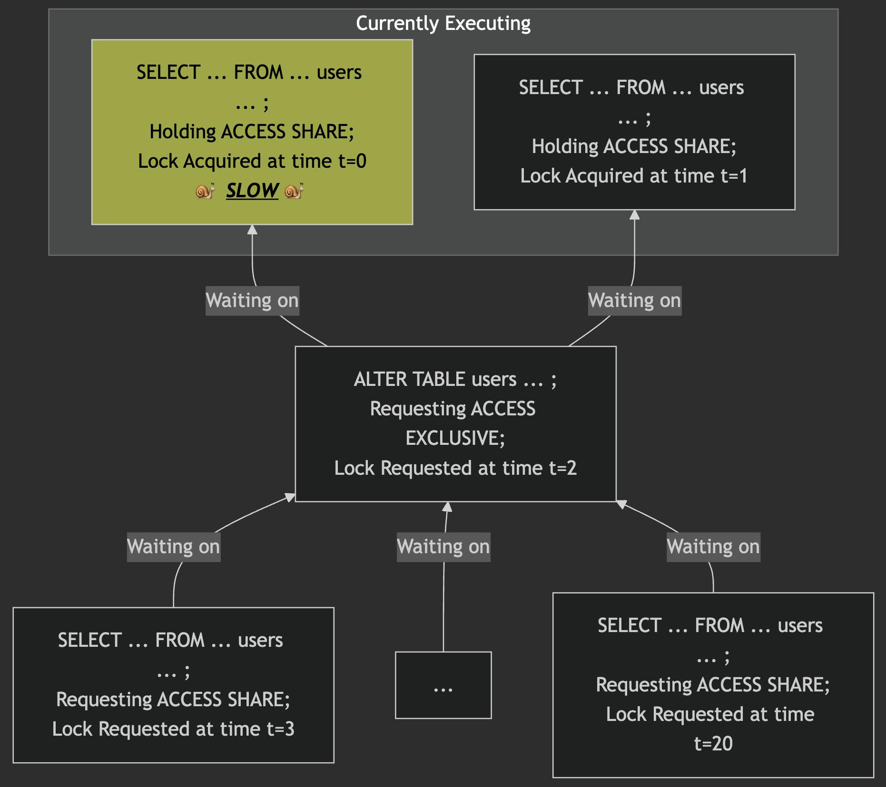

# 2024-12-22: 筆記 postgresql 的 Don't Do This.md

### https://wiki.postgresql.org/wiki/Don%27t_Do_This

### https://challahscript.com/what_i_wish_someone_told_me_about_postgres

---

對 backend, db 實在功力不夠，好奇看看這 2 篇

---

## 先是這篇 `Don't Do This`

---

## Database 的 Encoding: 不要用 `SQL_ASCII`

**為什麼?**

- `SQL_ASCII` 對所有 encoding conversion functions 來說，都是無轉換(no conversions)
  - 也就是說，原始的 bytes 在新的 encoding 中，不考慮其含義，只進行有效性檢查
- 除非要處理非常極端的 case，否則，採用 `SQL_ASCII` 的 DB 最終很容易會變成存各種混合不同 encodings 的狀況。這種情況根本沒有方法能可靠的把 characters 轉回原本的 characters

**什麼時候可以用?**

- 當你的資料已經是種無可救藥的混合各種 unlabelled encodings
  - 如 IRC channel logs or non-MIME-compliant emails
- 這時候 `SQL_ASCII` 可以做為最後的選責，但請先考慮看看 `bytea`
  - 或者可以 autodetect `UTF8` 和假設某些 encoding 為 `non-UTF8` data 例如 `WIN1252`

---

## 工具使用方面: 不要用 `psql -W` 或 `--password`

**為什麼?**

- 用 `--password` 或 `-W` 代表告訴 `psql` 把 password 提示出來
- 即使 server 不需要 password 也會被提示出來
- 根本都不需要這些 flag。如果 server 有需要，`psql` 會自己提示你。

一些會讓你混淆的情境

- 如果你用 `-w` 連到一台已經被設定過允許你存取 peer authentication 的 server，這時候你會以為你是需要給 password 的，但其實不需要。這會讓人混淆

**什麼時候可以用?**

- Never

---

## 不要用 [rules](https://www.postgresql.org/docs/current/sql-createrule.html)

- 如果想用，那改用 [trigger](https://www.postgresql.org/docs/current/plpgsql-trigger.html)

**為什麼?**

- `Rules` 非常強大，但它做的事情不像表面上看起來的那樣
- `Rules` 看起來有些 conditional logic，實際上它會 rewrite query、修改 query、加入額外的 query

也就是說，所有 non-trivial 的 `rules` 都是錯的

- https://blog.rhodiumtoad.org.uk/2010/06/21/the-rule-challenge/

Depesz 也有分享一些關於 `rules` 的看法

- https://www.depesz.com/2010/06/15/to-rule-or-not-to-rule-that-is-the-question/

**什麼時候可以用?**

- Never

---

## 不要用 `table 繼承`([table inheritance](https://www.postgresql.org/docs/current/tutorial-inheritance.html))

- 想要用時，改用 `foreign keys` 取代

**為什麼?**

- `Table inheritanc` 是 DB 當時還很靠近 OOP code 時期的過時產物
- 這會導致實際上我們不想要耦和的東西 coupling 在一起

**什麼時候可以用?**

- Never almost
- 現在已經有內建 `table partitioning`，inheritance 的常見 case 已經可以被 tuple routing 給取代了，還不會有 bespoke code

一個少見的例外情況會是用 [temporal_tables](https://github.com/arkhipov/temporal_tables) extension 來處理缺乏 SQL 2011 支援的情況
兒

`Table inheritance` 能提供小小捷徑來取代 `UNION ALL` 來同時取得有 historical 和 current rows

- 但是，即使如此，在處理 parent table 仍應該對一些注意事項保持警惕
- https://clarkdave.net/2015/02/historical-records-with-postgresql-and-temporal-tables-and-sql-2011/#using-inheritance

---

## SQL constructs: 不要用 `NOT IN`

- 別用 `NOT IN` 或任何 `NOT` 跟 `IN` 的組合，如 `NOT (x IN (select...))`

**為什麼? 兩個理由**

1. 當有 `null` 出現時，會無法預期 `NOT IN` 的行為

```sql
select * from foo where col not in (1,null); -- always returns 0 rows

select * from foo where foo.col not in (select bar.x from bar); -- 當 "bar.x" 有出現 null 時，這一定回傳 0 rows
```

這狀況是因為

- `col IN (1,null)` 會回傳 `TRUE`
- 會這樣是因為如果 `col=1`，`col IN (1,null)` 就會 returns `TRUE`，否則 return `NULL`
  - (i.e. 而絕對不會是 `FALSE`).
- 因此，當 `NOT (TRUE)` 是 `FALSE`，但 `NOT (NULL)` 仍然 `NULL`，那 `NOT (col IN (1,null))` 在任何情況下都不可能是 `TRUE`
  - `col NOT IN (1,null))` 也是一樣的情況

2. `NOT IN (SELECT ...)` 的效能不好

- 尤其當 planner 無法把它轉換成 anti-join，那就會變成是 `hashed Subplan` 或者是 `plain Subplan`
- `hashed subplan` 很快，但 planner 只允許用在 small result sets
- `plain subplan` 非常非常慢 (`O(N²)`)
- 結果就是，在資料少的時候，performance 感覺很好，但資料一多，就完蛋

替代方案

- `NOT IN (SELECT ...)` 可以改寫成 `NOT EXISTS (SELECT ...)`

```sql
select * from foo where foo.col not in (select bar.x from bar);

select * from foo where not exists (select from bar where foo.col = bar.x);
```

**什麼時候可以用?**

- `NOT IN (list,of,values,...)` 在沒有 `null` 的時候，大多都是沒問題的
- 如果 query value specific constant/value 時，也可以用

---

## 不要用 upper case 的 table/column names

- 不要用這個 `NamesLikeThis`
- 用 `names_like_this`.

**為什麼?**

- PostgreSQL 會將所有的 name (tables, columns, functions and everything else)都轉換為小寫
- 除非 name 有被雙引號包住

例如

- create table `Foo()`，將會建立 table 為 `foo`
- create table `"Bar"()`，將會建立 table 為 `Bar`

下面這些 select 能 work

```sql
select * from Foo
select * from foo
select * from "Bar"
```

這些會失敗 (`"no such table"`)

```sql
select * from "Foo"
select * from Bar
select * from bar.
```

所以，如果用 uppercase，代表

- 你必須一直用 `""` 來包名字，或者從不雙引號它們
- 而且當你用其他工具時，有時需要全部 `""`，有時不需要，這會非常混亂
- name 就用 `a-z, 0-9, underscore` 組合就好了，從此不用擔心

**什麼時候可以用?**

- 如果真的想要用 `""` 來顯示，那就用 column aliases 處理

```sql
select character_name as "Character Name" from foo
```

---

## 不要用 `BETWEEN` (尤其是對 `timestamps`)

**為什麼?**

- `BETWEEN` 此用的是 closed-interval 比較法
- 兩邊邊界的值都會被包含進來

下面的 query

- 結果會包含 `2018-06-08 00:00:00.000000` 的結果，但不會包含「同一天，但 timestamp 晚於這個時間點」的資料
- 看起來 work，但一旦有剛好半夜的資料，就會重複計算

```sql
SELECT * FROM blah WHERE timestampcol BETWEEN '2018-06-01' AND '2018-06-08'
```

改寫成這樣:

```sql
SELECT * FROM blah WHERE timestampcol >= '2018-06-01' AND timestampcol < '2018-06-08'
```

**什麼時候可以用?**

- integers or dates 時，`BETWEEN` 是 OK 的
- 只要記住 both ends of the range are included in the result
  - 但，習慣用它會是個壞習慣

---

## Date/Time 儲存格式: 不要用沒有 time zone 的 `timestamp`

- 不要用 `timestamp` type 來存 `timestamps`
- 用 `timestamptz` (`timestamp with time zone`)

**為什麼?**
`timestamptz` 紀錄著時間的那一刻 records a single moment in time.

- 儘管名稱上看起來，它並不是存時間戳，而只是描述從 2000 年 1 月 1 日 UTC 起的 microseconds 的時間點
- 你可以 insert 任何時區的值，它會存該值描述的時間點
- 它預設會顯示 current timezone 的 times，但也可以用它顯示不同 time zone 的時候

因為它存的是一個時間點

- 所以會正確處理涉及不同時區的 timestamps 的算術運算
- 包括夏令時間變更前後同一地點的 timestamps

`timestamp` (`timestamp without time zone`) 不會做這些

- 它只是存你提供的日期和時間
- 你可以將它視為日曆和時鐘的快照，而不是時間點。缺乏附加資訊(即 timezone)
- 你不知道它記錄的是什麼時間
  - 因此，不同地點或夏天和冬天之間的 timestamps 算術運算可能會給錯誤的答案

所以，如果你真的想存一個時間點，那就用 `timestamptz`

More about `timestamptz`

- https://community.spiceworks.com/t/zone-of-misunderstanding/928839

**什麼時候可以用?**

- 如果你以抽象方式處理 `timestamps`，或只從 application 存和搜尋，而不進行運算，那 timestamp 可能是合適

---

## 不要用沒有 time zone 的 `timestamp` 來存 `UTC` 時間

- 用有 time zone 的 `timestamp` 來處理
  - 會用「沒有 time zone 的 `timestamp`」來存 `UTC` 時間，這種事情通常是從「不支援 timezone」的 DB 習慣帶過來的

**為什麼?**

- DB 是不可能知道該 column 的 UTC 是什麼的
- 這使許多原本有用的時間計算變得複雜

如，「u.timezone 提供的時區中的上個半夜」變成這樣:

```sql
date_trunc('day', now() AT TIME ZONE u.timezone) AT TIME ZONE u.timezone AT TIME ZONE 'UTC'
```

以及「u.timezone 中 `x.datecol` 之前的半夜」變成這樣:

```sql

date_trunc('day', x.datecol AT TIME ZONE 'UTC' AT TIME ZONE u.timezone)
  AT TIME ZONE u.timezone AT TIME ZONE 'UTC'
```

**什麼時候可以用?**

- 當與「不支援時區的 DB」的相容性為最高優先考量的時候

---

## 不要用 `timetz` type

- 你可能會想改用 `timestamptz`

**為什麼?**

- 在大多數情況下，`date`, `time`, `timestamp (without time zone)` 和 `timestamp (with time zone)` 的組合應該能提供任何 application 所需的完整日期/時間功能範圍

**什麼時候可以用?**

- Never

---

## 不要用 `timestamp(0)` 或 `timestamptz(0)`

- 不要用精度規格，尤其不能用 `0` 來處理 timestamp 欄位或轉換為 timestamp
- 改用 `date_trunc('second', blah)`

**為什麼?**

- 因為它會四捨五入小數部分，而不是截斷小數部分
- 這會引起問題；想像，當你用 `now()` 存入這的欄位時，你可能會存一個半秒之後的值

**什麼時候可以用?**

- Never

---

## Don’t use `+/-HH:mm` as a text Time Zone name

**為什麼?**

- PostgreSQL 不接受用 fixed time zone 的 offsets 來取代 ISO time zone 名稱或縮寫
- 如果你指定這樣的 offsets，它將被解釋為 custom POSIX time zone spec
  - 其中不幸的是，positive values 會向西移，而 negative values 會向東移
    - (ISO 慣例是將向東的偏移標記為 negative)

注意，如果你提供的是 interval type 的值，則適用 ISO 慣例

- 因此，如果你真的想指定 fixed offset，可以這樣寫:

```sql
AT TIME ZONE INTERVAL '04:00'
```

**什麼時候可以用?**

- ISO 格式的 string timestamptz 字面值可以用帶正負號的 offset 來書寫，並且符號方向會依據 ISO 慣例來解釋

```sql
select '2024-01-31 17:16:25+04'::timestamptz; -- yields 1pm UTC
```

---

## Text 儲存: 不要用 `char(n)` type

- You probably want `text`

**為什麼?**

- 任何存進去 `char(n)` 的 string 都會 padded 空白(根據你宣告的 width 來補齊該有的數量)，這應該不是你想要的

文件上寫:

> Values of type character are physically padded with spaces to the specified width `n`, and are stored and displayed that way. However, trailing spaces are treated as semantically insignificant and disregarded when comparing two values of type character. In collations where whitespace is significant, this behavior can produce unexpected results; for example `SELECT 'a '::CHAR(2) collate "C" < E'a\n'::CHAR(2)` returns true, even though C locale would consider a space to be greater than a newline. Trailing spaces are removed when converting a character value to one of the other string types. Note that trailing spaces are semantically significant in character varying and text values, and when using pattern matching, that is LIKE and regular expressions.

space-padding 也浪費空間

- 這樣確實會浪費空間，也不會讓操作變得更快
- 事實上，由於在許多情境下需要去除空格，反而會變慢

需要注意的是，從儲存的角度來看，`char(n)` 並不是固定寬度的類型

- 實際的 bytes 數會有所不同，因為字可能會佔用多於一個 byte
- 因此存的值會被視為可變長度(即使包含了空格填充)

**什麼時候可以用?**

- 當你在移植非常、非常舊的軟體，且該軟體使用固定寬度的欄位時
- 或當你讀上面的那段文件說明，認為「是的，這完全符合我的需求」時

---

## 即使今天欄位值會是固定長度，也不要用 `char(n)`

就算你說，你的資料都是庫定一個長度，也不要用 `char(n)`

- **It is still a bad idea to use `char(n)` even in these cases.**
- 用 `text` 或者 a domain over text, with `CHECK(length(VALUE)=3)` or `CHECK(VALUE ~ '^[[:alpha:]]{3}$')` or similar.

**為什麼?**

- 因為即使 values 太短，`char(n)` 也不會拒絕。它會默默地 pad space
- 這樣也就沒有任何優點了
- 用 `text` with a constraint 反而能來確認是否符合特定長度
  - such a check can also verify that the value is in the correct format.

記住，**用 `char(n)` 代替 `varchar(n)` 也沒有任何 performance 好處**

- 正好相反，當要拿 `char(n)` 去比較 `text` or `varchar` 欄位時，會沒辦法用 index 來比較

**什麼時候可以用?**

- Never

---

## 不要預設用 `varchar(n)`

- 考慮用 `varchar` (沒有長度限制) 或者 `text`

**為什麼?**

- 當 insert 過長的 string 去 `varchar(n)` 會報錯
- `varchar` or `text` 沒有長度限制
- 同樣的 string 丟到三種 type 欄位去，都是佔用同樣的空間大小
- performance 也沒有差別
- 如果情境上真的需要有長度限制的 text，那 `varchar(n)` 很好
- 但如果你隨意挑選一個長度，例如 `varchar(20)` username，哪天有位 `Wolfe­schlegel­stein­hausen­berger­dorff` 就會報錯了
  - (上面那個範例字串包含 5 個特殊字元在中間)

有些 DB 沒有能夠存放任意長度文字的 type

- 即使有，也不像 `varchar(n)` 這麼方便或支援良好
- 來自這些 DB 的 User 通常會用像 `varchar(255)` 這樣的 type，但其實他們真正需要的是 `text` type

如果你需要限制欄位中的值，你可能需要比 maximum length 更具體的條件

- 也許是 minimum length，或是組有限的 characters
- [check constraint](https://www.postgresql.org/docs/current/ddl-constraints.html#DDL-CONSTRAINTS-CHECK-CONSTRAINTS) 可以做到所有這些事，包括最大字串長度

**什麼時候可以用？**

- 其實隨時都可以
- 如果你希望有個文字，當你 insert 過長時會拋錯，並且你不想使用明確的 `check constraint`，那 `varchar(n)` 是個完全可以接受的 type
  - 只是不要在不加思考的情況下自動用它

此外，`varchar` type 是 SQL 標準的一部分

- 不像 `text` type
- 所以在寫 super-portable applications 時，它可能是最好的選擇

---

## 不要用 `money` type

- `money` type 其實並不適合存貨幣值
- `Numeric` type，或者(很少見的情況下) `integer` 可能更好

**為什麼?**
原因有很多。

- https://www.postgresql.org/message-id/flat/20130328092819.237c0106@imp#20130328092819.237c0106@imp
- money 是種固定小數點 type，作為 machine int 實現，因此其運算速度很快

但是，它不處理 fractions of a cent (1 cent 或其他貨幣單位的小數)，其四捨五入的行為不是你想要的

- 它不會與 value 一起存 currency，反而假設所有 `money` 欄位都包含 DB 的 [lc_monetary](https://www.postgresql.org/docs/current/runtime-config-client.html#GUC-LC-MONETARY) locale setting 指定的 currency
- 如果出於任何原因更改了 `lc_monetary`，所有 `money` 欄位都會包含錯誤的值

這意味著，如果在 `lc_monetary` 設為 `'en_US.UTF-8'` 時 insert `'$10.00'`

- 如果更改 `lc_monetary`，你 search 的值可能會變為 `'10,00 Lei'` 或 `'¥1,000'`

**存 `numeric` type，並可能在相鄰欄位中用正在使用的 currency，可能會更好**

**什麼時候可以用?**

- 如果你只用單一 currency
- 不處理 fractional cents
- 只進行加法和減法
- 那麼 `money` 可能是合適的選擇

---

## 不要用 `serial`

- 用 `identity`

**為什麼?**

- `serial` type 有些[奇怪的行為](https://www.enterprisedb.com/blog/postgresql-10-identity-columns-explained)，使得 schema, dependency 和權限管理變得很繁瑣

**什麼時候可以用?**

- 如果需要支援 PostgreSQL 10 版本之前的版本
- 在某些與 table inheritance 的組合中
- 如果你以某種方式對多個 table 使用相同的序列
  - 儘管在這些情況下，明確 declaration 可能還是比 `serial` type 更好用

---

## Authentication: 不要在 TCP/IP (host, hostssl) 上 trust authentication

- 不要在任何 PROD 環境中通過任何 `TCP/IP` 方法(如 host, hostssl) 使用 trust authentication
- **絕對不要** 在 `pg_hba.conf` 中設定下面這種東西

```
host all all 0.0.0.0/0 trust
```

這允許任何人通過網路以你的 cluster 中的任何 PostgreSQL 使用者身份進行身份驗證，包括 PostgreSQL superuser

這裡有 [list of authentication methods](https://www.postgresql.org/docs/current/client-authentication.html)

- 你可以選更好的方法來建立到 PostgreSQL
- [password](https://www.postgresql.org/docs/current/auth-password.html)的方法相對容易
  - 推薦用 PostgreSQL 10 及以上版本中提供的 `scram-sha-256`

**Why not?**
[文件上寫](https://www.postgresql.org/docs/current/auth-trust.html):

> trust authentication 只適用於你信任每個被 `pg_hba.conf` 指定為信任的機器上的每個 User 進行的 `TCP/IP` 連接。除了來自 localhost(127.0.0.1)的 TCP/IP 連接外，很少有理由使用 trust

用 trust authentication，任何 User 可以聲稱自己是任何其他使用者，PostgreSQL 將信任這說法

- 這意味著有人可以聲稱是 postgres superuser，並且 PostgreSQL 會允許他們 log in

更進一步說，在 PROD 環境中允許在 local UNIX socket connections 上用 trust authentication 也不是好主意

- 因為任何有權訪問 PostgreSQL 的人都可以以任何使用者身份

**什麼時候可以用？**

- **never**
- 詳細回答是，有些情況下 trust authentication 可能合適:
  - 作為 CI/CD task 的一部分，在受信任網路上對 PostgreSQL server 進行測試
  - 在 local 開發，但只允許通過 localhost 進行 TCP/IP connection
    - 但你應該看看是否有更適合的替代方法。如，在 UNIX 中，可以用對等認證連接到 local 環境

---

## What I Wish Someone Told Me About Postgres

## 正規化你的資料，除非有充分理由不做

在網上搜 `database normalization`，會找到許多關於 `1st normal form` 等的結果。你絕對不需要知道每一種 `normal forms` 是什麼

- 但了解[一般過程](https://en.wikipedia.org/wiki/Database_normalization#Example_of_a_step-by-step_normalization)是有幫助的，這可以設計出更易於維護的結構
- 有些情況下，保留多餘資料（即[反正規化結構](https://en.wikipedia.org/wiki/Denormalization)）是有意義的
  - 通常是為了加快讀取某些資料的速度，這樣每次請求時就不需要重新計算
  - 例如，一些數值的總數，這樣就不用每次重新加總
  - 反正規化總是有代價的，可能資料不一致性 or 寫入複雜度增加

---

## 遵循 Postgres 開發團隊的所有建議

一些值得強調的建議：

- 將所有文字都存 `text` 類型
- 將所有 timestamp 都存用 `timestampz/time with time zone` 類型
- 使用 snake_case 命名 table

---

## 注意一些一般的 SQL 怪癖

## SQL 不必全部用大寫寫

在大多數文件和教學中，會看到 SQL 是這樣寫的:

```sql
SELECT * FROM my_table WHERE x = 1 AND y > 2 LIMIT 10;
```

SQL 關鍵字的大小寫並不重要，上面的 code 與這個是一樣的:

```sql
select * from my_table where x = 1 and y > 2 limit 10;
```

或像這樣:

```sql
SELECT * from my_table WHERE x = 1 and y > 2 LIMIT 10;
```

這並不限於 Postgres

---

## `NULL` 很詭異

你可能熟悉其他程式中的 `null` 或 `nil`，但 SQL 的 NULL 不太一樣

- `NULL` 更準確地說是 `unknown`
- 例如，`NULL = NULL` 會 return `NULL` (一個未知等於另一個未知是未知的！)
- 這對於幾乎所有運算子都是正確的，不僅僅是 `=`
- 如果比較的一方是 `NULL`，那麼結果將是 `NULL`

有些運算子可以用來與 `NULL` 比較，且不會返回 `NULL`:
|Operation|Description|
| :--- | :--- |
| `x IS NULL` | 若 `x` 為 `NULL`，return `true`，否則 `false` |
| `x IS NOT NULL` | 若 `x` 不為 `NULL`，return `true`，否則 `false` |
| `x IS NOT DISTINCT FROM y` | 與 `x = y` 相同，但 `NULL` 被視為正常值 |
| `x IS DISTINCT FROM y` | 與 `x != y`/`x <> y` 相同，但 `NULL` 被視為正常值 |

`WHERE` 子句只有在條件為 `true` 時才會匹配。這意味著像這樣的查詢:

```sql
SELECT * FROM users WHERE title != 'manager'
```

不會返回 `title` 為 `NULL` 的 row

- 因為 `NULL != 'manager'` 是 `NULL`

當處理 `NULL` 時，另個有用的 function 是 `COALESCE`

- `COALESCE` 可以接受任意數量的參數，並返回第一個不是 `NULL` 的參數

```sql
COALESCE(NULL, 5, 10) = 5
COALESCE(2, NULL, 9) = 2
COALESCE(NULL, NULL) IS NULL
```

---

## 讓 psql 更有用

## 修正難以閱讀的 output

輸出難讀的？這可能是因為沒有啟用 pager

- [terminal pager](https://en.wikipedia.org/wiki/Terminal_pager) 允許通過滾動視窗來查看文件(或在 `psql` 的情況下是表格)

`less` 是個在任何類 Unix 系統上都可用的不錯的 pager。可以在 `~/.bashrc`、`~/.zshrc` 中設變數來將其設置為 pager

```bash
# Use the `-S` option so it truncates long lines for scrolling instead of wrapping them
export PAGER='less -S'
```

有時，即使將內容視為表格也不是特別有用，特別是對於具有許多欄位的表格。為此

- 可以在 `psql` session 中用 `\pset expanded`（或 shortcut `\x`）切換到 `expanded` 模式
- 如果要 default 設定，可加在 `.psqlrc` 的中(如 `~/.psqlrc`)，將 `\x` 加上去。每次啟動 `psql` session 時，它將首先執行該文件中的所有命令

---

## 弄清楚不清的 `NULL`

當 output 中有 `NULL` 時，知道它存在是非常重要的

- default settings 並不特別明確
- 你可以給 `psql` 一個字串，當它指 `NULL` 時會輸出該字串

下面設定其設為 `[NULL]`:

```sh
\pset null '[NULL]'
```

任何 Unicode 字串都可以！

- 可以設為 👻
- 如果希望是改 default，`.psqlrc` 加上 `\pset null '[NULL]'`

---

## 使用 auto-completion

`psql` 是有 auto-completion 的

- SQL 是結構嚴謹且相當有規則的語言。只需要開始輸入大多關鍵字或 table name，然後 Tab 來 complete

```
-- start typing "SEL"
SEL
-- ^ hit `Tab`
SELECT
```

---

## 利用 `/` shortcuts

`psql` 中有許多有用的 shortcuts，可以來查資料、命令列編輯等

|                  |                                                      |
| :--------------- | :--------------------------------------------------- |
| `\?	`             | 列出所有 shortcuts                                   |
| `\d	`             | 顯示關聯 (表格和序列) 以及關聯的擁有者               |
| `\d+`            | 與 `\d` 相同，但還包括大小和其他 metadata            |
| `\d table_name`  | 顯示表格 schema 以及該表上的任何 index 或 FK         |
| `\e`             | 開啟預設編輯器 (`$EDITOR` 環境變數) 以在那裡編輯查詢 |
| `\h SQL_KEYWORD` | 取 `SQL_KEYWORD` 的語法和連結到文件                  |

這些命令很多，上面只是冰山一角

---

## 複製到 CSV

有時，你只是想將 cli output 放到 Excel，在 Postgres 中，很容易 output 複製到本地上的 CSV:

```shell
\copy (SELECT * FROM my_table) TO 'output.csv' WITH CSV
```

如果你希望包括所有 column names，可以加 `HEADER` 選項:

```shell
\copy (SELECT * FROM my_table) TO 'output.csv' WITH CSV HEADER
```

更多資訊

- https://www.postgresql.org/docs/current/app-psql.html#APP-PSQL-META-COMMANDS-COPY

---

## 用 column shorthands and aliases

在 `psql` 中執行 `SELECT` 時，可以使用 `AS` 關鍵字將每個 output columns 重新命名為任何名稱:

```sql
SELECT vendor, COUNT(*) AS number_of_backpacks
FROM backpacks
GROUP BY vendor
ORDER BY number_of_backpacks DESC;
```

這也會在 output 中重新命名該 column

`GROUP BY` 和 `ORDER BY` 也有簡寫方式

- 可以按它們在 `SELECT` 之後出現的順序來引用輸出列
- 因此，你可以將前面的查詢寫成:

```sql
SELECT vendor, COUNT(*) AS number_of_backpacks
FROM backpacks
GROUP BY 1
ORDER BY 2 DESC;
```

雖然這非常有用，但不要在 PROD 做這種事情

---

## `index` 用不好的話，就沒有任何幫助

`index` 是用於幫助查找資料的資料結構

- 讓 Postgres 負責維護一個 shortcut directory，來通過各種欄位指向 table 的 row
- 最常見的 index 類型是 `B-tree` index
  - 這是種 search tree，適用於精確相等條件(如 `WHERE a = 3`)以及範圍條件(如 `WHERE a > 5`)

但是，無法指示 Postgres 使用特定 index

- 它需要根據每個 table 維護的統計資料來預測使用 index 是否比從頭到尾讀取 table(稱為 sequential scan 或稱 seq. scan )更快
- 可以在 `SELECT ... FROM ....` 之前加 `EXPLAIN` 來查看 Postgres 如何執行 query
  - 這會給出 query plan，Postgres 將如何找到資料的計劃，以及每項任務所需的工作量估算
- 有很多文章可以參考
  - this one from thoughtbot: https://thoughtbot.com/blog/reading-an-explain-analyze-query-plan
  - pganalyze: https://pganalyze.com/docs/explain
  - 官方文件: https://www.postgresql.org/docs/current/using-explain.html
- 在分析 query plan 時，這個工具也能提供寫幫助
  - https://explain.depesz.com/

---

## 沒有什麼 row 的 table，index 也就沒什麼幫助了

這觀念在 local DB 開發時很重要

- 很可能你 local DB 沒有幾百萬行資料
- 如果只處理 100 行資料，Postgres 可能會發現直接 `seq. scan` 比用 index 更快

---

## 當建立多個欄位 index 時，順序很重要

如果你為 `a` 和 `b` 建立 index，如下:

```sql
CREATE INDEX CONCURRENTLY ON tbl (a, b);
```

如果我們這樣茶 `WHERE`:

```sql
SELECT * FROM tbl WHERE a = 1 AND b = 2;
```

上面這查詢的速度，會比「`a` 和 `b` 是分開建立 index」的情境還要快

- 這是因為在一個 multicolumn index 中，Postgres 只需要掃過一個 B-tree，就能有效結合搜尋查詢的條件
- 這 index 加快了「只針對 `a` 過濾查詢」的速度，與「單獨為 `a` 建立 index」的效果一樣快

但是，如果是 `SELECT * FROM tbl WHERE b = 5;` 會更快嗎？

- 可能會更快，但不如「單獨為 `b` 創建 index」那麼快
- 因為上述 index 中的 B-tree 首先以 `a` 為 key，其次以 `b` 為 key
  - 所以它需要掃過 index 中所有的 `a` 值，才能找到所有的 `b` 值

通常

- 如果需要在 query 中使用任意組合的列，你需要為 `(a, b)` 和 `b` 都建立 index
- 不過，根據需求，可能可以依賴分別為 `a` 和 `b` 建立的 index

---

## 如果要做 prefix matches，那用 `text_pattern_ops`

假設

- 在 DB 中用 [materialized path approach](https://www.slideshare.net/slideshow/models-for-hierarchical-data/4179181#18) 存系統的階層目錄(其中每行存該行所有祖先的 ID 列表)
- 並且 app 的某個部分需要取所有子目錄

因此，你需要查找到某列符合某些共同 prefix 的 rows

```sql
-- % is a wildcard: the `WHERE` clause here is asking for `directories` where `path` starts with '/1/2/3/'
SELECT * FROM directories WHERE path LIKE '/1/2/3/%'
```

為了查詢速度，你可以為 `directories` table 的 `path` column 加 index:

```
CREATE INDEX CONCURRENTLY ON directories (path);
```

不幸的是，這可能無法用

- 大多類型的 index (包括上面 `CREATE INDEX` 語句中預設 B-tree)都依賴於 value 的排序來工作

為了 Postgres 能夠進行這種類的 prefix match 或一般的模式 match 所需的基本字排序，你需要在定義 index 時給它不同的 [operator class](https://www.postgresql.org/docs/current/indexes-opclass.html)

```sql
CREATE INDEX CONCURRENTLY ON directories (path text_pattern_ops);
```

---

## 長時間持有的 lock 可能會中斷你的 application (即使是 `ACCESS SHARE`)

lock 或 `mutex(互斥)`(mutual exclusion 的縮寫)確保每次只有一個 client 可以執行可能危險的操作

- 這是在許多地方都會看到的概念
- 但在 Postgres 中，它們特別重要。因為更新單個 entity(row, table, view, etc)必須完全成功或完全失敗
- 因此，client 任何操作都需要獲得相關 entity 的 lock

---

## Postgres lock 機制的運作方式

- Postgres 中，table 的 lock 有不同的層級
- 這些層級的限制性各不相同

以下是其中幾個 lock 層級，按限制性從低到高排列:

| Lock Mode                | Example Statements                            |
| :----------------------- | :-------------------------------------------- |
| `ACCESS SHARE`           | `SELECT`                                      |
| `ROW SHARE`              | `SELECT ... FOR UPDATE`                       |
| `ROW EXCLUSIVE`          | `UPDATE`, `DELETE`, `INSERT`                  |
| `SHARE UPDATE EXCLUSIVE` | `CREATE INDEX CONCURRENTLY`                   |
| `SHARE`                  | `CREATE INDEX` (not `CONCURRENTLY`)           |
| `ACCESS EXCLUSIVE`       | Many forms of `ALTER TABLE` and `ALTER INDEX` |

以下是它們之間的衝突情況(`X` 表示有衝突):
鎖定類型 選擇共享鎖 行共享鎖 鎖定共享 鎖定排他 行排他鎖 選擇排他鎖

| Requested Lock Mode  | `ACCESS SHARE` | `ROW SHARE` | `ROW EXCL.` | `SHARE UPDATE EXCL.` | `SHARE` | `ACCESS EXCL.` |
| :------------------- | :------------: | :---------: | :---------: | :------------------: | :-----: | :------------: |
| `ACCESS SHARE`       |                |             |             |                      |         |       X        |
| `ROW SHARE`          |                |             |             |                      |         |       X        |
| `ROW EXCL.`          |                |             |             |                      |    X    |       X        |
| `SHARE UPDATE EXCL.` |                |             |             |          X           |    X    |       X        |
| `SHARE`              |                |             |      X      |          X           |         |       X        |
| `ACCESS EXCL.`       |       X        |      X      |      X      |          X           |    X    |       X        |

舉例:

| 當 `Client 1` 正在做 ... | 而 `Client 2` 打算做 ...    | 那 `C 2` 能做嗎 ?    |
| :----------------------- | :-------------------------- | :------------------- |
| `UPDATE`                 | `SELECT`                    | ✅ **Yes**           |
| `UPDATE`                 | `CREATE INDEX CONCURRENTLY` | 🚫 **No, must wait** |
| `SELECT`                 | `CREATE INDEX`              | ✅ **Yes**           |
| `SELECT`                 | `ALTER TABLE`               | 🚫 **No, must wait** |
| `ALTER TABLE`            | `SELECT`                    | 🚫 **No, must wait** |

詳細資訊，參考 [官方文件](https://www.postgresql.org/docs/current/explicit-locking.html#LOCKING-TABLES)

- 這份也是一個很好的參考，可以逐步了解每個操作與哪些 lock 類型衝突
  - (這通常是在操作時所考慮的，而不是 lock 層級)
  - https://postgres-locks.husseinnasser.com/

---

上面提到如果有個 client 正在執行 `ALTER TABLE`，可能會阻塞 `SELECT` 的執行

- 如果 `ALTER TABLE` 要很長時間才能完成，情況會很糟

如果你正在更新一個核心 table (如 `users`，這是所有 app request 可能需要參考的 table)

- 那麼所有從該 table 讀取的 `SELECT` 將會等待

常見導致 `ALTER TABLE` 變慢的原因包括:

- 加入一個 non-constant default 的欄位
  - (這是最常見的原因)
- 更改 column 的 type
- 加入 uniqueness constraint

所以，假設你正在向一個頻繁使用的 table 中加新欄位

- 你的 `ALTER TABLE` 語句並沒有做什麼愚蠢的操作
- 你只是加新欄位，但它並沒有變動的預設值。即使如此，這仍然可能會中斷 application

任何後續 query 也必須等待。這是因為 Postgres lock 形成了 queue:



For a great article on this exact scenario happening, see here.

- https://xata.io/blog/migrations-and-exclusive-locks

---

## Long-running 的 transactions 可能同樣糟糕

一旦你始 transaction (`BEGIN`)，你就藏了起來

- 沒有其他 client 可以看到你正在進行的任何更改
- 你完成交易(`COMMIT`)，然後將它們 publishes 到 DB
- 抽象的來看，transaction 類似於鎖，允許你避免其他 client 弄亂你正在做的事情

典型需要 transactions 的例子是將錢從銀行帳戶轉到另個帳戶

- 你會希望減少一個帳戶的餘額，增加另個帳戶的餘額
- 如果 DB 中途掛掉或原始帳戶餘額變為負數，你會希望取消整個操作

然而，如果 transactions 執行時間太長，很容易搬石頭砸自己的腳

- 因為一旦 transactions 獲得了鎖，它就會一直保留，直到送出

舉例，假設 client1 打開 `psql`，並寫了:

```sql
BEGIN;
SELECT * FROM backpacks WHERE id = 2;
UPDATE backpacks SET content_count = 3 WHERE id = 2;
SELECT count(*) FROM backpacks;
-- ...
```

此時 `Client 1` 離開桌子，去吃下午茶

- 即使 `Client 1` 實際上已經完成了更新 `id = 2`，他仍然持有鎖

如果另個 client 想要刪除此行，會執行以下命令:

```sql
DELETE FROM backpacks WHERE id = 2;
-- ...
-- ?
```

這只會 hang 住，直到 `Client 1` 回來 committed the transaction 後，才會執行

- 可以想像，這會導致各種情況
- client 持有鎖的時間遠長於所需時間，就會 block 其他人

---

## `JSONB` 是把利刃

Postgres 可以把 serialized JSON 當作 value 來存

- 可以讓 Postgres 有的 document-oriented DB 的優點
  - https://en.wikipedia.org/wiki/Document-oriented_database
- 而不需要啟新服務或在兩個不同的資料之間進行協調

但如果使用不當，也有其缺點

---

## `JSONB` 可能比一般的 columns 慢

`JSONB` 更加彈性

- 因此 `Postgres` 不會持續追蹤 JSONB columns
- 所以， JSONB column 可能會比一般 columns 慢非常多

Here’s a great blog post with someone demonstrating it making things `2000x` slower!

- https://www.heap.io/blog/when-to-avoid-jsonb-in-a-postgresql-schema

---

## JSONB

JSONB 欄位基本上可以包含任何東西

- 這也是它如此強大的主因之一
- 但這也意味著它的結構幾乎沒有任何保證
- 在正常的 table 中，你可以查看架構並了解查詢會回什麼
  - key 會用 camelCase 還是 snake_case 命名？
  - state 會用 boolean `true/false` 嗎？還是用 `yes/maybe/no` 列舉值？
- 你對 JSONB 完全沒有概念，因為它不像 Postgres 資料通常具有相同的 static typing

---

## `JSONB` types 蠻棘手的

假設有個 `backpacks` table 有個 `JSONB` columns，data 裡面有個 `brand` 欄位

- 這時侯你如果想要找個 `JanSport` 的 `backpacks`，你大概會這樣寫

```sql
-- WARNING: Does not work!
select * from backpacks where data['brand'] = 'JanSport';
```

上面這個會得到錯誤

```
ERROR:  invalid input syntax for type json
LINE 1: select * from backpacks where data['brand'] = 'JanSport';
                                                      ^
DETAIL:  Token "JanSport" is invalid.
CONTEXT:  JSON data, line 1: JanSport
```

Postgres 期望 right-hand side type 去相比較 left-hand side type

- 也就是說，它需要是正確格式的 JSON 文件
  - 因此，它要是 JSON object, array, string, number, boolean, 或 null
- 記住，這些類型與 Postgres types 如 `boolean` 或 `integer` 無關
- 而且在 SQL 中，`NULL` 的工作方式與 `JSONB` 的 `null` 非常不同
  - 要正確寫這查詢，需要啟用 Postgres 來執行某些強制轉換

```sql
select * from backpacks where data['brand'] = '"JanSport"';
-- ^ This is really equivalent to the following (because Postgres knows the left-hand side is `jsonb`)
select * from backpacks where data['brand'] = '"JanSport"'::jsonb;
-- Alternatively, you could convert the left-hand side to Postgres `text`:
select * from backpacks where data->>'brand' = 'JanSport';
```

注意，是單引號裡面加雙引號。單單 `JanSport` 不是有效的 JSON

- 這面有更多關於 JSONB 的操作
  - https://www.postgresql.org/docs/current/functions-json.html
