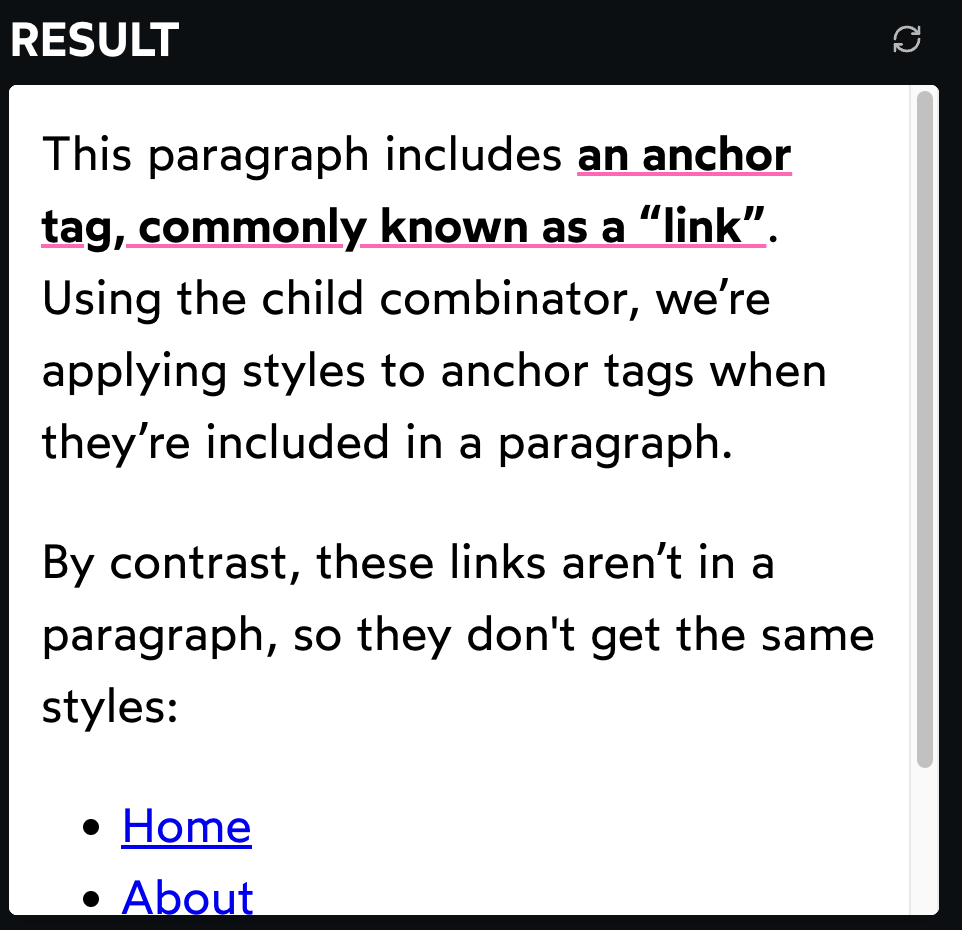
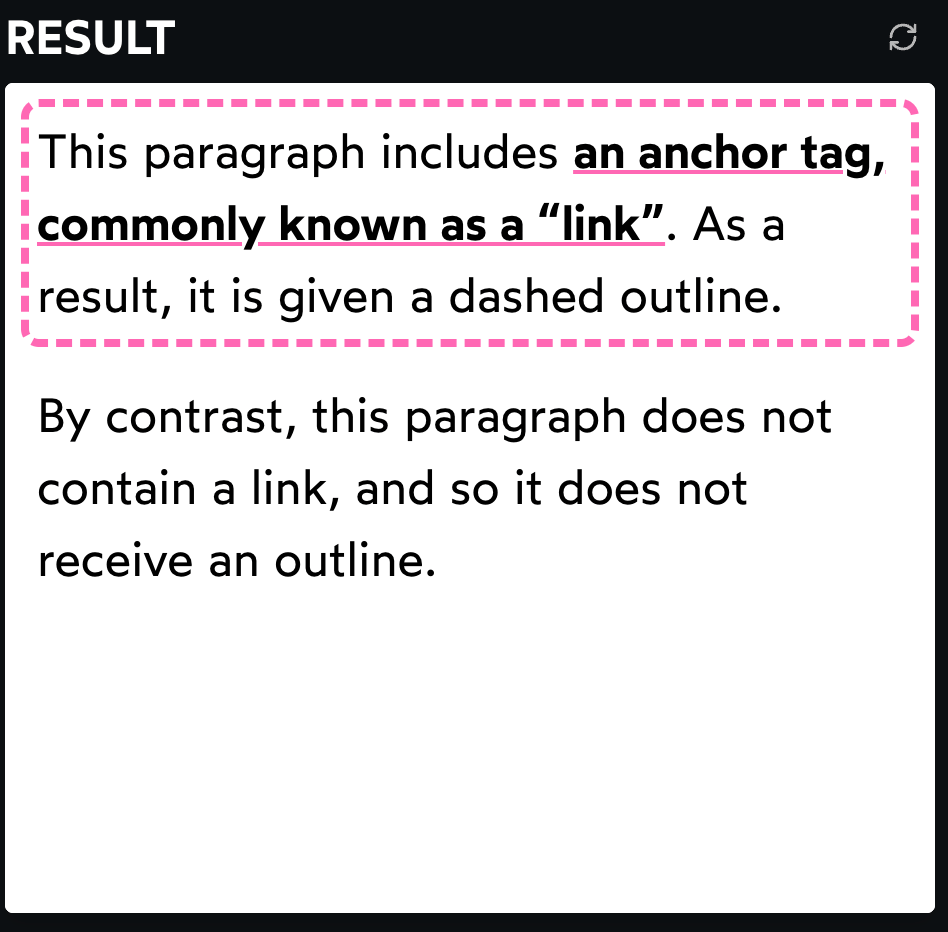

# 2025-01-01: 筆記 Josh 的 The Undeniable Utility Of CSS has.md

## Josh W Comeau, Sep 2024

### https://www.joshwcomeau.com/css/has/

---

CSS 的 has 出來好幾年了，一直知道很強大，但沒有仔細讀過什麼。  
Josh 大大寫了一篇一直存著，這次來看看。

---

`:has` 是非常方便的工具，即使在 CSS-in-JS 也是如此！  
下面會介紹一些有趣的實際使用案例，以及一些令人驚嘆的實驗

---

## 基本

傳統上，CSS selectors 是以 top down 的方式運作

如，在多個 selectors 間加空格，可以根據 parent 設定 child 的樣式:

```html
<style>
  /*
    Style all <a> tags that are
    contained within <p> tags:
  */
  p a {
    font-weight: bold;
    color: inherit;
    text-decoration-color: hotpink;
    text-decoration-thickness: 2px;
  }
</style>

<p>
  This paragraph includes
  <a href="/">an anchor tag, commonly known as a “link”</a>. Using the child
  combinator, we’re applying styles to anchor tags when they’re included in a
  paragraph.
</p>

<p>
  By contrast, these links aren’t in a paragraph, so they don't get the same
  styles:
</p>

<footer>
  <ul>
    <li>
      <a href="/">Home</a>
    </li>
    <li>
      <a href="/">About</a>
    </li>
    <li>
      <a href="/">Contact</a>
    </li>
  </ul>
</footer>
```

```css
body {
  padding: 16px;
}
p {
  margin-bottom: 1em;
}
```



`:has` pseudo-selector 則以 **bottom up** 運作

- 它允許根據 children 來設定 parent 的樣式:

```html
<style>
  /*
    Style all <p> tags that contain
    at least 1 <a> tag:
  */
  p:has(a) {
    outline: 4px dashed hotpink;
    outline-offset: 4px;
    border-radius: 1px;
  }
</style>

<p>
  This paragraph includes
  <a href="/">an anchor tag, commonly known as a “link”</a>. As a result, it is
  given a dashed outline.
</p>

<p>
  By contrast, this paragraph does not contain a link, and so it does not
  receive an outline.
</p>
```

```css
body {
  padding: 16px;
}
p {
  margin-bottom: 1em;
}
p a {
  font-weight: bold;
  color: inherit;
  text-decoration-color: hotpink;
  text-decoration-thickness: 2px;
}
```



看起來可能不算什麼大事，但它開啟了**許多有趣的新方法**

---

## Browser support

`:has` 主要瀏覽器中都得到支援，支援率約為 93%

- https://caniuse.com/?search=%3Ahas
- 幸運的是，大部分 `:has` case 都屬於可選的「錦上添花」功能，因此即使某些人看不到也不是大問題
- 而在其他情況下，可以檢測功能來提供後備 fallback

---

## Feature detection

`@supports` 允許根據 Browser 是否支援來 conditional 應用 CSS

```css
p {
  /* Fallback styles here */
}
@supports selector(p:has(a)) {
  p:has(a) {
    /* Fancy modern styles here */
  }
}
```

如果當前 Browser 無法理解傳給 `selector()` 的 selector

- 則其中的所有內容都將被忽略
- 而如果 User 的 Browser 更舊，不支援 `@supports`，則整個區塊將被忽略
- 無論哪種情況，它都能正常運作

現在，問題是，沒有辦法使用舊的 CSS 模仿 `:has`

- fallback style 無法真正再現相同的效果
- 相反，我們應該認為這是有兩套 styles 以不同的方式實現相同的目標

---

## 根據 state 來 Styling

Josh blog 的 `About Josh` 頁面上有些卡片有可點擊的子元素:

<p align="center">
  <video width="80%" muted autoplay loop loading="lazy" src="https://github.com/user-attachments/assets/71ea0695-751c-4f5f-9d50-7c256f6a57f5" ></video>
</p>

然而，對於用 keyboard navigate 的人來說，體驗有點怪

- 子元素會動態改變大小，導致出現如下的奇怪 focus outlines:

<p align="center">
  <video width="80%" muted autoplay loop loading="lazy" src="https://github.com/user-attachments/assets/695d037f-3f36-4b9b-8b09-04d505aa36aa" ></video>
</p>

為了解決這個問題

- 將 focus outline 移到 parent。現在它看起來是這樣的:

<p align="center">
  <video width="80%" muted autoplay loop loading="lazy" src="https://github.com/user-attachments/assets/4359dd08-26d0-4371-b885-233dfa85ab12" ></video>
</p>

解決了問題，它看起來還可以

- 下面深入了解這是如何運作的

這是 HTML 的大致樣子:

```html
<div class="bento-card">
  <p>
    I'm
    <button>188cm</button>
    tall.
  </p>
</div>
```

過去，可能將整個 `.bento-card` container 設為 `<button>` 來解決這個問題

- 但這不是個好主意。將這麼多東西塞進 button 會引入多個 usability/accessibility 問題
  - 例如，User 無法點並拖動以 button 內的 text

幸運的是

- 我們可以保持漂亮的 semantic markup 並用 `:has` 來實現目標:

```css
.bento-card:has(button:focus-visible) {
  outline: 2px solid var(--color-primary);
}
/* Remove the default button focus outline */
.bento-card button {
  outline: none;
}
```

當 `.bento-card` 包含 focused button 時

- 我們加一個 outline。outline 在 `.bento-card`(parent)，而不是 button 本身

如果對 `:focus-visible` 不熟

- 它 `:focus` 完全相同，但只有當 Browser 檢測到 User 使用鍵盤(或其他 non-pointer device)進行 navigate 時才適用
- 用滑鼠點 button focuse 時，不會觸發 `:focus-visible`，也不會顯示 focus outline

我還移除了 default 的 focus outline

- 以防止雙重 focus indicators
- **這是需要非常謹慎的地方。** 事實上，解決方案尚未完成，因為還需要為用舊 browser 的人提供 fallback

這是它的樣子:

```css
@supports selector(:has(*)) {
  .bento-card:has(button:focus-visible) {
    outline: 2px solid var(--color-primary);
  }
  .bento-card button {
    outline: none;
  }
}
```

在 updated version 中

- 只有 modern browsers 的 User 才能看到修改 style
- 用舊 browser，這些內容都不會採用，將看到 standard focus outline
  - 儘管有些奇怪，但也是合理的 fallback experience

上面也用了點捷徑:

- 不是用正在用的特定 selector (`.bento-card:has(button:focus-visible)`)，而是用最小的有效 `:has` selector，`:has(*)`
- Browser 不會實際嘗試解析我們提供的 selectors，因此選擇了哪些 element 並不重要
  - `@supports` 是通過查看語法並確定其是否有效來運作的

為什麼不用 `:focus-within`?
`:focus-within` 它 select 包含 focused descendant

- 它允許做些類似的事情:

```css
.bento-card:focus-within {
  outline: 2px solid var(--color-primary);
}
```

`:focus-within` 比 `:has` 的 browser 支援要好得多。看起來是更好的方法，不是嗎?

在這種情況下，我更喜歡 `:has` 的兩個原因:

1. `:focus-within` match `:focus` 狀態，而不是 `:focus-visible` 狀態
   - 這意味著即使 User 用滑鼠點 button，outline 也會顯示
   - 並沒有 `:focus-visible-within` 這種東西
2. 我不希望在任何 descendant focused 時顯示 outline
   - 只希望在 button focused 時 outline

一些 card 含 focusable links:

<p align="center">
  <video width="80%" muted autoplay loop loading="lazy" src="https://github.com/user-attachments/assets/0d88f51e-ec64-456f-8c02-360d571eefcf" ></video>
</p>

如果用 `:focus-within`，User 就不清楚哪個互動子元素實際上 focused

- 最終，`:focus-within` 可以很有用，但它是相當粗糙的工具。用 `:has` 能夠有更精細的控制

---

## 另個根據 state 來 Styling 的範例

除了 `:focus-visible`，CSS 還有數十種 pseudo-classes

- 可以用任一種與 `:has` 搭配來 conditionally apply CSS！

來看另個範例 `X/Y Pad`:

  
( https://www.joshwcomeau.com/css/has/#another-state-based-example-5 )  
(這是個可互動的 demo，可以點/拖。點了以後，還可以用鍵盤上下左右)

在互動時，container 會變色！code 看起來像這樣:

```html
<style>
  .xy-pad {
    --dot-color: gray;
  }
  .xy-pad:has(.handle:active),
  .xy-pad:has(.handle:focus-visible) {
    --dot-color: var(--color-primary);
  }
</style>

<div class="xy-pad">
  <svg>
    <!-- Dotted background here -->
  </svg>

  <button class="handle"></button>
</div>
```

`:active` pseudo-class 在 button 被 click 時 apply

- 當 User draggin 時，`:has` select 就會 match，設定上 `--dot-color` 的值
- `:focus-visible`，這樣鍵盤 User 也能有相同效果

`--dot-color` CSS var 用於多個地方，包括 borders, lines, dots

- 這些 dots 本身是動態產生的一堆 SVG circle:

```html
<circle fill="var(--dot-color)"></circle>
```

---

## Global 的 detection

這個 case 超 cool

- 我們可以將 `:has` 作為一種 global event listener

假設一個 modal/dialog component

- 當開啟時，我們希望禁用 page scroll
- 我們可以通過一些 CSS 到 `<html>` tag 來達成

```css
/* Scrolling disabled while this is set: */
html {
  overflow: hidden;
}
```

以前用 React 時的解法:

```js
// Register a side-effect that runs whenever `isOpen` changes:
React.useEffect(() => {
  if (isOpen) {
    // Save the current value for `overflow`,
    // so that we can restore it later:
    const { overflow } = document.documentElement.getComputedStyle();

    // Apply the new value to disable scrolling:
    document.documentElement.style.overflow = "hidden";

    // Register a cleanup function that undoes this work,
    // when `isOpen` flips back to `false`:
    return () => {
      document.documentElement.style.overflow = overflow;
    };
  }
}, [isOpen]);
```

我們可以用 `:has` 以更好的方式解決這個問題:

```css
html:has([data-disable-document-scroll="true"]) {
  overflow: hidden;
}
```

只要 HTML contain 任何有這個 attri 的 element -無論 element 在哪個位置，都會 apply `overflow: hidden`

Component 中，就這樣設計 attribute 就好

```js
function Modal({ isOpen, children }) {
  return (
    <div data-disable-document-scroll={isOpen}>{/* Modal stuff here */}</div>
  );
}
```

vanilla JavaScript 做法可以這樣做:

```js
function toggleModal(isOpen) {
  const element = document.querySelector("...");
  element.dataset.disableDocumentScroll = isOpen;
}
```

performance 呢

- 這方法策略的性能影響？在 HTML 上用 `:has`，這是否意味著 Browser 需要檢查整個 **DOM** 才能判斷條件是否滿足?
- 用 ["Selector Stats" feature](https://developer.chrome.com/docs/devtools/performance/selector-stats?hl=zh-tw) 測試
- 在超過 2500 DOM，上面這個 selector 平均需要 0.1 ms(0.0001 s)來解析，這還是在一台舊電腦上的測試結果
- 這不是我們需要擔心的問題

---

## JavaScript free 的 dark mode

Jen Simmons 發現可以做到 JavaScript free 的 dark mode toggle

例子:

```html
<style>
  /* Default (light mode) colors: */
  body {
    --color-text: black;
    --color-background: white;
  }

  /* Dark mode colors: */
  body:has(#dark-mode-toggle:checked) {
    --color-text: white;
    --color-background: black;
  }
</style>

<!-- Somewhere in the DOM: -->
<input id="dark-mode-toggle" type="checkbox" />
<label for="dark-mode-toggle"> Enable Dark Mode </label>
```

當 User checkbox 時，`:checked` 就會 apply，使 `:has` match

補充，完整的 dark mode 功能有很多細節的

- 上面這只是個舉例，並不是完整 dark mode 的功能
- [2024-02-24：筆記 Josh 的 The Quest for the Perfect Dark Mode](<./2024-02-24：筆記 Josh 的 The Quest for the Perfect Dark Mode.md>)

Jen Simmons blog post:

- https://webkit.org/blog/13096/css-has-pseudo-class/

---

## The missing selector

目前為止，看到的所有 case 都涉及基於 descendants 來設定 parent 的樣式

- 這只是冰山一角

舉例:

```html
<style>
  p:has(+ figure) {
    font-weight: bold;
  }
</style>

<p>This is a regular paragraph, with no custom styles applied.</p>

<p>This paragraph introduces this figure:</p>

<figure>
  
</figure>

<p>
  See how the paragraph right before the <em>figure</em> was given bold text,
  while the other paragraphs like this one are untouched?
</p>
```

```css
p {
  margin-bottom: 1em;
}
figure {
  margin: 0;
  margin-bottom: 1em;
}
img {
  display: block;
  width: 100%;
  max-width: 250px;
  margin-inline: auto;
  border-radius: 4px;
}
```


上面這 case，選擇了所有位於 `<figure>` tag 之前的 paragraphs

- 這裡的關鍵區別在於沒有 parent/child 關係，paragraphs 和 figure 是 siblings

現在，要明確的是

- 我們已經能夠在 CSS 中用 `next-sibling combinator`: `+` 來做類似的事情
- `+` 允許我們選擇位於特定 selector 之後的 element:

```html
<style>
  figure + p {
    font-weight: bold;
  }
</style>

<p>This paragraph comes <i>before</i> the figure.</p>

<figure>
  
</figure>

<p>This paragraph comes <i>after</i> the figure.</p>
```

```css
p {
  margin-bottom: 1em;
}
figure {
  margin: 0;
  margin-bottom: 1em;
}
img {
  display: block;
  width: 100%;
  max-width: 250px;
  margin-inline: auto;
  border-radius: 4px;
}
```


僅靠 `+` 只能用於選擇位於 DOM 中特定 selector 之後的 element

- 有了 `:has`，我們可以翻轉順序
- 一起使用時，我們可以在任意方向上選擇元素！

```html
<style>
  p:has(+ figure),
  figure + p {
    font-weight: bold;
  }
</style>

<p>
  By combining the previous two selectors, we can select paragraphs on either
  side of the figure!
</p>

<figure>
  
</figure>

<p>See? This paragraph is bold too! ✨</p>
<p>
  This paragraph is unselected, since it isn’t adjacent to a &lt;figure&gt;.
</p>
```

```css
p {
  margin-bottom: 1em;
}
figure {
  margin: 0;
  margin-bottom: 1em;
}
img {
  display: block;
  width: 100%;
  max-width: 250px;
  margin-inline: auto;
  border-radius: 4px;
}
```


**不僅限於 direct siblings**

- `:has`，我們可以基於另個位於完全不同 container 中的 element 來設定一個 element 的樣式

這裡有個 case ，改編自 Ahmad 的 `:has` blog

- https://ishadeed.com/article/css-has-guide/

試著 hover 在 category buttons 和/或 book 上:

```html
<style>
  html:has([data-category="sci-fi"]:hover) [data-category="sci-fi"],
  html:has([data-category="fantasy"]:hover) [data-category="fantasy"],
  html:has([data-category="romance"]:hover) [data-category="romance"] {
    background: var(--highlight-color);
  }
</style>

<header>
  Categories:
  <ul>
    <li>
      <button data-category="sci-fi">Sci-Fi</button>
    </li>
    <li>
      <button data-category="fantasy">Fantasy</button>
    </li>
    <li>
      <button data-category="romance">Romance</button>
    </li>
  </ul>
</header>

<!--
  These are 4 of my favourite books!
  If you like sci-fi/fantasy, check
  them out. 😄
-->
<div class="book-grid">
  <a data-category="sci-fi">
    
    A Psalm For The Wild-Built
  </a>
  <a data-category="fantasy">
    
    The Fifth Season
  </a>
  <a data-category="sci-fi">
    
    Some Desperate Glory
  </a>
  <a data-category="romance">
    
    Winter’s Orbit
  </a>
</div>
```

```css
html {
  --highlight-color: hsl(270deg 100% 85%);
}

header {
  display: flex;
  flex-direction: column;
  align-items: center;
  gap: 8px;
  margin-top: 8px;
  margin-bottom: 24px;
  font-weight: 800;
}

header ul {
  display: flex;
  gap: 4px;
  list-style: none;
  padding: 0;
  margin: 0;
}

header button {
  background: transparent;
  border: 1px solid hsl(0deg 0% 0% / 0.5);
  border-radius: 4px;
  padding: 4px 16px;
  font-size: inherit;
}

.book-grid {
  display: grid;
  grid-template-columns: repeat(auto-fit, minmax(120px, 1fr));
}

.book-grid a {
  display: block;
  padding: 8px;
  border-radius: 8px;
  color: inherit;
  text-align: center;
  text-decoration: none;
}

.book-grid img {
  width: 100%;
  border-radius: 4px;
  aspect-ratio: 145 / 235;
  object-fit: cover;
}

/* Alternative styles for mobile/keyboard users: */
html:has([data-category="sci-fi"]:focus-visible) [data-category="sci-fi"],
html:has([data-category="fantasy"]:focus-visible) [data-category="fantasy"],
html:has([data-category="romance"]:focus-visible) [data-category="romance"],
html:has([data-category="sci-fi"]:active) [data-category="sci-fi"],
html:has([data-category="fantasy"]:active) [data-category="fantasy"],
html:has([data-category="romance"]:active) [data-category="romance"] {
  background: var(--highlight-color);
}
```

  


替代控制方案，如果你是在手機上讀這篇文章，沒有滑鼠可以 hover

- 你可以點分類按鈕來觸發相同的效果
- 鍵盤 User ，你可以 focue category buttons

hover 在某個分類上會

- button hover state
- 以及任何**符合所選分類的書！**
- 同樣，hover 在某本書上也會 hightlight 相符的分類

核心 CSS 邏輯:

```css
html:has([data-category="sci-fi"]:hover) [data-category="sci-fi"] {
  background: var(--highlight-color);
}
```

這 selecr 用了之前看到的 global detection 邏輯

- 我們檢查 DOM 是否包含一個 node
- 設了 category data attribute 為 `"sci-fi"`，並且
- 當前正被 hover

但是，這裡不是直接將 style apply 到 `<html>`

- 而是尋找全部設置了 `"sci-fi"` category data attribute 的 descendants

總結邏輯，基本上是在說

- 「如果 HTML 中包含至少 1 個 hover 的 ele，並且該 ele 的 category 為 `"sci-fi"`，則對所有該 category 的 ele apply 以下 CSS。」
- 在這個特定的例子中，我應用的 CSS 是淡紫色背景，但它可以是任何東西！

這個範例中最瘋狂的是實際的 DOM 結構並不重要

- category buttons 位於 DOM 的一個完全不同的部分
- 而 book 則在另一部分
- 沒有父子關係，甚至沒有兄弟關係！
- 唯一的共同點是他們都是 `<html>` 的後代

有了 `:has`，我們可以基於任何其他 element 的屬性/狀態來選擇任何 element

- 沒有限制

---

## 最佳工具

`:has`**非常** 強大。以前需要用 JavaScript 才能完成的事情現在可以僅用 CSS 來實現！

- 但僅僅因為可以這樣解決問題，是否意味著我們應該這麼做?
- 用 `:has`，事情可能會變得相當複雜

這是我們剛剛看到的片段的「最終」版本，包括移 mobile/keyboard 的 alternative controls:

```css
html:where(
    :has([data-category="sci-fi"]:hover),
    :has([data-category="sci-fi"]:focus-visible),
    :has([data-category="sci-fi"]:active),

  )
  [data-category="sci-fi"],
html:where(
    :has([data-category="fantasy"]:hover),
    :has([data-category="fantasy"]:focus-visible),
    :has([data-category="fantasy"]:active),

  )
  [data-category="fantasy"],
html:where(
    :has([data-category="romance"]:hover),
    :has([data-category="romance"]:focus-visible),
    :has([data-category="romance"]:active),

  )
  [data-category="romance"] {
  background: var(--highlight-color);
}
```

(`:where` 我們「分組」相關 selector 。這相當於將每個條款寫成單獨的 selectors)

如果用 React 來做這個 UI，建一個 currently active state 會更簡單，也會更靈活

- 可以有動態分類，而且書可以屬於多個分類。而且它能在 Internet Explorer 中運作

這個範例是因為它是 `:has` 能夠做到的令人難以置信的範例

- 但如果真的要開發這個特定的 UI，我會用 JavaScript
